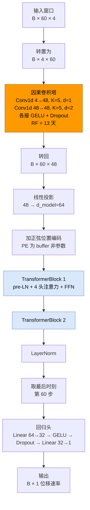

# CNN-Transformer 算法原理详解

> 配套案例：[案例3 · CNN-Transformer 单点位移预测](03_CNN_Transformer_位移预测_实现与调参.ipynb)　·　原理 PPT：[03_CNN_Transformer_位移预测_算法介绍.pptx](03_CNN_Transformer_位移预测_算法介绍.pptx)
>
> 本文从"为什么要把 CNN 和 Transformer 拼起来"讲起，完整推导**因果卷积**、**缩放点积注意力**与**位置编码**，配架构图、因果性验证、数值算例，并说明物理滞后核如何写成正则项。建议先读本文再看 Notebook。

**目录**

- [1. 问题设定：两类依赖，两种极端](#1-问题设定两类依赖两种极端)
- [2. 因果一维卷积：局部模式扫描仪](#2-因果一维卷积局部模式扫描仪)
- [3. 自注意力：全局观察者](#3-自注意力全局观察者)
- [4. 位置编码：把顺序注入注意力](#4-位置编码把顺序注入注意力)
- [5. 本案例的网络结构](#5-本案例的网络结构)
- [6. 训练目标与物理核正则](#6-训练目标与物理核正则)
- [7. 反向传播](#7-反向传播)
- [8. 数值算例与结构验证](#8-数值算例与结构验证)
- [9. 消融与注意力可解释性](#9-消融与注意力可解释性)
- [10. 在位移预测中的落地](#10-在位移预测中的落地)
- [11. 实现要点与常见坑](#11-实现要点与常见坑)
- [12. 小结与自检问题](#12-小结与自检问题)

---

## 1. 问题设定：两类依赖，两种极端

位移序列里同时存在**两类时间依赖**，它们的尺度完全不同：

| 类型 | 典型尺度 | 例子 |
|---|---|---|
| **局部模式** | 几天 | 降雨事件的短期响应形态、日周期波动、短期趋势 |
| **长距离依赖** | 几十天 | 库水位持续下降对边坡变形的滞后影响、渗流的时间尺度 |

两种主流架构各擅长一半、各有一个极端缺陷：

| | LSTM（案例1） | Transformer 纯注意力 |
|---|---|---|
| 信息路径长度 | $O(T)$ 逐级传递 | $O(1)$ 任意两点直连 |
| 并行性 | 时间步**串行** | 全序列**并行** |
| 局部归纳偏置 | 有（结构内蕴） | **弱**——需从数据学"相邻"这件事 |
| 小样本表现 | 稳 | 易过拟合 |
| 复杂度 | $O(T)$ | $O(T^2)$ |

**本案例的答案**：分工协作。

$$\text{原始序列}\;\xrightarrow{\text{因果 CNN（局部）}}\;\text{局部特征图}\;\xrightarrow{+\,\text{位置编码}}\;\text{Transformer（全局）}\;\xrightarrow{\text{取末时刻}}\;\hat y$$

- **CNN 前置**：用小卷积核扫局部模式，权值共享 + 局部感受野带来**强归纳偏置**——小样本下比纯注意力更稳、参数更省；
- **Transformer 后置**：在"已经含局部模式"的特征上做注意力，直接建模长距离依赖，且整窗并行。

> 这也解释了为什么本案例把窗口设为 **60 天**（案例1 是 30 天）：**60 天窗口正是为"长依赖"留空间**——窗口不够长，注意力再强也"无处可看"。

---

## 2. 因果一维卷积：局部模式扫描仪

### 2.1 定义与因果性

普通一维卷积在时刻 $t$ 的输出会用到 $t$ 左右两侧的输入。用在**预测**任务上是致命的——右侧就是未来。

**因果卷积**（causal convolution）的做法是**只在左侧补零**：

$$\big(\mathbf{w}\ast_{\text{causal}}\mathbf{x}\big)_{o,t}=\sum_{c=1}^{C}\sum_{k=0}^{K-1}W_{o,c,k}\cdot x_{c,\;t-(K-1-k)\,d}$$

其中 $K$ 是核宽、$d$ 是膨胀率（dilation）、$t-(K-1-k)d\le t$ 保证**只看到当前与过去**。

代码上就是"左侧 pad，右侧不 pad"：

```python
class CausalConv1d(nn.Module):
    """因果一维卷积：左侧补 (K−1)·dilation 个零，输出长度 = 输入长度，t 时刻只看得到 ≤t 的输入。"""
    def __init__(self, in_ch, out_ch, kernel_size, dilation=1):
        super().__init__()
        self.pad = (kernel_size - 1) * dilation
        self.conv = nn.Conv1d(in_ch, out_ch, kernel_size, dilation=dilation)

    def forward(self, x):                                   # (B, C, T)
        return self.conv(nn.functional.pad(x, (self.pad, 0)))   # ← 只补左边
```

### 2.2 膨胀卷积与感受野

堆叠 $L$ 层、膨胀率取 $2^0,2^1,\dots,2^{L-1}$（**指数增长**），感受野为

$$\boxed{\;\text{RF}=1+\sum_{i=0}^{L-1}(K-1)\cdot 2^{\,i}\;}$$

| $K$ | 层数 $L$ | 感受野 RF |
|---|---|---|
| 3 | 2 | $1+(2)(1)+2(2)=7$ |
| 5 | 2 | $1+4+8=13$ |
| 5 | 3 | $1+4+8+16=29$ |

**本案例**：$K=5$、$L=2$ → **RF = 13 天**（与 Notebook 打印一致），而窗口是 60 天——所以 CNN 只覆盖窗口前 13 天，**剩下的长依赖由 Transformer 负责**。这个分工不是巧合，而是设计意图。

**为什么用膨胀而不是堆更多层？** 感受野随层数**指数**增长（$2^L$），而参数量只随层数**线性**增长——用少量参数换大感受野。这也是 WaveNet 的核心技巧。

### 2.3 参数量与权值共享

单层因果卷积的参数量：

$$N_{\text{conv}}=C_{\text{in}}\cdot C_{\text{out}}\cdot K+C_{\text{out}}$$

| 层 | 配置 | 参数量 |
|---|---|---|
| 第 1 层 | $4\to48$，$K=5$ | $4\times48\times5+48=1{,}008$ |
| 第 2 层 | $48\to48$，$K=5$ | $48\times48\times5+48=11{,}568$ |

**关键性质**：同一组卷积核在**所有时间位置复用**——这就是"参数共享"的卷积版本，与 RNN 的跨时间共享参数是同一个思想，但**没有串行依赖**（可并行）。

---

## 3. 自注意力：全局观察者

### 3.1 缩放点积注意力

把输入序列 $\mathbf{X}\in\mathbb{R}^{T\times d}$ 线性投影成查询、键、值三件套：

$$\mathbf{Q}=\mathbf{X}\mathbf{W}_Q,\qquad \mathbf{K}=\mathbf{X}\mathbf{W}_K,\qquad \mathbf{V}=\mathbf{X}\mathbf{W}_V$$

注意力输出为

$$\boxed{\;\text{Attn}(\mathbf{Q},\mathbf{K},\mathbf{V})=\mathrm{softmax}\!\left(\frac{\mathbf{Q}\mathbf{K}^{\top}}{\sqrt{d_k}}\right)\mathbf{V}\;}$$

逐项理解：

| 部件 | 含义 |
|---|---|
| $\mathbf{Q}\mathbf{K}^{\top}\in\mathbb{R}^{T\times T}$ | **相似度矩阵**：$[\mathbf{Q}\mathbf{K}^{\top}]_{ij}$ 表示"$i$ 该关注 $j$ 多少" |
| $/\sqrt{d_k}$ | **缩放**：$d_k$ 大时点积方差随之增大，softmax 会饱和成 one-hot（梯度消失）。除以 $\sqrt{d_k}$ 把方差归一到 $O(1)$ |
| $\mathrm{softmax}(\cdot)$ | 每个查询对**所有**时间步的权重，行和为 1 |
| $\times\mathbf{V}$ | 按权重对值做加权平均 |

**为什么它能建模长依赖**：输出第 $t$ 行是 $\sum_j \alpha_{tj}\mathbf{v}_j$——**任意 $j$ 到 $t$ 的路径长度都是 1**，不存在 RNN 那种逐级衰减。

### 3.2 为什么要"缩放"：方差分析

设 $\mathbf{q},\mathbf{k}$ 各维独立、均值 0 方差 1，则点积

$$\mathbf{q}\cdot\mathbf{k}=\sum_{i=1}^{d_k}q_i k_i,\qquad \mathrm{Var}\!\left(\sum_i q_ik_i\right)=d_k$$

即点积的标准差是 $\sqrt{d_k}$。当 $d_k=64$ 时，分数尺度约 8 倍——softmax 会把绝大部分概率压到最大值上（梯度趋近 0）。除以 $\sqrt{d_k}$ 后方差回到 1，softmax 处于"可学习"的区间。

### 3.3 多头注意力

把 $d$ 维切成 $h$ 个头，各自做注意力再拼接：

$$\text{MultiHead}=\big[\text{Attn}_1;\dots;\text{Attn}_h\big]\mathbf{W}_O,\qquad d_k=d/h$$

**多头的意义**：每个头在**不同的子空间**里学不同的关注模式（例如头 1 关注"3 天前的降雨"、头 2 关注"30 天前的水位"）。本案例 $d=64,h=4$ → 每头 16 维。

### 3.4 两个重要性质

**① 置换等变**：注意力对输入顺序**不敏感**——

$$\text{Attn}(\mathbf{X}_{P})=\text{Attn}(\mathbf{X})_{P}$$

数值已验证（[§8](#8-数值算例与结构验证)）。**这不是优点而是警告**：若不注入位置信息，模型根本分不清"先降雨后变形"与"先变形后降雨"。→ 必须有位置编码。

**② 复杂度 $O(T^2)$**：相似度矩阵是 $T\times T$。本案例 $T=60$，矩阵仅 3600 元素，完全可接受；若窗口上千天则需稀疏/线性注意力。

---

## 4. 位置编码：把顺序注入注意力

### 4.1 正弦位置编码

把位置 $pos$ 编码成一个 $d$ 维向量，不同维度用不同频率的三角函数：

$$
\begin{aligned}
PE_{(pos,\,2i)}&=\sin\!\left(\frac{pos}{10000^{2i/d}}\right)\\[2pt]
PE_{(pos,\,2i+1)}&=\cos\!\left(\frac{pos}{10000^{2i/d}}\right)
\end{aligned}
$$

**设计动机**：不同 $i$ 对应从高频（短周期）到低频（长周期）的一组基，拼起来让每个位置得到**唯一的"指纹"**。

数值验证（[§8](#8-数值算例与结构验证)，$d=64$、90 个位置）：

| 检验 | 结果 |
|---|---|
| 取值范围 | $[-1,1]$ ✓ |
| 任意两位置余弦相似度 | 最大 0.966、最小 0.374，**均 < 1** → 位置可区分 |
| 相邻位置（0 vs 1） | 0.966（较高，符合"位置相近则编码相近"） |
| 间隔 80 位置 | 0.462（明显更低） |
| 偶数维 = sin / 奇数维 = cos | ✓ |

**为什么不用"位置序号 / T"这种直接编码？** 因为那样相邻位置的编码差异固定且随窗口长度变化；正弦编码的差异由频率自然给出多尺度结构，且可**外推到训练时未见过的更长窗口**。

### 4.2 加在哪儿

本案例把位置编码**加在 CNN 输出上**（不是原始输入上）：

$$\mathbf{H}=\text{CNN}(\mathbf{X})+\mathbf{PE}_{1:T}$$

其中 $\mathbf{PE}$ 用 `register_buffer` 注册——它是**固定常量，不是可训练参数**（所以不计入参数量）。

---

## 5. 本案例的网络结构

### 5.1 整体架构



图中橙色 = CNN 前置（局部），蓝色 = Transformer 编码器（全局）。

### 5.2 每个组件的内部结构

**TransformerBlock（pre-LN 写法）**：

$$\mathbf{H}\leftarrow\mathbf{H}+\text{MHA}\big(\mathrm{LN}(\mathbf{H})\big),\qquad \mathbf{H}\leftarrow\mathbf{H}+\text{FFN}\big(\mathrm{LN}(\mathbf{H})\big)$$

| 设计 | 取值 | 说明 |
|---|---|---|
| **pre-LN** | LN 在子层**之前** | 相比原始 Transformer 的 post-LN，训练更稳、无需 warmup |
| 残差连接 | 两处 | 保证梯度直达底层 |
| FFN | $64\to256\to64$ | 中间升维 4 倍（注意力通道混合、FFN 特征混合） |
| 注意力头数 | 4 | 每头 16 维 |

**回归头**：`Linear(64→32) → GELU → Dropout → Linear(32→1)`，取**最后时刻**的表示——因果性保证 $\mathbf{h}_{60}$ 只含 $\le t$ 的信息。

### 5.3 逐层参数量

| 组件 | 计算式 | 参数量 |
|---|---|---|
| Conv1d(4→48, K=5) | $4\times48\times5+48$ | 1,008 |
| Conv1d(48→48, K=5) | $48\times48\times5+48$ | 11,568 |
| `proj` Linear(48→64) | $48\times64+64$ | 3,136 |
| 每个 TransformerBlock | 注意力 16,640 + **2 个** LayerNorm 256 + FFN 33,088 | 49,984 |
| 2 个 Block | $2\times49{,}984$ | 99,968 |
| 末层 LayerNorm | $2\times64$ | 128 |
| 回归头 64→32→1 | $(64\times32+32)+(32\times1+1)$ | 2,113 |
| **合计** | | **117,921** |

**算得最细的一项是注意力**：$3d^2+3d$（QKV 投影权重与偏置）+ $d^2+d$（输出投影）= $3\times4096+192+4160=16{,}640$。

> ⚠️ **易错点**：一个 TransformerBlock 里有**两个** LayerNorm（`ln1`、`ln2`），不是 1 个。漏算会让总数少 256。
>
> 该数字与 Notebook 打印的 `CNN+Transformer 参数量 = 117,921` 一致。

---

## 6. 训练目标与物理核正则

### 6.1 基础损失

标准化空间的 MSE（与案例1 一致）：

$$\mathcal{L}_{\text{MSE}}=\frac{1}{BH}\sum_{b=1}^{B}\sum_{h=1}^{H}\big(\hat y_{b,h}-y_{b,h}\big)^2$$

### 6.2 物理核正则：把渗流滞后写成损失项

**物理动机**：降雨入渗到边坡内部需要时间，含水率随深度缓慢消散——响应呈**指数滞后衰减**，常用滞后核描述：

$$k_{\exp}(j)=\exp\!\left(-\frac{j}{\tau}\right),\qquad j=0,1,\dots,K-1$$

其中 $\tau$ 是特征滞后时间（本案例 $\tau=12$ 天），$j$ 是核内滞后天数。

**做法**：约束第一层卷积**降雨通道**的核与这个物理核形状一致。两个技术细节很关键：

$$\hat{\mathbf{w}}_c=\frac{\mathbf{w}_c}{\|\mathbf{w}_c\|+\epsilon},\qquad \hat{\mathbf{k}}=\frac{\mathbf{k}_{\exp}}{\|\mathbf{k}_{\exp}\|}$$

**① 先各自归一化，再比形状**（尺度自由）——只约束"形状"而不约束"幅度"，否则模型会被迫把所有通道的增益都调到 1：

$$\mathcal{L}_{\text{shape}}=1-\frac{1}{C}\sum_{c=1}^{C}\hat{\mathbf{w}}_c^{\top}\hat{\mathbf{k}}\;=\;1-\overline{\cos\theta_c}$$

（归一化后内积即余弦相似度，最大化相似度等价于最小化此项。）

**② 非负惩罚**——物理上"降雨增加 → 位移响应为正"，故核系数不应为负：

$$\mathcal{L}_{\text{neg}}=\frac{1}{CK}\sum_{c,k}\big[\max(0,-w_{c,k})\big]^2=\overline{\mathrm{ReLU}(-\mathbf{w})^2}$$

**总损失**：

$$\boxed{\;\mathcal{L}}=\mathcal{L}_{\text{MSE}}+\lambda\big(\mathcal{L}_{\text{shape}}+\mathcal{L}_{\text{neg}}\big)$$

$\lambda$ 是正则权重，Notebook §9.3 做了 $\lambda$ 的敏感性实验：讨论**物理约束以多大精度代价换来形状可解释性与外推稳健性**。

> 💡 这与案例1 的门控形成了有趣的对照：**LSTM 的遗忘门是"数据学出来的衰减曲线"，这里的指数核是"物理写进去的衰减曲线"**。两者若形状接近，说明数据里确实存在该物理规律。这正是"数据-物理融合"的可检验形式。

### 6.3 优化设置

| 项 | 取值 |
|---|---|
| 优化器 | AdamW（$\lambda_{\text{wd}}=10^{-4}$） |
| 学习率 | $10^{-3}$ + `ReduceLROnPlateau` |
| 早停 | patience = 20，**回滚到验证最优权重** |
| 梯度裁剪 | 全局范数阈值 1.0 |
| Dropout | 0.1 |

---

## 7. 反向传播

### 7.1 因果卷积层的梯度

单层因果卷积 $\mathbf{Y}=\mathbf{W}\ast_{\text{causal}}\mathbf{X}$，梯度是：

$$\frac{\partial\mathcal{L}}{\partial W_{o,c,k}}=\sum_{t}\frac{\partial\mathcal{L}}{\partial Y_{o,t}}\cdot x_{c,\,t-(K-1-k)d},\qquad
\frac{\partial\mathcal{L}}{\partial x_{c,t'}}=\sum_{o,k}\frac{\partial\mathcal{L}}{\partial Y_{o,\,t'+(K-1-k)d}}\cdot W_{o,c,k}$$

**关键观察**：反向传播时 $x_{c,t'}$ 的梯度来自**未来时刻** $t'\ge t$ 的输出——这与前向的因果性**不矛盾**：前向不许看未来，反向允许（训练时未来已经观测到，梯度本就要从未来流回来）。这是"因果卷积**不是**因果模型"这一常见误解的正解。

### 7.2 注意力层的梯度

记 $\mathbf{S}=\dfrac{\mathbf{Q}\mathbf{K}^{\top}}{\sqrt{d_k}}$、$\mathbf{A}=\mathrm{softmax}(\mathbf{S})$、$\mathbf{O}=\mathbf{A}\mathbf{V}$，则

$$\frac{\partial\mathcal{L}}{\partial\mathbf{A}}=\frac{\partial\mathcal{L}}{\partial\mathbf{O}}\mathbf{V}^{\top},\qquad
\frac{\partial\mathcal{L}}{\partial\mathbf{S}}=\mathbf{A}\odot\Big(\frac{\partial\mathcal{L}}{\partial\mathbf{A}}-\big(\tfrac{\partial\mathcal{L}}{\partial\mathbf{A}}\odot\mathbf{A}\big)\mathbf{1}\mathbf{1}^{\top}\Big)$$

第二式是 **softmax 的雅可比** $\dfrac{\partial A_{ij}}{\partial S_{ik}}=A_{ij}(\delta_{jk}-A_{ik})$ 的矩阵形式——这一项**对每个查询行独立**，所以整个注意力的反向传播可以完全并行（不像 RNN 必须串行）。

再往下：

$$\frac{\partial\mathcal{L}}{\partial\mathbf{Q}}=\frac{1}{\sqrt{d_k}}\frac{\partial\mathcal{L}}{\partial\mathbf{S}}\mathbf{K},\qquad
\frac{\partial\mathcal{L}}{\partial\mathbf{K}}=\frac{1}{\sqrt{d_k}}\Big(\frac{\partial\mathcal{L}}{\partial\mathbf{S}}\Big)^{\top}\mathbf{Q},\qquad
\frac{\partial\mathcal{L}}{\partial\mathbf{V}}=\mathbf{A}^{\top}\frac{\partial\mathcal{L}}{\partial\mathbf{O}}$$

### 7.3 全链路梯度流


**残差连接的重要性**：$\mathbf{H}\leftarrow\mathbf{H}+\text{MHA}(\cdot)$ 使梯度有一条**恒等捷径**直达底层，这与 LSTM 的"传送带"是同一类设计思想（都靠"加法通路"避开连乘衰减）。

---

## 8. 数值算例与结构验证

### 8.1 因果性验证（最重要的一项）

设 $C=3$、$T=12$、$K=5$，**改动 $t\ge7$ 的输入**，检查输出：

| 检验 | 结果 |
|---|---|
| $t\le6$ 的输出最大变化 | **0.00×10⁰**（严格为 0）→ 因果性成立 ✓ |
| $t\ge7$ 的输出最大变化 | 6.502（确实受影响） |
| **对照·普通对称填充卷积** | $t\le6$ 输出变化 **3.688**（泄漏未来信息） |

这个对照很关键：它说明"因果"不是自动获得的，而是**padding 方式**决定的——把 `pad(x, (p, 0))` 写成 `pad(x, (p//2, p//2))` 就会泄漏。

### 8.2 感受野公式验证

$K=5$、$L=2$：$\text{RF}=1+4\times2^0+4\times2^1=13$（与手动展开一致）；Notebook 亦打印 `CNN 感受野 = 13 天`。

### 8.3 自注意力验证

| 检验 | 结果 |
|---|---|
| 输出形状 | $(T,d)$ ✓ |
| 单头手算与多头实现的头 1 一致 | ✓ |
| 注意力权重每行和为 1 | ✓ |
| **置换等变性** | ✓ → 证明"位置信息必须靠位置编码注入" |

### 8.4 位置编码验证

见 [§4.1](#41-正弦位置编码) 的表。核心结论：**任意两位置的余弦相似度上限 0.966 < 1**，即没有两个位置得到相同编码。

### 8.5 小结：本案例的结构性保障

| 保障 | 机制 | 验证方式 |
|---|---|---|
| 不看未来 | 因果卷积（左填充）+ 取末时刻 | 扰动未来输入，检查过去输出不变 |
| 知道顺序 | 正弦位置编码 | 置换等变性检验 |
| 梯度可达底层 | 残差 + pre-LN | 结构保证 |
| 局部感受野 | 膨胀卷积 13 天 | 公式 + 打印值一致 |
| 物理可解释 | 核正则 + 注意力可视化 | 核形状与指数核的余弦相似度 |

---

## 9. 消融与注意力可解释性

### 9.1 消融实验：谁在起作用？

| 配置 | 含义 | 回答的问题 |
|---|---|---|
| CNN-Transformer（完整） | CNN + 注意力 | 基准 |
| **Transformer-only（无 CNN）** | 去掉因果卷积塔 | 局部归纳偏置值多少？ |
| **CNN-only（无注意力）** | 去掉 Transformer 块 | 长依赖建模值多少？ |

> 若"无 CNN"掉得多 → 说明局部模式是主力，数据量小时注意力学不好局部；若"无注意力"掉得多 → 说明 60 天窗口里确实有长依赖。
>
> ⚠️ **注意参数量不等价**：去掉模块会同时改变参数量，所以严格说消融反映的是"结构 + 容量"的合并效应。要分离二者需额外做"等参数量对照"。

### 9.2 注意力可视化：模型在看哪里？

由于代码里 `need_weights=True` 保留了注意力权重，可以画出**注意力-滞后曲线**：横轴是"被关注的时间步相对当前的距离（滞后天数）"，纵轴是平均注意力权重。

**这张图为什么有价值**：

- 若曲线在**滞后 10~15 天**附近出现峰值，与降雨→变形的渗流滞后量级吻合 → 模型学到了物理规律；
- 可与 CNN 内核、以及 [§6.2](#62-物理核正则把渗流滞后写成损失项) 的指数核**三方对照**：

| 来源 | 表达 | 性质 |
|---|---|---|
| CNN 卷积核 | 第一层降雨通道核 | **数据学出**的响应核 |
| 注意力权重 | 滞后 vs 权重曲线 | **数据学出**的依赖强度 |
| 指数核 $e^{-j/\tau}$ | 物理先验 | **物理写入**的响应核 |

三者形状接近，就是"数据-物理融合"的最直接证据。

---

## 10. 在位移预测中的落地

### 10.1 与案例1 的差异点

| 项 | 案例1（LSTM） | 案例3（CNN-Transformer） |
|---|---|---|
| 窗口 $L$ | 30 天 | **60 天**（为长依赖留空间） |
| 局部建模 | 靠门控隐式学 | **显式**因果卷积（RF=13 天） |
| 长依赖 | 靠传送带缓解衰减 | **显式**注意力直连 |
| 并行性 | 串行 | 并行（训练更快） |
| 参数量 | 53,313 | **117,921** |
| 物理先验 | 落在门控上（间接） | 落在**卷积核形状**上（直接可检验） |

其余（防泄漏流水线、速率目标 + 累积重构双口径、递归多步、MC Dropout）与案例1 **完全一致**。

### 10.2 多步递归预测

与案例1 同法：预测速率回填自回归通道，滚动外推，再累积重构：

$$\hat s_{T}=\hat s_{t_0}+\sum_{k=1}^{T-t_0}\Delta\hat s_{t_0+k}$$

**注意 60 天窗口的递归成本**：每外推一步都要重跑整窗前向，$H$ 步就是 $H$ 次前向——比单步评估贵 $H$ 倍。

### 10.3 不确定性：MC Dropout

同案例1：预测时保持 Dropout 开启，采样 $N$ 次得到 $\mu,\sigma$，输出 95% 区间，并用 PICP 检验校准（理想 ≈0.95）。

---

## 11. 实现要点与常见坑

### 11.1 一个可对照的最小实现

```python
import torch, torch.nn as nn

class CausalConv1d(nn.Module):
    """因果一维卷积：只左填充，保证 t 时刻看不到 t 之后。"""
    def __init__(self, in_ch, out_ch, kernel_size, dilation=1):
        super().__init__()
        self.pad = (kernel_size - 1) * dilation          # ← 左填充量
        self.conv = nn.Conv1d(in_ch, out_ch, kernel_size, dilation=dilation)

    def forward(self, x):                                # (B, C, T)
        return self.conv(nn.functional.pad(x, (self.pad, 0)))
```

```python
def sinusoidal_pe(max_len, d_model):
    pos = np.arange(max_len)[:, None]
    i = np.arange(d_model // 2)[None, :]
    ang = pos / np.power(10000.0, 2 * i / d_model)       # 不同维度不同频率
    pe = np.zeros((max_len, d_model))
    pe[:, 0::2] = np.sin(ang)                            # 偶数维 sin
    pe[:, 1::2] = np.cos(ang)                            # 奇数维 cos
    return pe
```

### 11.2 常见坑一览

| 坑 | 现象 | 对策 |
|---|---|---|
| **因果填充写反** | 训练指标虚高、上线崩 | `pad(x, (pad, 0))`，配因果性单测（扰动未来看过去是否不变） |
| 忘记位置编码 | 模型对顺序不敏感，学不到滞后 | 加正弦 PE（§4） |
| 位置编码当成参数 | 参数量统计错误、训练时被更新 | 用 `register_buffer` |
| 注意力**未缩放** | softmax 饱和、梯度消失 | 除以 $\sqrt{d_k}$ |
| pre-LN 写成 post-LN | 需要 warmup，训练不稳 | 按 §5.2 的 pre-LN 结构 |
| 取平均池化而非末时刻 | 用了窗口内全部时刻，但因果性要求只能取末时刻 | `out[:, -1]` |
| 层数堆过多 | $O(T^2)$ 内存爆炸、过拟合 | $T=60$ 时 2 层足够 |
| 窗口太短 | 注意力"无处可看" | 60 天（覆盖长滞后） |
| 核正则未归一化 | 模型被迫缩放幅度，精度骤降 | 先各自归一化再算余弦 |
| Dropout 加在残差主路上 | 破坏恒等通路 | 只加在子层输出/FFN 内部 |

### 11.3 超参选择的经验次序

1. **窗口 $L$**——由互相关滞后确定，且要**大于**预期的最长滞后（本案例 60 天）；
2. **$d_{\text{model}}$ 与头数**——64 / 4 起步（头数整除 $d$）；
3. **块数**——1~2 层足够（窗口短时注意力容量不是瓶颈）；
4. **卷积塔层数与核宽**——RF 覆盖主要局部尺度（13 天）即可；
5. **Dropout**——0.1；
6. 最后才动物理正则的 $\lambda$。

---

## 12. 小结与自检问题

### 核心要点

1. 位移序列里**局部模式（几天）**与**长依赖（几十天）**并存，单一架构各有极端缺陷；
2. **因果卷积**靠"只左填充"实现不看未来，膨胀率指数增长使感受野 $\text{RF}=1+\sum(K-1)2^i$（本案例 13 天）；
3. **缩放点积注意力**用 $\mathrm{softmax}(\mathbf{Q}\mathbf{K}^\top/\sqrt{d_k})\mathbf{V}$ 让任意两点路径长度为 $O(1)$；除 $\sqrt{d_k}$ 是为了防 softmax 饱和；
4. 注意力是**置换等变**的——顺序必须靠**位置编码**注入；正弦编码给每个位置唯一指纹且可外推；
5. 本案例结构：**因果 CNN（局部，RF=13 天）→ 位置编码 → 2 层 pre-LN Transformer（全局，窗口 60 天）→ 取末时刻 → 回归头**，共 117,921 参数；
6. **残差 + pre-LN** 提供梯度直达底层的通路，与 LSTM 的传送带是同类设计；
7. **物理核正则**把渗流滞后写成形状约束（先归一化再比余弦 + 非负惩罚），是"数据-物理融合"的可检验形式；
8. 注意力-滞后曲线、CNN 核形状、指数核**三方对照**，是判断"模型是否学到物理规律"的直接证据。

### 自检问题

1. 为什么预测任务必须用因果卷积？代码上"因果"体现在哪一行？
2. 因果卷积的反向传播可以看到未来，这与因果性矛盾吗？为什么？
3. 写出感受野公式，并计算 $K=5$、$L=3$ 时的 RF。为什么用膨胀卷积而不是堆层数？
4. 注意力为什么要除以 $\sqrt{d_k}$？不除会怎样？请从方差角度说明。
5. 什么是置换等变性？它为什么要求必须有位置编码？
6. 正弦位置编码为什么可外推到更长窗口，而"位置序号/T"不行？
7. pre-LN 与 post-LN 的区别是什么？为什么本案例选 pre-LN？
8. 本案例的注意力层有多少参数？一个 TransformerBlock 里有几个 LayerNorm？
9. 核正则为什么要**先归一化再算余弦**？去掉归一化会发生什么？
10. 如果注意力-滞后曲线的峰值在滞后 2 天，而指数核 $\tau=12$ 天，你会怎么解释与处理？

<details>
<summary>点击查看第 3 题答案</summary>

$$\text{RF}=1+\sum_{i=0}^{L-1}(K-1)\cdot 2^{\,i}=1+4\times(1+2+4)=1+28=29\ \text{天}$$

**用膨胀而非堆层数**：感受野随层数**指数**增长（$2^L$），而参数量只随层数**线性**增长——用少量参数换大感受野。

</details>

<details>
<summary>点击查看第 8 题答案</summary>

**注意力层**（$d=64$，4 头）：

$$\underbrace{3d^2+3d}_{\text{QKV 投影权重+偏置}}+\underbrace{d^2+d}_{\text{输出投影}}=3\times4096+192+4160=16{,}640$$

**一个 TransformerBlock 里有 2 个 LayerNorm**（`ln1` 与 `ln2`，对应注意力子层与 FFN 子层各一个），共 $2\times2\times64=256$ 个参数。只算 1 个会少 128，两块就少 256——这正是本案例 117,921 与"漏算版" 117,665 的差值。

</details>

---

## 参考

- Vaswani, A., et al. (2017). *Attention Is All You Need.* NeurIPS. ——自注意力、缩放、多头、位置编码
- Oord, A. v. d., et al. (2016). *WaveNet: A Generative Model for Raw Audio.* ——因果卷积与膨胀卷积
- Ba, J. L., Kiros, J. R., & Hinton, G. E. (2016). *Layer Normalization.* ——pre-LN 与 post-LN 的稳定性对比
- Xiong, R., et al. (2020). *On Layer Normalization in the Transformer Architecture.* ICML. ——pre-LN 无需 warmup 的分析
- Zhou, H., et al. (2021). *Informer.* AAAI. ——长序列注意力的效率改进（窗口进一步加长时的方向）
- 本案例 Notebook 的因果性与置换等变性验证实验（§4 / §8）

---

**下一步**：本文是四个算法原理详解的第三篇。[案例1 LSTM](../LSTM/LSTM_算法原理.md)（序列建模与 BPTT）、[案例2 GCN](../GCN/GCN_算法原理.md)（图卷积与监测网拓扑）、[案例4 XGBoost + SHAP](../XGBoost+SHAP/)（梯度提升树与精确归因）。
