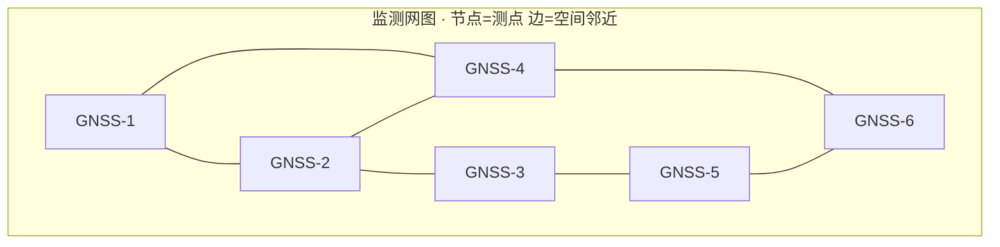
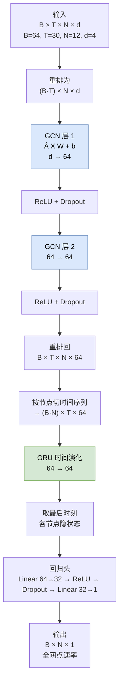
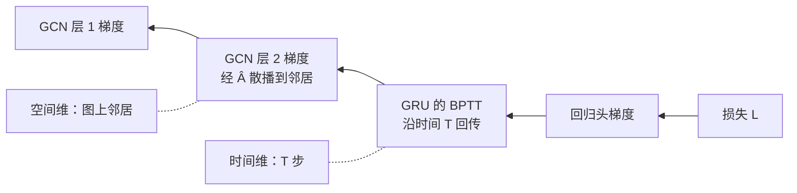

# GCN 算法原理详解

> 配套案例：[案例2 · GCN 多点监测网时空预测](02_GCN_多点监测网时空预测_实现与调参.ipynb)　·　原理 PPT：[02_GCN_多点监测网时空预测_算法介绍.pptx](02_GCN_多点监测网时空预测_算法介绍.pptx)
>
> 本文从"为什么单点模型不够"讲起，完整推导**谱图卷积的一阶近似**与**对称归一化**，配监测网图示意、GCN 聚合示意图、ST-GCN 架构图、数值手算示例，并说明归一化为什么是必须的。建议先读本文再看 Notebook。

> **[📐 数学预备知识](../算法原理_数学预备知识.md)**：矩阵、导数、链式法则、softmax、特征值……零基础先读这一份（含手算例子）

**目录**

- [1. 问题设定：单点模型的三个盲区](#1-问题设定单点模型的三个盲区)
- [2. 图的数学表示](#2-图的数学表示)
- [3. 从谱图卷积到 GCN](#3-从谱图卷积到-gcn)
- [4. 对称归一化：为什么必须做](#4-对称归一化为什么必须做)
- [5. 本案例的图构建](#5-本案例的图构建)
- [6. 本案例的网络结构：ST-GCN](#6-本案例的网络结构st-gcn)
- [7. 反向传播](#7-反向传播)
- [8. 数学分析：感受野与过平滑](#8-数学分析感受野与过平滑)
- [9. 数值算例](#9-数值算例)
- [10. 变体：GAT、无图消融与 ST-GCN](#10-变体gat无图消融与-st-gcn)
- [11. 在监测网预测中的落地](#11-在监测网预测中的落地)
- [12. 实现要点与常见坑](#12-实现要点与常见坑)
- [13. 小结与自检问题](#13-小结与自检问题)

---

## 1. 问题设定：单点模型的三个盲区

设监测网有 $N$ 个测点，第 $i$ 个测点在第 $t$ 天的观测为 $\mathbf{x}_t^{(i)}\in\mathbb{R}^{d}$，目标是同时预测**全网点**未来一步的位移速率：

$$f_\theta:\;\big(\mathbf{x}_{t-L+1:t}^{(1)},\dots,\mathbf{x}_{t-L+1:t}^{(N)}\big)\;\longmapsto\;\big(\hat y_{t+1}^{(1)},\dots,\hat y_{t+1}^{(N)}\big)$$

案例1 的 LSTM 对每个测点**独立**建模，因此有三个盲区：

| 盲区 | 后果 |
|---|---|
| **信息不互通** | 测点 A 的传感器短暂失效，模型无法借用 B 的信息 |
| **忽略空间规律** | 相邻测点共享同一降雨/库水位驱动，变形高度相关；独立建模把这个先验丢掉了 |
| **欠观测点难预测** | 位于坡体关键部位但监测时间短的测点，样本少，独立模型学不动 |

**核心诉求**：把"测点之间的空间关系"也编码进模型——这正是**图**擅长的事。

---

## 2. 图的数学表示

一个图 $\mathcal{G}=(\mathcal{V},\mathcal{E})$ 由节点集 $\mathcal{V}$（$|\mathcal{V}|=N$）与边集 $\mathcal{E}$ 组成。本案例中：

- **节点** = 监测点（GNSS 测点、测斜点等），节点特征 = 该点当天的多变量观测；
- **边** = "两个测点空间上靠近"这一关系，由坐标生成；
- **邻接矩阵** $\mathbf{A}\in\{0,1\}^{N\times N}$，$A_{ij}=1$ 表示 $i,j$ 之间有边；
- **度矩阵** $\mathbf{D}=\mathrm{diag}(d_1,\dots,d_N)$，$d_i=\sum_j A_{ij}$ 是节点 $i$ 的度（邻居个数）。



> 💡 **关键区别**：这里的"邻居"是**空间**上的邻近，不是时间上的先后。LSTM 处理时间维的依赖，GCN 处理空间维的依赖——这也是 ST-GCN 要"GCN + GRU"两件套的原因。

---

## 3. 从谱图卷积到 GCN

### 3.1 谱域图卷积

图信号没有"平移"概念，因此卷积不能在空域直接滑动。**谱图卷积**的思路是：借用图的拉普拉斯矩阵特征分解，在频域定义"滤波"：

$$\mathbf{g}_\theta \star \mathbf{x} = \mathbf{U}\,\mathbf{g}_\theta(\boldsymbol\Lambda)\,\mathbf{U}^{\top}\mathbf{x}$$

其中 $\mathbf{L}=\mathbf{I}-\mathbf{D}^{-1/2}\mathbf{A}\mathbf{D}^{-1/2}=\mathbf{U}\boldsymbol\Lambda\mathbf{U}^{\top}$ 是归一化拉普拉斯矩阵（对称半正定），$\mathbf{U}$ 是其特征向量矩阵。

**问题**：特征分解是 $O(N^3)$，且 $\mathbf{U}$ 依赖具体图结构——换个监测网就要重算。**不可用**。

### 3.2 一阶 Chebyshev 近似

把 $\mathbf{g}_\theta(\boldsymbol\Lambda)$ 用 Chebyshev 多项式截断到 $K$ 阶：

$$\mathbf{g}_\theta\star\mathbf{x}\approx\sum_{k=0}^{K}\theta_k\,T_k(\tilde{\mathbf{L}})\,\mathbf{x},\qquad \tilde{\mathbf{L}}=\tfrac{2}{\lambda_{\max}}\mathbf{L}-\mathbf{I}$$

**Kipf & Welling (2017) 的两个简化**：

1. 取 $K=1$（只看 1 阶邻居）并令 $\lambda_{\max}\approx2$；
2. 令 $\theta_0=-\theta_1=\theta$ **共享参数**（减少参数量、避免过拟合）。

一步化简后（要注意符号与 $\mathbf{I}+\mathbf{D}^{-1/2}\mathbf{A}\mathbf{D}^{-1/2}$ 的对应关系）：

$$\mathbf{g}_\theta\star\mathbf{x}\approx\theta\big(\mathbf{I}+\mathbf{D}^{-1/2}\mathbf{A}\mathbf{D}^{-1/2}\big)\mathbf{x}$$

### 3.3 重归一化技巧（renormalization trick）

$\mathbf{I}+\mathbf{D}^{-1/2}\mathbf{A}\mathbf{D}^{-1/2}$ 的特征值落在 $[0,2]$，**多层叠加会数值不稳定**（谱半径 > 1 导致信号放大）。Kipf 的技巧是引入自环并重新归一化：

$$\tilde{\mathbf{A}}=\mathbf{A}+\mathbf{I},\qquad \tilde{\mathbf{D}}=\mathrm{diag}\big(\textstyle\sum_j\tilde A_{ij}\big)= \mathbf{D}+\mathbf{I}$$

$$\boxed{\;\hat{\mathbf{A}}=\tilde{\mathbf{D}}^{-1/2}\,\tilde{\mathbf{A}}\,\tilde{\mathbf{D}}^{-1/2}\;}$$

于是得到 GCN 层的完整形式：

$$\boxed{\;\mathbf{H}^{(l+1)}=\sigma\Big(\hat{\mathbf{A}}\,\mathbf{H}^{(l)}\,\mathbf{W}^{(l)}\Big)\;}$$

- $\hat{\mathbf{A}}\mathbf{H}$ = **一次空间聚合**（每个节点收拢 1 阶邻居与自身）；
- $\mathbf{W}^{(l)}$ 在**所有节点间共享**（图版的平移不变性）；
- 叠加 $L$ 层 → 感受野扩到 $L$ 跳。

### 3.4 逐元素形式：一次"加权平均"

把 $\hat{\mathbf{A}}$ 的元素写开，聚合的物理意义就清楚了：

$$\hat A_{ij}=\frac{\tilde A_{ij}}{\sqrt{\tilde d_i\,\tilde d_j}} \qquad\Rightarrow\qquad \big(\hat{\mathbf{A}}\mathbf{H}\big)_i=\sum_{j\in\mathcal{N}(i)\cup\{i\}}\frac{1}{\sqrt{\tilde d_i\,\tilde d_j}}\,\mathbf{h}_j$$

即：**节点 $i$ 的新特征 = 自身与邻居特征的加权和**，权重反比于两端度的平方根——**度数大的节点被压低**（否则枢纽节点会把所有邻居淹没）。

> 🪨 **岩土含义**：这一层操作相当于让"变形场"做一次**空间扩散/插值**——欠观测测点借用邻居信息。这与案例1 §11.3 讲的"变形场空间连续"是同一物理先验的两种实现：那里用软约束，这里用**结构**。

---

## 4. 对称归一化：为什么必须做

不做归一化、直接用 $\mathbf{A}$（或 $\mathbf{A}+\mathbf{I}$）会出什么问题？答案是**尺度失控**：

$$\big\|\mathbf{A}^k\mathbf{x}\big\|\sim \rho(\mathbf{A})^k\|\mathbf{x}\|$$

以度数为 $d$ 的正则图为例，$\rho(\mathbf{A})=d$——每层传播把信号幅度放大约 $d$ 倍，**两层就是 $d^2$ 倍**。本案例平均度 5.2，两层后放大 $\sim27$ 倍，深层网络直接发散。

**对称归一化把谱半径压到 1 以内**：

$$\rho\big(\hat{\mathbf{A}}\big)\le 1$$

数值验证（本案例的小图，见 [§9](#9-数值算例)）：$\hat{\mathbf{A}}$ 的特征值范围 $[-0.205,\ 1.000]$，**恰好不超过 1**。这不是巧合：

- $\tilde{\mathbf{A}}$ 是实对称矩阵，特征值实；
- 由 Gershgorin 圆盘定理与 Perron-Frobenius 理论，$\mathbf{D}^{-1/2}\tilde{\mathbf{A}}\mathbf{D}^{-1/2}$ 的特征值落在 $[-1,1]$。

**三个结论**：

1. 深层叠加不会指数放大信号 → 数值稳定；
2. 归一化后 $\hat{\mathbf{A}}$ 的**行和一般不等于 1**，而是

$$\big(\hat{\mathbf{A}}\mathbf{1}\big)_i=\frac{1}{\sqrt{\tilde d_i}}\sum_{j}\frac{\tilde A_{ij}}{\sqrt{\tilde d_j}}$$

   只有**所有节点度都相等**（正则图）时才恰好等于 1。本案例 12 个测点度不等，实测行和在 $[0.91,\ 1.16]$ 附近浮动。所以 $\hat{\mathbf{A}}$ **不是**严格的加权平均算子——这一点在区分"GCN 传播"与"邻域平均池化"时很重要；
3. 自环 $\mathbf{I}$ 的作用是**保底**：保证每个节点至少保留自己的信息，不会在多层传播中被邻居完全"抹平"。

---

## 5. 本案例的图构建

### 5.1 KNN 建图

只有测点坐标、没有显式连边时，用 **K 近邻**生成：

```python
def build_knn_graph(coords, k=4):
    """坐标 → 对称 KNN 二值邻接矩阵（不含自环）。"""
    d = np.linalg.norm(coords[:, None, :] - coords[None, :, :], axis=-1)  # 两两距离
    np.fill_diagonal(d, np.inf)                    # 排除自身
    A = np.zeros(d.shape, dtype=bool)
    for i, js in enumerate(np.argsort(d, axis=1)[:, :k]):
        A[i, js] = True                            # 每点连最近的 k 个
    A |= A.T                                       # ← 对称化
    np.fill_diagonal(A, False)                     # 去掉自环（自环由 Â 里的 I 引入）
    return A.astype("float32")
```

**两个细节必须留意**：

| 操作 | 为什么 |
|---|---|
| **对称化**（转置取逻辑或） | KNN 天然**不对称**（$i$ 的邻居里有 $j$，不代表 $j$ 的邻居里有 $i$）。而 $\hat{\mathbf{A}}$ 必须对称才能保证特征值实、谱半径 ≤1。对称化后平均度从 $k$ 升到约 $5.2$（本案例 $k=4$） |
| 对角线置 0 | 自环交给 $\tilde{\mathbf{A}}=\mathbf{A}+\mathbf{I}$ 统一处理，避免重复 |

### 5.2 对称归一化

```python
def sym_normalize(A):
    """Â = D^-1/2 (A+I) D^-1/2"""
    A_tilde = A + np.eye(len(A), dtype="float32")
    deg = A_tilde.sum(1)
    Dinv = np.diag(deg ** -0.5)
    return Dinv @ A_tilde @ Dinv
```

等价于逐元素 $\hat A_{ij}=\tilde A_{ij}/\sqrt{\tilde d_i\tilde d_j}$（[§9](#9-数值算例) 已数值核对该等价性）。

### 5.3 图的信息

| 指标 | 本案例取值 |
|---|---|
| 节点数 $N$ | 12 |
| KNN 的 $k$ | 4 |
| 对称化后平均度 | 5.2 |
| 节点特征维度 $d$ | 4（降雨、库水位、温度、速率） |

---

## 6. 本案例的网络结构：ST-GCN

### 6.1 整体架构

**核心思路**：**空间**用 GCN 聚合邻居，**时间**用 GRU 演化。每个时间步先做一次全图空间混合，再把每个节点的时间序列交给 GRU：



**为什么是这个顺序**（先空间后时间）？

- 若反过来（先 GRU 后 GCN），则每个时间步都要过一次图，计算量大，且时间编码与空间编码互相纠缠；
- 先空间后时间的做法让 GCN 成为**逐时刻的特征提取器**（同一个 $\hat{\mathbf{A}}$ 在 $B\cdot T$ 个样本上复用），GRU 只处理长度为 $T$ 的序列——**两个维度职责清晰**。

### 6.2 张量形状流转

| 步骤 | 形状 | 说明 |
|---|---|---|
| 输入 | $B\times T\times N\times d$ | $64\times30\times12\times4$ |
| 重排 | $(B T)\times N\times d$ | 把"时间"折进 batch，让 GCN 逐时刻独立处理 |
| GCN ×2 | $(B T)\times N\times 64$ | 空间聚合，节点特征升到 64 维 |
| 重排回 | $B\times T\times N\times 64$ | 恢复时间维 |
| 置换 | $(B N)\times T\times 64$ | **每个节点一条时间序列** |
| GRU | $(B N)\times T\times 64$ | 时间演化 |
| 取末时刻 | $(B N)\times 64$ → $B\times N\times 64$ | 各节点的时序摘要 |
| 回归头 | $B\times N\times 1$ | 一次输出全网 |

> ⚠️ `permute(0, 2, 1, 3)` 这一步最容易写错：$B\times T\times N\times C \to B\times N\times T\times C$，把 $T$ 与 $N$ 换位，之后才能按"每个节点一条序列"reshape。

### 6.3 逐层参数量

| 层 | 计算式 | 参数量 |
|---|---|---|
| GCN 层 1 | $4\times64+64$ | 320 |
| GCN 层 2 | $64\times64+64$ | 4,160 |
| GRU（1 层，双向否） | $3\times(64\times64+64\times64+2\times64)$ | 24,960 |
| 回归头 `Linear(64→32)` | $64\times32+32$ | 2,080 |
| 回归头 `Linear(32→1)` | $32\times1+1$ | 33 |
| **合计** | | **31,553** |

> GRU 的参数量公式：3 个门 × (输入权重 $h\times i$ + 隐权重 $h\times h$ + **两个**偏置 $2h$)。PyTorch 的 GRU/LSTM 每门都有 $\mathbf{b}_{ih}$ 与 $\mathbf{b}_{hh}$ 两组偏置——只算一组会少 192 个（LSTM 那篇已专门提示过这个坑）。
>
> 该数字与 Notebook 实际打印的 `GRU-GCN 参数量 = 31,553` 一致。

---

## 7. 反向传播

### 7.1 GCN 层的梯度

单层 $\mathbf{H}'=\sigma(\hat{\mathbf{A}}\mathbf{H}\mathbf{W}+\mathbf{b})$，记 $\mathbf{Z}=\hat{\mathbf{A}}\mathbf{H}\mathbf{W}+\mathbf{b}$、$\boldsymbol{\Delta}=\partial\mathcal{L}/\partial\mathbf{Z}$（由上层反传而来，含激活导数），则

$$\frac{\partial\mathcal{L}}{\partial\mathbf{W}}=\big(\hat{\mathbf{A}}\mathbf{H}\big)^{\top}\boldsymbol{\Delta},\qquad
\frac{\partial\mathcal{L}}{\partial\mathbf{b}}=\sum_{i}\boldsymbol{\Delta}_{i},\qquad
\frac{\partial\mathcal{L}}{\partial\mathbf{H}}=\hat{\mathbf{A}}^{\top}\boldsymbol{\Delta}\,\mathbf{W}^{\top}$$

**关键观察**：$\partial\mathcal{L}/\partial\mathbf{H}$ 里出现 $\hat{\mathbf{A}}^{\top}$——因为 $\hat{\mathbf{A}}$ **对称**，$\hat{\mathbf{A}}^{\top}=\hat{\mathbf{A}}$，梯度**沿同样的图结构往回流**。这就是"图上的反向传播"：前向聚合邻居，反向把梯度散播回邻居。

### 7.2 梯度会被归一化"收缩"

$\hat{\mathbf{A}}$ 的谱半径 ≤1 意味着：**反向传播时梯度也会被逐层收缩**。这解释了两个现象：

1. 为什么 GCN **不能堆太深**（梯度衰减 + 过平滑，见 [§8.2](#82-过平滑为什么深层-gcn-会失效)）；
2. 为什么本案例只用 **2 层**——2 跳感受野已覆盖监测网的局部邻域。

### 7.3 与 GRU 的拼接：全链路 BPTT

整体梯度沿两条路径回传：



即：**先把误差沿时间反传（GRU 的 BPTT），再把每个时刻的误差沿图反传（GCN 的邻居散播）**。空间与时间维度的梯度互不干扰，这正是"先空间后时间"架构带来的便利。

---

## 8. 数学分析：感受野与过平滑

### 8.1 感受野 = 层数

一层 GCN 的输出 $\big(\hat{\mathbf{A}}\mathbf{H}\big)_i$ 只依赖 $i$ 及其**1 跳**邻居。叠加 $L$ 层，感受野扩到 $L$ 跳。数值验证（[§9](#9-数值算例)）：

| 层数 | 节点 $i$ 的输出受多少输入节点影响 |
|---|---|
| 1 层 | 1 跳邻居数 + 1（自身） |
| 2 层 | 2 跳邻居数 + 1 |

> 这也说明：**GCN 的"看得远"是有代价的**——每加一层才多扩一跳，而长距离依赖需要很多层。相比之下自注意力一步就能连任意两点（见[案例3](../CNN-Transformer/)）。

### 8.2 过平滑：为什么深层 GCN 会失效

反复乘 $\hat{\mathbf{A}}$ 会让图中所有节点的表示**趋于相同**——这叫**过平滑**（over-smoothing）。直觉：$\hat{\mathbf{A}}^k$ 相当于在图上做 $k$ 步随机游走，步数足够多时，从任意点出发的分布都会收敛到同一个平稳分布（与节点位置无关）。

形式上，考虑 $\hat{\mathbf{A}}$ 的谱分解：最大特征值 $\lambda_1=1$ 对应的特征向量与度相关。多次传播后，**$\lambda_1$ 分量主导**，所有节点的表示都被这一共同分量"淹没"，节点间差异消失 → 模型退化为"所有测点预测同一个值"。

**实用准则**：

| 层数 | 效果 |
|---|---|
| 1~3 层 | 通常最优，覆盖局部邻域 |
| 4~6 层 | 开始过平滑，精度下降 |
| 更多 | 完全退化，且梯度消失 |

缓解手段（本案例未全部使用，供进阶参考）：残差连接 $\mathbf{H}'=\sigma(\hat{\mathbf{A}}\mathbf{H}\mathbf{W})+\mathbf{H}$、JKNet 跨层拼接、PairNorm 等归一化。

### 8.3 自环的必要性

若无自环（$\hat{\mathbf{A}}$ 用 $\mathbf{D}^{-1/2}\mathbf{A}\mathbf{D}^{-1/2}$），孤立节点（度为 0）的表示会被清零。自环保证：

$$\tilde d_i=d_i+1\ge 1\quad\Rightarrow\quad \hat A_{ii}=\frac{1}{\tilde d_i}>0$$

即**每个节点至少以 $\frac{1}{\tilde d_i}$ 的权重保留自身信息**——这是"不完全被邻居淹没"的保底机制。

---

## 9. 数值算例

用 6 个测点、$k=2$ 的小图走一遍建图与传播。**下方数字全部经数值验证**。

### 9.1 设定

$$\text{坐标} = \big[(0,0),(1,0),(2.2,0),(5,0),(5.2,0.3),(0.2,1.1)\big]$$

### 9.2 KNN 建图与归一化

```text
KNN 建图（k=2）：边数 = 8，平均度 = 2.67
① 邻接对称 A = Aᵀ            ✓
② 无自环 diag(A) = 0          ✓
③ Â 对称                      ✓
④ 元素级归一化 Â_ij = Ã_ij/√(d̃_i·d̃_j)  ✓
⑤ Â 特征值范围 [-0.2054, 1.0000]  → 谱半径 ≤ 1  ✓
```

第 ⑤ 条是整个 GCN 稳定性的基石：**特征值上限恰好为 1**，所以多层传播不会放大信号。

### 9.3 单层前向与梯度

取 $d=3,\ n=2$（输出维度），随机权重：

$$\mathbf{H}'=\tanh\big(\hat{\mathbf{A}}\mathbf{H}\mathbf{W}+\mathbf{b}\big)$$

解析梯度 $\partial\mathcal{L}/\partial\mathbf{W}=\big(\hat{\mathbf{A}}\mathbf{H}\big)^{\top}\boldsymbol{\Delta}$ 等三式，与**中心差分数值梯度**对比：

| 梯度 | 最大偏差 |
|---|---|
| $\partial\mathcal{L}/\partial\mathbf{H}$ | 2.7×10⁻⁹ |
| $\partial\mathcal{L}/\partial\mathbf{W}$ | 1.5×10⁻⁹ |
| $\partial\mathcal{L}/\partial\mathbf{b}$ | 1.9×10⁻⁹ |

全部一致（偏差为浮点精度量级）。

### 9.4 感受野递推

| 层数 | 各节点受影响输入数 |
|---|---|
| 1 层 | $[4,4,5,3,3,3]$（= 1 跳邻居 + 自身） |
| 2 层 | $[6,6,6,5,5,4]$（= 2 跳邻居 + 自身） |

**同时验证了**：层数 $L$ ⇒ 感受野 $L$ 跳，且不会超过 $N$（全图）。

---

## 10. 变体：GAT、无图消融与 ST-GCN

### 10.1 GAT：让权重由数据决定

GCN 的聚合权重 $\frac{1}{\sqrt{\tilde d_i\tilde d_j}}$ 是**结构固定的**（只取决于度）。GAT（Veličković et al., 2018）改为**学出来的注意力**：

$$
e_{ij}=\text{LeakyReLU}\Big(\mathbf{a}_s^{\top}\mathbf{W}\mathbf{h}_i+\mathbf{a}_d^{\top}\mathbf{W}\mathbf{h}_j\Big),\qquad
\alpha_{ij}=\frac{\exp(e_{ij})}{\sum_{k\in\mathcal{N}(i)\cup\{i\}}\exp(e_{ik})}
$$

$$\mathbf{h}_i'=\sigma\Big(\sum_{j\in\mathcal{N}(i)\cup\{i\}}\alpha_{ij}\mathbf{W}\mathbf{h}_j\Big)$$

即"邻居该占多大权重"也交给数据学——**代价是参数量增加与过拟合风险**（小样本监测网上需谨慎）。

### 10.2 无图消融

把 GCN 层换成恒等映射（`conv_type="id"`），就得到"完全不用空间信息"的对照。这个消融回答一个关键问题：**GCN 带来的提升，是真的用到了空间关系，还是仅仅因为多了几层非线性？**

### 10.3 三种配置对照

| 配置 | 空间模块 | 时间模块 | 用途 |
|---|---|---|---|
| GRU-GCN（主模型） | GCN ×2 | GRU | 完整时空模型 |
| ST-GAT | GAT ×2 | GRU | 注意力版空间聚合 |
| GRU-only（无图） | 无 | GRU | 消融对照 |
| GCN-only（无 GRU） | GCN ×2 | 无（取末时刻） | 消融对照 |

> 消融结果见 Notebook §9.1。**"无图"版本若精度接近，说明该监测网的空间相关性弱或建图不合理**——这时应当检查 KNN 的 $k$ 与坐标质量，而不是盲目加层。

---

## 11. 在监测网预测中的落地

### 11.1 数据组织

| 项 | 要求 |
|---|---|
| 输入形状 | $(\text{样本}, L, N, d)$——四维，比单点模型多一个**节点维** |
| 测点坐标表 | 必须有，用于 KNN 建图；坐标系任意（只用到相对距离） |
| 缺失处理 | **按测点分组插值**（`groupby("node_id").interpolate`），不可跨测点插 |
| 目标 | 每测点位移速率（与案例1同理，累计值不可外推） |

### 11.2 与案例1 共享的工程规范

两篇的流水线完全一致，只是多了节点维与图：

1. 标准化器**只在训练段 fit**；
2. 目标列兼作输入（自回归）时，输入输出**共用同一标准化器**；
3. 样本按**目标时刻**划分 train/val/test，绝不随机打乱；
4. 速率目标 + 累积重构**双口径**报告。

### 11.3 缺测情景：图的真正价值

GCN 最实用的场景是**传感器失效时的补偿**：某测点一段时间无观测，用邻居信息仍可给出估计。做法是把该节点的特征置为"缺失标识"，并保证它在图中有边（$\tilde d_i>0$）——模型会自然地向邻居"借"信息。

这也是 Notebook §9.2 要专门做"缺测情景下的图补偿"实验的原因。

### 11.4 图平滑物理正则

除结构外，还可以把"变形场空间连续"写成**损失项**，惩罚相邻测点预测值的突变：

$$\mathcal{L}_{\text{smooth}}=\sum_{(i,j)\in\mathcal{E}}\big\|\hat y^{(i)}-\hat y^{(j)}\big\|^2$$

加入总损失 $\mathcal{L}=\mathcal{L}_{\text{MSE}}+\lambda\mathcal{L}_{\text{smooth}}$。这与案例1 的物理软约束、案例3 的核正则属于同一类做法：**把机理先验写进损失函数**。

### 11.5 不确定性：全网 MC Dropout

与案例1 相同，但输出是**全网 $N$ 个点各自的区间**：采样 $M$ 次得到 $\mu^{(i)},\sigma^{(i)}$，可画出"测点误差的空间分布图"——哪些点预测可信、哪些点不确定度大，这对监测网布设与预警分级有直接价值。

---

## 12. 实现要点与常见坑

### 12.1 一个可对照的最小实现

```python
import torch, torch.nn as nn

class DenseGCNConv(nn.Module):
    """稠密邻接版 GCN：Y = Â X W + b（等价于 PyG GCNConv，见 §12.2）。"""
    def __init__(self, f_in, f_out):
        super().__init__()
        self.lin = nn.Linear(f_in, f_out)

    def forward(self, X, A_hat):
        # X: (..., N, f_in)  A_hat: (N, N)
        return torch.einsum("ij,...jk->...ik", A_hat.to(X.dtype), self.lin(X))
```

`einsum` 的写法让同一份代码同时处理 $(N,F)$、$(B,N,F)$、$(B T,N,F)$ 等任意前置维度——这正是 [§6.2](#62-张量形状流转) 里反复 reshape 能工作的原因。

### 12.2 与 PyG 官方实现对齐

从零实现容易"自洽但不对"。Notebook 的做法是把**同一组权重**灌进 `torch_geometric.nn.GCNConv`，比对前向输出：

$$\big\|\mathbf{H}'_{\text{manual}}-\mathbf{H}'_{\text{PyG}}\big\|_\infty<10^{-6}$$

**两个必须注意的细节**：

| 细节 | 说明 |
|---|---|
| 权重转置 | PyG 的 `conv.lin.weight` 形状是 $(\text{out},\text{in})$，与手写的 $(\text{in},\text{out})$ 相反，需 `.T` |
| 边权精度 | PyG 的 `gcn_norm` 默认以 float32 归一化，会带来 ~10⁻⁸ 的差异；显式传 float64 的 `edge_weight` 才能干净对齐 |

### 12.3 常见坑一览

| 坑 | 现象 | 对策 |
|---|---|---|
| 邻接**未对称化** | 特征值出现复根、深层发散 | 用 `np.logical_or(A, A.T)` 对称化 |
| 忘记自环 | 孤点表示被清零 | 用 $\tilde{\mathbf{A}}=\mathbf{A}+\mathbf{I}$ |
| 用 $\mathbf{A}$ 而不归一化 | 多层后信号爆炸（$\rho=d$） | 用 $\hat{\mathbf{A}}=\tilde{\mathbf{D}}^{-1/2}\tilde{\mathbf{A}}\tilde{\mathbf{D}}^{-1/2}$ |
| **跨测点插值** | 把 A 点的值插到 B 点 | `groupby("node_id").interpolate()` |
| `permute` 顺序写错 | 时间被当成节点 | $(B,T,N,C)\to(B,N,T,C)$ 用 `permute(0,2,1,3)` |
| 特征包含全局量 | 所有节点特征相同 → 图退化为全连接 | 节点特征应含**该点自身**的观测（如该点速率） |
| 层数堆太多 | 过平滑，所有点预测趋同 | 2~3 层足够 |
| 坐标未对齐 node_id | 图连错 | 用 `groupby("node_id").first()` 取坐标 |
| PyG 未装 | `ImportError` | `pip install torch-geometric`（见 requirements.txt） |

### 12.4 超参选择的经验次序

1. **$k$（近邻数）**——先看测点间距分布，$k$ 取 3~6；太大图变全连接，失去局部性；
2. **层数**——2~3 层，再多过平滑；
3. **隐单元**——64 起；
4. **是否用 GRU**——做消融确认时间维确实有贡献；
5. **是否上 GAT**——样本量足够、且怀疑权重不该由度数决定时再试。

---

## 13. 小结与自检问题

### 核心要点

1. 单点模型的盲区是**信息不互通、忽略空间规律、欠观测点难预测**，图结构正好补这三块；
2. 谱图卷积因 $O(N^3)$ 特征分解不可用，一阶 Chebyshev 近似 + 重归一化技巧得到 $\hat{\mathbf{A}}=\tilde{\mathbf{D}}^{-1/2}\tilde{\mathbf{A}}\tilde{\mathbf{D}}^{-1/2}$；
3. GCN 层 $\mathbf{H}'=\sigma(\hat{\mathbf{A}}\mathbf{H}\mathbf{W})$ 的含义是**邻居特征加权和**，权重反比于度的平方根；
4. **对称归一化的本质是把谱半径压到 1 以内**（数值上验证为 $[-0.205,1.000]$），这是深层稳定的前提；
5. **自环**保证每个节点至少保留自身信息；
6. 一层 GCN 扩一跳感受野，**层数 = 跳数**；但层数多了会**过平滑**（节点表示趋同），2~3 层为宜；
7. 反向传播因 $\hat{\mathbf{A}}$ 对称而"沿同一张图回流"，梯度同样被归一化收缩；
8. ST-GCN = **先空间后时间**：GCN 逐时刻聚合邻居，GRU 逐节点演化时间——两维职责清晰。

### 自检问题

1. 为什么谱图卷积在监测网场景不可用？一阶近似省掉了什么？
2. 写出 $\hat{\mathbf{A}}$ 的定义，并说明"对称化"和"自环"分别解决什么问题。
3. 不归一化直接用 $\mathbf{A}$，两层传播后信号幅度大约放大多少倍？为什么？
4. 为什么 $\hat{\mathbf{A}}$ 的谱半径必须 ≤1？
5. 一层 GCN 的感受野是几跳？两层呢？这和"看得远"的代价有什么关系？
6. 什么是过平滑？为什么它会导致所有测点的预测趋同？
7. 反向传播时梯度沿什么路径回到邻居？为什么能这样？
8. 本案例的 GRU 有多少参数？为什么每门要算**两个**偏置？
9. 缺测情景下 GCN 为什么能补偿？需要满足什么条件？
10. "无图消融"的精度若与完整模型接近，应该得出什么结论、下一步查什么？

<details>
<summary>点击查看第 8 题答案</summary>

GRU 参数量 $=3\times(h\cdot i+h\cdot h+2h)$，本案例 $i=h=64$：

$$3\times(64\times64+64\times64+2\times64)=3\times8320=24{,}960$$

**两个偏置**指 PyTorch 的 GRU/LSTM 每个门都有 $\mathbf{b}_{ih}$（作用于输入）与 $\mathbf{b}_{hh}$（作用于隐状态）两组偏置，对应公式

$$r_t=\sigma(\mathbf{W}_{ir}\mathbf{x}_t+\mathbf{b}_{ir}+\mathbf{W}_{hr}\mathbf{h}_{t-1}+\mathbf{b}_{hr})$$

只算一组会少 $3\times64=192$ 个参数。

</details>

<details>
<summary>点击查看第 5 题答案</summary>

一层 = **1 跳**（邻居 + 自身），两层 = **2 跳**。

代价：每加一层才多扩一跳，而监测网中相隔较远的测点需要很多层才能互通——层数一多又会过平滑、梯度衰减。所以 GCN 擅长**局部空间关系**，**长距离依赖应交给注意力机制**（这正是[案例3](../CNN-Transformer/) 的动机）。

</details>

---

## 参考

- Kipf, T. N., & Welling, M. (2017). *Semi-Supervised Classification with Graph Convolutional Networks.* ICLR. ——GCN 的原始论文，重归一化技巧出处
- Defferrard, M., Bresson, X., & Vandergheynst, P. (2016). *Convolutional Neural Networks on Graphs with Fast Localized Spectral Filtering.* NeurIPS. ——Chebyshev 近似
- Hammond, D. K., Vandergheynst, P., & Gribonval, R. (2011). *Wavelets on graphs via spectral graph theory.* ——谱图卷积的数学基础
- Veličković, P., et al. (2018). *Graph Attention Networks.* ICLR. ——GAT
- Li, Q., Han, Z., & Wu, X.-M. (2018). *Deeper Insights into Graph Convolutional Networks for Semi-Supervised Learning.* AAAI. ——过平滑分析
- Chung, F. R. K. (1997). *Spectral Graph Theory.* ——归一化拉普拉斯与谱性质
- 本案例 Notebook 与 PyG 官方 `GCNConv` 的对齐实验（§4.4）

---

**下一步**：本文是四个算法原理详解的第二篇。[案例1 LSTM](../LSTM/LSTM_算法原理.md)（序列建模与 BPTT）、[案例3 CNN-Transformer](../CNN-Transformer/)（局部模式与长依赖的分工）、[案例4 XGBoost + SHAP](../XGBoost+SHAP/)（梯度提升树与精确归因）。
