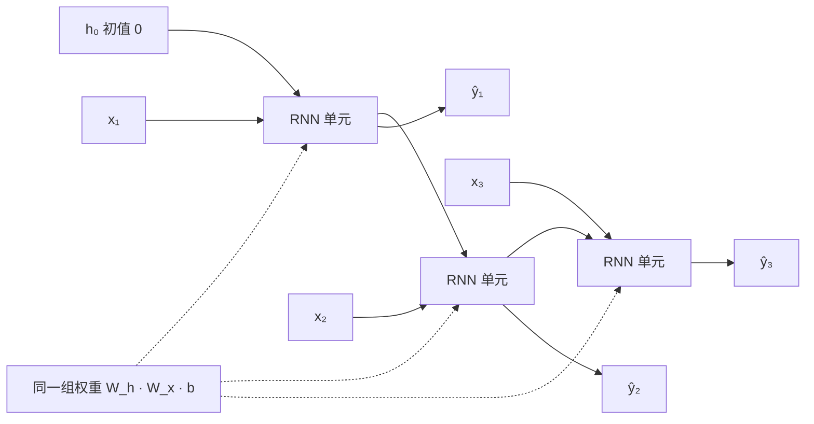
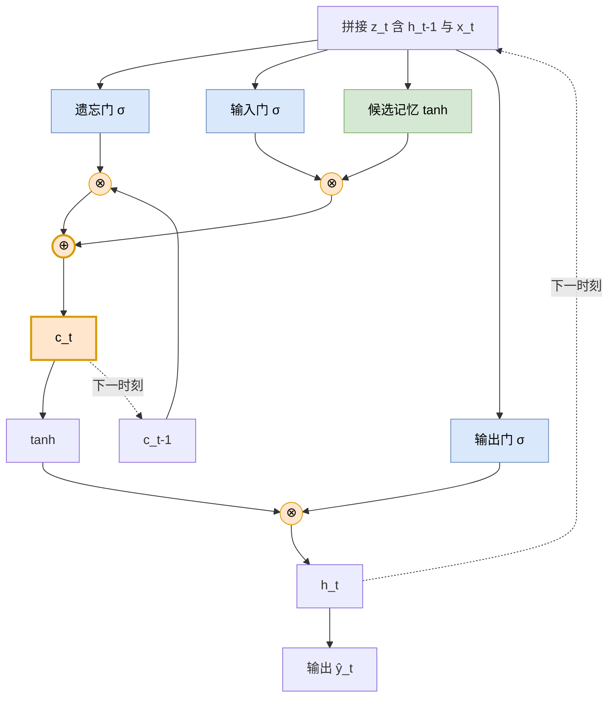
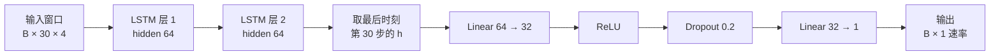
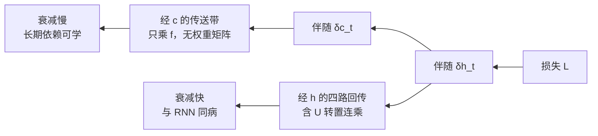

# LSTM 算法原理详解

> 配套案例：[案例1 · LSTM 单点位移时序预测](01_LSTM_位移预测_实现与调参.ipynb)　·　原理 PPT：[01_LSTM_位移预测_算法介绍.pptx](01_LSTM_位移预测_算法介绍.pptx)
>
> 本文从"为什么需要它"讲起，**完整推导前向与反向传播**，配网络结构图、单元内部示意图、数值手算示例，并说明它在位移预测中学到了什么。建议先读本文再看 Notebook，代码里每一步都能对上。

> **[📐 数学预备知识](../算法原理_数学预备知识.md)**：矩阵、导数、链式法则、softmax、特征值……零基础先读这一份（含手算例子）

**目录**

- [1. 问题设定：时序预测的数学表述](#1-问题设定时序预测的数学表述)
- [2. 从 RNN 说起](#2-从-rnn-说起)
- [3. 梯度消失与爆炸](#3-梯度消失与爆炸)
- [4. LSTM 的门控与状态](#4-lstm-的门控与状态)
- [5. 本案例的网络结构](#5-本案例的网络结构)
- [6. 损失函数与训练目标](#6-损失函数与训练目标)
- [7. 反向传播完整推导](#7-反向传播完整推导)
- [8. 梯度流的数学分析](#8-梯度流的数学分析)
- [9. 数值算例：前向与反向](#9-数值算例前向与反向)
- [10. 变体：GRU、BiLSTM 与对比](#10-变体grubilstm-与对比)
- [11. 在位移预测中的落地](#11-在位移预测中的落地)
- [12. 实现要点与常见坑](#12-实现要点与常见坑)
- [13. 小结与自检问题](#13-小结与自检问题)

---

## 1. 问题设定：时序预测的数学表述

### 1.1 形式化

设监测点在第 $t$ 天观测到的特征向量为 $\mathbf{x}_t \in \mathbb{R}^{d}$（位移速率、降雨、库水位、温度等），历史序列记作 $\mathbf{x}_1,\dots,\mathbf{x}_T$。要学的是映射

$$f_\theta:\;(\mathbf{x}_{t-L+1},\dots,\mathbf{x}_t)\;\longmapsto\;\hat{y}_{t+1:t+H}$$

即把长度 $L$ 的**历史窗口**映射为未来 $H$ 步的目标。本案例取 $L=30$ 天、$H=1$（单步训练），目标 $y$ 为**位移速率**。

多步预测两种做法的取舍：

| 方式 | 形式 | 特点 |
|---|---|---|
| 直接多输出 | $f_\theta(\cdot)\to(\hat y_{t+1},\dots,\hat y_{t+H})$ | 一次出全部，各步独立、可能不自洽 |
| **递归（自回归）** | $\hat y_{t+k}=f_\theta(\dots,\hat y_{t+k-1})$，预测值回填为输入 | 误差逐步累积，但符合"逐日滚动预报"的实际用法 |

本案例**训练用单步、评估用递归**——两种口径不同，必须分开报告（见 [§11.2](#112-为什么用速率做目标两级评估口径)）。

### 1.2 朴素方案：展平 + MLP 的三个问题

$$\hat y_{t+1}=\text{MLP}\big(\text{flatten}(\mathbf{x}_{t-L+1},\dots,\mathbf{x}_t)\big)$$

1. **参数量爆炸**：输入维度 $dL$。本案例 $d=4,\ L=30$ → 输入 120 维，第一层权重 $120\times h$；且连接是**稠密**的——"第 30 天与第 29 天相邻"要网络自己从数据里学。
2. **不共享统计强度**：序列早期学到的模式（"强降雨后 2 天位移加速"）无法迁移到后期——每个时间位置都有独立权重。
3. **窗口写死**：改 $L$ 就得改网络结构。

**结论**：需要一种**在不同时间位置共享同一组参数**、且**天然知道时间有序**的结构。

---

## 2. 从 RNN 说起

### 2.1 循环结构与参数共享

RNN 的核心是引入**隐状态** $\mathbf{h}_t\in\mathbb{R}^{n}$，逐时刻"读入"序列：

$$\mathbf{h}_t=\tanh\big(\mathbf{W}_h\mathbf{h}_{t-1}+\mathbf{W}_x\mathbf{x}_t+\mathbf{b}\big)$$

**只此一组参数** $\mathbf{W}_h\in\mathbb{R}^{n\times n}$、$\mathbf{W}_x\in\mathbb{R}^{n\times d}$、$\mathbf{b}\in\mathbb{R}^{n}$，在所有时刻复用。于是：

- 参数量 $n^2+nd+n$，与序列长度 $T$ **无关**；
- 第 1 天学到的模式与第 100 天学到的模式**共用同一套权重**（统计强度共享）。

### 2.2 时间展开

把循环结构按时间摊开，得到等价的展开图——形状与普通前馈网络相同，区别只在于**每一步用的是同一组权重**：



> ⚠️ 三个「RNN 单元」**不是三个网络**，而是同一个网络在三个时刻被调用。

### 2.3 损失与 BPTT 的起点

取 $\mathcal{L}=\sum_{t=1}^{T}\mathcal{L}_t$，隐状态梯度满足递推

$$\frac{\partial\mathcal{L}}{\partial\mathbf{h}_t}=\frac{\partial\mathcal{L}_t}{\partial\mathbf{h}_t}+\frac{\partial\mathcal{L}}{\partial\mathbf{h}_{t+1}}\cdot\frac{\partial\mathbf{h}_{t+1}}{\partial\mathbf{h}_t}$$

把梯度沿时间反传的算法即 **BPTT**。问题全部出在右端那个局部雅可比上。

---

## 3. 梯度消失与爆炸

### 3.1 单步雅可比

由 $\mathbf{h}_t=\tanh(\mathbf{W}_h\mathbf{h}_{t-1}+\cdots)$，逐元素求导并用链式法则：

$$\boxed{\;\frac{\partial\mathbf{h}_t}{\partial\mathbf{h}_{t-1}}=\mathrm{diag}\big(\mathbf{1}-\mathbf{h}_t\odot\mathbf{h}_t\big)\,\mathbf{W}_h\;}$$

> ⚠️ **转置在哪一侧很重要，这里最容易记反**：
> - **雅可比**（前向的局部线性化）是 $\mathrm{diag}(\tanh')\mathbf{W}_h$，**不带转置**；
> - **反向传播**（把误差往回送）才是 $\boldsymbol\delta_{t-1}=\mathbf{W}_h^{\top}\,\mathrm{diag}(\tanh')\,\boldsymbol\delta_t$，**转置出现在这里**。
>
> 记忆法：前向是"$\mathbf{W}$ 乘上去"，反向是"$\mathbf{W}^{\top}$ 乘回来"。数值验证（见 [§9.4](#94-关于验证)）：$\mathrm{diag}(\tanh')\mathbf{W}_h$ 与数值雅可比完全一致，而 $\mathrm{diag}(\tanh')\mathbf{W}_h^{\top}$ 不一致。

其中 $\mathbf{1}-\mathbf{h}_t\odot\mathbf{h}_t=\tanh'(\cdot)\in(0,1]$ 是**逐元素**的对角矩阵（每个分量各自缩放），$\mathbf{W}_h$ 是**全连接**的矩阵（把各分量混合起来）——**逐元素缩放与全连接混合的组合，正是这个雅可比的结构特征**。

### 3.2 连乘与范数界

跨 $k$ 步的梯度要把雅可比连乘 $k$ 次：

$$\frac{\partial\mathbf{h}_{t+k}}{\partial\mathbf{h}_t}=\prod_{j=1}^{k}\mathrm{diag}\big(\mathbf{1}-\mathbf{h}_{t+j}\odot\mathbf{h}_{t+j}\big)\,\mathbf{W}_h$$

对范数取上界（利用 $\|\mathrm{diag}(\cdot)\|\le\gamma$ 与矩阵的**谱范数** $\sigma_{\max}$）：

$$\left\|\frac{\partial\mathbf{h}_{t+k}}{\partial\mathbf{h}_t}\right\|\;\le\;\big(\gamma\,\sigma_{\max}\big)^{k},\qquad \gamma=\max|\tanh'|\le 1,\quad\sigma_{\max}=\|\mathbf{W}_h\|_2$$

> 谱范数 $\sigma_{\max}$ 是 $\mathbf{W}_h$ 的最大奇异值；当 $\mathbf{W}_h$ 对称时可简写为谱半径 $\rho(\mathbf{W}_h)$（许多教材直接写 $\rho$）。

**结论**：$\gamma\rho<1$ 指数衰减（消失），$\gamma\rho>1$ 指数增长（爆炸）。

### 3.3 数值感受

| $\gamma\rho$ | 5 步 | 20 步 | 50 步 |
|---|---|---|---|
| 0.5 | 3.1×10⁻² | 9.5×10⁻⁷ | 8.9×10⁻¹⁶ |
| 0.9 | 5.9×10⁻¹ | 1.2×10⁻¹ | 5.2×10⁻³ |
| 1.0 | 1.0 | 1.0 | 1.0 |
| 1.1 | 1.6 | 6.7 | 1.2×10² |

$\gamma\rho=0.9$ 看似"接近 1"，50 步后梯度只剩 **0.5%**——意味着**50 天前的降雨对今天位移的影响几乎学不到**。而渗流引起的边坡变形恰有这种长滞后，这就是必须换结构的原因。

> 补充：$\tanh'\le1$ 的等号仅在输入为 0 时成立，实际多数时刻远小于 1，所以**即便 $\rho=1$ 也会衰减**。

### 3.4 爆炸与梯度裁剪

爆炸比消失更危险：一次更新就把参数推到极远处，损失直接 `NaN`。对策是**全局范数裁剪**（Pascanu et al., 2013）：

$$\mathbf{g}\leftarrow\mathbf{g}\cdot\min\!\left(1,\;\frac{\tau}{\|\mathbf{g}\|}\right),\qquad \|\mathbf{g}\|=\sqrt{\textstyle\sum_i\|\mathbf{g}_i\|_2^2}$$

$\tau$ 为阈值（本案例 Notebook 取 1.0），求和遍历**所有**参数张量——先算全局范数再统一缩放，**保持梯度方向不变**。

---

## 4. LSTM 的门控与状态

### 4.1 两个核心设计

**设计一：把"记忆"与"输出"分开。**
RNN 只有一个状态 $\mathbf{h}_t$，既要存长期记忆、又要对外输出，两者相互干扰。LSTM 引入独立的**细胞状态** $\mathbf{c}_t$ 专司长期记忆，$\mathbf{h}_t$ 只是它在当前时刻的**一个投影**。

**设计二：状态更新改为"加法"。**

$$\mathbf{c}_t=\mathbf{f}_t\odot\mathbf{c}_{t-1}+\mathbf{i}_t\odot\tilde{\mathbf{c}}_t$$

对比 RNN 的 $\mathbf{h}_t=\tanh(\mathbf{W}_h\mathbf{h}_{t-1}+\cdots)$——旧状态**要乘权重矩阵**；这里旧状态只被**逐元素缩放**，梯度回传时不经过矩阵连乘。这条通路就是著名的**常数误差传送带**（Constant Error Carousel）。

至于"缩放多少、写入多少"，由三个**门**决定，门本身是学出来的。

### 4.2 前向公式（与 Notebook 代码一致的形式）

采用 `nn.LSTM` 的**分离权重**写法（$W$ 作用于输入、$U$ 作用于隐状态），$\sigma$ 为 Sigmoid，$\odot$ 为逐元素积：

$$
\begin{aligned}
\mathbf{f}_t&=\sigma\big(\mathbf{W}_f\mathbf{x}_t+\mathbf{U}_f\mathbf{h}_{t-1}+\mathbf{b}_f\big) &&\text{遗忘门：旧记忆保留多少}\\
\mathbf{i}_t&=\sigma\big(\mathbf{W}_i\mathbf{x}_t+\mathbf{U}_i\mathbf{h}_{t-1}+\mathbf{b}_i\big) &&\text{输入门：新信息写入多少}\\
\mathbf{o}_t&=\sigma\big(\mathbf{W}_o\mathbf{x}_t+\mathbf{U}_o\mathbf{h}_{t-1}+\mathbf{b}_o\big) &&\text{输出门：记忆对外暴露多少}\\
\tilde{\mathbf{c}}_t&=\tanh\big(\mathbf{W}_c\mathbf{x}_t+\mathbf{U}_c\mathbf{h}_{t-1}+\mathbf{b}_c\big) &&\text{候选记忆：要写入的内容}\\
\mathbf{c}_t&=\mathbf{f}_t\odot\mathbf{c}_{t-1}+\mathbf{i}_t\odot\tilde{\mathbf{c}}_t &&\text{细胞状态更新}\\
\mathbf{h}_t&=\mathbf{o}_t\odot\tanh(\mathbf{c}_t) &&\text{隐状态输出}
\end{aligned}
$$

### 4.3 两种写法的等价性

很多教程写拼接形式 $\mathbf{z}_t=[\mathbf{h}_{t-1};\mathbf{x}_t]$、$\mathbf{f}_t=\sigma(\mathbf{W}_f\mathbf{z}_t+\mathbf{b}_f)$。它与上面的分离形式**完全等价**——把权重按块拼起来即可：

$$\mathbf{W}_f^{\text{cat}}=\big[\;\mathbf{U}_f\;\;\mathbf{W}_f\;\big],\qquad
\mathbf{W}_f^{\text{cat}}\mathbf{z}_t=\mathbf{U}_f\mathbf{h}_{t-1}+\mathbf{W}_f\mathbf{x}_t$$

**证明**：按分块矩阵乘法直接展开

$$\big[\mathbf{U}_f\;\mathbf{W}_f\big]\begin{bmatrix}\mathbf{h}_{t-1}\\\mathbf{x}_t\end{bmatrix}=\mathbf{U}_f\mathbf{h}_{t-1}+\mathbf{W}_f\mathbf{x}_t\quad\blacksquare$$

> 这一点在实现里很有用：`nn.LSTM` 把四组权重拼成一个 $4n\times(n+d)$ 的大矩阵做**一次**矩阵乘法（比四次小乘法更快）。本文推导用分离形式，因为它能把"来自 $\mathbf{x}$ 的梯度"与"来自 $\mathbf{h}$ 的梯度"分开，物理含义更清楚。

### 4.4 矩阵形式与维度

设 batch 大小为 $B$，一次前向可写成矩阵运算：

$$\mathbf{P}_t=\mathbf{X}_t\mathbf{W}^{\top}+\mathbf{H}_{t-1}\mathbf{U}^{\top}+\mathbf{b},\qquad
\mathbf{W}=\begin{bmatrix}\mathbf{W}_f\\\mathbf{W}_i\\\mathbf{W}_c\\\mathbf{W}_o\end{bmatrix}\in\mathbb{R}^{4n\times d},\;
\mathbf{U}=\begin{bmatrix}\mathbf{U}_f\\\mathbf{U}_i\\\mathbf{U}_c\\\mathbf{U}_o\end{bmatrix}\in\mathbb{R}^{4n\times n}$$

再按行切分成四块分别过激活。维度对照：

| 张量 | 形状 | 含义 |
|---|---|---|
| $\mathbf{X}_t$ | $B\times d$ | 当前输入 |
| $\mathbf{H}_{t-1}$ | $B\times n$ | 上一时刻隐状态 |
| $\mathbf{P}_t$ | $B\times 4n$ | 四个门的**预激活**（未过 $\sigma/\tanh$） |
| $\mathbf{f}_t,\mathbf{i}_t,\mathbf{o}_t,\tilde{\mathbf{c}}_t$ | $B\times n$ | 切出后分别激活 |
| $\mathbf{c}_t,\mathbf{h}_t$ | $B\times n$ | 新状态 |
| $\hat y$ | $B\times H$ | 回归输出 |

### 4.5 单元内部结构图

下图是本案例所用 LSTM 单元的**完整数据流**：橙色为细胞状态主干（横向贯穿的传送带），蓝色为三个门，绿色为候选记忆，$\otimes$ 为逐元素乘、$\oplus$ 为逐元素加。



**读图要点**：

1. 主横线是 $\mathbf{c}$ 的更新路径：$\mathbf{c}_{t-1}\to\otimes(\mathbf{f}_t)\to\oplus(\mathbf{i}_t\odot\tilde{\mathbf{c}}_t)\to\mathbf{c}_t$。**只有逐元素乘与加，没有权重矩阵**——这是梯度能长期保存的结构原因。
2. 四个激活块**都只读** $\mathbf{z}_t=[\mathbf{h}_{t-1};\mathbf{x}_t]$，彼此并行、互不依赖（因此可合并成一次大矩阵乘法）。
3. 输出门 $\mathbf{o}_t$ 作用于 $\tanh(\mathbf{c}_t)$ 而**不作用于 $\mathbf{c}_t$ 本身**——所以"内部记着"与"对外说出"是两件事。

### 4.6 逐门解读

| 门 | 控制 | 极端取值 | 位移预测中的物理含义 |
|---|---|---|---|
| 遗忘门 $\mathbf{f}_t$ | 旧记忆保留比例 | $1$ 全留 / $0$ 全忘 | 前期降雨、水位影响的**衰减速度** |
| 输入门 $\mathbf{i}_t$ | 候选内容写入比例 | $1$ 全写 / $0$ 拒收 | 今天这场强降雨**是否值得记住** |
| 输出门 $\mathbf{o}_t$ | 记忆对外暴露比例 | $1$ 全暴露 / $0$ 只存不说 | 当前阶段记忆**是否该影响输出** |

**几个有用的极端情形**：

- $\mathbf{f}_t\equiv1,\ \mathbf{i}_t\equiv0$：$\mathbf{c}_t=\mathbf{c}_{t-1}$，记忆**无限期保持**——RNN 做不到；
- $\mathbf{f}_t\equiv0$：每步清空，退化为只看当前输入的前馈网络；
- $\mathbf{o}_t\equiv1$：$\mathbf{h}_t=\tanh(\mathbf{c}_t)$。

> 💡 **为什么门用 Sigmoid、内容用 tanh？**
> Sigmoid 值域 $(0,1)$，天然是"开关"；tanh 值域 $(-1,1)$ 且**零中心**，适合表达"数值内容"（正/负增量）。若内容也用 Sigmoid，就永远无法表达负值。

### 4.7 参数量

四个门各需 $\mathbf{W}\in\mathbb{R}^{n\times d}$、$\mathbf{U}\in\mathbb{R}^{n\times n}$、$\mathbf{b}\in\mathbb{R}^{n}$。

**注意两种计数约定**（这一点很容易算错）：

$$N^{\text{math}}_{\text{LSTM}}(n,d)=4n(n+d)+4n \qquad\text{（数学文献约定：每门一个偏置）}$$

$$N^{\text{torch}}_{\text{LSTM}}(n,d)=4n(n+d)+8n \qquad\text{（PyTorch 实现：每门两个偏置 } \mathbf{b}_{ih},\mathbf{b}_{hh}\text{）}$$

> ⚠️ **本案例用 PyTorch，必须用第二个式子**。若按数学约定算，$n=64,d=4$ 会少算 256 个参数，两层的误差累计 512。

| 配置 | 数学约定 | PyTorch（本案例） |
|---|---|---|
| $n=64,\ d=4$（层 1 输入） | 17,664 | **17,920** |
| $n=64,\ d=64$（层 2 输入） | 33,024 | **33,280** |
| $n=498,\ d=1$（论文附录配置） | 996,000 | 997,992 |

---

## 5. 本案例的网络结构

### 5.1 整体架构

本案例的模型是**两层 LSTM + 三层回归头**（可直接对照 Notebook §5 的 `LSTMRegressor`）：



**关键设计说明**：

| 设计 | 取值 | 原因 |
|---|---|---|
| 取最后时刻 `out[:, -1]` | 而非平均池化 | 窗口信息已由 $\mathbf{h}_{30}$ 汇聚；也为后续换成注意力聚合留接口 |
| `dropout` 只在层间 | `num_layers=2` 时生效 | `nn.LSTM` 的 dropout 只作用于**层与层之间**，单层时自动失效，故回归头里另加一个 |
| 回归头多一层隐藏 | $64\to32\to1$ | 留一点非线性容量，同时把 64 维压到目标维度 |

### 5.2 逐层参数量核算

| 层 | 计算式（PyTorch 双偏置） | 参数量 |
|---|---|---|
| LSTM 层 1 | $4\times64\times(64+4)+8\times64$ | 17,920 |
| LSTM 层 2 | $4\times64\times(64+64)+8\times64$ | 33,280 |
| `Linear(64→32)` | $64\times32+32$ | 2,080 |
| `Linear(32→1)` | $32\times1+1$ | 33 |
| **合计** | | **53,313** |

> 该数字与 Notebook 中 `sum(p.numel() for p in model.parameters())` 的实际打印值一致。

> 层 2 的输入维度是 64（层 1 的隐状态），**不是** 4——这是读代码时最容易看错的地方。

### 5.3 数据流水线与防泄漏划分

模型之外同样重要的是**数据怎么切**。本案例严格执行"按目标时刻划分 + 标准化器只用训练段拟合"：


**三个必须守住的点**：

1. **标准化器只在训练段 `fit`**——否则验证/测试段的均值方差会泄漏进训练；
2. **按"目标时刻"划分**，不是按窗口起点——否则训练样本的目标可能落在测试时间段内；
3. **目标列同时作为输入（自回归）时，输入与输出共用同一个标准化器**——这样递归预测时预测值可直接回填，无需反变换再变换。

---

## 6. 损失函数与训练目标

### 6.1 多步损失

对 batch 内 $B$ 个样本、预测 $H$ 步，取标准化空间的均方误差：

$$\mathcal{L}_{\text{MSE}}=\frac{1}{BH}\sum_{b=1}^{B}\sum_{h=1}^{H}\big(\hat y_{b,h}-y_{b,h}\big)^2$$

若各步权重不同（如更看重近端），加权重 $w_h$：

$$\mathcal{L}_{\text{wMSE}}=\frac{1}{B}\sum_{b=1}^{B}\sum_{h=1}^{H}\frac{w_h}{\sum_{h'}w_{h'}}\big(\hat y_{b,h}-y_{b,h}\big)^2$$

**为什么在标准化空间算损失？** 各站位移量级差异大，标准化后不同测点可公平加权；否则量级大的点会主导梯度。

### 6.2 正则与总目标

$$\mathcal{L}=\mathcal{L}_{\text{MSE}}+\lambda\underbrace{\|\boldsymbol\theta\|_2^2}_{\text{L2 正则}}$$

本案例用 **AdamW**，其权重衰减是**解耦**的（不混进梯度里）：

$$
\begin{aligned}
\mathbf{m}_t&=\beta_1\mathbf{m}_{t-1}+(1-\beta_1)\mathbf{g}_t\\
\mathbf{v}_t&=\beta_2\mathbf{v}_{t-1}+(1-\beta_2)\mathbf{g}_t^2\\
\hat{\mathbf{m}}_t&=\frac{\mathbf{m}_t}{1-\beta_1^{t}},\qquad \hat{\mathbf{v}}_t=\frac{\mathbf{v}_t}{1-\beta_2^{t}}\\
\boldsymbol\theta_t&=\boldsymbol\theta_{t-1}-\eta\left(\frac{\hat{\mathbf{m}}_t}{\sqrt{\hat{\mathbf{v}}_t}+\epsilon}+\lambda\,\boldsymbol\theta_{t-1}\right)
\end{aligned}
$$

默认 $\beta_1=0.9,\ \beta_2=0.999,\ \epsilon=10^{-8}$。注意最后一项 $\lambda\boldsymbol\theta_{t-1}$ 是**直接加在更新量上**的（这就是 "W" 的含义），而非加进 $\mathbf{g}_t$。

### 6.3 学习率调度与早停

$$\eta_t=\eta_0\cdot\gamma^{\lfloor t/p\rfloor},\qquad \gamma=0.5,\ p=\text{patience}$$

`ReduceLROnPlateau`：验证损失连续 $p$ 轮不降则学习率减半。配合**早停回滚**——记录验证损失最优时的权重，训练结束后**回滚到那一步**，而不是用最后一轮的权重。

---

## 7. 反向传播完整推导

这一节把 LSTM 的 BPTT 完整推一遍。**所有公式均已用数值微分独立验证**（见 [§9.4](#94-关于验证)）。

### 7.1 伴随变量

定义两个伴随（adjoint）向量作为反向传播的载体：

$$\boldsymbol\delta^h_t\equiv\frac{\partial\mathcal{L}}{\partial\mathbf{h}_t}\in\mathbb{R}^{n},\qquad
\boldsymbol\delta^c_t\equiv\frac{\partial\mathcal{L}}{\partial\mathbf{c}_t}\in\mathbb{R}^{n}$$

### 7.2 输出层的注入

由 $\hat y_t=\mathbf{w}_y^{\top}\mathbf{h}_t+b_y$，回归损失的梯度就是残差：

$$e_t\equiv\frac{\partial\mathcal{L}_t}{\partial\hat y_t}=\hat y_t-y_t$$

$$\boldsymbol\delta^h_t\;\mathrel{+}=\;e_t\,\mathbf{w}_y,\qquad
\frac{\partial\mathcal{L}}{\partial\mathbf{w}_y}\;\mathrel{+}=\;e_t\,\mathbf{h}_t,\qquad
\frac{\partial\mathcal{L}}{\partial b_y}\;\mathrel{+}=\;e_t$$

（若回归头是多层，则先对这几层照常反传，再把结果注入 $\boldsymbol\delta^h_t$。）

### 7.3 细胞状态伴随的递推（核心）

$\mathbf{c}_t$ 有**两条**下游支路：本时刻经 $\mathbf{h}_t=\mathbf{o}_t\odot\tanh(\mathbf{c}_t)$ 影响输出；以及下一时刻的 $\mathbf{c}_{t+1}$。因此

$$\boxed{\;\boldsymbol\delta^c_t=\underbrace{\boldsymbol\delta^h_t\odot\mathbf{o}_t\odot\big(\mathbf{1}-\tanh^2\mathbf{c}_t\big)}_{\text{来自本步 } \mathbf{h}_t}+\underbrace{\boldsymbol\delta^c_{t+1}\odot\mathbf{f}_{t+1}}_{\text{来自下一步的传送带}}\;}$$

**这个式子就是 LSTM 的全部秘密**：第二项只有**逐元素乘 $\mathbf{f}$**，不含权重矩阵、不含激活导数。若 $\mathbf{f}\approx1$，梯度可近乎无损地跨时间步回传。

**补一步：它是怎么来的？** 用链式法则把"$\mathbf{c}_t$ 影响哪些下游量"逐个列出来，只有两条路径：

```text
路径 1：c_t ──→ h_t = o_t ⊙ tanh(c_t) ──→ 本步输出 ŷ_t ──→ L
路径 2：c_t ──→ c_{t+1} = f_{t+1} ⊙ c_t + i_{t+1} ⊙ c̃_{t+1} ──→ （继续往后）
```

两条路径的贡献相加：

$$\boldsymbol\delta^c_t=\underbrace{\frac{\partial\mathcal{L}}{\partial\mathbf{h}_t}\cdot\frac{\partial\mathbf{h}_t}{\partial\mathbf{c}_t}}_{\text{路径 1}}+\underbrace{\frac{\partial\mathcal{L}}{\partial\mathbf{c}_{t+1}}\cdot\frac{\partial\mathbf{c}_{t+1}}{\partial\mathbf{c}_t}}_{\text{路径 2}}$$

逐项求出这两个局部导数：

$$
\frac{\partial\mathbf{h}_t}{\partial\mathbf{c}_t}=\mathrm{diag}\Big(\mathbf{o}_t\odot\big(\mathbf{1}-\tanh^2\mathbf{c}_t\big)\Big)
\quad\text{（因为 } \mathbf{h}_t=\mathbf{o}_t\odot\tanh(\mathbf{c}_t)\text{，而 } \tanh'=1-\tanh^2\text{）}
$$

$$\frac{\partial\mathbf{c}_{t+1}}{\partial\mathbf{c}_t}=\mathrm{diag}\big(\mathbf{f}_{t+1}\big)
\quad\text{（因为 } \mathbf{c}_{t+1}=\mathbf{f}_{t+1}\odot\mathbf{c}_t+\cdots\text{，对 } \mathbf{c}_t \text{ 求导只剩 } \mathbf{f}_{t+1}\text{）}$$

把 $\mathrm{diag}(\mathbf{v})\,\mathbf{u}=\mathbf{v}\odot\mathbf{u}$（见[数学预备知识 §3.1](../算法原理_数学预备知识.md)）代入，即得上面的递推式。**注意路径 1 里带着 $\tanh'$ 与 $\mathbf{o}_t$（都会压缩梯度），路径 2 里只有 $\mathbf{f}$（可学到接近 1）——这就是为什么长程梯度主要走路径 2。**

### 7.4 各门与候选的伴随

先算各门**预激活**的梯度（用到 $\sigma'(z)=\sigma(z)(1-\sigma(z))$ 与 $\tanh'(z)=1-\tanh^2(z)$）：

$$
\begin{aligned}
\boldsymbol\delta^o_t&\equiv\frac{\partial\mathcal{L}}{\partial\mathbf{p}^o_t}=\boldsymbol\delta^h_t\odot\tanh(\mathbf{c}_t)\odot\mathbf{o}_t\odot(\mathbf{1}-\mathbf{o}_t)\\[2pt]
\boldsymbol\delta^f_t&\equiv\frac{\partial\mathcal{L}}{\partial\mathbf{p}^f_t}=\boldsymbol\delta^c_t\odot\mathbf{c}_{t-1}\odot\mathbf{f}_t\odot(\mathbf{1}-\mathbf{f}_t)\\[2pt]
\boldsymbol\delta^i_t&\equiv\frac{\partial\mathcal{L}}{\partial\mathbf{p}^i_t}=\boldsymbol\delta^c_t\odot\tilde{\mathbf{c}}_t\odot\mathbf{i}_t\odot(\mathbf{1}-\mathbf{i}_t)\\[2pt]
\boldsymbol\delta^{\tilde c}_t&\equiv\frac{\partial\mathcal{L}}{\partial\mathbf{p}^c_t}=\boldsymbol\delta^c_t\odot\mathbf{i}_t\odot\big(\mathbf{1}-\tilde{\mathbf{c}}_t^{\,2}\big)
\end{aligned}
$$

**注意各门来源不同**：$\boldsymbol\delta^o_t$ 来自 $\boldsymbol\delta^h_t$（输出门只影响 $\mathbf{h}$）；另外三个来自 $\boldsymbol\delta^c_t$（它们只影响 $\mathbf{c}$）。

### 7.5 参数梯度

每个门的梯度都是"伴随 $\times$ 输入"的外积，并按时间累加：

$$
\frac{\partial\mathcal{L}}{\partial\mathbf{W}_g}=\sum_{t=1}^{T}\boldsymbol\delta^g_t\,\mathbf{x}_t^{\top},\qquad
\frac{\partial\mathcal{L}}{\partial\mathbf{U}_g}=\sum_{t=1}^{T}\boldsymbol\delta^g_t\,\mathbf{h}_{t-1}^{\top},\qquad
\frac{\partial\mathcal{L}}{\partial\mathbf{b}_g}=\sum_{t=1}^{T}\boldsymbol\delta^g_t
$$

其中 $g\in\{f,i,c,o\}$。外积的含义很直观：**第 $t$ 步的误差在多大程度上该归因于第 $j$ 个输入通道**，就是 $\delta^g_{t,i}\cdot x_{t,j}$。

### 7.6 向 $t-1$ 回传

$\mathbf{h}_{t-1}$ 出现在四个门的线性部分里，故要四路求和：

$$\boxed{\;\boldsymbol\delta^h_{t-1}=\mathbf{U}_f^{\top}\boldsymbol\delta^f_t+\mathbf{U}_i^{\top}\boldsymbol\delta^i_t+\mathbf{U}_c^{\top}\boldsymbol\delta^{\tilde c}_t+\mathbf{U}_o^{\top}\boldsymbol\delta^o_t\;}$$

$$\boxed{\;\boldsymbol\delta^c_{t-1}=\boldsymbol\delta^c_t\odot\mathbf{f}_t\;}$$

第二式再次说明：**细胞状态的梯度回传只需乘遗忘门**。

### 7.7 完整算法

把上述公式整理成可实现的流程：

```text
输入：整个序列的缓存 (x_t, h_{t-1}, c_t, f_t, i_t, õ_t, o_t) 与每步残差 e_t
初始化 δh = 0, δc = 0，所有参数梯度置零

for t = T, T-1, ..., 1:
    # ① 注入本步输出层的误差
    δh ← δh + e_t · w_y
    δc ← δc + δh ⊙ o_t ⊙ (1 − tanh²(c_t))

    # ② 算各门预激活的伴随
    δo  ← δh ⊙ tanh(c_t) ⊙ o_t ⊙ (1 − o_t)
    δf  ← δc ⊙ c_{t-1}  ⊙ f_t ⊙ (1 − f_t)
    δi  ← δc ⊙ õ_t      ⊙ i_t ⊙ (1 − i_t)
    δc̃  ← δc ⊙ i_t      ⊙ (1 − õ_t²)

    # ③ 累加参数梯度（外积）
    for g in {f, i, c, o}:
        dW_g += δg ⊗ x_t ;  dU_g += δg ⊗ h_{t-1} ;  db_g += δg

    # ④ 向 t−1 回传
    δh ← Ufᵀ δf + Uiᵀ δi + Ucᵀ δc̃ + Uoᵀ δo     ← 四路求和（含 U 连乘，会衰减）
    δc ← δc ⊙ f_t                                ← 传送带（不含 U，衰减慢）
```

**看第 ④ 步就能理解 LSTM 的一切**：$\boldsymbol\delta^h$ 的回传含 $\mathbf{U}^{\top}$ 连乘（会衰减，与 RNN 同病），而 $\boldsymbol\delta^c$ 的回传只乘 $\mathbf{f}$（衰减慢）。**长程梯度主要走 $\mathbf{c}$ 这条路**。

---

## 8. 梯度流的数学分析

### 8.1 $\partial\mathbf{c}_t/\partial\mathbf{c}_{t-1}$ 的完整展开

由 $\mathbf{c}_t=\mathbf{f}_t\odot\mathbf{c}_{t-1}+\mathbf{i}_t\odot\tilde{\mathbf{c}}_t$，且 $\mathbf{f}_t,\mathbf{i}_t,\tilde{\mathbf{c}}_t$ 都是 $\mathbf{h}_{t-1}$ 的函数、而 $\mathbf{h}_{t-1}=\mathbf{o}_{t-1}\odot\tanh(\mathbf{c}_{t-1})$ 又依赖 $\mathbf{c}_{t-1}$，完整展开为：

$$\frac{\partial\mathbf{c}_t}{\partial\mathbf{c}_{t-1}}=\underbrace{\mathrm{diag}(\mathbf{f}_t)}_{\text{主干}}
+\underbrace{\mathrm{diag}(\mathbf{c}_{t-1})\frac{\partial\mathbf{f}_t}{\partial\mathbf{c}_{t-1}}
+\mathrm{diag}(\tilde{\mathbf{c}}_t)\frac{\partial\mathbf{i}_t}{\partial\mathbf{c}_{t-1}}
+\mathrm{diag}(\mathbf{i}_t)\frac{\partial\tilde{\mathbf{c}}_t}{\partial\mathbf{c}_{t-1}}}_{\text{次级项}}$$

次级项经链式法则再展开，例如

$$\frac{\partial\mathbf{f}_t}{\partial\mathbf{c}_{t-1}}=\mathrm{diag}\big(\mathbf{f}_t\odot(\mathbf{1}-\mathbf{f}_t)\big)\,\mathbf{U}_f\,\mathrm{diag}\big(\mathbf{o}_{t-1}\odot(\mathbf{1}-\tanh^2\mathbf{c}_{t-1})\big)$$

逐项读这个式子：

1. $\dfrac{\partial\mathbf{h}_{t-1}}{\partial\mathbf{c}_{t-1}}=\mathrm{diag}\big(\mathbf{o}_{t-1}\odot(1-\tanh^2\mathbf{c}_{t-1})\big)$——由 $\mathbf{h}_{t-1}=\mathbf{o}_{t-1}\odot\tanh(\mathbf{c}_{t-1})$ 求导；
2. $\dfrac{\partial\mathbf{f}_t}{\partial\mathbf{h}_{t-1}}=\mathrm{diag}\big(\mathbf{f}_t\odot(1-\mathbf{f}_t)\big)\,\mathbf{U}_f$——由 $\mathbf{f}_t=\sigma(\mathbf{W}_f\mathbf{x}_t+\mathbf{U}_f\mathbf{h}_{t-1}+\mathbf{b}_f)$ 求导，**注意这里不带转置**（与 [§3.1](#31-单步雅可比) 同一个道理：雅可比是 $\mathrm{diag}(\sigma')\mathbf{U}$，转置只出现在反向回传时）；
3. 两者相乘即得上式。

——**含 $\mathbf{U}_f$ 权重矩阵**，因此这一项会和 RNN 一样衰减。

> ⚠️ **这是全篇最容易写错的一个地方**：链式展开里的 $\mathbf{U}_f$ **不带转置**（它是对"$\mathbf{f}$ 关于 $\mathbf{h}_{t-1}$"求导得到的雅可比），而反向传播公式 $\boldsymbol\delta^h_{t-1}=\sum_g\mathbf{U}_g^{\top}\boldsymbol\delta^g_t$ 里的 $\mathbf{U}_g^{\top}$ **带转置**。两者容易混，请对照 [§3.1](#31-单步雅可比) 的辨析框一起看。

### 8.2 主干项为什么是"传送带"

跨 $k$ 步传播时，若只保留主干（次级项含 $\sigma'\le0.25$，衰减很快，可近似忽略）：

$$\frac{\partial\mathbf{c}_{t+k}}{\partial\mathbf{c}_t}\approx\prod_{j=1}^{k}\mathrm{diag}(\mathbf{f}_{t+j})=\mathrm{diag}\Big(\textstyle\prod_{j=1}^{k}\mathbf{f}_{t+j}\Big)$$

**关键差别**：对角矩阵连乘仍是对角矩阵，**没有矩阵间的相互作用**——不存在"谱半径被反复相乘"的问题。每个维度各自以 $\prod f$ 的速率衰减，而 $\mathbf{f}$ 是**学出来的**：需要长期记忆的维度会把 $f$ 学到接近 1。

### 8.3 与 RNN 的谱对比

| | RNN | LSTM 的 $\mathbf{c}$ 通路 |
|---|---|---|
| 跨步雅可比 | $\mathrm{diag}(\tanh')\,\mathbf{W}_h$ | $\mathrm{diag}(\mathbf{f}_t)+\text{次级项}$ |
| 是否含权重矩阵 | **含**，每次连乘 | 主干**不含** |
| 衰减规律 | $(\gamma\sigma_{\max})^k$，$\gamma\le1$ 由激活函数定死 | $\prod f_j$，$f$ 可学到 $\to1$ |
| 能否自适应 | 不能 | **能**（$f$ 由数据学） |

**一句话**：RNN 的衰减率被激活函数锁死；LSTM 把衰减率变成了**可学习参数**。

### 8.4 局限：LSTM 不是"不会梯度消失"

必须说清楚（很多教程回避这一点）：

> LSTM **不是根治**梯度消失，而是**提供了一条不经过权重矩阵连乘的通路**。
> - 次级项仍含 $\mathbf{U}^{\top}$ 与 $\sigma'\le0.25$，仍会衰减；
> - $\boldsymbol\delta^h$ 的四路回传（[§7.6](#76-向-t-1-回传)）**照样含 $\mathbf{U}^{\top}$ 连乘**；
> - 若某些维度学到 $f\ll1$，那条通路同样会消失。

更准确的表述是：**LSTM 把"必然的指数衰减"变成了"可学习的、可能接近无损的衰减"**。

数值对照（50 步后保留比例）：RNN 在 $\gamma\rho=0.9$ 时剩 **0.5%**；LSTM 在 $f=0.95$ 时剩 **7.7%**、$f=0.99$ 时剩 **60.5%**。

### 8.5 梯度回传路径示意



---

## 9. 数值算例：前向与反向

用 $n=2$（2 个隐单元）、$d=1$（1 个输入）的极小例子把前向、反向都算一遍。**下方每个数字都经过数值微分交叉验证**。

### 9.1 设定

$$\mathbf{h}_{t-1}=\begin{bmatrix}0.5\\-0.3\end{bmatrix},\quad \mathbf{x}_t=[1.2],\quad \mathbf{c}_{t-1}=\begin{bmatrix}0.8\\-0.6\end{bmatrix},\quad
\mathbf{z}_t=[0.5,\,-0.3,\,1.2]^{\top}$$

$$
\mathbf{W}_f=\begin{bmatrix}0.7&-0.2&0.5\\0.1&0.6&-0.3\end{bmatrix},\;
\mathbf{b}_f=\begin{bmatrix}0.5\\-0.1\end{bmatrix},\quad
\mathbf{W}_i=\begin{bmatrix}0.4&0.3&-0.6\\0.2&-0.5&0.7\end{bmatrix},\;
\mathbf{b}_i=\begin{bmatrix}0.2\\0.3\end{bmatrix}
$$

$$
\mathbf{W}_c=\begin{bmatrix}0.6&0.1&0.8\\-0.4&0.5&0.2\end{bmatrix},\;
\mathbf{b}_c=\begin{bmatrix}0.0\\0.1\end{bmatrix},\quad
\mathbf{W}_o=\begin{bmatrix}0.5&-0.4&0.3\\0.7&0.2&-0.5\end{bmatrix},\;
\mathbf{b}_o=\begin{bmatrix}-0.2\\0.4\end{bmatrix}
$$

输出层 $\mathbf{w}_y=[1.0,\ 0.5]$、$b_y=0.1$；真值 $y=0.6$。（为叙述简洁，此处用拼接形式。）

### 9.2 前向

| 步骤 | 预激活 $\mathbf{W}\mathbf{z}+\mathbf{b}$ | 激活后 |
|---|---|---|
| 遗忘门 $\mathbf{f}_t=\sigma(\cdot)$ | $[1.51,\ -0.59]$ | $[0.8191,\ 0.3566]$ |
| 输入门 $\mathbf{i}_t=\sigma(\cdot)$ | $[-0.41,\ 1.39]$ | $[0.3989,\ 0.8006]$ |
| 候选 $\tilde{\mathbf{c}}_t=\tanh(\cdot)$ | $[1.23,\ -0.01]$ | $[0.8426,\ -0.0100]$ |
| 输出门 $\mathbf{o}_t=\sigma(\cdot)$ | $[0.53,\ 0.09]$ | $[0.6295,\ 0.5225]$ |

$$
\mathbf{c}_t=\underbrace{[0.6552,\,-0.2140]}_{\mathbf{f}_t\odot\mathbf{c}_{t-1}}+\underbrace{[0.3361,\,-0.0080]}_{\mathbf{i}_t\odot\tilde{\mathbf{c}}_t}=[0.9914,\,-0.2220]
$$

$$
\mathbf{h}_t=\mathbf{o}_t\odot\tanh(\mathbf{c}_t)=[0.6295,0.5225]\odot[0.7579,-0.2184]=[0.4771,\,-0.1141]
$$

$$
\hat y=\mathbf{w}_y^{\top}\mathbf{h}_t+b_y=1.0\times0.4771+0.5\times(-0.1141)+0.1=0.520054
$$

$$\mathcal{L}=\tfrac12(\hat y-y)^2=\tfrac12(0.520054-0.6)^2=3.1956\times10^{-3}$$

> **读数**：第 1 维 $f_1=0.82,\ i_1=0.40$ → 旧记忆大部保留、新内容少量写入，$\mathbf{c}$ 第 1 维从 0.80 平滑升到 0.99；第 2 维 $f_2=0.36$ **较小** → 旧记忆大幅丢弃，从 −0.60 快速衰减到 −0.22。**不同维度呈现不同的记忆时间尺度**——这正是 LSTM 相比 RNN 的核心增益。

### 9.3 反向

残差 $e=\hat y-y=-0.079946$。逐项代入 [§7](#7-反向传播完整推导) 的公式：

| 量 | 数值 |
|---|---|
| $\boldsymbol\delta^h_t=e\,\mathbf{w}_y$ | $[-0.079946,\ -0.039973]$ |
| $\boldsymbol\delta^c_t=\boldsymbol\delta^h_t\odot\mathbf{o}_t\odot(\mathbf{1}-\tanh^2\mathbf{c}_t)$ | $[-0.021414,\ -0.019889]$ |
| $\boldsymbol\delta^f_t$ | $[-0.002539,\ 0.002738]$ |
| $\boldsymbol\delta^i_t$ | $[-0.004326,\ 0.000032]$ |
| $\boldsymbol\delta^o_t$ | $[-0.014133,\ 0.002178]$ |
| $\boldsymbol\delta^{\tilde c}_t$ | $[-0.002478,\ -0.015921]$ |
| $\partial\mathcal{L}/\partial\mathbf{b}_f=\boldsymbol\delta^f_t$ | $[-0.002539,\ 0.002738]$ |
| $\partial\mathcal{L}/\partial\mathbf{w}_y=e\,\mathbf{h}_t$ | $[-0.038143,\ 0.009123]$ |
| $\partial\mathcal{L}/\partial b_y=e$ | $-0.079946$ |

参数梯度（外积 $\boldsymbol\delta^f_t\mathbf{z}_t^{\top}$）：

$$\frac{\partial\mathcal{L}}{\partial\mathbf{W}_f}=
\begin{bmatrix}-0.002539\\0.002738\end{bmatrix}\begin{bmatrix}0.5&-0.3&1.2\end{bmatrix}=
\begin{bmatrix}-0.001269&0.000762&-0.003047\\0.001369&-0.000821&0.003286\end{bmatrix}$$

### 9.4 关于验证

上述解析梯度全部用**中心差分数值梯度**独立核对：

- 单步情形的 **10 组参数梯度**，最大偏差 $<5\times10^{-12}$；
- 一个 **3 步序列**（$n=3,d=2$，每步均有监督）的 **14 组参数梯度**，最大偏差 $<2\times10^{-11}$——这一步专门用于验证跨时间递推项（$\boldsymbol\delta^c\!\leftarrow\!\boldsymbol\delta^c\odot\mathbf{f}$ 与四路 $\mathbf{U}^{\top}$ 回传）的正确性。

> 这也解释了 Notebook §4.3 的做法：**先用数值梯度验证自己写的反向传播，再与 `nn.LSTM` 的输出对齐**。梯度检查是理解 RNN 类模型最有效的手段。

---

## 10. 变体：GRU、BiLSTM 与对比

### 10.1 GRU

GRU（Cho et al., 2014）把"遗忘门 + 输入门"合并为一个**更新门**，并取消独立的细胞状态：

$$
\begin{aligned}
\mathbf{z}_t&=\sigma\big(\mathbf{W}_z\mathbf{x}_t+\mathbf{U}_z\mathbf{h}_{t-1}+\mathbf{b}_z\big) &&\text{更新门}\\
\mathbf{r}_t&=\sigma\big(\mathbf{W}_r\mathbf{x}_t+\mathbf{U}_r\mathbf{h}_{t-1}+\mathbf{b}_r\big) &&\text{重置门}\\
\tilde{\mathbf{h}}_t&=\tanh\big(\mathbf{W}_h\mathbf{x}_t+\mathbf{U}_h(\mathbf{r}_t\odot\mathbf{h}_{t-1})+\mathbf{b}_h\big) &&\text{候选隐状态}\\
\mathbf{h}_t&=(\mathbf{1}-\mathbf{z}_t)\odot\mathbf{h}_{t-1}+\mathbf{z}_t\odot\tilde{\mathbf{h}}_t &&\text{插值更新}
\end{aligned}
$$

| | LSTM | GRU |
|---|---|---|
| 门数 | 3 | 2 |
| 独立细胞状态 | 有 | 无（$\mathbf{h}$ 兼职） |
| 参数量 | $4n(n+d)+4n$ | $3n(n+d)+3n$ |
| 加法通路 | $\mathbf{c}_t=\mathbf{f}\odot\mathbf{c}_{t-1}+\cdots$ | $\mathbf{h}_t=(\mathbf{1}-\mathbf{z})\odot\mathbf{h}_{t-1}+\cdots$ |

**本案例实测**：GRU 参数量少 25%，但精度与 LSTM 基本持平甚至略差 → 在该数据规模上**瓶颈不是参数效率**。这是"先看数据再调模型"的一个例证。

### 10.2 BiLSTM

双向 LSTM 用两个方向相反的 LSTM 编码后拼接：

$$\mathbf{h}_t^{\text{bi}}=\big[\overrightarrow{\mathbf{h}_t};\ \overleftarrow{\mathbf{h}_t}\big]$$

> ⚠️ **用于预测任务时必须判断是否泄漏**：
> - 本案例是**滑窗**设定——每个样本只含"过去 $L$ 天"，反向 LSTM 只在**这个过去窗口内部**反向扫描，**不涉及未来**，因此合法；
> - 若对整段序列一次性编码（如"用全部历史预测未来一段"），反向方向会读到**目标时刻之后**的数据，构成泄漏。
>
> **判断准则只有一条**：反向扫描的范围里，是否包含预测目标时刻之后的数据。

### 10.3 其他变体

| 变体 | 改动 | 作用 |
|---|---|---|
| Peephole | $\mathbf{f}_t=\sigma(\mathbf{W}_f\mathbf{x}_t+\mathbf{U}_f\mathbf{h}_{t-1}+\mathbf{p}_f\odot\mathbf{c}_{t-1}+\mathbf{b}_f)$ | 让门感知记忆的精确取值 |
| Coupled 门 | 令 $\mathbf{i}_t=\mathbf{1}-\mathbf{f}_t$ | 减少参数，只在忘记处写入 |
| LayerNorm | 对预激活做归一化 | 深层 LSTM 稳定训练 |
| Stacked | 多层堆叠，下层输出作上层输入 | 更大容量，更易过拟合 |

### 10.4 与 Transformer 的对比

| | LSTM | Transformer |
|---|---|---|
| 信息路径长度 | $O(T)$ 逐级传递 | $O(1)$ 注意力直连 |
| 并行性 | 时间步**串行** | 全序列**并行** |
| 位置信息 | 结构内蕴 | 需显式位置编码 |
| 小样本表现 | 归纳偏置强，通常更稳 | 需更多数据 |
| 复杂度 | $O(T)$ | $O(T^2)$ |

这正是[案例3](../CNN-Transformer/) 的出发点：**因果卷积提局部模式 + 自注意力抓长依赖**，兼顾二者之长。

---

## 11. 在位移预测中的落地

### 11.1 输入输出设计

| 项 | 本案例设定 | 原因 |
|---|---|---|
| 输入 $\mathbf{x}_t$ | 降雨、库水位、温度、**位移速率自身** | 位移是被动响应，必须给驱动量；含目标自身即自回归项，通常显著提升精度 |
| 窗口 $L$ | 30 天 | 由降雨-位移互相关滞后分析确定，覆盖 1~2 个主导周期 |
| 目标 | 位移速率 | 见 §11.2 |
| 归一化 | StandardScaler，**仅训练段 fit** | 防泄漏 |

### 11.2 为什么用速率做目标：两级评估口径

直接回归累计位移有陷阱：**累计位移单调上升**，模型只要学会"明天 ≈ 今天"就能拿到很高的整体 $R^2$——这叫 **persistence 支配**，看着漂亮，实际什么都没学到。

因此采用**两级口径**：

| 口径 | 定义 | 作用 |
|---|---|---|
| **速率级** | $\Delta s_t=s_t-s_{t-1}$ | 检验是否真的学到"驱动 → 响应" |
| **累积重构** | $\hat s_T=s_{t_0}+\sum_k\Delta\hat s_{t_0+k}$ | 工程真正关心的量 |

> 📌 两者必须**同时报告**：只报累积会因 persistence 而虚高，只报速率又脱离工程含义。

### 11.3 门控学到了什么：与物理滞后核对照

把训练好的遗忘门序列 $\mathbf{f}_t$ 与降雨事件对照，可以读出：

- 遗忘门随降雨的**衰减速度** ≈ 影响的时间尺度；
- 某维度学出 $f\approx1$ 的长期保持行为 → 等价于一条**长期记忆通道**；
- 这条**学出来的衰减曲线**，与水文常用的**指数滞后核**（案例3 中作为物理先验显式建模）是同一物理量的两种表达——**一个由数据学出，一个由物理写入**。

这就是"数据-物理融合"的第一层：**用物理解释数据模型的内部机制**。

### 11.4 不确定性：MC Dropout

单点预测没有工程意义，工程要问"**95% 置信下位移不会超过多少**"。MC Dropout 在**预测时保持 Dropout 开启**，前向采样 $N$ 次：

$$\hat y^{(i)}=f_\theta(\mathbf{x};\boldsymbol\xi^{(i)}),\qquad
\mu=\frac1N\sum_i\hat y^{(i)},\qquad
\sigma^2=\frac1N\sum_i\big(\hat y^{(i)}-\mu\big)^2$$

$$\big[\mu-1.96\sigma,\ \mu+1.96\sigma\big]$$

用 **PICP** 检验校准：

$$\text{PICP}=\frac{1}{N_{\text{test}}}\sum_i\mathbb{1}\big[y_i\in[\text{lo}_i,\text{hi}_i]\big]\;\overset{\text{理想}}{\approx}\;0.95$$

> ⚠️ 常见错误：`model.eval()` 会关闭 Dropout，此时重复前向得到**同一个值**，$\sigma=0$。做 MC Dropout 必须让 Dropout 处于开启状态。

---

## 12. 实现要点与常见坑

### 12.1 一个可对照的最小实现

```python
import torch, torch.nn as nn

class LSTMCellScratch(nn.Module):
    """单步 LSTM：手写四组门，便于与 nn.LSTM 逐项对齐、并做梯度检查。"""
    def __init__(self, input_dim, hidden_dim):
        super().__init__()
        self.hidden_dim = hidden_dim
        # 四组门合并成一次矩阵乘法：输出 4*hidden
        self.linear = nn.Linear(input_dim + hidden_dim, 4 * hidden_dim)
        self.reset_parameters()

    def reset_parameters(self):
        nn.init.xavier_uniform_(self.linear.weight)
        nn.init.zeros_(self.linear.bias)
        # 关键技巧：遗忘门偏置初始化为 1，让训练初期倾向“记住”
        n = self.hidden_dim
        with torch.no_grad():
            self.linear.bias[n:2 * n].fill_(1.0)

    def forward(self, x_t, state):
        h_prev, c_prev = state
        z = torch.cat([h_prev, x_t], dim=-1)
        f, i, c_bar, o = self.linear(z).chunk(4, dim=-1)   # 与 §4.2 的 ①②③⑤ 一一对应
        f, i, o = torch.sigmoid(f), torch.sigmoid(i), torch.sigmoid(o)
        c_bar = torch.tanh(c_bar)
        c_t = f * c_prev + i * c_bar                       # §4.2 ⑥
        h_t = o * torch.tanh(c_t)                          # §4.2 ⑦
        return h_t, (h_t, c_t)
```

> `reset_parameters` 里把**遗忘门偏置设为 1**（Gers et al., 2000）是原论文强调的技巧：否则训练初期 $\mathbf{f}\approx0.5$，长期记忆立即被冲掉。

### 12.2 常见坑一览

| 坑 | 现象 | 对策 |
|---|---|---|
| 忘记梯度裁剪 | loss 突然 `NaN` | `clip_grad_norm_(params, 1.0)` |
| 标准化泄漏 | 验证指标好得不真实 | 归一化统计量**只用训练段** fit |
| 目标未差分 | $R^2$ 虚高但没学到东西 | 速率目标 + 累积重构双口径 |
| Dropout 用错位置 | 收敛慢或无效 | 不加在**循环连接**上，只加层间与输出前 |
| 按窗口起点划分 | 训练/测试目标时刻重叠 | 按**目标时刻**切分 |
| 忘初始化遗忘门偏置 | 长依赖学不动 | 遗忘门偏置初始化 1 |
| 评估忘 `eval()` | 结果每次不同 | 评估前 `model.eval()` |
| MC Dropout 也 `eval()` | 区间宽度恒为 0 | 采样时保持 Dropout 开启 |
| 层 2 输入维度写错 | 维度不匹配 | 层 2 输入是**层 1 的隐维度**，不是原始特征数 |
| 递归预测忘回填 | 多步预测误差异常 | 预测值写入自回归通道再滚窗 |

### 12.3 超参选择的经验次序

1. **窗口 $L$**——先看互相关滞后，再在 Notebook §5 做敏感性；
2. **隐单元 $n$**——32/64 起步，容量不足再加（本案例 64 已接近饱和）；
3. **层数**——1~2 层足够，加层边际收益低且易过拟合；
4. **Dropout**——0.1~0.3；
5. **学习率**——$10^{-3}$ 起步 + `ReduceLROnPlateau`；
6. 最后才考虑换结构。

---

## 13. 小结与自检问题

### 核心要点

1. 时序预测的诉求是**参数共享 + 时间有序**，RNN 用循环结构回应；
2. RNN 更新要**乘权重矩阵**，BPTT 连乘导致梯度按 $(\gamma\rho)^k$ 指数衰减/爆炸；
3. LSTM 两大设计：**记忆与输出分离**、**状态加法更新** → 常数误差传送带；
4. 三个门都是**输入的函数**——模型自己学会何时忘、何时记，等价于把"衰减率"从被激活函数锁死的常数变成**可学习参数**；
5. 反向传播的关键是 $\boldsymbol\delta^c_t=\boldsymbol\delta^h_t\odot\mathbf{o}_t\odot(1-\tanh^2\mathbf{c}_t)+\boldsymbol\delta^c_{t+1}\odot\mathbf{f}_{t+1}$ 与 $\boldsymbol\delta^c_{t-1}=\boldsymbol\delta^c_t\odot\mathbf{f}_t$；
6. LSTM 是**缓解**而非根治——$\boldsymbol\delta^h$ 的四路回传同样含 $\mathbf{U}^{\top}$ 连乘；
7. 评估必须**双口径**，否则 persistence 会让指标虚高；
8. 工程要点：梯度裁剪、防泄漏标准化、遗忘门偏置初始化、MC Dropout 取区间。

### 自检问题

1. 为什么 LSTM 要用两个状态 $\mathbf{c}_t$ 与 $\mathbf{h}_t$？只用一个行不行？
2. 证明拼接形式 $\mathbf{f}_t=\sigma(\mathbf{W}_f[\mathbf{h}_{t-1};\mathbf{x}_t]+\mathbf{b}_f)$ 与分离形式等价。
3. 写出 $\boldsymbol\delta^c_t$ 的递推式，指出哪一项是"传送带"、为什么它不含权重矩阵。
4. 若遗忘门恒为 0，LSTM 退化成什么？若恒为 1 呢？
5. 为什么门用 Sigmoid、候选用 tanh？
6. LSTM 的哪条梯度通路仍会像 RNN 一样衰减？
7. 双向 LSTM 在什么情况下泄漏？判断准则是什么？
8. 为什么不能只报累积位移口径的 $R^2$？
9. MC Dropout 时为什么不能 `nn.Module.eval()`？
10. 本案例模型（$d=4,\ n=64$，2 层，回归头 $64\to32\to1$）共多少参数？其中第 2 层 LSTM 多少？

<details>
<summary>点击查看第 10 题答案</summary>

| 层 | 计算（PyTorch 双偏置 $\mathbf{b}_{ih},\mathbf{b}_{hh}$） | 参数量 |
|---|---|---|
| LSTM 层 1 | $4\times64\times(64+4)+8\times64$ | 17,920 |
| LSTM 层 2 | $4\times64\times(64+64)+8\times64$ | 33,280 |
| `Linear(64→32)` | $64\times32+32$ | 2,080 |
| `Linear(32→1)` | $32\times1+1$ | 33 |
| **合计** | | **53,313** |

两个易错点：① 第 2 层输入维度是 **64**（层 1 的隐状态），不是 4；② PyTorch 每个门有**两个**偏置，只算一个会少 512。

</details>

<details>
<summary>点击查看第 6 题答案</summary>

$\mathbf{h}$ 的通路。由 [§7.6](#76-向-t-1-回传)：

$$\boldsymbol\delta^h_{t-1}=\mathbf{U}_f^{\top}\boldsymbol\delta^f_t+\mathbf{U}_i^{\top}\boldsymbol\delta^i_t+\mathbf{U}_c^{\top}\boldsymbol\delta^{\tilde c}_t+\mathbf{U}_o^{\top}\boldsymbol\delta^o_t$$

四路都含 $\mathbf{U}^{\top}$（权重矩阵），且各门伴随都含 $\sigma'$ 或 $\tanh'$ 因子，因此**仍会像 RNN 一样衰减**。长程梯度主要走 $\mathbf{c}$ 的传送带。

</details>

---

## 参考

- Hochreiter, S., & Schmidhuber, J. (1997). *Long Short-Term Memory.* Neural Computation, 9(8), 1735–1780.
- Gers, F. A., Schmidhuber, J., & Cummins, F. (2000). *Learning to Forget: Continual Prediction with LSTM.* Neural Computation, 12(10), 2451–2471. ——遗忘门偏置初始化
- Pascanu, R., Mikolov, T., & Bengio, Y. (2013). *On the difficulty of training recurrent neural networks.* ICML. ——梯度消失/爆炸分析与梯度裁剪
- Cho, K., et al. (2014). *Learning Phrase Representations using RNN Encoder–Decoder for Statistical Machine Translation.* EMNLP. ——GRU
- Gal, Y., & Ghahramani, Z. (2016). *Dropout as a Bayesian Approximation.* ICML. ——MC Dropout
- Loshchilov, I., & Hutter, F. (2019). *Decoupled Weight Decay Regularization.* ICLR. ——AdamW

---

**下一步**：本文是四个算法原理详解的第一篇。后续将依次补充 [案例2 GCN](../GCN/)（图卷积与监测网拓扑）、[案例3 CNN-Transformer](../CNN-Transformer/)（局部模式与长依赖的分工）、[案例4 XGBoost + SHAP](../XGBoost+SHAP/)（梯度提升树与精确归因）。
