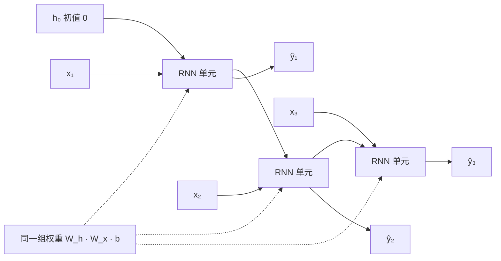
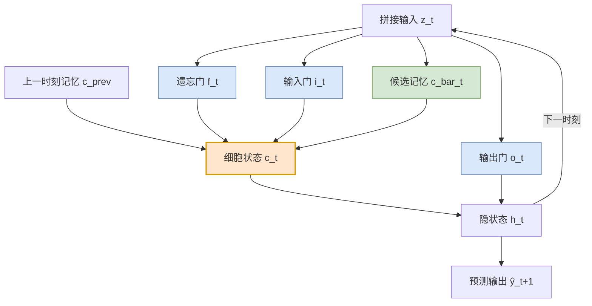

# LSTM 算法原理详解

> 配套案例：[案例1 · LSTM 单点位移时序预测](01_LSTM_位移预测_实现与调参.ipynb) ｜ 原理 PPT：[01_LSTM_位移预测_算法介绍.pptx](01_LSTM_位移预测_算法介绍.pptx)
>
> 本文从"为什么需要它"讲起，逐项推导 LSTM 的前向与反向公式，配结构图、数值手算示例，并说明它在位移预测中到底学到了什么。**建议先读本文再看 Notebook**，代码里的每一步都能对上。

**目录**

- [1. 问题设定：时序预测在数学上是什么](#1-问题设定时序预测在数学上是什么)
- [2. 从 RNN 说起](#2-从-rnn-说起)
- [3. RNN 的致命伤：梯度消失与爆炸](#3-rnn-的致命伤梯度消失与爆炸)
- [4. LSTM：门控 + 传送带](#4-lstm门控--传送带)
- [5. 数值手算：完整走一遍前向传播](#5-数值手算完整走一遍前向传播)
- [6. 变体：GRU、BiLSTM 与对比](#6-变体grubilstm-与对比)
- [7. 在位移预测中的落地](#7-在位移预测中的落地)
- [8. 实现要点与常见坑](#8-实现要点与常见坑)
- [9. 小结与自检问题](#9-小结与自检问题)

---

## 1. 问题设定：时序预测在数学上是什么

### 1.1 形式化表述

设监测点在第 $t$ 天观测到的特征向量为 $\mathbf{x}_t \in \mathbb{R}^{d}$（可含位移、降雨、库水位、温度等），历史序列为

$$\mathbf{x}_1, \mathbf{x}_2, \dots, \mathbf{x}_T$$

**我们要学的是一个映射**

$$f_\theta: (\mathbf{x}_{t-L+1}, \dots, \mathbf{x}_t) \;\longmapsto\; \hat{y}_{t+1}$$

它把长度 $L$ 的**历史窗口**（look-back window）映射为**未来一步的目标值** $\hat{y}_{t+1}$。本案例中目标 $y$ 取**位移速率**（相邻时刻位移之差），而非累计位移——原因见 [§7.2](#72-为什么用速率做目标两级评估口径)。

**多步预测**则有两种做法：

| 方式 | 做法 | 代价 |
|---|---|---|
| 直接多输出 | 一次输出 $\hat{y}_{t+1},\dots,\hat{y}_{t+H}$ | 各步独立，步间可能不自洽 |
| **递归（自回归）** | 把 $\hat{y}_{t+1}$ 当作已知输入，回填后预测 $\hat{y}_{t+2}$ | 误差逐步累积 |

本案例两种都做：前者用于训练，后者（递归）用于评估"多步外推的误差累积"。

### 1.2 朴素想法及其问题

最直接的做法：把窗口内的所有观测**展平成一个长向量**，喂给全连接网络（MLP）：

$$\hat{y}_{t+1} = \text{MLP}\big(\text{flatten}(\mathbf{x}_{t-L+1}, \dots, \mathbf{x}_t)\big)$$

三个问题：

1. **参数量爆炸**：输入维度 $dL$，若 $L=30, d=8$，第一层权重就是 $240 \times$ 隐单元数；而且这是一个**稠密**连接——网络必须自己学会"第 30 天和第 29 天相邻"这件事。
2. **不共享统计强度**：序列早期学到的模式（如"降雨后 2 天位移加速"）无法直接迁移到序列后期——每个时间位置都有各自独立的权重。
3. **窗口长度被写死**：换 $L$ 就要重建网络。

**核心诉求**：让模型在**不同时间位置共享同一组参数**，并且天然知道"时间有先后"。

---

## 2. 从 RNN 说起

### 2.1 循环结构与参数共享

RNN 的思想：**用一个带记忆的状态，把序列逐个"读"进去**。

$$\mathbf{h}_t = \tanh\big(\mathbf{W}_h \mathbf{h}_{t-1} + \mathbf{W}_x \mathbf{x}_t + \mathbf{b}\big)$$

其中 $\mathbf{h}_t \in \mathbb{R}^{n}$ 称为**隐状态**（hidden state），$n$ 是隐单元数。三个关键点：

- $\mathbf{W}_h \in \mathbb{R}^{n \times n}$、$\mathbf{W}_x \in \mathbb{R}^{n \times d}$、$\mathbf{b} \in \mathbb{R}^n$ 是**唯一的**一组参数——**在所有时刻共享**；
- $\mathbf{h}_t$ 是"到第 $t$ 天为止所有历史"的压缩表示；
- 参数量与序列长度 $T$ **无关**，只与 $n, d$ 有关：$n^2 + nd + n$。

### 2.2 时间展开

把循环结构按时间"摊开"，就得到等价的展开图——它和普通前馈网络长得一样，只是**每个时间步用的是同一组权重**：



> ⚠️ 图中三个「RNN 单元」**不是三个不同的网络**，而是同一个网络在三个时刻被调用，权重完全相同。

### 2.3 用反向传播训练：BPTT

损失对参数的梯度需要沿时间反向累积，这一算法叫 **BPTT**（Backpropagation Through Time，时间反向传播）。

记损失 $\mathcal{L} = \sum_{t=1}^{T} \mathcal{L}_t$，则隐状态的梯度满足递推：

$$\frac{\partial \mathcal{L}}{\partial \mathbf{h}_t} = \frac{\partial \mathcal{L}_t}{\partial \mathbf{h}_t} + \frac{\partial \mathcal{L}}{\partial \mathbf{h}_{t+1}} \cdot \frac{\partial \mathbf{h}_{t+1}}{\partial \mathbf{h}_t}$$

而递推里那个**局部雅可比矩阵**是：

$$\boxed{\;\frac{\partial \mathbf{h}_t}{\partial \mathbf{h}_{t-1}} = \mathrm{diag}\big(\mathbf{1} - \mathbf{h}_t \odot \mathbf{h}_t\big)\,\mathbf{W}_h^{\top}\;}$$

这个式子就是一切问题的根源。

---

## 3. RNN 的致命伤：梯度消失与爆炸

### 3.1 连乘展开

跨 $k$ 步的梯度要**连乘 $k$ 次**上面的雅可比：

$$\frac{\partial \mathbf{h}_{t+k}}{\partial \mathbf{h}_{t}} = \prod_{j=1}^{k} \mathrm{diag}\big(\mathbf{1} - \mathbf{h}_{t+j} \odot \mathbf{h}_{t+j}\big)\,\mathbf{W}_h^{\top}$$

取范数上界：

$$\left\|\frac{\partial \mathbf{h}_{t+k}}{\partial \mathbf{h}_{t}}\right\| \;\le\; \big(\gamma\,\rho\big)^{k}, \qquad \gamma = \max\big|\tanh'\big| \le 1,\quad \rho = \rho(\mathbf{W}_h)$$

其中 $\rho$ 是 $\mathbf{W}_h$ 的**谱半径**（最大奇异值量级）。结论一目了然：

- 若 $\gamma\rho < 1$ → 梯度随 $k$ **指数衰减**（梯度消失）
- 若 $\gamma\rho > 1$ → 梯度随 $k$ **指数增长**（梯度爆炸）

注意 $\tanh' = 1 - \tanh^2 \in (0, 1]$，它的最大值 1 只在输入为 0 处取得；多数时候远小于 1。所以**即使 $\rho = 1$，实际也会衰减**。

### 3.2 数值感受

下表列出 $(\gamma\rho)^k$ 在不同步数下的量级：

| $\gamma\rho$ | 5 步 | 20 步 | 50 步 |
|---|---|---|---|
| 0.5 | 3.1×10⁻² | 9.5×10⁻⁷ | 8.9×10⁻¹⁶ |
| 0.9 | 5.9×10⁻¹ | 1.2×10⁻¹ | 5.2×10⁻³ |
| 1.0 | 1.0 | 1.0 | 1.0 |
| 1.1 | 1.6 | 6.7 | 1.2×10² |

**解读**：$\gamma\rho = 0.9$ 看起来"很接近 1"，但 50 步后梯度只剩 0.5%。这意味着——**50 天前的降雨对今天位移的影响，RNN 几乎学不到**。而边坡变形恰恰存在这种长滞后（渗流需要时间）。这就是必须换结构的原因。

### 3.3 梯度爆炸的后果

爆炸比消失"更危险"：它会让参数一步更新到极远处，损失直接变成 `NaN`。工程上的对策很简单——**梯度裁剪**（gradient clipping）：

$$\mathbf{g} \leftarrow \mathbf{g} \cdot \min\left(1, \frac{\tau}{\|\mathbf{g}\|}\right)$$

本案例的 Notebook 中就用了这一项。

---

## 4. LSTM：门控 + 传送带

LSTM（Long Short-Term Memory，Hochreiter & Schmidhuber, 1997）用**两个设计**解决上述问题。

### 4.1 两个核心思想

**思想一：把"记忆"和"输出"分开。**
RNN 只有一个状态 $\mathbf{h}_t$，它既是内部记忆、又要对外输出，两件事互相干扰。LSTM 引入独立的**细胞状态**（cell state）$\mathbf{c}_t$ 专门存长期记忆，$\mathbf{h}_t$ 只是它对外的一个"投影"。

**思想二：状态更新改成"加法"。**
RNN 的更新是 $\mathbf{h}_t = \tanh(\mathbf{W}_h\mathbf{h}_{t-1} + \cdots)$——旧状态**经过权重矩阵相乘**。LSTM 的细胞状态更新是

$$\mathbf{c}_t = \mathbf{f}_t \odot \mathbf{c}_{t-1} + \mathbf{i}_t \odot \tilde{\mathbf{c}}_t$$

旧状态只被**逐元素缩放**（$\odot$ 是 Hadamard 积），不再经过权重矩阵连乘。这就是"**常数误差传送带**"（Constant Error Carousel, CEC）——梯度沿这条带子流动时不被反复乘小。

而"缩放多少、写入多少"由三个**门**来控制，门本身是学出来的。

### 4.2 完整前向公式

记 $\sigma(z) = \dfrac{1}{1+e^{-z}}$（Sigmoid），$\odot$ 为逐元素相乘。

先把上一时刻隐状态与当前输入**拼接**：

$$\mathbf{z}_t = \begin{bmatrix} \mathbf{h}_{t-1} \\ \mathbf{x}_t \end{bmatrix} \in \mathbb{R}^{n+d}$$

**① 遗忘门**（forget gate）——决定旧记忆保留多少：

$$\mathbf{f}_t = \sigma\big(\mathbf{W}_f \mathbf{z}_t + \mathbf{b}_f\big)$$

**② 输入门**（input gate）——决定新信息写入多少：

$$\mathbf{i}_t = \sigma\big(\mathbf{W}_i \mathbf{z}_t + \mathbf{b}_i\big)$$

**③ 候选记忆**（candidate）——待写入的**内容**：

$$\tilde{\mathbf{c}}_t = \tanh\big(\mathbf{W}_c \mathbf{z}_t + \mathbf{b}_c\big)$$

**④ 细胞状态更新**——遗忘 + 写入：

$$\boxed{\;\mathbf{c}_t = \mathbf{f}_t \odot \mathbf{c}_{t-1} \;+\; \mathbf{i}_t \odot \tilde{\mathbf{c}}_t\;}$$

**⑤ 输出门**（output gate）——决定此刻对外暴露多少：

$$\mathbf{o}_t = \sigma\big(\mathbf{W}_o \mathbf{z}_t + \mathbf{b}_o\big)$$

**⑥ 隐状态输出**：

$$\boxed{\;\mathbf{h}_t = \mathbf{o}_t \odot \tanh(\mathbf{c}_t)\;}$$

**⑦ 回归头**（本案例的输出层）：

$$\hat{y}_{t+1} = \mathbf{w}_y^{\top}\mathbf{h}_t + b_y$$

> 📌 **为什么门用 Sigmoid、内容用 tanh？**
> Sigmoid 值域 $(0,1)$——天然适合当"开关"（0 = 完全关闭，1 = 完全打开）；tanh 值域 $(-1,1)$ 且**零中心**，适合当"数值内容"（可以表示"正向增加"或"负向减少"）。若内容也用 Sigmoid，就永远无法表达负值。

### 4.3 结构图



图中橙色为**细胞状态主干**（记忆传送带），蓝色为三个**门**（开关），绿色为**候选内容**。

### 4.4 逐门解读

| 门 | 控制什么 | 取极端值时 | 物理直觉（位移预测） |
|---|---|---|---|
| **遗忘门** $\mathbf{f}_t$ | 旧记忆 $\mathbf{c}_{t-1}$ 保留比例 | $f=1$ 全保留 / $f=0$ 全忘记 | 前期的水位/降雨影响衰减多快 |
| **输入门** $\mathbf{i}_t$ | 新候选 $\tilde{\mathbf{c}}_t$ 写入比例 | $i=1$ 全写入 / $i=0$ 不写入 | 今天这场强降雨要不要被记住 |
| **输出门** $\mathbf{o}_t$ | $\tanh(\mathbf{c}_t)$ 对外暴露比例 | $o=1$ 全暴露 / $o=0$ 只存不说 | 当前阶段是否该让记忆影响输出 |

**几个值得记住的极端情形**：

- $\mathbf{f}_t \equiv 1,\ \mathbf{i}_t \equiv 0$：细胞状态**完全不变**，记忆可以无限期保留——这正是 RNN 做不到的；
- $\mathbf{f}_t \equiv 0$：每个时刻都清空，退化为"只看当前输入"的前馈网络；
- $\mathbf{o}_t \equiv 1$：隐状态直接等于 $\tanh(\mathbf{c}_t)$，与标准"细胞 → 输出"映射一致。

> 💡 **关键洞察**：门的开关是**输入的函数**——也就是说，模型自己学会"什么时候该忘、什么时候该记"。在位移预测里，这等价于让网络自己拟合出**降雨/水位影响的时间衰减曲线**。案例3（CNN-Transformer）会把这条曲线与**渗流滞后核**作对照，那是同一个物理量的两种表达。

### 4.5 为什么 LSTM 能缓解梯度消失

对细胞状态求雅可比：

$$\frac{\partial \mathbf{c}_t}{\partial \mathbf{c}_{t-1}} = \underbrace{\mathrm{diag}(\mathbf{f}_t)}_{\text{主干：无权重矩阵}} \;+\; \underbrace{\mathrm{diag}(\mathbf{c}_{t-1})\frac{\partial \mathbf{f}_t}{\partial \mathbf{c}_{t-1}} + \mathrm{diag}(\tilde{\mathbf{c}}_t)\frac{\partial \mathbf{i}_t}{\partial \mathbf{c}_{t-1}} + \mathrm{diag}(\mathbf{i}_t)\frac{\partial \tilde{\mathbf{c}}_t}{\partial \mathbf{c}_{t-1}}}_{\text{次级项：含 } \sigma' \text{ 或 } \tanh' \text{ 因子，通常很小}}$$

**主干项只有对角矩阵 $\mathrm{diag}(\mathbf{f}_t)$**，它是逐元素的、**不含权重矩阵**。于是跨 $k$ 步的梯度是

$$\frac{\partial \mathbf{c}_{t+k}}{\partial \mathbf{c}_t} \approx \prod_{j=1}^{k}\mathrm{diag}\big(\mathbf{f}_{t+j}\big) = \mathrm{diag}\Big(\textstyle\prod_{j=1}^{k}\mathbf{f}_{t+j}\Big)$$

梯度不会被"矩阵连乘"反复压缩；只要 $\mathbf{f} \approx 1$，梯度就能近乎**无损地传回去**。

**但必须说清楚**（这是很多教程回避的一点）：

> LSTM **不是"不会梯度消失"**，而是**提供了一条不经过权重矩阵连乘的通路**。次级项里仍然含 $\sigma' \le 0.25$、$\tanh' \le 1$ 的因子，仍会衰减。所以 LSTM 是**缓解**，不是根治。
>
> 一个直观对比：遗忘门路径 $f = 0.95$ 时，50 步后梯度保留 $0.95^{50} \approx 7.7\%$；$f = 0.99$ 时保留 $0.99^{50} \approx 60.5\%$。相比之下 RNN 在同样步数下（$\S3.2$）只剩千分之几。

### 4.6 参数量

每个门都需要一套 $\mathbf{W} \in \mathbb{R}^{n \times (n+d)}$、$\mathbf{b} \in \mathbb{R}^{n}$，共 4 套：

$$N_{\text{LSTM}} = 4\underbrace{n(n+d)}_{\mathbf{W}} + 4\underbrace{n}_{\mathbf{b}}$$

| 配置 | 参数量 |
|---|---|
| $n=64,\ d=8$ | $4\times64\times72+4\times64 = 18{,}688$ |
| $n=498,\ d=1$（论文附录配置） | $4\times498\times499+4\times498 = 996{,}000$ |

> 对比 GRU（3 套权重）：同样 $n$ 下参数量约为 LSTM 的 **75%**。但本案例的实测结果显示 GRU 并未明显占优——**参数少不等于精度高**，见 [§6.1](#61-gru)。

---

## 5. 数值手算：完整走一遍前向传播

光看公式容易"以为懂了"。下面用一个 $n=2$（2 个隐单元）、$d=1$（1 个输入）的极小例子，把每个数算出来。

**给定**（时刻 $t$）：

$$\mathbf{h}_{t-1} = \begin{bmatrix}0.5\\-0.3\end{bmatrix},\quad \mathbf{x}_t = [1.2],\quad \mathbf{c}_{t-1} = \begin{bmatrix}0.8\\-0.6\end{bmatrix}$$

拼接：$\mathbf{z}_t = [0.5,\,-0.3,\,1.2]^{\top}$

**权重**（为便于演示取的整数化小数）：

$$
\mathbf{W}_f=\begin{bmatrix}0.7&-0.2&0.5\\0.1&0.6&-0.3\end{bmatrix},\;
\mathbf{b}_f=\begin{bmatrix}0.5\\-0.1\end{bmatrix},\quad
\mathbf{W}_i=\begin{bmatrix}0.4&0.3&-0.6\\0.2&-0.5&0.7\end{bmatrix},\;
\mathbf{b}_i=\begin{bmatrix}0.2\\0.3\end{bmatrix}
$$

$$
\mathbf{W}_c=\begin{bmatrix}0.6&0.1&0.8\\-0.4&0.5&0.2\end{bmatrix},\;
\mathbf{b}_c=\begin{bmatrix}0.0\\0.1\end{bmatrix},\quad
\mathbf{W}_o=\begin{bmatrix}0.5&-0.4&0.3\\0.7&0.2&-0.5\end{bmatrix},\;
\mathbf{b}_o=\begin{bmatrix}-0.2\\0.4\end{bmatrix}
$$

**逐步计算**：

| 步骤 | 线性部分 $\mathbf{W}\mathbf{z}+\mathbf{b}$ | 激活后 |
|---|---|---|
| 遗忘门 $f_t=\sigma(\cdot)$ | $[1.51,\ -0.59]$ | $[0.8191,\ 0.3566]$ |
| 输入门 $i_t=\sigma(\cdot)$ | $[-0.41,\ 1.39]$ | $[0.3989,\ 0.8006]$ |
| 候选 $\tilde{c}_t=\tanh(\cdot)$ | $[1.23,\ -0.01]$ | $[0.8426,\ -0.0100]$ |
| 输出门 $o_t=\sigma(\cdot)$ | $[0.53,\ 0.09]$ | $[0.6295,\ 0.5225]$ |

**细胞状态更新**（逐元素）：

$$
\mathbf{f}_t \odot \mathbf{c}_{t-1} = [0.8191\times0.8,\ 0.3566\times(-0.6)] = [0.6552,\ -0.2140]
$$

$$
\mathbf{i}_t \odot \tilde{\mathbf{c}}_t = [0.3989\times0.8426,\ 0.8006\times(-0.0100)] = [0.3361,\ -0.0080]
$$

$$
\mathbf{c}_t = [0.6552,\ -0.2140] + [0.3361,\ -0.0080] = \mathbf{[0.9914,\ -0.2220]}
$$

**隐状态**：

$$
\tanh(\mathbf{c}_t) = [0.7579,\ -0.2184],\qquad
\mathbf{h}_t = \mathbf{o}_t \odot \tanh(\mathbf{c}_t) = \mathbf{[0.4771,\ -0.1141]}
$$

**读数**（这就是"看懂 LSTM"的地方）：

- 第 1 维遗忘门 $f_1=0.82$、输入门 $i_1=0.40$ → 旧记忆保留大部分、新内容少量写入 → $\mathbf{c}$ 的第 1 维从 $0.80$ 升到 $0.99$，**平滑地累积**；
- 第 2 维遗忘门 $f_2=0.36$（**较小**）→ 旧记忆 $-0.6$ 被大幅丢弃，$\mathbf{c}$ 的第 2 维从 $-0.60$ 变成 $-0.22$，**快速衰减**；
- 输出门 $[0.63, 0.52]$ → 两维都只暴露约一半，说明"内部还记着，但此刻不全部输出"。

> 🔍 **这正是 LSTM 的设计意图**：不同维度可以有不同的记忆时间尺度——有的维度当"长期记忆"，有的当"短期波动"。RNN 做不到这一点，它的所有维度共用同一个 $\mathbf{W}_h$ 压缩率。

---

## 6. 变体：GRU、BiLSTM 与对比

### 6.1 GRU

GRU（Cho et al., 2014）把"遗忘门 + 输入门"合并为一个**更新门**，并取消独立的细胞状态：

$$
\begin{aligned}
\mathbf{z}_t &= \sigma\big(\mathbf{W}_z[\mathbf{h}_{t-1};\mathbf{x}_t]\big) &&\text{更新门}\\
\mathbf{r}_t &= \sigma\big(\mathbf{W}_r[\mathbf{h}_{t-1};\mathbf{x}_t]\big) &&\text{重置门}\\
\tilde{\mathbf{h}}_t &= \tanh\big(\mathbf{W}_h[\mathbf{r}_t \odot \mathbf{h}_{t-1};\ \mathbf{x}_t]\big) &&\text{候选隐状态}\\
\mathbf{h}_t &= (1-\mathbf{z}_t)\odot\mathbf{h}_{t-1} + \mathbf{z}_t \odot \tilde{\mathbf{h}}_t &&\text{插值更新}
\end{aligned}
$$

| | LSTM | GRU |
|---|---|---|
| 门数量 | 3（遗忘/输入/输出） | 2（更新/重置） |
| 独立细胞状态 | 有 $\mathbf{c}_t$ | 无（$\mathbf{h}_t$ 兼职） |
| 参数量 | $4n(n+d)+4n$ | $3n(n+d)+3n$ |
| 记忆与输出的关系 | 分开（$\mathbf{h}=o\odot\tanh c$） | 合一 |
| 在 LSTM 前身之处 | — | 少一个门，同样有加法通路 |

**本案例的实测结论**（见 [Notebook §6](01_LSTM_位移预测_实现与调参.ipynb)）：GRU 参数量少 25%，但精度与 LSTM 基本持平，甚至略差。**说明在这个数据规模上，瓶颈不是参数效率**——这是"调参之前先看数据"的一个例子。

### 6.2 BiLSTM

双向 LSTM 用两个方向相反的 LSTM 分别编码，再拼接：

$$\mathbf{h}_t^{\text{bi}} = \big[\overrightarrow{\mathbf{h}_t};\ \overleftarrow{\mathbf{h}_t}\big]$$

> ⚠️ **用在预测任务时必须小心**：
> - 本案例采用**滑窗**设定——每个样本只包含"过去 $L$ 天"。此时反向 LSTM 只在**这个过去的窗口内部**反向扫描，**不涉及未来信息**，因此是合法的；
> - 但若对整段序列做一次性编码（例如"用全部历史预测未来一段"），反向方向会**用到未来时刻**，构成数据泄漏——预测任务中绝不可这样用。
>
> 判断准则只有一条：**反向扫描的范围里，是否包含预测目标时刻之后的数据**。

### 6.3 其他变体

| 变体 | 改动 | 用途 |
|---|---|---|
| **Peephole** | 门"偷看"细胞状态：$\mathbf{f}_t=\sigma(\mathbf{W}_f\mathbf{z}_t + \mathbf{p}_f\odot\mathbf{c}_{t-1})$ | 让门能感知记忆的精确取值 |
| **Coupled forget/input** | 令 $\mathbf{i}_t = 1-\mathbf{f}_t$ | 减少参数；只在旧记忆被完全丢弃处写入新记忆 |
| **Layer Normalization** | 对门与状态的线性输出做归一化 | 深层 LSTM 稳定性 |
| **Stacked LSTM** | 多层堆叠，下层输出作为上层输入 | 更大容量，但更易过拟合 |

### 6.4 与 Transformer 的对比

| | LSTM | Transformer |
|---|---|---|
| 信息路径长度 | $O(T)$（逐步传递） | $O(1)$（注意力直连） |
| 并行性 | 时间步**串行**，不能并行 | 全序列**并行** |
| 位置信息 | 结构内蕴（天然有序） | 需显式**位置编码** |
| 小样本表现 | 较强归纳偏置，通常更稳 | 需要更多数据 |
| 长依赖建模 | 靠门控缓解 | 直接建模，但 $O(T^2)$ 复杂度 |

> 这正是案例3 的出发点——**Causal CNN 提局部模式 + 自注意力抓长依赖**，把二者长处结合。读完本文再读 [案例3](../CNN-Transformer/03_CNN_Transformer_位移预测_算法介绍.pptx)，对比会很清楚。

---

## 7. 在位移预测中的落地

### 7.1 输入与输出的设计

| 项 | 本案例设定 | 为什么 |
|---|---|---|
| 输入 $\mathbf{x}_t$ | 多环境驱动量（降雨、库水位、温度等） | 位移是被动响应，必须给驱动量 |
| 窗口 $L$ | 若干天（Notebook §5 做敏感性分析） | 太短看不到滞后，太长引入无关历史 |
| 目标 $y$ | **位移速率**（位移差分） | 见 §7.2 |
| 归一化 | **仅用训练段**统计量 | 防止用未来信息做标准化（数据泄漏） |

### 7.2 为什么用速率做目标：两级评估口径

直接用累计位移做回归有一个陷阱：**累计位移单调上升**，模型只要学会"明天 ≈ 今天"就能拿到很漂亮的整体 $R^2$——这叫 **persistence（持续性）支配**，看起来精度很高，实际什么都没学到。

因此本案例采用**两级口径**：

| 口径 | 定义 | 作用 |
|---|---|---|
| **速率级** | 预测 $\Delta s_t = s_t - s_{t-1}$ | 反映模型是否真的学到了驱动-响应关系 |
| **累积重构** | 从真实起点累加预测速率：$\hat{s}_T = s_{t_0} + \sum \Delta\hat{s}$ | 反映工程上真正关心的量 |

> 📌 这两个口径必须**同时报告**。只报累积会让模型显得很准（受益于 persistence）；只报速率又脱离工程含义。

### 7.3 门控在学什么？——与物理滞后核对照

把训练好的遗忘门序列 $\mathbf{f}_t$ 与输入对照，可以看出：

- **遗忘门随降雨事件的变化** ≈ 影响的时间衰减；
- 若某个隐单元学出"$f \approx 1$ 长期保持"的行为，等价于一条**长期记忆通道**；
- 这条学出来的衰减曲线，与水文上常用的**指数滞后核**（案例3 中作为物理先验显式建模）是同一种东西的两种表达——**一个是数据学出来的，一个是物理写进去的**。

这正是课程想传达的："数据-物理融合"的第一层，就是**用物理解释数据模型的内部机制**。

### 7.4 不确定性：MC Dropout

单点预测值没有工程意义——工程要问的是"**以 95% 置信度，位移不会超过多少**"。

MC Dropout 的做法：**预测时保持 Dropout 开启**，前向采样 $N$ 次：

$$\hat{y}^{(i)} = f_\theta(\mathbf{x};\ \boldsymbol{\xi}^{(i)}),\quad i=1,\dots,N$$

$$\mu = \frac{1}{N}\sum_i \hat{y}^{(i)},\qquad \sigma^2 = \frac{1}{N}\sum_i\big(\hat{y}^{(i)}-\mu\big)^2$$

预测区间（正态近似）：

$$\big[\mu - 1.96\,\sigma,\ \ \mu + 1.96\,\sigma\big]$$

用 **PICP**（Prediction Interval Coverage Probability）检验校准质量：

$$\text{PICP} = \frac{1}{N_{\text{test}}}\sum \mathbb{1}\big[y_i \in [\text{lo}_i, \text{hi}_i]\big] \;\overset{\text{理想}}{\approx}\; 0.95$$

> ⚠️ 常见误区：`model.eval()` 之后 Dropout 就关闭了，此时重复前向得到的是**同一个值**，$\sigma = 0$。必须显式 `model.train()`（或只打开 Dropout 层）再采样。

---

## 8. 实现要点与常见坑

### 8.1 一个最小实现（PyTorch）

```python
import torch, torch.nn as nn

class LSTMCellScratch(nn.Module):
    """单步 LSTM：手写四组门，便于与 nn.LSTM 输出逐项对齐。"""
    def __init__(self, input_dim, hidden_dim):
        super().__init__()
        self.hidden_dim = hidden_dim
        # 一次线性层算四个门：输出维度 4*hidden
        self.linear = nn.Linear(input_dim + hidden_dim, 4 * hidden_dim)
        self.reset_parameters()

    def reset_parameters(self):
        nn.init.xavier_uniform_(self.linear.weight)
        nn.init.zeros_(self.linear.bias)
        # 关键技巧：遗忘门偏置初始化为 1，让训练初期倾向“记住”
        n = self.hidden_dim
        with torch.no_grad():
            self.linear.bias[n:2 * n].fill_(1.0)

    def forward(self, x_t, state):
        h_prev, c_prev = state
        z = torch.cat([h_prev, x_t], dim=-1)
        f, i, c_bar, o = self.linear(z).chunk(4, dim=-1)   # 切四份
        f, i, o = torch.sigmoid(f), torch.sigmoid(i), torch.sigmoid(o)
        c_bar = torch.tanh(c_bar)
        c_t = f * c_prev + i * c_bar
        h_t = o * torch.tanh(c_t)
        return h_t, (h_t, c_t)
```

> `chunk(4)` 的顺序（f, i, c, o）与公式 ①②③⑤ 一一对应；`reset_parameters` 里把**遗忘门偏置设为 1**是原论文就强调的技巧——否则训练初期 $f\approx0.5$，长期记忆立刻被冲掉。

### 8.2 常见坑一览

| 坑 | 现象 | 对策 |
|---|---|---|
| **忘记梯度裁剪** | loss 突然变 `NaN` | `clip_grad_norm_(params, 1.0)` |
| **标准化泄漏** | 验证指标好得不真实 | 归一化统计量**只用训练段**拟合 |
| **目标未差分** | $R^2$ 很高但没学到东西 | 改用速率目标 + 累积重构双口径 |
| **Dropout 用错位置** | 收敛慢或无效 | 不加在**循环连接**上，只加在层间/输出前 |
| **window 划分按位置而非目标时刻** | 训练集与测试集目标时刻重叠 | 按**目标时刻**切分，训练段绝不包含验证/测试时刻 |
| **忘初始化的遗忘门偏置** | 长依赖学不动 | 遗忘门偏置初始化为 1 |
| **评估时忘了 eval()** | 结果每次不同 | 评估前 `model.eval()`；做 MC Dropout 时**故意**保留 |
| **多层堆叠无归一化** | 深层难训练 | 加 LayerNorm，或减小层数 |

### 8.3 超参选择的经验次序

1. **窗口 $L$**——先看自相关/互相关确定量级，再在 Notebook §5 做敏感性；
2. **隐单元数 $n$**——从 32/64 起，容量不足再加；本案例实测 64 已接近饱和；
3. **层数**——时序任务 1~2 层通常够，加层边际收益低且易过拟合；
4. **Dropout**——0.1~0.3 起；
5. **学习率**——$10^{-3}$ 起，配 `ReduceLROnPlateau`；
6. 最后才考虑换模型结构。

---

## 9. 小结与自检问题

### 核心要点回顾

1. 时序预测的诉求是**参数共享 + 时间有序**，RNN 用循环结构回应了它；
2. RNN 的更新要**乘权重矩阵**，BPTT 的连乘导致梯度指数衰减/爆炸（$\gamma\rho$ 幂次）；
3. LSTM 的两大设计：**记忆与输出分离**（$\mathbf{c}_t$ 与 $\mathbf{h}_t$）、**状态加法更新**（无权重矩阵连乘）→ 常数误差传送带；
4. 三个门（遗忘/输入/输出）都是**输入的函数**，即"模型自己学会何时忘、何时记"；
5. LSTM 是**缓解**而非根治梯度消失——主干无矩阵连乘，次级项仍会衰减；
6. 用速率目标 + 累积重构**双口径**评估，避免 persistence 带来的虚高精度；
7. 工程落地要点：梯度裁剪、防泄漏标准化、遗忘门偏置初始化、MC Dropout 取区间。

### 自检问题（能答上来才算真懂）

1. 为什么 LSTM 要用两个状态 $\mathbf{c}_t$ 和 $\mathbf{h}_t$？只用一个行不行？
2. 写出 $\partial \mathbf{c}_t / \partial \mathbf{c}_{t-1}$，指出哪一项是"传送带"，为什么它不含权重矩阵？
3. 若遗忘门恒为 0，LSTM 退化成什么？
4. 为什么门用 Sigmoid 而不用 ReLU？为什么候选用 tanh 而不用 Sigmoid？
5. 双向 LSTM 在什么情况下会发生数据泄漏？判断准则是什么？
6. 为什么不能只报告累积位移口径的 $R^2$？
7. MC Dropout 时为什么不能 `model.eval()`？
8. $n=64, d=8$ 的单层 LSTM 有多少参数？双层呢？

<details>
<summary>点击查看第 8 题答案</summary>

单层：$4n(n+d)+4n = 4\times64\times72+4\times64 = 18{,}688$

双层：第二层输入维度为 64（下层隐状态），故

$$4\times64\times(64+64)+4\times64 \;+\; 18{,}688 = 32{,}768 + 18{,}688 = \mathbf{51{,}456}$$

</details>

---

## 参考

- Hochreiter, S., & Schmidhuber, J. (1997). *Long Short-Term Memory.* Neural Computation, 9(8), 1735–1780.
- Gers, F. A., Schmidhuber, J., & Cummins, F. (2000). *Learning to Forget: Continual Prediction with LSTM.* Neural Computation, 12(10), 2451–2471. ——遗忘门偏置初始化的出处
- Cho, K., et al. (2014). *Learning Phrase Representations using RNN Encoder–Decoder for Statistical Machine Translation.* EMNLP. ——GRU
- Pascanu, R., Mikolov, T., & Bengio, Y. (2013). *On the difficulty of training recurrent neural networks.* ICML. ——梯度消失/爆炸的分析与梯度裁剪
- Gal, Y., & Ghahramani, Z. (2016). *Dropout as a Bayesian Approximation.* ICML. ——MC Dropout

---

**下一步**：本文是四个算法原理详解的第一篇。后续将依次补充 [案例2 GCN](../GCN/)（图卷积与监测网拓扑）、[案例3 CNN-Transformer](../CNN-Transformer/)（局部模式与长依赖的分工）、[案例4 XGBoost + SHAP](../XGBoost+SHAP/)（梯度提升树与精确归因）。
