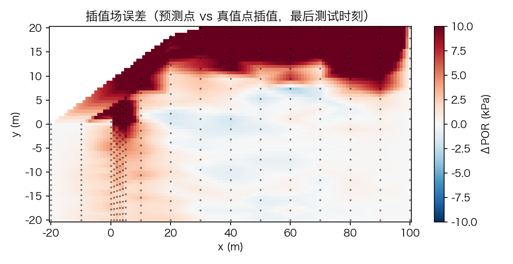
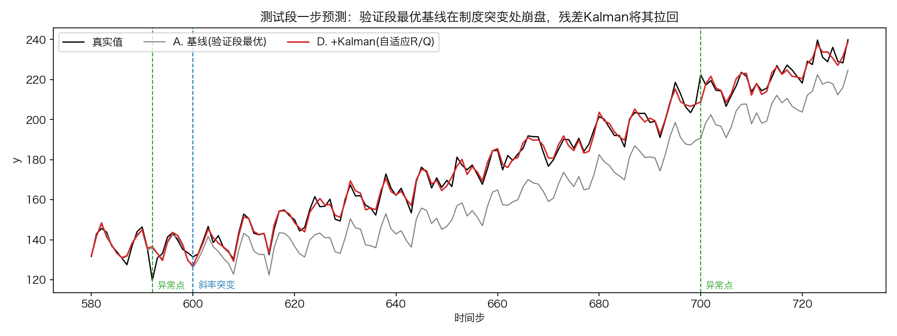
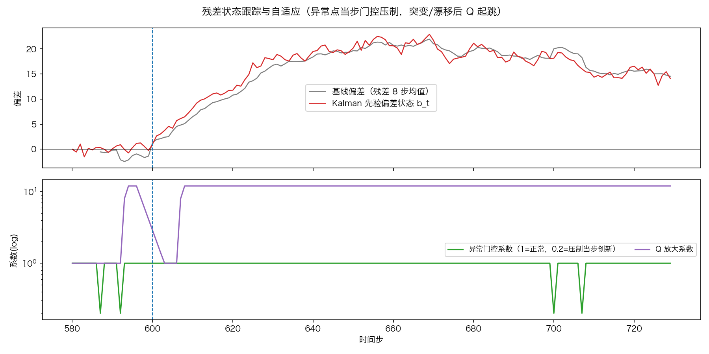

# 《人工智能算法与岩土工程应用案例》

### AI Algorithms for Geotechnical Engineering: Case Studies


[](SQL学习/README.md)
[](requirements.txt)
[](requirements.txt)
[](LICENSE)

**关键词**：边坡稳定性 · 位移预测 · 深度学习 · 图神经网络 · 物理信息约束 · 可解释归因 · 不确定性量化

---

## 摘要

岩土工程安全监测的核心困难在于**多源驱动、强非线性、样本稀缺与后果不可逆**的叠加：变形响应由降雨、库水位、温度等因素共同驱动，机理复杂且存在滞后；现场监测序列短、测点稀疏；而误判的代价是灾害性的。本仓库以四类代表性算法为案例，系统研究 **"从零实现 → 精度检验 → 调参 → 物理融合 → 不确定性量化"** 的完整方法链，并配套一份论文复现、一份经典时序基线对照、一份多源融合架构设计。

全部算法均采用**双轨实现**（NumPy 从零实现 + 官方库实现）并逐项对齐，以保证方法透明可验证；改进环节不局限于调参，而是把渗流滞后核、变形场空间连续性、降雨单调响应等**物理先验**以软约束或正则项的形式嵌入模型。

---

## 研究背景与科学问题

**工程背景**：降雨与库水位变动诱发的边坡失稳是地质灾害的主要来源之一。变形监测（GNSS 位移、InSAR 形变、孔压计）产生的时序数据为**提前预警**提供了可能，但"提前多久、区间多大、到阈值概率多少"三个问题，分别对应预测能力、不确定性量化与风险评价。

本课程围绕以下问题组织案例：

| # | 科学/工程问题 | 对应案例 |
|---|---|---|
| Q1 | 单点位移的**多步预测**如何做才不虚高？如何避免评估口径带来的乐观偏差？ | 案例① LSTM、案例④ XGBoost |
| Q2 | 多测点构成**空间关联**，如何利用监测网拓扑提升预测？ | 案例② GCN |
| Q3 | **局部波动**与**长程依赖**共存时，如何让两类机制各司其职？ | 案例③ CNN-Transformer |
| Q4 | 模型"为什么这么预测"？驱动因子如何**归因**？ | 案例④ SHAP |
| Q5 | 物理机理（滞后、连续、单调）如何**约束**数据驱动模型？ | 案例①③ 物理软约束 |
| Q6 | 预测的**不确定性**如何量化，以支撑风险决策？ | 案例①③ MC Dropout、案例④ 分位数回归 |
| Q7 | 纯数据模型的精度上限在哪？**经典时序模型**是否已足够？ | ARIMA-Kalman 基线对照 |

---

## 方法与技术路线

```text
                     ┌──────────────── 数据层 ────────────────┐
                     │  监测序列（位移 / 孔压 / 降雨 / 库水位）  │
                     │  · 防泄漏划分（训练段 fit）             │
                     │  · 速率目标 + 累积重构 两级口径          │
                     └───────────────────────────────────────┘
                                      ↓
   ┌───────────── 建模层（四类方法）──────────────────────────┐
   │  时序深度模型        时空图模型         树模型与归因      │
   │  ① LSTM/GRU/BiLSTM   ② GCN / GAT      ④ GBDT + TreeSHAP │
   │  ③ CNN-Transformer                     基线族            │
   │                                       经典时序：ARIMA+Kalman │
   └──────────────────────────────────────────────────────────┘
                                      ↓
   ┌───────────── 机理融合层 ────────────────────────────────┐
   │  渗流滞后核 · 变形场空间连续 · 降雨单调响应              │
   │  → 损失函数正则项 / 模型结构约束 / monotone_constraints  │
   └──────────────────────────────────────────────────────────┘
                                      ↓
   ┌───────────── 评估与决策层 ──────────────────────────────┐
   │  精度检验（RMSE/MAE/MAPE/R²/NSE + 多步递归）            │
   │  消融实验 · 不确定性区间（MC Dropout / 分位数）          │
   └──────────────────────────────────────────────────────────┘
```

---

## 研究内容与进展

### 已发布案例（4）

| # | 案例 | 研究问题 | 教学材料 | 方法与要点 |
|---|---|---|---|---|
| ① | **LSTM** | Q1, Q5, Q6 | [PPT](LSTM/01_LSTM_位移预测_算法介绍.pptx) · [Notebook](LSTM/01_LSTM_位移预测_实现与调参.ipynb) | NumPy 从零实现 + 梯度检查、PyTorch 实战（LSTM/GRU/BiLSTM）、速率目标 + 累积重构两级评估、累积位移三种处理对比（反例）、精度检验（RMSE/MAE/MAPE/R²/NSE + 多步递归）、调参（随机搜索/Optuna）、改进（物理软约束、MC Dropout、集成） |
| ② | **GCN** | Q2 | [PPT](GCN/02_GCN_多点监测网时空预测_算法介绍.pptx) · [Notebook](GCN/02_GCN_多点监测网时空预测_实现与调参.ipynb) | KNN 建图 + 对称归一化、NumPy 从零 GCN + 梯度检查 + PyG 官方对齐、ST-GCN（GCN×GRU）、消融实验（无图/无时序）、手写 GAT 注意力、图平滑物理正则（变形场空间连续先验）、逐节点误差空间分布、MC Dropout 全网区间 |
| ③ | **CNN-Transformer** | Q3, Q5, Q6 | [PPT](CNN-Transformer/03_CNN_Transformer_位移预测_算法介绍.pptx) · [Notebook](CNN-Transformer/03_CNN_Transformer_位移预测_实现与调参.ipynb) | **CNN 前置提局部模式 + Transformer 抓长依赖**：因果 Conv1D 与自注意力 NumPy 从零实现 + 梯度检查 + PyTorch 官方对齐、正弦位置编码、pre-LN 编码器、SEQ_LEN 窗口敏感性、消融实验（无 CNN/无注意力）、注意力-滞后曲线对照渗流滞后核、卷积响应核物理先验（非负 + 指数滞后衰减软约束）、MC Dropout 区间 |
| ④ | **XGBoost + SHAP** | Q1, Q4, Q6 | [PPT](XGBoost+SHAP/04_XGBoost_SHAP_位移预测与归因_算法介绍.pptx) · [Notebook](XGBoost+SHAP/04_XGBoost_SHAP_位移预测与归因_实现与调参.ipynb) | **24 个全因果特征 + GBDT + TreeSHAP 精确归因**：五特征族工程（自回归/水平/降雨/库水位/季节）、NumPy 从零 GBDT（二阶泰勒目标 + 精确贪心 CART + 增益公式暴力验证 + 官方对齐）、基线对比（persistence/线性/岭/从零）、随机搜索调参 + val 早停、速率+累积两级口径与递归多步、特征族消融、物理单调约束（`monotone_constraints`）、SHAP 归因全套（加和一致性检查、bar/beeswarm、依赖图、加速日瀑布图、驱动因子 Top-5 报告）、分位数回归初探（衔接⑤） |

### 规划中的案例（4）

| # | 方向 | 拟解决 |
|---|---|---|
| ⑤ | 分位数 / Conformal 风险区间 | 超越概率 → 风险矩阵 |
| ⑥ | PINN（物理信息神经网络） | 太沙基固结正问题 → 参数反演 |
| ⑦ | 神经算子（FNO / DeepONet） | 替代 FEM 代理模型 |
| ⑧ | 时序基础模型（Chronos / TimesFM） | zero-shot 预测能力边界对比 |

> **方法论共性**：四个已发布案例共用同一套研究规范——防泄漏数据流水线（训练段 fit / 按目标时刻划分）、速率目标 + 累积重构两级口径、早停回滚 + 梯度裁剪、随机搜索调参、消融实验、物理融合软约束模板、不确定性量化。案例④ 为树模型对应版本（无标准化、公式暴力验证、单调约束、SHAP 加和检查）。

---

## 主要结果

> 下列结果为**示例（仿真）数据**上的实现正确性对照。各案例的预测目标与量纲不同（单点速率 / 多节点 / 安全系数），**指标之间不可横向比较**；完整指标见各文件夹的 `*_results_summary.csv`。

**图 1**　论文复现：端到端安全系数（FS）预测。LSTM 预测孔压时序 → natural-neighbor 插值成全边坡孔压场 → 与重度/黏聚力/内摩擦角栅格化为 120×120×4 四通道图像 → CNN 回归该时刻 FS。


**图 2**　LSTM 对 360 个采样点孔压（POR）的时序预测与插值误差（[work001](work001/)）。

|  |  |
|---|---|

**图 3**　经典时序基线：ARIMA（SARIMAX）拟合与 Kalman 滤波偏差跟踪（[ARIMA-Kalman](ARIMA-Kalman/)）。

|  |  |
|---|---|

---

## 数据与代码可用性

**Data & Code Availability**

| 资源 | 状态 | 说明 |
|---|---|---|
| 算法实现、Notebook、PPT | ✅ 本仓库 | 原创，MIT 授权 |
| 示例数据 | ✅ 随仓库 | 各案例内含演示数据与结果 CSV |
| 论文复现（work001） | ✅ 本仓库 | 复现自 [Lin et al. (2025)](#引用)；训练用 9 边坡数据集未公开，故复现基于单边坡 |
| 原始 MATLAB 代码与数据 | ⚠️ 第三方 | 位于 [`demo001/`](demo001/)，上游仓库 [linmmsbaby](https://github.com/linmmsbaby/Time-series-prediction-of-the-slope-stability-under-rainfall-conditions-based-on-LSTM-and-CNN)，Apache-2.0 |
| 论文原文 PDF | ❌ 未分发 | 该 PDF 为 Springer 出版社正式排版版（Version of Record），版权归出版社所有，不在上游 Apache-2.0 授权范围内。请通过 [DOI](https://doi.org/10.1007/s11069-025-07703-4) 在期刊页面获取 |
| 配套数据库教程 | ✅ 本仓库 | [`SQL学习/`](SQL学习/)，17 章 + 4 附录，无需 Python 依赖 |

---

## 复现指南

### 环境

需要 **Python 3.12**；依赖见 [`requirements.txt`](requirements.txt)（文件头记录了各库的已验证版本）。

```bash
# 创建并激活环境（conda 或 venv 任选其一）
conda create -n dl-env python=3.12 -y && conda activate dl-env
#   或：python3.12 -m venv .venv && source .venv/bin/activate

pip install -r requirements.txt

# 注册 Jupyter 内核（Notebook 里选 "Python [dl-env]"）
python -m ipykernel install --user --name dl-env --display-name "Python [dl-env]"
```

> ⚙️ `requirements.txt` 安装的是 CPU 版 torch。需要 GPU（CUDA）或 Apple MPS 时，请按官方命令单独安装，参考 <https://pytorch.org/get-started/locally/>。

### 运行

```bash
conda activate dl-env
jupyter lab
```

打开任一案例文件夹中的 Notebook，内核选择 **Python [dl-env]**，从头执行即可。全部 Notebook 均已完整执行、输出随仓库提供。

### 迁移到自有监测数据

每个 Notebook 的 §2.2 为配置区、§10.2 为 Checklist：

1. 监测 CSV 放入对应案例文件夹（案例①：单点长表；案例②：多测点长表 + 测点坐标表）；
2. 修改 §2.2 的 `DATA_PATH / FEATURE_COLS / TARGET_COL`；位移类目标先差分出速率列；
3. 按 §10.2 走：跑基线 → 看损失曲线 → 调参 → 改进路线。

### 远程训练（`remote_dl.sh`）

用于将训练任务投放到 SSH 远程服务器（GPU 机器）。**使用前先在脚本顶部【手动配置区】填写服务器信息**（必填 4 项：`SSH_HOST / SSH_USER / REMOTE_CONDA_ENV / REMOTE_PROJECT_DIR`）；脚本会先校验配置并展示摘要，人工确认后才连接。

```bash
./remote_dl.sh check   # 连接测试：主机 / GPU / conda 环境信息
./remote_dl.sh train   # 同步项目 + 后台启动训练（REMOTE_TRAIN_CMD 填训练命令）
./remote_dl.sh log     # 实时查看训练日志（Ctrl-C 退出不影响训练）
./remote_dl.sh stop    # 停止远程训练
./remote_dl.sh pull    # 拉取日志/模型/结果到 remote_results/<时间戳>/
./remote_dl.sh push    # 仅同步项目到远程
```

建议配置 SSH 免密登录：`ssh-copy-id -p <端口> <用户名>@<服务器>`。rsync 默认排除 `.git / __pycache__ / .ipynb_checkpoints / remote_results`，可在脚本顶部 `RSYNC_EXCLUDES` 调整。

---

## 仓库结构

```text
DL-Geo/
├── LSTM/                        # 案例① 单点时序预测        （PPT + Notebook + 结果 CSV）
├── GCN/                         # 案例② 多点监测网时空预测
├── CNN-Transformer/             # 案例③ 单点时序预测·CNN+Transformer 混合架构
├── XGBoost+SHAP/                # 案例④ 表格式强基线与可解释归因（含 数据说明.md）
├── ARIMA-Kalman/                # 经典时序基线对照：ARIMA(SARIMAX) + Kalman 滤波
├── work001/                     # 论文复现：LSTM + 插值 + CNN 的降雨边坡稳定性预测
│   ├── figs/                    #   结果图（本文 README 图 1、图 2 的来源）
│   └── data/                    #   复现用数据（含 inp/ 降雨序列、slopefiles/ 边坡几何）
├── demo001/                     # 论文的原始 MATLAB 代码与数据（第三方，Apache-2.0）
├── SQL学习/                     # 配套教程：《PostgreSQL 从零开始》
│   ├── 第00章…第16章_*.md        #   17 章正文
│   ├── 附录A…附录D_*.md          #   术语表 / 错误信息速查 / SQL 速查表 / 自测与面试题
│   └── scripts/                 #   建库、示例数据、一键重置 + 9 份练习脚本
├── InSAR_GNSS_融合方案.md       # 多源融合分层架构设计（L0–L4，含算法①–⑧落位）
├── remote_dl.sh                 # SSH 远程训练辅助脚本
├── requirements.txt             # 依赖（文件头记录已验证版本）
└── LICENSE                      # MIT
```

---

## 配套资源

| 资源 | 说明 |
|---|---|
| [**work001/**](work001/)　论文复现 | 完整复现 Lin et al. (2025) *Natural Hazards* 的 LSTM+插值+CNN 降雨边坡稳定性预测流程，并**如实报告与原文数字的差距及原因**（单边坡 vs 9 边坡训练集），详见 [work001/README.md](work001/README.md) |
| [**ARIMA-Kalman/**](ARIMA-Kalman/)　经典基线 | SARIMAX 拟合、Kalman 滤波偏差跟踪、强弱基线对照与真实指标计算，附[文章连载](ARIMA-Kalman/article_continuation.md) |
| [**InSAR_GNSS_融合方案.md**](InSAR_GNSS_融合方案.md)　架构设计 | 将 InSAR 面域覆盖与 GNSS 高频点观测接入算法体系的 **L0–L4 五层架构**，含算法①–⑧的落位与优先级，可作为研究生选题参考 |
| [**SQL学习/**](SQL学习/)　配套教程 | 《PostgreSQL 从零开始》：17 章正文 + 4 篇[附录](SQL学习/README.md)（术语表 / 错误信息速查 / SQL 速查表 / 自测与面试题）+ 一键建库脚本与 9 份练习；所有 SQL 已在真实 PostgreSQL 实例上验证。**无需 Python 依赖** |

---

## 局限与展望

**Limitations**（如实声明，供后续研究接续）

1. **数据规模**：论文的 9 边坡训练集未公开，本仓库复现基于单一边坡（slope2，72 个降雨小时），因此端到端 FS 精度与原文数字存在差距（原因已在 [work001/README.md](work001/README.md) 逐项分析）；
2. **跨案例不可比**：各案例的预测目标与量纲不同，`*_results_summary.csv` 中的指标**仅供实现正确性对照**，不构成方法优劣排序；
3. **物理约束的适用边界**：软约束（滞后核、空间平滑、单调性）基于特定水文地质假设，换场地需重新标定；案例③的核正则敏感性实验已给出先验与数据冲突时的判据；
4. **不确定性的校准**：MC Dropout 与分位数回归给出的是近似区间，未做严格的覆盖率标定（Conformal 预测为规划中的案例⑤）。

**展望**：⑤–⑧ 四个方向分别针对**风险决策（区间与超越概率）→ 机理反演（PINN）→ 计算效率（神经算子代理 FEM）→ 能力边界（时序基础模型 zero-shot）**，构成从"预测"走向"决策"的递进路径。

---

## 引用

若本仓库对你的研究或教学有帮助，请引用：

**本仓库**

```bibtex
@misc{dlgeo2026,
  title        = {人工智能算法与岩土工程应用案例 (AI Algorithms for Geotechnical
                  Engineering: Case Studies)},
  author       = {{OpenGeoriskLab}},
  year         = {2026},
  howpublished = {GitHub repository},
  url          = {https://github.com/georisk-zsh/dl-geo}
}
```

**所复现的论文**（案例 work001 的全部代码与数据源自此文）

```bibtex
@article{lin2025time,
  title   = {Time series prediction of the slope stability under rainfall conditions
             based on {LSTM} and {CNN}},
  author  = {Lin, Mansheng and Lu, Yucheng and Li, Yan and Chen, Gongfa and Yuan, Bingxiang},
  journal = {Natural Hazards},
  volume  = {121},
  pages   = {22487--22517},
  year    = {2025},
  doi     = {10.1007/s11069-025-07703-4}
}
```

---

## 引用规范与学术诚信

- `demo001/` 为**第三方**代码与数据（Apache-2.0），使用时请同时遵守其许可并保留原始 `LICENSE` 与 `README.txt`；
- `work001/` 为论文复现，**任何基于该数据或流程的发表须引用原文**（见上）；
- 其余算法实现、Notebook、PPT 与教程为本课程原创，转载或改编请注明出处。

## 许可证

本项目采用 **[MIT License](LICENSE)**（Copyright © 2026 OpenGeoriskLab）。可自由使用、修改、分发，请保留版权声明。

> 第三方材料（`demo001/`）遵循其自身的 Apache-2.0 许可；论文 PDF 不在本仓库分发范围内。

## 联系方式

- 维护：OpenGeoriskLab（<zhousuhua@foxmail.com>）
- 问题与建议：欢迎提交 [Issue](https://github.com/georisk-zsh/dl-geo/issues) 或 Pull Request

---

<p align="center">
  <b>《人工智能算法与岩土工程应用案例》</b><br>
  从零实现 · 对齐验证 · 物理融合 · 不确定性量化
</p>
