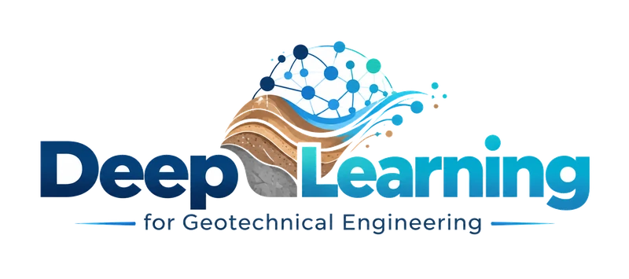
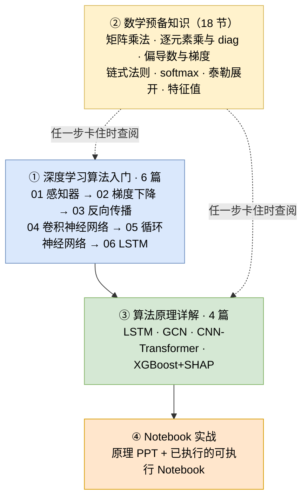
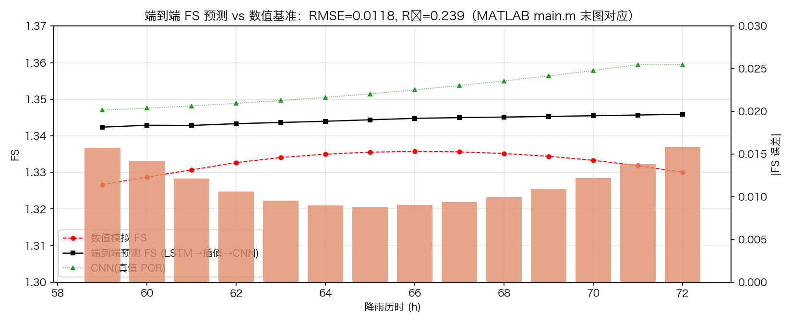
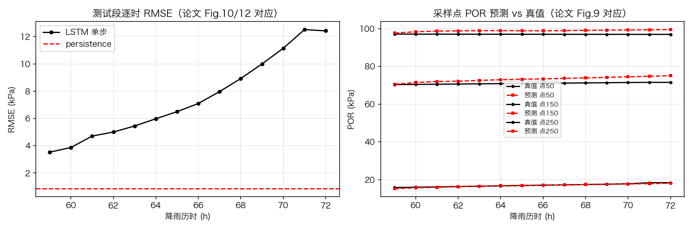

<p align="center">
  
</p>

<h1 align="center">《人工智能算法与岩土工程应用案例》</h1>
<h3 align="center">AI Algorithms for Geotechnical Engineering: Case Studies</h3>

<p align="center">
  
  
  <a href="SQL学习/README.md"></a>
  <a href="requirements.txt"></a>
  <a href="requirements.txt"></a>
  <a href="LICENSE"></a>
</p>

---

## ▍目录

- [一、课程简介](#一课程简介)
- [二、学习路径](#二学习路径)
- [三、快速开始（环境配置）](#三快速开始环境配置)
- [四、深度学习算法入门](#四深度学习算法入门)
  - [· 1 感知器](#1-感知器)
  - [· 2 线性单元和梯度下降](#2-线性单元和梯度下降)
  - [· 3 神经网络和反向传播算法](#3-神经网络和反向传播算法)
  - [· 4 卷积神经网络](#4-卷积神经网络)
  - [· 5 循环神经网络](#5-循环神经网络)
  - [· 6 长短时记忆网络LSTM](#6-长短时记忆网络lstm)
- [五、算法案例](#五算法案例)
  - [· 案例1 LSTM 单点位移时序预测](#案例1-lstm-单点位移时序预测)
  - [· 案例2 GCN 多点监测网时空预测](#案例2-gcn-多点监测网时空预测)
  - [· 案例3 CNN-Transformer 混合架构](#案例3-cnn-transformer-混合架构)
  - [· 案例4 XGBoost 与 SHAP 可解释归因](#案例4-xgboost-与-shap-可解释归因)
- [六、拓展案例与配套教程](#六拓展案例与配套教程)
- [七、许可证](#七许可证)
- [八、联系方式](#八联系方式)

---

## ▍一、课程简介

本课程面向研究生，以**岩土工程安全监测**为应用场景（边坡与库岸边坡的位移、稳定性预测），讲解人工智能算法的**原理、实现与改进**。

课程不满足于"调用现成的库函数跑一个模型"：每个算法都先**手写核心计算**、用梯度检查验证正确性，再与官方实现**逐项对齐**，最后结合物理机理做改进，并给出带区间的预测结果。

**· 这门课讲什么**

| | |
|---|---|
| **6 篇零基础教程** | [深度学习算法入门/](深度学习算法入门/README.md)：从"什么是神经元"一路讲到 LSTM，每篇配可运行的 NumPy 代码 |
| **4 篇算法原理详解** | LSTM / GCN / CNN-Transformer / XGBoost+SHAP 的完整数学推导、结构图与数值算例 |
| **1 份数学工具包** | [数学预备知识.md](深度学习算法入门/数学预备知识.md)：矩阵、偏导、链式法则、softmax、特征值的大白话 + 手算版 |
| **8 个算法案例** | 每个含**原理 PPT + 可执行 Notebook**（已执行、带输出）；已交付 4 个、规划中 4 个 |
| **1 条完整方法链** | 从零实现 → 精度检验 → 调参 → 物理融合改进 → 不确定性量化 |
| **2 个拓展案例** | 论文复现、经典时序基线对照 |
| **1 份配套教程** | PostgreSQL 从零开始（监测数据的建库、查询与运维） |

**· 课程内容**

| 案例 | 算法 | 应用场景 | 教学材料 |
|---|---|---|---|
| 1 | **LSTM** | 单点位移预测 | [原理 PPT](LSTM/01_LSTM_位移预测_算法介绍.pptx) · [Notebook](LSTM/01_LSTM_位移预测_实现与调参.ipynb) |
| 2 | **GCN** | 多点监测网时空预测 | [原理 PPT](GCN/02_GCN_多点监测网时空预测_算法介绍.pptx) · [Notebook](GCN/02_GCN_多点监测网时空预测_实现与调参.ipynb) |
| 3 | **CNN-Transformer** | 单点位移预测（混合架构） | [原理 PPT](CNN-Transformer/03_CNN_Transformer_位移预测_算法介绍.pptx) · [Notebook](CNN-Transformer/03_CNN_Transformer_位移预测_实现与调参.ipynb) |
| 4 | **XGBoost + SHAP** | 单点位移预测与归因 | [原理 PPT](XGBoost+SHAP/04_XGBoost_SHAP_位移预测与归因_算法介绍.pptx) · [Notebook](XGBoost+SHAP/04_XGBoost_SHAP_位移预测与归因_实现与调参.ipynb) |
| 5 | 分位数 / Conformal 风险区间 | 规划中.... | 超越概率 → 风险矩阵 |
| 6 | PINN | 规划中.... | 太沙基固结正问题 → 参数反演 |
| 7 | 神经算子（FNO / DeepONet） | 规划中.... | 替代 FEM 代理模型 |
| 8 | 时序基础模型（Chronos / TimesFM） | 规划中.... | zero-shot 能力边界对比 |

> 🎓 **完全零基础请先学**：[四、深度学习算法入门](#四深度学习算法入门)——6 篇渐进式教程，学完即具备读四篇原理详解的全部前置知识。
>
> 📐 **零基础读者先看**：[数学预备知识.md](深度学习算法入门/数学预备知识.md)——矩阵、偏导数、链式法则、softmax、特征值等工具的「大白话 + 手算例子」版本，四篇原理详解共用。
>
> 📐 **统一的工程规范**（所有 Notebook 共用）：防泄漏数据流水线（训练段 fit / 按目标时刻划分）、速率目标 + 累积重构两级口径、早停回滚 + 梯度裁剪、随机搜索调参、消融实验、物理融合软约束模板、不确定性量化。

**· 适合谁**：

- **完全零基础**（没学过神经网络、没写过深度学习代码）→ 从 [深度学习算法入门/](深度学习算法入门/README.md) 开始，6 篇教程会把前置知识补齐；
- **有 Python 与机器学习基础** → 直接读四篇算法原理详解，或从对应案例的 Notebook 入手；
- 共同目标：把算法真正落到岩土工程问题上。

**· 学完能做什么**

- 独立从零实现 LSTM / 图卷积 / 注意力 / 梯度提升树的核心计算，并用梯度检查验证；
- 用"与官方实现对齐"的方法定位自己代码的偏差，而不是靠猜；
- 搭建防数据泄漏的训练流水线，正确使用"速率目标 + 累积重构"两级评估口径；
- 完成精度检验、随机搜索调参、消融实验的完整流程；
- 把物理机理（渗流滞后、变形场空间连续、降雨单调响应）写成软约束融入模型；
- 给出带不确定性区间的预测，支撑风险评价。

**· 课程特色**

| 特色 | 说明 |
|---|---|
| **双轨实现** | 每个算法都有 NumPy 从零实现（含梯度检查）+ 官方库实战，两条路线互为验证 |
| **对齐式调试** | 统一采用"自己实现 vs 官方实现逐项对齐"的方法，把黑盒变成白盒 |
| **物理融合** | 不只调参：把渗流滞后核、空间连续性、单调性等先验写进损失函数或模型约束 |
| **材料齐全** | 原理 PPT + 已执行 Notebook + 结果 CSV，开箱可复现 |

[↑ 返回目录](#目录)

---

## ▍二、学习路径

本课程的教学材料分**四层**，从零基础到动手实战层层递进。**请按自己的基础选择入口**：

| 层 | 材料 | 适合谁 | 学完得到什么 |
|---|---|---|---|
| ① **前置基础** | [深度学习算法入门/](深度学习算法入门/README.md)（6 篇） | 完全没学过神经网络 | 手推感知器、梯度下降、反向传播；从零实现 CNN/RNN/LSTM |
| ② **数学工具** | [数学预备知识.md](深度学习算法入门/数学预备知识.md)（18 节） | 读文档遇到数学符号卡住时随时查 | 矩阵乘法、逐元素乘与 diag、偏导数梯度、链式法则、softmax、泰勒展开、特征值…… |
| ③ **算法原理** | 四篇 `*_算法原理.md` | 有基础、要深入理解 | 每个案例的完整数学推导、结构图、数值算例、工程落地与局限 |
| ④ **动手实战** | 各案例的 PPT + Notebook | 要跑代码、做实验 | 已执行的 Notebook（输出随仓库提供），含调参、消融、物理融合改进 |

**推荐路线**：



**零基础读者的具体顺序**（约 2~3 周）：

1. [深度学习算法入门/](深度学习算法入门/README.md) 的 6 篇，**每篇的代码都亲手敲一遍**（约 15 小时）；
2. 按兴趣选一个算法案例，先读该案例的**原理详解**，再跑对应的 **Notebook**；
3. 遇到看不动的数学符号 → 查 [数学预备知识](深度学习算法入门/数学预备知识.md) 的对应小节；
4. 最后把某个案例**迁移到自己的监测数据上**——各 Notebook 的 §2.2 是配置区、§10.2 是 Checklist，照它走一遍即为一次完整的实战练习。

> 📌 **不建议跳步**：直接读 LSTM 原理详解会卡在"梯度为什么消失""雅可比是什么"；而先花 15 小时学完入门模块，后面每一篇都会顺畅很多。

[↑ 返回目录](#目录)

---

## ▍三、快速开始（环境配置）

> **从没用过命令行？** 请按下面的 **第 0 步 → 第 5 步** 顺序操作，不要跳步。每一步都给了 macOS / Linux / Windows 三种系统的做法，找到你系统那一栏照着敲即可。

### · 第 0 步　安装必备工具

**① Miniconda（必需）** —— 用来创建 Python 环境、管理各种库

到官网下载与你系统对应的安装包（**选 Python 3.12 版本**）：<https://docs.conda.io/en/latest/miniconda.html>

| 系统 | 安装方式 |
|---|---|
| Windows | 下载 `.exe` 双击安装，**一路点"下一步"保持默认即可**（不要勾选 "Add to PATH"）；安装完成后，今后一律用开始菜单里的 **「Anaconda Prompt (miniconda3)」** 打开命令行 |
| macOS | 下载 `.pkg` 双击安装；或用 Homebrew：`brew install --cask miniconda` |
| Linux | 下载 `.sh` 脚本后执行：`bash Miniconda3-latest-Linux-x86_64.sh`，按提示输入 `yes` |

安装完**验证**（在终端里敲，能显示版本号就成功了）：

```bash
conda --version
```

**② Git（可选）** —— 只有你想用 `git clone` 下载项目时才需要

| 系统 | 安装方式 |
|---|---|
| Windows | 下载 <https://git-scm.com/download/win> 双击安装 |
| macOS | 终端执行 `xcode-select --install`；或 `brew install git` |
| Linux | `sudo apt install git`（Debian/Ubuntu）或 `sudo dnf install git` |

> 不想装 Git 也没关系——第 1 步的**方式 A** 完全不需要 Git。

### · 第 1 步　把项目下载到本地

**方式 A：网页下载 ZIP（推荐零基础，不用 Git）**

1. 浏览器打开 <https://github.com/georisk-zsh/dl-geo>
2. 点绿色的 **`Code`** 按钮 → 在下拉菜单里选 **`Download ZIP`**
3. 下载完成后**解压缩**（Windows 右键 →"全部解压缩"；macOS 双击）
4. 得到一个文件夹（通常名为 `dl-geo-main`），**建议重命名为 `dl-geo`**

**方式 B：用 Git 克隆（需要第 0 步的 Git）**

```bash
git clone https://github.com/georisk-zsh/dl-geo.git
```

> 国内网络下 GitHub 可能较慢；下载缓慢时改用方式 A 的 ZIP，或换个时间/网络重试。

**⚠️ 文件放在哪里很重要**

- 路径中**不要出现中文和空格**，否则个别 Python 库会报错；
- 建议放在：Windows → `D:\dl-geo`；macOS / Linux → `~/dl-geo`（即用户主目录下）；
- **记住这个路径**，第 2 步要用。

### · 第 2 步　打开终端，进入项目文件夹

**Windows**

1. 打开「文件资源管理器」进入 `D:\dl-geo` 文件夹；
2. 在**地址栏**里把路径删掉、输入 `cmd` 然后回车 —— 会直接在这个目录打开命令行窗口。

（也可以：先打开「Anaconda Prompt (miniconda3)」，再用 `cd /d D:\dl-geo` 切过去。注意 Windows **跨盘符切换必须加 `/d`**，只写 `cd D:\dl-geo` 是不会跳转的。）

**macOS**

1. `Command + 空格` 搜索并打开「终端」；
2. 敲 `cd ~/dl-geo` 回车。

（也可以：在访达里右键项目文件夹 → 服务 → "新建位于文件夹位置的终端窗口"。）

**Linux**

```bash
cd ~/dl-geo
```

**确认是否进对了目录**：

```bash
ls          # Windows 上如果提示找不到 ls，用 dir
```

应该能看到 `README.md`、`LSTM`、`GCN`、`requirements.txt` 这些名字。**如果看不到，说明目录进错了**，回到上面重新 `cd`。

### · 第 3 步　配置 Python 环境

**先创建并激活环境** —— conda 与 venv 任选其一，**区别主要在激活命令**：

**macOS / Linux**

```bash
# 方式 A：conda（推荐）
conda create -n dl-env python=3.12 -y
conda activate dl-env

# 方式 B：venv（不用 conda 时）
python3.12 -m venv .venv
source .venv/bin/activate
```

**Windows**

```powershell
# 方式 A：conda（推荐）
conda create -n dl-env python=3.12 -y
conda activate dl-env

# 方式 B：venv
py -3.12 -m venv .venv
.\.venv\Scripts\Activate.ps1
```

> ⚠️ **Windows 两个常见报错**
> - `conda : 无法将"conda"项识别为 cmdlet` → 改用「Anaconda Prompt (miniconda3)」；或在 PowerShell 执行一次 `conda init powershell` 后**重开窗口**（不重开不生效）。
> - 激活 venv 时提示"禁止运行脚本" → 执行 `Set-ExecutionPolicy -Scope Process RemoteSigned`（仅当前窗口生效），或改用 `.venv\Scripts\activate.bat`。

激活成功的标志：命令行提示符前面会出现 `(dl-env)`。

**再安装依赖**（三系统相同）：

```bash
pip install -r requirements.txt
```

> 🚀 **国内下载慢**（这是最常见的问题）：换清华镜像，速度快很多：
> ```bash
> pip install -r requirements.txt -i https://pypi.tuna.tsinghua.edu.cn/simple
> ```

**最后按平台配置 torch 的算力后端**（`requirements.txt` 装的是 **CPU 版**）：

| 平台 / 硬件 | 做法 |
|---|---|
| **macOS（Apple 芯片）** | 默认 wheel 已含 **MPS** 后端，**无需额外操作**。验证：`python -c "import torch; print(torch.backends.mps.is_available())"` → 应为 `True` |
| **macOS（Intel 芯片）** | 仅 CPU，默认 wheel 即可 |
| **Linux + NVIDIA 显卡** | 需装 CUDA 版，用官方源指定 CUDA 版本（示例 CUDA 12.4）：<br>`pip install torch --index-url https://download.pytorch.org/whl/cu124`<br>验证：`python -c "import torch; print(torch.cuda.is_available())"` |
| **Windows + NVIDIA 显卡** | 同上命令；PowerShell 中若报参数错误，给 URL 加引号：`--index-url="https://..."` |
| **无独立显卡** | 默认 wheel（CPU）即可，无需任何操作 |

> ⚙️ CUDA 版本必须与显卡驱动匹配，**具体该用 `cu124` 还是别的版本，请到官方选择器确认**：<https://pytorch.org/get-started/locally/>（选好 OS / Package / Compute Platform 后会给出可直接复制的命令）。
>
> 💡 国内下载 CUDA 版 torch 通常较慢。**建议先按默认装 CPU 版把整个流程跑通**，之后再换 GPU 版也不迟。

### · 第 4 步　首次运行与验证

**先做个 3 秒自检**（确认依赖都装上了）：

```bash
python -c "import torch, numpy, pandas, sklearn; print('依赖 OK, torch', torch.__version__)"
```

看到 `依赖 OK, torch 2.x.x` 就没问题了。若报 `ModuleNotFoundError`，说明第 3 步没装全，回去重跑 `pip install -r requirements.txt`。

**注册 Jupyter 内核并启动**（三系统相同）：

```bash
python -m ipykernel install --user --name dl-env --display-name "Python [dl-env]"
jupyter lab
```

浏览器会自动打开 Jupyter 页面（若没自动打开，把终端里显示的 `http://localhost:8888/...` 那行地址复制到浏览器）。

**跑通第一个 Notebook**：

1. 在左侧文件列表点进 `LSTM/` 文件夹；
2. 双击 `01_LSTM_位移预测_实现与调参.ipynb` 打开；
3. 看**右上角的内核名**，如果不是 **Python [dl-env]**，点它切换过来；
4. 菜单栏 **Run → Run All Cells**（或按 `Shift + Enter` 一格一格跑）；
5. **成功标志**：全程没有红色报错，图像和指标正常出现。第一次跑需要几分钟。

### · 第 5 步　遇到问题怎么办

| 现象 | 原因 | 解决 |
|---|---|---|
| `conda : 无法将"conda"项识别为...` | Windows 用了普通 cmd/PowerShell | 改用「Anaconda Prompt (miniconda3)」 |
| `'git' 不是内部或外部命令` | 没装 Git | 改用第 1 步的**方式 A**（下载 ZIP），或安装 Git |
| Windows 里 `cd D:\dl-geo` 没反应 | 跨盘符切换 | 加 `/d`：`cd /d D:\dl-geo` |
| `pip install` 极慢 / 超时 | 默认源在国外 | 换镜像：`-i https://pypi.tuna.tsinghua.edu.cn/simple` |
| Notebook 里 `ModuleNotFoundError: No module named 'torch'` | 内核选错，或环境没装好 | 确认右上角内核是 **Python [dl-env]**；重跑第 3 步 |
| `jupyter: command not found` | 依赖没装全 | 回到第 3 步重跑 `pip install -r requirements.txt` |
| 内核列表里没有 Python [dl-env] | 未注册内核 | 重跑 `python -m ipykernel install --user --name dl-env --display-name "Python [dl-env]"` |
| 各种莫名其妙的路径报错 | 项目路径含**中文或空格** | 把项目移到纯英文、无空格的路径（如 `D:\dl-geo`） |
| 跑得特别慢 | 在用 CPU 训练 | 正常现象；需要加速见第 3 步的 torch 后端配置 |

### · 平台差异备忘

| 事项 | 说明 |
|---|---|
| `remote_dl.sh` | 是 **Bash 脚本**：macOS / Linux 直接运行；**Windows 需在 Git Bash 或 WSL 中执行**（或自行用 PowerShell 手工 rsync / ssh） |
| 路径写法 | Notebook 内一律使用**相对路径**，三系统通用；请勿写死 `D:\...` 或 `/Users/...` |
| `SQL学习/` 教程 | 以 **Linux 为主线**，macOS 与 Windows 的差异在该教程内用「🖥 系统差异」提示框标注；该教程**不需要 Python 环境**，只需一个可用的 PostgreSQL 实例 |

[↑ 返回目录](#目录)

---

## ▍四、深度学习算法入门

> 🎓 **完全零基础从这里开始**。6 篇渐进式教程，从"什么是神经元"一路讲到 LSTM，每篇含 Mermaid 结构图、手算数值例子、**可独立运行的 NumPy 从零实现**（含梯度检查）与自检题（折叠答案）。学完即具备阅读四篇算法原理详解的全部前置知识。**预计用时约 15 小时。**

📂 [深度学习算法入门/](深度学习算法入门/README.md)　·　本模块只需 NumPy + Matplotlib，刻意不用 PyTorch——从零手写才能真懂。

### · 1 感知器

📂 [01_感知器](深度学习算法入门/01_感知器.md)

**核心问题**　一个"神经元"怎么工作？

**学完你能**　手推感知器学习规则，写出二分类程序。

### · 2 线性单元和梯度下降

📂 [02_线性单元和梯度下降](深度学习算法入门/02_线性单元和梯度下降.md)

**核心问题**　怎么让模型**自己**找到好参数？

**学完你能**　手推平方误差的梯度，实现梯度下降做回归。

### · 3 神经网络和反向传播算法

📂 [03_神经网络和反向传播算法](深度学习算法入门/03_神经网络和反向传播算法.md)

**核心问题**　多层网络怎么训练？

**学完你能**　手推 BP 算法，从零实现一个能解 XOR 的网络。

### · 4 卷积神经网络

📂 [04_卷积神经网络](深度学习算法入门/04_卷积神经网络.md)

**核心问题**　怎么处理图像/网格数据？

**学完你能**　手算二维卷积，从零实现一个迷你 CNN。

### · 5 循环神经网络

📂 [05_循环神经网络](深度学习算法入门/05_循环神经网络.md)

**核心问题**　怎么处理序列数据？

**学完你能**　手推 BPTT，从零实现 RNN 并理解梯度消失。

### · 6 长短时记忆网络LSTM

📂 [06_长短时记忆网络LSTM](深度学习算法入门/06_长短时记忆网络LSTM.md)

**核心问题**　怎么让网络记住长期信息？

**学完你能**　手推 LSTM 前向与反向，从零实现 LSTM。

**学完如何衔接**：04 卷积神经网络 → [案例3 CNN-Transformer](#案例3-cnn-transformer-混合架构)；05 循环神经网络 / 06 LSTM → [案例1 LSTM](#案例1-lstm-单点位移时序预测)。数学符号看不懂时，随时查阅 [数学预备知识.md](深度学习算法入门/数学预备知识.md)。

[↑ 返回目录](#目录)

---

## ▍五、算法案例

以下是四个已完成的算法案例，每个案例都包含一份**原理 PPT**（讲清算法本身）和一本**可执行 Notebook**（从零实现 → 精度检验 → 调参 → 物理融合改进 → 不确定性量化）。

### · 案例1 LSTM 单点位移时序预测

📂 [LSTM/](LSTM/)　·　📘 [**算法原理详解**](LSTM/LSTM_算法原理.md)（公式推导 + 结构图）　·　📊 [原理 PPT](LSTM/01_LSTM_位移预测_算法介绍.pptx)　·　💻 [实现与调参 Notebook](LSTM/01_LSTM_位移预测_实现与调参.ipynb)

**算法简介**　LSTM（长短期记忆网络）是一种循环神经网络。它通过"门控"机制决定**记住什么、忘记什么**，从而在处理有先后顺序的数据时保留长期信息——正好对应"历史位移影响未来位移"的时序预测需求。

**本案例做什么**　预测边坡**单个监测点**（GNSS 位移）未来一段时间的位移速率。

**案例要点**

- **从零实现**：NumPy 手写 LSTM 的四个门与反向传播，用梯度检查确认无误，再与 PyTorch 官方实现对齐；
- **精度检验**：RMSE / MAE / MAPE / R² / NSE + 多步递归预测；
- **评估口径**：速率目标 + 累积重构两级口径；并给出"累积位移三种处理方式"的对比（含反例）；
- **调参**：随机搜索与 Optuna 贝叶斯优化；
- **改进**：物理软约束、MC Dropout 不确定性区间、模型集成；
- **模型族对比**：LSTM / GRU / BiLSTM。


### · 案例2 GCN 多点监测网时空预测

📂 [GCN/](GCN/)　·　📘 [**算法原理详解**](GCN/GCN_算法原理.md)（图卷积推导 + 结构图）　·　📊 [原理 PPT](GCN/02_GCN_多点监测网时空预测_算法介绍.pptx)　·　💻 [实现与调参 Notebook](GCN/02_GCN_多点监测网时空预测_实现与调参.ipynb)

**算法简介**　GCN（图卷积网络）把监测点当作图的节点、把测点之间的空间关系当作边。每个节点的新特征由**它自己和邻居节点**的信息聚合而来，因此能利用"相邻测点变形相似"这一空间规律。

**本案例做什么**　对**整个监测网**的多个测点做时空预测（空间用图卷积、时间用循环网络）。

**案例要点**

- **建图**：KNN 建图 + 对称归一化（由测点坐标生成邻接矩阵）；
- **从零实现**：NumPy 手写图卷积 + 梯度检查，并与 PyG（PyTorch Geometric）官方实现对齐；
- **时空模型**：ST-GCN（GCN × GRU）；
- **消融实验**：去掉图结构、去掉时序，看各自贡献；
- **注意力**：手写 GAT 注意力机制；
- **物理正则**：图平滑正则项（变形场空间连续先验）；
- **结果分析**：逐节点误差的空间分布、全网 MC Dropout 区间。


### · 案例3 CNN-Transformer 混合架构

📂 [CNN-Transformer/](CNN-Transformer/)　·　📘 [**算法原理详解**](CNN-Transformer/CNN-Transformer_算法原理.md)（注意力推导 + 结构图）　·　📊 [原理 PPT](CNN-Transformer/03_CNN_Transformer_位移预测_算法介绍.pptx)　·　💻 [实现与调参 Notebook](CNN-Transformer/03_CNN_Transformer_位移预测_实现与调参.ipynb)

**算法简介**　本案例把两种机制组合起来分工协作：**CNN（因果一维卷积）是"局部模式扫描仪"**，只看相邻几天，擅长捕捉周期性波动与短期响应；**Transformer（自注意力）是"全局观察者"**，让任意两个时间步直接相连，擅长建模长距离依赖。相比纯循环网络，它既能并行计算，又能显式给出时间步之间的关联强度。

**本案例做什么**　与案例1相同的单点位移预测任务，换用更强的混合架构。

**案例要点**

- **从零实现**：NumPy 手写因果 Conv1D 与自注意力，梯度检查 + 与 PyTorch 官方实现对齐；
- **位置编码**：正弦位置编码，把"先后顺序"注入注意力；
- **结构细节**：pre-LN 编码器、窗口长度（SEQ_LEN）敏感性分析；
- **消融实验**：去掉 CNN、去掉注意力，对比各自贡献；
- **可解释性**：注意力-滞后曲线对照渗流滞后核；
- **物理先验**：卷积响应核的软约束（非负 + 指数滞后衰减）；
- **不确定性**：MC Dropout 预测区间。


### · 案例4 XGBoost 与 SHAP 可解释归因

📂 [XGBoost+SHAP/](XGBoost+SHAP/)　·　📘 [**算法原理详解**](XGBoost+SHAP/XGBoost+SHAP_算法原理.md)（增益公式 + SHAP 推导）　·　📊 [原理 PPT](XGBoost+SHAP/04_XGBoost_SHAP_位移预测与归因_算法介绍.pptx)　·　💻 [实现与调参 Notebook](XGBoost+SHAP/04_XGBoost_SHAP_位移预测与归因_实现与调参.ipynb)　·　📄 [数据说明](XGBoost+SHAP/数据说明.md)

**算法简介**　**XGBoost** 是梯度提升树（GBDT）的代表实现，把许多棵浅决策树逐棵累加，每棵新树专门拟合前面所有树的残差，因此在表格型数据上往往最强。**SHAP** 则解决"模型为什么这么预测"：它把一次预测的贡献**公平地分摊到每个特征**上（基于博弈论的 Shapley 值），对树模型有精确的多项式算法（TreeSHAP）。

**本案例做什么**　用 24 个全因果特征预测单点位移，并对预测结果做**逐样本归因**——例如找出某次加速变形的主导驱动因子。

**案例要点**

- **特征工程**：五个特征族（自回归 / 位移水平 / 降雨 / 库水位 / 季节），全部因果构造，避免未来信息泄漏；
- **从零实现**：NumPy 手写 GBDT（二阶泰勒目标 + 精确贪心 CART），用增益公式暴力验证，再与官方实现对齐；
- **基线对比**：persistence（明日=今日）、线性回归、岭回归、从零 GBM；
- **调参**：随机搜索 + 验证集早停；
- **物理约束**：单调性约束（强降雨方向的外推保险）；
- **SHAP 归因**：加和一致性检查、特征重要性 bar/beeswarm、依赖图、加速日瀑布图、驱动因子 Top-5 报告；
- **扩展**：分位数回归初探（衔接案例5的区间预测）。

[↑ 返回目录](#目录)

---

## ▍六、拓展案例与配套教程

| 资源 | 内容 |
|---|---|
| [**work001/**](work001/)　论文复现 | 完整复现 Lin et al. (2025) *Natural Hazards* 的 **LSTM + 插值 + CNN** 降雨边坡稳定性预测流程：LSTM 预测孔压 → 插值成全边坡孔压场 → 栅格化为四通道图像 → CNN 回归安全系数 FS |
| [**ARIMA-Kalman/**](ARIMA-Kalman/)　经典基线 | 与深度学习对照的经典时序方法：SARIMAX 拟合 + Kalman 滤波偏差跟踪 + 强弱基线对照，附[文章连载](ARIMA-Kalman/article_continuation.md) |
| [**SQL学习/**](SQL学习/)　配套教程 | 《PostgreSQL 从零开始》：17 章正文 + 4 篇[附录](SQL学习/README.md)（术语表 / 错误信息速查 / SQL 速查表 / 自测与面试题）+ 一键建库脚本与 9 份练习，用于监测数据的建库与查询 |

**案例效果示例**

| 论文复现：安全系数预测（[work001](work001/)） | LSTM 孔压时序预测（[work001](work001/)） |
|---|---|
|  |  |

[↑ 返回目录](#目录)

---

## ▍七、许可证

本项目采用 **[MIT License](LICENSE)**（Copyright © 2026 OpenGeoriskLab）。可自由使用、修改、分发，请保留版权声明。

> 第三方材料说明：[`demo001/`](demo001/) 为论文原始 MATLAB 代码与数据，遵循其自身的 Apache-2.0 许可；其中的**论文 PDF 未随本仓库分发**（该 PDF 为出版社正式排版版，版权归出版社所有），请通过 [DOI](https://doi.org/10.1007/s11069-025-07703-4) 在期刊页面获取。

[↑ 返回目录](#目录)

## ▍八、联系方式

- 维护：OpenGeoriskLab in HNU
- 问题与建议：欢迎提交 [Issue](https://github.com/georisk-zsh/dl-geo/issues) 或 Pull Request

[↑ 返回目录](#目录)

---

<p align="center">
  <b>《人工智能算法与岩土工程应用案例》</b>
</p>
