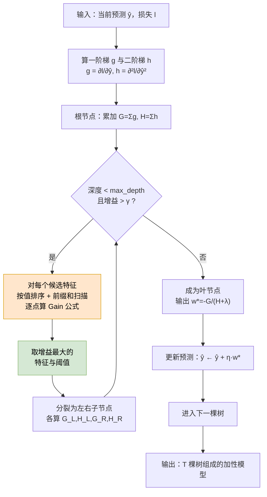

# XGBoost + SHAP 算法原理详解

> 配套案例：[案例4 · XGBoost + SHAP 位移预测与归因](04_XGBoost_SHAP_位移预测与归因_实现与调参.ipynb)　·　原理 PPT：[04_XGBoost_SHAP_位移预测与归因_算法介绍.pptx](04_XGBoost_SHAP_位移预测与归因_算法介绍.pptx)　·　[数据说明](数据说明.md)
>
> 本文完整推导 **XGBoost 的二阶泰勒目标、最优叶权重与分裂增益公式**，以及 **SHAP 的公理体系与 TreeSHAP 的精确性来源**，配建树流程图、归因分解图、数值算例，并说明物理单调约束如何实现。建议先读本文再看 Notebook。

> **[📐 数学预备知识](../算法原理_数学预备知识.md)**：矩阵、导数、链式法则、softmax、特征值……零基础先读这一份（含手算例子）

**目录**

- [1. 问题设定：为什么需要树模型](#1-问题设定为什么需要树模型)
- [2. 从决策树到梯度提升](#2-从决策树到梯度提升)
- [3. XGBoost 的二阶泰勒目标](#3-xgboost-的二阶泰勒目标)
- [4. 精确贪心建树算法](#4-精确贪心建树算法)
- [5. 本案例的特征工程与模型配置](#5-本案例的特征工程与模型配置)
- [6. SHAP：博弈论归因](#6-shap博弈论归因)
- [7. TreeSHAP 为什么是"精确"的](#7-treeshap-为什么是精确的)
- [8. 数值算例](#8-数值算例)
- [9. 物理单调约束](#9-物理单调约束)
- [10. 在位移预测中的落地](#10-在位移预测中的落地)
- [11. 实现要点与常见坑](#11-实现要点与常见坑)
- [12. 小结与自检问题](#12-小结与自检问题)

---

## 1. 问题设定：为什么需要树模型

案例①③ 是**端到端深度模型**：把原始序列喂进网络，让模型自己"造特征"。案例④ 走的是另一条路——**把领域知识显式写成特征**，再让梯度提升树在特征上找非线性与交互。

两条路线的分工：

| | 深度模型（①③） | 树模型（④） |
|---|---|---|
| 特征 | 网络自己学 | **人工构造**（滞后、有效降雨、骤降…） |
| 训练成本 | 分钟~小时级，需 GPU | **秒级**，CPU 足够 |
| 数据预处理 | 需标准化 | **不需要**（见 [§5.2](#52-为什么树模型不需要标准化)） |
| 量纲敏感性 | 敏感 | **天然免疫**（只依赖排序） |
| 约束可加性 | 软约束（损失项） | **硬约束**（单调性直接改分裂逻辑） |
| **可解释性** | 近似（梯度×输入、注意力） | **精确**（TreeSHAP 多项式算法） |

最后一行是本案例的重心：工程预警不仅要知道"会滑多少"，更要知道"**为什么**"——这次加速是降雨主导还是库水位骤降主导？这需要**精确**的归因，而不是近似解释。

---

## 2. 从决策树到梯度提升

### 2.1 CART 回归树

一棵回归树把特征空间递归地切成若干个互不重叠的区域，每个区域给一个常数预测：

$$f(\mathbf{x})=\sum_{j=1}^{T}w_j\,\mathbb{1}\big[\mathbf{x}\in R_j\big]$$

其中 $R_j$ 是第 $j$ 个叶节点对应的区域，$w_j$ 是该叶的输出值，$T$ 是叶子数。

**树的数学表达优势**：它是一族**分段常数函数**，天然能表达阈值型、交互型关系（"当 7 日累计降雨 > 80mm **且** 库水位日降幅 > 0.5m 时……"）——这正是岩土工程里常见的"临界条件"形式。

### 2.2 加性模型与函数空间梯度下降

单棵树容易欠拟合。**提升（boosting）** 的思路是串行地加树，每棵新树修正前面所有树的残差：

$$\hat y^{(t)}=\hat y^{(t-1)}+\eta\,f_t(\mathbf{x})$$

其中 $\eta$ 是学习率（收缩系数）。从函数空间看，这就是**在函数空间做梯度下降**：第 $t$ 步沿着损失下降方向 $f_t$ 走一小步 $\eta$。

**为什么小步多轮更好？** 若 $\eta=1$ 一步到位，每棵树都强拟合当前残差，容易过拟合噪声；小 $\eta$ 让每棵树只"温和修正"，多棵树的平均效应更稳。这是 GBDT 最实用的经验之一（本案例调参选出的 $\eta=0.05$，配 294 棵树）。

---

## 3. XGBoost 的二阶泰勒目标

### 3.1 目标函数与泰勒展开

XGBoost 的关键改进是：**不直接拟合残差，而是对损失做二阶泰勒展开**。第 $t$ 轮的目标函数（在 $\hat y^{(t-1)}$ 处展开）：

$$\mathcal{Obj}^{(t)}=\sum_{i=1}^{n}\Big[g_i\,f_t(\mathbf{x}_i)+\tfrac12 h_i\,f_t^2(\mathbf{x}_i)\Big]+\Omega\big(f_t\big)$$

$$\text{其中}\quad g_i=\frac{\partial\, l(y_i,\hat y)}{\partial\hat y}\bigg|_{\hat y^{(t-1)}},\qquad
h_i=\frac{\partial^2\, l(y_i,\hat y)}{\partial\hat y^2}\bigg|_{\hat y^{(t-1)}}$$

正则项惩罚树的复杂度：

$$\Omega(f)=\gamma T+\tfrac12\lambda\|\mathbf{w}\|^2$$

| 项 | 作用 |
|---|---|
| $\gamma T$ | 惩罚叶子数 → 控制树的结构复杂度（**预剪枝**） |
| $\tfrac12\lambda\lVert\mathbf{w}\rVert^2$ | 惩罚叶权重大小 → 防过拟合 |

**为什么用二阶而不是只用一阶？** 二阶项 $h_i$ 提供了损失的**曲率信息**，相当于自适应的步长——曲率大（陡）的地方自动走小步。这也是 XGBoost 通常比只用一阶的 GBDT 收敛更快的原因。

### 3.2 $g$ 与 $h$ 怎么算

以平方损失 $l=\frac12(\hat y-y)^2$ 为例：

$$g_i=\hat y_i-y_i\ \ (\text{残差}),\qquad h_i=1$$

**数值验证**（用二阶中心差分核对）：

$$\frac{l(\hat y+\epsilon)+l(\hat y-\epsilon)-2l(\hat y)}{\epsilon^2}=1.000001\;\approx\; h_i=1\quad\checkmark$$

**换损失只换 $(g,h)$**——这个设计非常优雅：

| 损失 | $g_i$ | $h_i$ | 用途 |
|---|---|---|---|
| 平方损失 | $\hat y-y$ | $1$ | 本案例主模型 |
| Logistic | $\sigma(\hat y)-y$ | $\sigma(\hat y)(1-\sigma(\hat y))$ | 分类 |
| 分位数损失（$\alpha$） | $\mathbb{1}[y<\hat y]-\alpha$ | 常数（如 1） | [§10.3](#103-不确定性分位数回归) 的区间预测 |

框架不变、只换两个数组——这让 §4 的建树算法可以完全不关心具体任务。

### 3.3 最优叶权重：推导

把 $f_t$ 展开为叶子结构。样本 $i$ 落在某个叶 $j$ 里，则 $f_t(\mathbf{x}_i)=w_j$。把目标按叶子分组：

$$\mathcal{Obj}^{(t)}=\sum_{j=1}^{T}\Big[\underbrace{\Big(\sum_{i\in I_j}g_i\Big)}_{G_j}w_j+\tfrac12\underbrace{\Big(\sum_{i\in I_j}h_i\Big)}_{H_j}w_j^2\Big]+\gamma T+\tfrac12\lambda\sum_{j=1}^{T}w_j^2$$

合并 $w_j$ 的项：

$$\mathcal{Obj}^{(t)}=\sum_{j=1}^{T}\Big[G_j w_j+\tfrac12(H_j+\lambda)w_j^2\Big]+\gamma T$$

**注意各叶子之间完全解耦**——可以对每个 $w_j$ 独立求极值。对 $w_j$ 求导并令其为零：

$$\frac{\partial}{\partial w_j}\Big[G_jw_j+\tfrac12(H_j+\lambda)w_j^2\Big]=G_j+(H_j+\lambda)w_j=0$$

$$\boxed{\;w_j^{*}=-\frac{G_j}{H_j+\lambda}\;}$$

代回目标，得到**叶子目标值**：

$$\boxed{\;\mathcal{Obj}^{*}_{\text{叶},j}=-\frac12\cdot\frac{G_j^2}{H_j+\lambda}+\gamma\;}$$

> ⚠️ **负号的含义**：这一项是"损失（越大越差）"的一部分，所以 $-\frac12\frac{G^2}{H+\lambda}$ **越小越好**；换个说法，$\frac12\frac{G^2}{H+\lambda}$ 是"这棵叶子带来的目标改善量"。**建树时的增益（gain）就是父节点的这个量减去两个子节点之和**——见 §3.4。

**数值验证**（[§8](#8-数值算例)）：对左叶 $G_L=7.5,\ H_L=3,\ \lambda=1$ 有 $w_L^*=-1.875$；用 60 万点网格搜索目标函数，最优值恰为 $-1.875000$ ✓

### 3.4 分裂增益公式：推导

一次分裂把当前节点的样本分成左、右两组。**增益 = 分裂前的目标 − 分裂后两个子节点的目标之和**：

$$\text{Gain}=\mathcal{Obj}_{\text{父}}-\Big(\mathcal{Obj}^{*}_{\text{左}}+\mathcal{Obj}^{*}_{\text{右}}\Big)$$

代入 §3.3 的叶子目标（注意父节点与子节点都要加 $\gamma$，相减后：父 1 个 $\gamma$ 减去子 2 个 $\gamma$ = $-\gamma$）：

$$\boxed{\;\text{Gain}=\frac12\left[\frac{G_L^2}{H_L+\lambda}+\frac{G_R^2}{H_R+\lambda}-\frac{G^2}{H+\lambda}\right]-\gamma\;}$$

其中 $G=G_L+G_R$、$H=H_L+H_R$ 为父节点的统计量。

**数值验证**（[§8](#8-数值算例)）：公式算得 20.833393，暴力计算"父目标 − 子目标"也得 20.833393，完全一致 ✓

**这个公式的工程含义**：

| 观察 | 含义 |
|---|---|
| 只依赖 $(G,H)$ 的累积 | 可以用**前缀和**在 $O(n)$ 内扫完一个特征的所有候选阈值 |
| 左右两侧都是 $\frac{G^2}{H+\lambda}$ | 增益 = "分裂后两侧的纯度之和" − "分裂前的纯度" |
| $-\gamma$ | 增益必须超过 $\gamma$ 才值得分裂 → 天然预剪枝 |
| $\lambda$ 出现在分母 | $\lambda$ 越大，样本少的叶子被压得越狠 |

### 3.5 各超参的数学含义

| 超参 | 出现在 | 数学作用 | 本案例调参结果 |
|---|---|---|---|
| `learning_rate` ($\eta$) | $\hat y\leftarrow\hat y+\eta f_t$ | 每步的收缩系数 | **0.05**（小步多轮） |
| `max_depth` | — | 限制树深 → 限制交互阶数（深度 $d$ 最多 $d$ 阶交互） | **4** |
| `reg_lambda` ($\lambda$) | $w^*=-\frac{G}{H+\lambda}$ | 压小叶权重 | **10**（强正则） |
| `gamma` ($\gamma$) | $\text{Gain}-\gamma$ | 分裂门槛 | **1** |
| `min_child_weight` | 约束 $H_j$ 下界 | 对平方损失即**最小叶样本数**（因 $H=\sum h=\sum 1=$ 样本数） | **10** |
| `subsample` | — | 行采样：每棵树只用部分样本 → 降方差 | **0.6** |
| `colsample_bytree` | — | 列采样：每棵树只用部分特征 | **0.8** |

**$\lambda$ 压叶子的数值感受**（本案例左叶 $G_L=7.5$、$H_L=3$）：

| $\lambda$ | $w_L^*$ | 相对 $\lambda=0$ 缩小到 |
|---|---|---|
| 0 | $-2.5000$ | 100.0% |
| 1 | $-1.8750$ | 75.0% |
| 10 | $-0.5769$ | 23.1% |
| 100 | $-0.0728$ | 2.9% |

这解释了为什么"$\lambda$ 大"等价于"更保守"：每个叶子都只输出很小的修正量。

---

## 4. 精确贪心建树算法

### 4.1 算法流程



### 4.2 精确 vs 近似：本案例选精确

| 方式 | 候选阈值 | 复杂度 | 何时用 |
|---|---|---|---|
| **精确贪心**（`exact`） | 全部相邻不同值 | $O(n\cdot f)$ / 层 | 样本中等、追求与从零实现**逐项对齐** |
| 直方图近似（`hist`） | 分桶边界 | $O(\text{bins}\cdot f)$ | 大数据（本案例主模型用 `hist`，与从零实现的对齐实验用 `exact`） |

**为什么对齐实验必须用 `exact`？** 因为近似方法的分桶引入了额外的、与算法无关的偏差——只有 `exact` + 相同 `base_score` 才能检验"公式实现是否正确"。这就是 Notebook §4.5 强调"同超参数、同 base_score"的原因。

### 4.3 从零实现的关键片段

```python
def _leaf_w(self, G, H):
    return -G / (H + self.reg_lambda)                  # §3.3 的 w*

def _obj_leaf(self, G, H):
    """叶子目标（在 w* 处取得）：−½·G²/(H+λ) + γ"""
    return -0.5 * G * G / (H + self.reg_lambda) + self.gamma

def _find_split(self, g, h, X, feat_idx):
    """精确贪心：每个候选特征排序 + 前缀和扫描，找增益最大的 (特征, 阈值)。"""
    G, H = g.sum(), h.sum()
    parent_obj = self._obj_leaf(G, H)
    best_gain, best_f, best_thr = 0.0, None, None      # 增益 ≤ 0 → 直接成叶（对应 γ 门槛）
    for f in feat_idx:
        order = np.argsort(X[:, f], kind="mergesort")  # 排序
        xs, gs, hs = X[order, f], g[order], h[order]
        Gl, Hl = np.cumsum(gs)[:-1], np.cumsum(hs)[:-1]   # ← 前缀和：O(n) 扫完所有阈值
        Gr, Hr = G - Gl, H - Hl
        gain = parent_obj - self._obj_leaf(Gl, Hl) - self._obj_leaf(Gr, Hr)
        ok = xs[1:] > xs[:-1]                          # 阈值只在相邻不同值之间取
        ...
```

**为什么能 $O(n)$ 扫完一个特征？** 因为增益只依赖 $(G_L,H_L)$ 的累积量——排序后一次前缀和就把所有候选阈值的统计量凑齐了，无需对每个阈值重新遍历样本。这是 XGBoost 高效的核心技巧之一。

---

## 5. 本案例的特征工程与模型配置

### 5.1 五大特征族

树模型的能力上限由**特征**决定（"加特征就是加知识"）。本案例构造 **24 个全因果特征**，分五族：

| 特征族 | 代表特征 | 物理含义 |
|---|---|---|
| **自回归** | `rate_lag1`、`rate_lag2`、`rate_mean3`、`rate_mean7` | 变形的惯性/趋势延续 |
| **水平** | `disp_level`、`dlevel`、`dlevel7` | 当前累积位移所处阶段 |
| **降雨** | `rain`、`eff_rain`（滞后核有效降雨）、`rain7`、`rain30`、`rain_max3`、`dry_days` | 降雨入渗与累积效应 |
| **库水位** | `reservoir`、`drawdown7`（7 日骤降） | 水位升降引起的有效应力变化 |
| **季节** | 年内周期项 | 温度/蒸发等季节性因素 |

> ⚠️ **"全因果"是硬要求**：每个特征只能用**目标时刻及之前**的信息构造。例如 `rate_mean7` 必须是"过去 7 天"的均值，不能包含目标当天之后。用 `shift` / `rolling` 时最容易写错边界（见 [§11.2](#112-常见坑一览)）。

**`eff_rain` 的构造**体现了物理先验：用指数滞后核把日降雨累积成"有效降雨"

$$\text{eff\_rain}_t=\sum_{j=0}^{J-1}\exp\!\left(-\frac{j}{\tau}\right)\cdot \text{rain}_{t-j}$$

这与案例3 的卷积核正则**是同一个物理量的两种用法**：案例3 把它作为软约束限制卷积核形状，案例4 直接把它算成一个特征喂给树。

### 5.2 为什么树模型不需要标准化

线性模型/神经网络对特征尺度敏感（因为 $\mathbf{w}^{\top}\mathbf{x}$ 依赖数值大小），而树模型的每一次分裂都只问：

$$x_j\le \theta\ \ ?$$

**只依赖特征的排序，不依赖数值大小**。因此：

- 无需标准化/归一化；
- 量纲混杂（mm、mm/day、m、°C）也不影响；
- 缺失值可以走"默认分支"（XGBoost 内置稀疏感知）。

**但要注意**：不做标准化**不意味着**不需要处理缺失与异常值——插值与截尾（4σ）仍然要做，那是**数据质量**问题，与尺度无关。

### 5.3 主模型配置与调参

**基线族**（回答"树模型到底比简单方法强多少"）：

| 基线 | 说明 |
|---|---|
| persistence（明日=今日） | 最朴素的持续性预测，**必须报告的对照** |
| 线性回归（同特征） | 检验线性可分性 |
| 岭回归 | 加 L2 的线性基线 |
| **从零 GBM**（200 棵，depth 3） | 检验自己的实现是否可用 |

**XGBoost 主模型**：`n_estimators=600` + 验证集早停，`max_depth=4`、`eta=0.1`（默认量级），`early_stopping_rounds=50`——实测早停于第 **42** 轮，说明 600 棵是足够宽的上限，真正决定模型复杂度的是早停。

**随机搜索**（12 组）：

| 超参 | 候选 |
|---|---|
| `max_depth` | 3, 4, 5, 6 |
| `eta` | 0.03, 0.05, 0.1, 0.2 |
| `subsample` | 0.6, 0.8, 1.0 |
| `colsample_bytree` | 0.6, 0.8, 1.0 |
| `min_child_weight` | 1, 5, 10, 20 |
| `reg_lambda` | 0.5, 1, 5, 10 |
| `gamma` | 0, 0.5, 1 |

**调参结果**（val RMSE 最优）：`max_depth=4, eta=0.05, min_child_weight=10, subsample=0.6, colsample_bytree=0.8, reg_lambda=10, gamma=1`，早停于 `best_iteration=294`。

> **读这组参数**：$\eta$ 从 0.1 降到 0.05（小步多轮）、$\lambda$ 从 1 提到 10（强压叶子）、`gamma=1`（分裂门槛抬高）、行采样 0.6——**四个方向都指向"更保守"**。这是小样本岩土数据的典型结论：**降方差比降偏差更重要**。

### 5.4 gain 重要性：先看一眼，但别当归因

$$\text{gain}_j=\frac{1}{\#\text{用到 } j \text{ 的分裂}}\sum_{\text{分裂}} \text{Gain}$$

**它衡量的是"训练时被用得多深"，不是"对预测的贡献"**：

- 高度相关的特征会**互相抢功劳**（两个几乎相同的降雨特征，谁被选中是随机的）；
- 被用得少的特征也可能"一旦缺失就灾难"（关键但独挡一面的阈值特征）。

本案例实测 `mean|SHAP|` 与 `gain` 的 Spearman 排名相关约 **0.715**——**相似但不相同**，正好说明 gain 不能替代归因。严谨归因交给 [§6](#6-shap博弈论归因) 的 SHAP。

---

## 6. SHAP：博弈论归因

### 6.1 问题定义

一次预测 $\hat y(\mathbf{x})$ 相对基线 $\phi_0$ 的偏差，要**公平地分摊**给每个特征：

$$\hat y(\mathbf{x})=\phi_0+\sum_{j=1}^{F}\phi_j(\mathbf{x})$$

"公平"如何定义？SHAP 借用了合作博弈论里的 **Shapley 值**。

### 6.2 Shapley 值的定义

把"特征"当作参与合作的玩家，把"预测值"当作合作收益。特征 $j$ 的贡献定义为它在**所有可能的特征子集**中的**边际贡献的加权平均**：

$$\boxed{\;\phi_j=\sum_{S\subseteq \mathcal{F}\setminus\{j\}}\frac{|S|!\,\big(|\mathcal{F}|-|S|-1\big)!}{|\mathcal{F}|!}\Big[v\big(S\cup\{j\}\big)-v(S)\Big]\;}$$

其中 $v(S)$ 是"只用子集 $S$ 里特征时的模型输出"（即把 $S$ 之外的特征"屏蔽"掉）。权重 $\frac{|S|!(F-|S|-1)!}{F!}$ 是**排列计数**：在所有 $F!$ 种特征加入顺序中，$S$ 恰好先于 $j$ 出现的比例——即"$j$ 加入时，联盟恰好是 $S$"的概率。

### 6.3 四条公理与唯一的解

Shapley 值是**唯一**同时满足以下四条公理的分配方案：

| 公理 | 内容 | 意义 |
|---|---|---|
| **效率（加和性）** | $\sum_{j}\phi_j=v(\mathcal{F})-v(\varnothing)$ | 贡献之和 = 总预测偏差，**不丢不重** |
| **对称性** | 两个特征对所有子集的边际贡献都相同 ⇒ $\phi$ 相同 | 同等作用同等对待 |
| **虚拟（哑元）** | 对任何子集都无边际贡献 ⇒ $\phi_j=0$ | 没用的特征得零分 |
| **可加性** | 两个模型之和的 $\phi$ = 各自 $\phi$ 之和 | 可分模型可分解 |

**效率公理就是工程上说的"加和一致性"**，也是 Notebook §8 要做加和检查的原因：

$$\Big|\hat y(\mathbf{x})-\Big(\phi_0+\sum_j\phi_j(\mathbf{x})\Big)\Big|<\epsilon$$

数值验证（[§8](#8-数值算例)，3 个特征的小模型穷举 Shapley）：$\sum\phi_j=2.4$，而 $v(\text{全部})-v(\varnothing)=2.4$ ✓

### 6.4 Shapley 值的代价与 TreeSHAP 的价值

**直接按定义计算需要枚举 $2^F$ 个子集**——$F=24$ 时是 1677 万次模型评估，不可行。

| 方法 | 复杂度 | 精度 |
|---|---|---|
| 精确 Shapley（枚举） | $O(2^F)$ | 精确但不可行 |
| KernelSHAP（采样） | $O(\text{samples})$ | **近似**，有方差 |
| 深度模型的梯度类方法 | $O(1)$ 反向 | **近似**，且不满足公理 |
| **TreeSHAP**（本案例） | $O(TLD^2)$ | **精确**（对树模型） |

其中 $T$ 是树数、$L$ 是最大叶子数、$D$ 是深度。**多项式复杂度 + 精确解**，这是树模型独有的红利。

---

## 7. TreeSHAP 为什么是"精确"的

### 7.1 核心思想：按树的路径递归

树模型的结构让"屏蔽某特征"这件事变得可计算。考虑一个只有 3 个叶子、用一个特征分裂的极小树：

- 若 $x_j$ 是**分裂特征**，样本就走确定的一支 → 该特征的贡献可以**精确**算成"走这一支 vs 加权走两支"的差；
- 若 $x_j$ **不是**分裂特征，它对这次分裂的贡献为 0。

Lundberg 的算法把上面的"边际贡献"翻译成**沿树路径的递归**：对每个节点，维护"进入该节点的样本子集比例"，在向上/向下递归中累积条件期望的差异。由于树的路径长度是 $D$，递归是多项式而非指数的。

### 7.2 一次预测的分解结构

对第 $i$ 个样本，输出可写成

$$\hat y(\mathbf{x}_i)=\bar y+\sum_{j=1}^{F}\phi_{ij}$$

其中 $\bar y$ 是全体样本的平均预测（基线）。


**这是一个真正的"归因瀑布"**：从基线出发，逐个特征的贡献把预测"推"到最终值。工程上就能回答：

> 这次 3 mm/day 的加速，其中 **+1.2** 来自 7 日累计降雨、**+0.8** 来自库水位 7 日骤降、**−0.3** 被温度抵消……

### 7.3 交互 SHAP：识别协同效应

普通 SHAP 给出的是**各特征的独立贡献**（在主效应意义下），但真实物理里存在交互——例如"强降雨 **且** 库水位骤降"才是危险组合。

`pred_interactions=True` 返回交互矩阵 $\boldsymbol{\Phi}\in\mathbb{R}^{(F+1)\times(F+1)}$：

$$\hat y(\mathbf{x}_i)=\bar y+\sum_j\Phi_{jj}+\sum_{j<k}\Phi_{jk}$$

其中 $\Phi_{jj}$ 是**主效应**，$\Phi_{jk}$（$j\ne k$）是**成对交互效应**；矩阵对称，故只需看上三角。按平均 $|\Phi_{jk}|$ 排序即得**最重要的特征对**——这直接对应"多因子耦合"的工程判据。

### 7.4 SHAP 与 gain 的本质区别

| | gain | SHAP |
|---|---|---|
| 定义 | 分裂带来的平均目标下降 | Shapley 值（边际贡献加权平均） |
| 粒度 | **全局**（每个特征一个数） | **逐样本**（每个样本每个特征一个数） |
| 是否满足公理 | 否 | 是（效率/对称/哑元/可加） |
| 能回答 | "训练时谁被用得多" | "**这次预测为什么是这个值**" |
| 相关性（本案例） | Spearman ≈ 0.715 | — |

---

## 8. 数值算例

用一个 6 样本、1 个特征的小例子把建树的每一步算出来。**下方数字全部经数值验证**。

### 8.1 设定

$$\mathbf{x}=[1,2,3,6,7,8],\qquad \mathbf{y}=[2.1,2.4,3.0,8.2,8.5,9.1],\qquad \hat{\mathbf{y}}^{(0)}=\mathbf{5.0}$$

$$\lambda=1,\qquad \gamma=0$$

### 8.2 一阶梯与二阶梯

$$\mathbf{g}=\hat{\mathbf{y}}^{(0)}-\mathbf{y}=[2.9,\ 2.6,\ 2.0,\ -3.2,\ -3.5,\ -4.1]$$

$$\mathbf{h}=[1,1,1,1,1,1]$$

父节点统计量：$G=\sum g=-3.3$，$H=6$。

$$\mathcal{Obj}_{\text{父}}=-\frac12\cdot\frac{G^2}{H+\lambda}+\gamma=-\frac12\cdot\frac{10.89}{7}=-0.777857$$

### 8.3 候选分裂 $x\le3$

| 侧 | 样本 | $G$ | $H$ |
|---|---|---|---|
| 左 | $x=1,2,3$ | $G_L=2.9+2.6+2.0=7.5$ | $H_L=3$ |
| 右 | $x=6,7,8$ | $G_R=-3.2-3.5-4.1=-10.8$ | $H_R=3$ |

**最优叶权重**：

$$w_L^*=-\frac{G_L}{H_L+\lambda}=-\frac{7.5}{4}=-1.875,\qquad
w_R^*=-\frac{G_R}{H_R+\lambda}=-\frac{-10.8}{4}=2.700$$

> 网格搜索核对：对左叶在 $[-4.875,\ 1.125]$ 上以 60 万点扫目标函数，最优 $w=-1.875000$ ✓（右叶同理，$2.700000$ ✓）

**叶子目标**：

$$\mathcal{Obj}_L=-\frac12\cdot\frac{7.5^2}{4}=-7.031250,\qquad
\mathcal{Obj}_R=-\frac12\cdot\frac{(-10.8)^2}{4}=-14.580000$$

**分裂增益**（公式）：

$$\text{Gain}=\frac12\left[\frac{7.5^2}{4}+\frac{(-10.8)^2}{4}-\frac{(-3.3)^2}{7}\right]-0=\frac12\big[14.0625+29.16-1.5557\big]=20.833393$$

**暴力核对**：$\mathcal{Obj}_{\text{父}}-(\mathcal{Obj}_L+\mathcal{Obj}_R)=-0.777857-(-7.031250-14.580000)=20.833393$ ✓ 完全一致

### 8.4 更新预测

第一棵树的输出就是两个叶子的权重：

$$\hat{\mathbf{y}}^{(1)}=\begin{cases}5.0-1.875=3.125 & x\le3\\ 5.0+2.700=7.700 & x>3\end{cases}$$

残差平方和：**58.4700 → 4.4419**（一棵 depth-1 的树就把误差降了 92%）。

### 8.5 $\lambda$ 的作用

| $\lambda$ | $w_L^*=-\frac{7.5}{3+\lambda}$ | 相对 $\lambda=0$ |
|---|---|---|
| 0 | $-2.5000$ | 100.0% |
| 1 | $-1.8750$ | 75.0% |
| 10 | $-0.5769$ | 23.1% |
| 100 | $-0.0728$ | 2.9% |

### 8.6 Shapley 值公理验证

用 3 个特征、含一个交互项 $v(\{0,1\})=1.2$ 的小模型，**穷举所有子集**计算 Shapley 值：

$$\boldsymbol\phi=[2.6,\ -0.9,\ 0.7]$$

| 检验 | 结果 |
|---|---|
| $\sum_j\phi_j$ | $2.400000$ |
| $v(\mathcal{F})-v(\varnothing)$ | $2.400000$ |
| 是否相等（**效率公理**） | ✓ |
| 交互项 1.2 的分配 | 特征 0 与特征 1 **各得一半**（$0.6$）：$\phi_0=2.0+0.6=2.6$ ✓ |

最后一行揭示了 SHAP 的一个深刻性质：**交互带来的收益被参与交互的特征平分**——这与"把交互归给某一个特征"的朴素做法有本质区别，也是 SHAP 被认为是"公平"归因的原因。

---

## 9. 物理单调约束

### 9.1 动机：外推时的物理合理性

数据驱动模型在**训练分布之外**的行为不可控。典型风险场景：

> 某次极端强降雨超出历史样本范围 → 树模型在该区间没有分裂点 → 预测可能**反而偏低**（因为高降雨区间的叶权重是训练数据拟合的，未必单调）。

工程上这是不可接受的：**降雨越大，滑坡风险必须越高**。

### 9.2 数学形式

`monotone_constraints` 给每个特征指定单调方向 $c_j\in\{+1,-1,0\}$，建树时在增益公式上**加约束**：

$$\text{候选分裂合法}\iff \Big(w_L^*-w_R^*\Big)\cdot c_j\ge 0$$

即：若 $c_j=+1$（特征越大预测越大），则左叶（特征值小侧）的权重必须 ≤ 右叶权重，否则该分裂**被拒绝**。

**注意这是硬约束**：它直接改变建树的搜索空间，而不是像正则项那样只是"建议"。代价是可能损失一点拟合精度，换来**外推时的物理保险**。

### 9.3 本案例的约束设定

| 特征 | 约束 | 物理理由 |
|---|---|---|
| `rain`, `eff_rain`, `rain7`, `rain30`, `rain_max3` | $+1$ | 降雨越多 → 位移速率越大 |
| `dry_days`（连续无雨天数） | $-1$ | 越久无雨 → 速率越小 |
| `drawdown7`（7 日水位骤降） | $+1$ | 骤降越快 → 有效应力增加 → 变形加剧 |
| `dlevel`, `dlevel7`（水位变率） | $-1$ | 水位上升 → 抑制变形 |
| 其余特征 | $0$ | 不加约束（方向不明确） |

> ⚠️ **约束不是免费的**：本案例会同时报告"有约束 vs 无约束"的 val/test RMSE，让读者自己判断**用多少精度换多少物理合理性**。这正是 Notebook §9.2 的做法。

### 9.4 与软约束的对比

| | 软约束（案例①③） | 硬约束（案例④） |
|---|---|---|
| 形式 | 损失项 $\lambda\mathcal{L}_{\text{phys}}$ | 建树时拒绝非法分裂 |
| 强度 | 可调（$\lambda$） | 绝对 |
| 代价 | 可能牺牲精度换形状 | 可能牺牲精度换单调性 |
| 可违反性 | **可被数据压倒** | **不可违反** |

同一个物理先验，两种落地方式的取舍——这是"数据-物理融合"的一个实操视角。

---

## 10. 在位移预测中的落地

### 10.1 与案例①③ 的对照

| 项 | ①③ 深度模型 | ④ 树模型 |
|---|---|---|
| 训练时间 | 分钟级 | **秒级** |
| 标准化 | 必需（防泄漏 fit） | **不需要** |
| 目标 | 位移速率（双口径） | 位移速率（双口径，**一致**） |
| 时序划分 | 按目标时刻 | 按目标时刻（**一致**） |
| 长依赖 | 网络隐式学 | 显式滞后特征 |
| 物理先验 | 软约束 | 单调硬约束 + 有效降雨特征 |
| 不确定性 | MC Dropout | **分位数回归** |

> ④ 与 ①③ **用同一个合成测点、同一套时序划分**——这是刻意的设计，只有这样才能公平对照"端到端学习"与"人工特征 + 树"两条路线的差异。

### 10.2 递归多步预测

与案例①③ 同法但更简单：树模型无需维护隐藏状态，只需把预测值写回自回归特征列，滚动外推：

$$\hat y_{t+k}=f_{\text{GBDT}}\big(\text{features}\ \big|\ \text{rate\_lag1}\leftarrow\hat y_{t+k-1}\big)$$

### 10.3 不确定性：分位数回归

MC Dropout 是深度模型的手段；树模型用**分位数回归**更自然。把损失换成 pinball（分位数）损失：

$$\mathcal{L}_\alpha(y,\hat y)=\begin{cases}\alpha\,(y-\hat y), & y\ge\hat y\\ (1-\alpha)\,(\hat y-y), & y<\hat y\end{cases}$$

其 $(g,h)$ 为（$\alpha=0.5$ 时退化为 MAE）：

$$g=\mathbb{1}[y<\hat y]-\alpha,\qquad h\ \text{取常数（如 1）}$$

> ⚠️ **符号最容易写反**，而且写反会把预测推向错误方向。逐段求导核对：
> - 当 $y>\hat y$（欠预测）：$L=\alpha(y-\hat y)$，则 $g=\partial L/\partial\hat y=-\alpha<0$ → 更新量 $w^*=-G/(H+\lambda)>0$ → **把预测推大** ✓
> - 当 $y<\hat y$（过预测）：$L=(1-\alpha)(\hat y-y)$，则 $g=1-\alpha>0$ → $w^*<0$ → **把预测推小** ✓
>
> 若写成 $g=\alpha-\mathbb{1}[y<\hat y]$，欠预测时会得到 $g=+\alpha$，反而把预测推**小**——方向完全相反。
> 另外，pinball 损失是分段线性的，二阶导几乎处处为 0，所以 XGBoost 用**常数** $h$ 近似（数学上不是严格二阶展开，但工程上稳定有效）。

XGBoost 里直接用 `objective="reg:quantileerror"` + `quantile_alpha=α`。分别训 $\alpha=0.05$ 与 $0.95$ 两个模型，就得到 90% 预测区间：

$$\big[\hat y^{(0.05)},\ \hat y^{(0.95)}\big]$$

**用 PICP 检验校准**：

$$\text{PICP}=\frac{1}{n}\sum_i\mathbb{1}\big[y_i\in[\text{lo}_i,\text{hi}_i]\big]\overset{\text{理想}}{\approx}0.90$$

**一个额外的诊断**：区间宽度与 $|误差|$ 的相关系数。若 $>0$，说明**区间在"该宽的地方更宽"**——具备区分度，比"所有样本一样宽"的区间有实用价值。

> 📌 分位数回归给出的是**近似**区间，严格的覆盖率保证需要 **Conformal 预测**（规划中的案例⑤）。

---

## 11. 实现要点与常见坑

### 11.1 一个可对照的最小实现

XGBoost 的核心就是 §3 的三个公式。最小可运行版本（平方损失）的骨架：

```python
class GradBoostTrees:
    """极简 XGBoost（平方损失版）：二阶泰勒目标 + 精确贪心 CART + 收缩 + 行/列采样。"""
    def __init__(self, n_estimators=200, max_depth=3, eta=0.1, reg_lambda=1.0,
                 gamma=0.0, min_child_weight=1.0, subsample=1.0, colsample_bytree=1.0):
        ...
```

**四项一致性检查**（树模型没有反向传播，但每个公式都能被暴力验证）：

| 检查 | 方法 | 本案例结果 |
|---|---|---|
| 一阶/二阶梯 | 解析 vs 数值微分 | $h=1.000001$ ✓ |
| 最优叶权重 | 闭式 $w^*$ vs 网格搜索 | 一致 ✓ |
| 增益公式 | 公式 vs 暴力算目标差 | 一致 ✓ |
| 训练损失 | 是否单调下降 | 见 Notebook |

**与官方对齐**（比"指标接近"更硬的验证）：平方损失下二阶泰勒展开**是精确的**，因此从零实现与官方在完全相同设置（`tree_method="exact"`、同超参、同 `base_score`）下，应走出几乎相同的 test RMSE 曲线。

**实测结果**：从零实现 200 棵耗时 **1.4 s**，与官方的 test RMSE 在后 50 轮的平均差仅 **0.00330 mm/day**——同一量级于浮点与实现细节差异，说明三个公式的实现都是正确的。

### 11.2 常见坑一览

| 坑 | 现象 | 对策 |
|---|---|---|
| **特征含未来信息** | 离线指标虚高、上线崩 | 每个特征严格 `shift`/`rolling` 到目标时刻之前；对所有特征做"时间戳审计" |
| `rolling` 默认包含当前值 | 自回归特征等效于"用今天预测今天" | 明确 `closed`/`shift(1)` |
| 训练集/验证集**随机划分** | 时序泄漏，早停失效 | 按**时间**（目标时刻）划分 |
| 用 test 调参 | 测试集失效 | 调参只用 val，test 只在最后跑一次 |
| 只报累积位移 $R^2$ | 被 persistence 支配，虚高 | 速率 + 累积重构**双口径** |
| gain 当归因 | 相关特征互相抢功劳 | 用 SHAP；gain 只作参考 |
| 对齐实验用 `hist` | 分桶引入额外偏差，无法判断公式对错 | 对齐必须 `exact` |
| 单调约束方向写反 | 物理上更危险 | 逐个特征核对方向（§9.3） |
| 分位数的 tree 数不一致 | 两分位模型容量不同，区间失真 | 两个分位模型用相同 `n_trees` |
| 忘做 SHAP 加和检查 | 归因结果可能整体偏移 | 校验 $\hat y\approx\phi_0+\sum\phi_j$ |

### 11.3 超参选择的经验次序

1. **特征**——先做好特征工程，树模型的上限由特征决定；
2. **$\eta$ 与树数**——小 $\eta$ + 早停定树数（本案例 0.05 / 294）；
3. **`max_depth`**——3~6，控制交互阶数；
4. **`min_child_weight` 与 $\lambda$**——小样本时优先调大，降方差；
5. **`subsample` / `colsample`**——0.6~0.8；
6. **`gamma`**——最后调，作为分裂门槛；
7. **单调约束**——作为"物理保险"在精度与稳健之间取舍。

---

## 12. 小结与自检问题

### 核心要点

1. 树模型与深度模型是**互补路线**：前者把领域知识显式写成特征，训练秒级、无需标准化、约束可为硬约束、**可被精确归因**；
2. XGBoost 的核心是对损失做**二阶泰勒展开**，把任务压缩到 $(g,h)$ 两个数组；
3. 三个闭式解：$w^*=-\frac{G}{H+\lambda}$、$\mathcal{Obj}^*=-\frac12\frac{G^2}{H+\lambda}+\gamma$、$\text{Gain}=\frac12[\frac{G_L^2}{H_L+\lambda}+\frac{G_R^2}{H_R+\lambda}-\frac{G^2}{H+\lambda}]-\gamma$——**全部经数值验证**；
4. 增益只依赖 $(G,H)$ 的累积量，故可用**前缀和 $O(n)$ 扫完**一个特征的所有阈值；
5. 超参都有明确数学含义：$\lambda$ 压叶子、$\gamma$ 抬门槛、`min_child_weight` 是 $H$ 的下界（平方损失下即最小叶样本数）；
6. **SHAP 是唯一满足效率/对称/哑元/可加四公理的归因**，加和性 $\hat y=\phi_0+\sum\phi_j$ 是它的工程可用性基础；
7. **TreeSHAP 对树模型是精确的**（$O(TLD^2)$ 多项式算法），这是深度模型的近似归因拿不到的红利；
8. **gain ≠ 归因**：gain 是"训练时被用得多深"，本案例与 SHAP 的排名相关仅 0.715；
9. 物理先验可用**单调硬约束**落地（直接拒绝非法分裂），与深度模型的**软约束**形成对照。

### 自检问题

1. 为什么 XGBoost 用二阶泰勒展开而不是只用一阶？二阶项提供了什么信息？
2. 推导 $w^*=-\frac{G}{H+\lambda}$（从目标函数对 $w$ 求导开始）。
3. 写出分裂增益公式，并说明 $-\gamma$ 和 $\lambda$ 各自的作用。
4. 为什么增益可以用前缀和 $O(n)$ 扫完一个特征？关键前提是什么？
5. 平方损失下 `min_child_weight` 的物理含义是什么？其他损失下还是这个含义吗？
6. 本案例调参把 $\eta$ 从 0.1 降到 0.05、$\lambda$ 从 1 提到 10、`gamma` 从 0 提到 1，这三个改动共同指向什么结论？
7. 写出 Shapley 值的定义式。为什么它需要枚举 $2^F$ 个子集？
8. TreeSHAP 为什么能做到"精确 + 多项式复杂度"？它利用了什么结构？
9. gain 与 SHAP 的区别是什么？为什么相关特征会让 gain 失真？
10. 硬约束与软约束的区别是什么？单调约束在代码里是怎么实现的？

<details>
<summary>点击查看第 2 题答案</summary>

把目标按叶子分组后，\(w_j\) 之间**完全解耦**：

$$\mathcal{Obj}=\sum_j\Big[G_jw_j+\tfrac12(H_j+\lambda)w_j^2\Big]+\gamma T$$

对 $w_j$ 求导：

$$\frac{\partial}{\partial w_j}=G_j+(H_j+\lambda)w_j=0\ \Longrightarrow\ \boxed{w_j^*=-\frac{G_j}{H_j+\lambda}}$$

代回得叶子目标 $-\frac12\frac{G_j^2}{H_j+\lambda}+\gamma$。

**注**：$\lambda$ 出现在分母，所以 $\lambda$ 越大 $|w^*|$ 越小——这就是"$\lambda$ 压叶子"的数学来源。

</details>

<details>
<summary>点击查看第 8 题答案</summary>

TreeSHAP 利用了**树的结构**：

- 对树做一次分裂的特征，样本走哪一支是**确定的**，因此该特征的边际贡献可以精确算出；
- 不是分裂特征时贡献为 0；
- 于是"枚举 $2^F$ 个子集"被替换为**沿树路径的递归**：在每个节点维护"进入该节点的样本比例"，向上回溯累积条件期望之差。

代价从 $O(2^F)$ 降到 $O(TLD^2)$（$T$ 树数、$L$ 叶子数、$D$ 深度），且**对树模型是精确解**而非近似——这是 KernelSHAP（采样近似）和深度模型梯度类方法都做不到的。

</details>

---

## 参考

- Chen, T., & Guestrin, C. (2016). *XGBoost: A Scalable Tree Boosting System.* KDD. ——XGBoost 原始论文，二阶泰勒目标与增益公式
- Friedman, J. H. (2001). *Greedy Function Approximation: A Gradient Boosting Machine.* Annals of Statistics. ——GBDT 基础
- Lundberg, S. M., & Lee, S.-I. (2017). *A Unified Approach to Interpreting Model Predictions.* NeurIPS. ——SHAP 与公理体系
- Lundberg, S. M., et al. (2020). *From Local Explanations to Global Understanding with Explainable AI for Trees.* Nature Machine Intelligence. ——TreeSHAP 与交互 SHAP
- Shapley, L. S. (1953). *A Value for n-Person Games.* ——Shapley 值原始定义
- Molnar, C. (2022). *Interpretable Machine Learning.* ——可解释性方法的系统梳理（含 gain 与 SHAP 的对比）
- 本案例 Notebook 的四项一致性检查与官方对齐实验（§4.3 / §4.5）

---

**下一步**：本文是四个算法原理详解的第四篇，系列至此完整。[案例1 LSTM](../LSTM/LSTM_算法原理.md)（序列建模与 BPTT）、[案例2 GCN](../GCN/GCN_算法原理.md)（图卷积与监测网拓扑）、[案例3 CNN-Transformer](../CNN-Transformer/CNN-Transformer_算法原理.md)（局部模式与长依赖的分工）。
