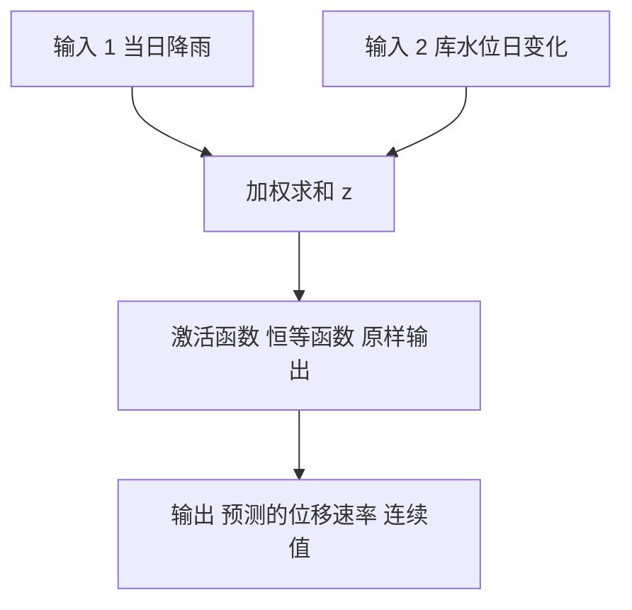
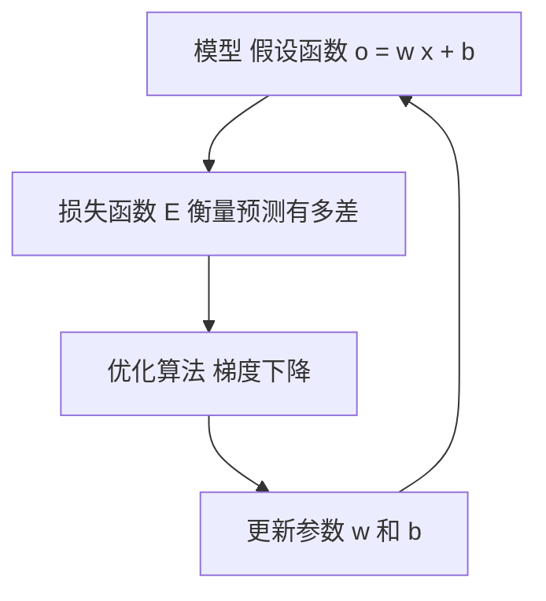
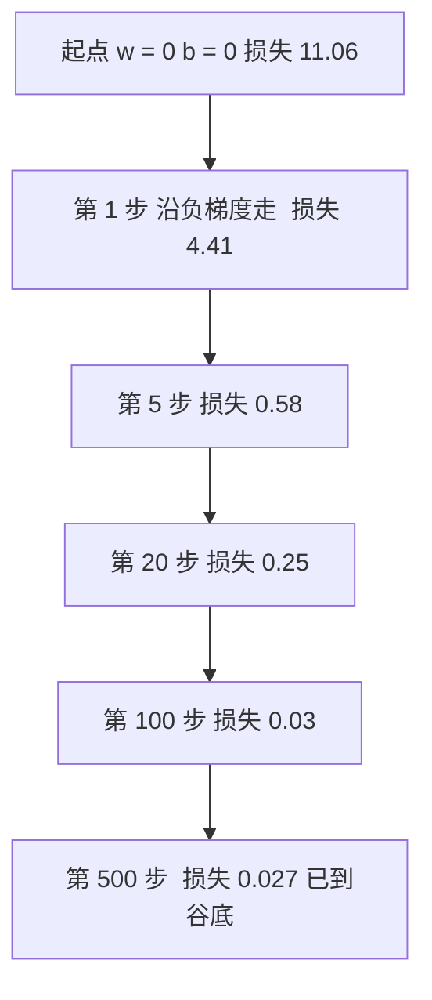

# 02. 线性单元和梯度下降

> [📖 模块目录](README.md) · ⬅️ [上一篇：01 感知器](01_感知器.md) · ➡️ [下一篇：03 神经网络和反向传播算法](03_神经网络和反向传播算法.md)

上一篇讲了**感知器**：输入几个数、加权求和、过一道门槛，输出 0 或 1。它会自己调权重，但方式很粗糙（错了就按输入方向推一下），而且只能回答"是/否"。

这一篇解决两件事：让神经元输出**连续数值**，再换一套**有数学保证**的调参方法——**梯度下降**。

**读完你会**：说清"激活函数"是什么；手推平方误差的偏导数；拿纸笔算完一次梯度下降更新；用 NumPy 从零写出线性单元拟合"降雨 → 位移速率"；看懂损失曲线，知道学习率太大/太小各会发生什么。

**要用的数学**：导数（[§5](数学预备知识.md#5-导数变化率是什么意思)）、偏导数与梯度（[§6](数学预备知识.md#6-偏导数与梯度参数该往哪边调)）、梯度下降（[§9](数学预备知识.md#9-梯度下降与学习率)）。用到时候点进去看就行。

---

## 1. 这一篇解决什么问题

感知器的输出只有两种可能：加权求和大于 0 就输出 1，否则输出 0。所以它能回答"这个测点今天会不会报警"，**却回答不了"明天位移速率是多少 mm/day"**——后者不是"是/否"，而是一个可以取任意实数的量。预测一个数值叫**回归**（regression），预测一个类别叫**分类**（classification）；感知器只能做分类，这就是它的天花板。

**出路**：看感知器的内部结构，那个门槛就是一个函数 $f$，输入是加权求和的结果 $z$，输出被它硬掰成 0 或 1。

$$o=f\underbrace{\big(\mathbf{w}^\top\mathbf{x}+b\big)}_{\text{加权求和 } z}$$

**把这个 $f$ 换成"原样输出"的函数，输出就变成连续值了。** 这就是本篇的主角——**线性单元**。

---

## 2. 从感知器到线性单元

### 2.1 先认识"激活函数"

那个 $f$ 有个正式名字：**激活函数**（activation function）。**生活类比**：加权求和 $z$ 像是"症状严重程度的打分"，激活函数像是"医生根据打分给出的结论"——结论只有"住院 / 回家"两种，这是**阶跃函数**；结论是一个连续程度（"需要观察的紧急度 0.6"），这是**恒等函数**。

**数学定义**：激活函数是作用在加权求和结果上的函数，决定了这个神经元输出长什么样：$o=f(z)$，其中 $z=\mathbf{w}^\top\mathbf{x}+b$。

| 激活函数 | 表达式 | 输出范围 | 用它的神经元 |
|---|---|---|---|
| 阶跃函数 | 大于 0 输出 1，否则 0 | 0 或 1 | 感知器 |
| **恒等函数** | $f(z)=z$ | 任意实数 | **线性单元** |

**为什么专门起个名字**：第 3 篇的多层网络，正是靠"每层用哪个激活函数"来决定网络能力。先记住：**激活函数 = 加在加权求和后面、决定输出形态的那个函数。**

### 2.2 线性单元的结构

把阶跃换成恒等，就得到**线性单元**：

$$o=\mathbf{w}^\top\mathbf{x}+b=w_1x_1+w_2x_2+\cdots+w_nx_n+b$$

> 📌 **符号说明**（每个符号第一次出现都要解释清楚）：$\mathbf{x}$ 是**输入向量**，$n$ 个数（本例中是某一天的"降雨"和"库水位日变化"）；$\mathbf{w}$ 是**权重向量**，$w_i$ 表示"第 $i$ 个输入对输出的影响有多大"，这是**要学的东西**；$b$ 是**偏置**，表示"所有输入都是 0 时输出大概是多少"，也要学；$\mathbf{w}^\top\mathbf{x}$ 是两个向量对应项相乘再求和，结果是**一个数**（看不懂记号就看 [§2 矩阵乘法](数学预备知识.md#2-矩阵乘法-wx-到底在算什么)）；$o$ 是**输出**（有的教材写成 $\hat{y}$），上标 $^\top$ 是转置，只是把横排向量竖过来方便写乘法。



**关键**：线性单元和感知器**前一半完全一样**，都是 $\mathbf{w}^\top\mathbf{x}+b$，换的只是最后那一步——所以上一篇读懂了，这一篇已经懂一半了。而 $o=\mathbf{w}^\top\mathbf{x}+b$ 就是一个**模型**（也叫**假设函数**）："我假设真实规律长这样，只要把 $\mathbf{w}$ 和 $b$ 定下来就能预测"，**训练就是去找一组好的 $\mathbf{w}$ 和 $b$**。

---

## 3. 监督学习的三个要素

这是全书反复出现的框架。任何监督学习算法都能拆成三块：

| 要素 | 别称 | 回答什么问题 | 本篇的对应 |
|---|---|---|---|
| **模型** | 假设函数 | 预测值长什么样 | $o=\mathbf{w}^\top\mathbf{x}+b$ |
| **损失函数** | 目标函数、代价函数 | 怎么衡量"预测得多差" | $E=\frac{1}{2}\sum_d(t_d-o_d)^2$ |
| **优化算法** | 学习算法 | 怎么把损失变小 | 梯度下降 |



给定当前参数 → 算预测有多差 → 算该往哪边调 → 调一点点 → 再算损失……转很多圈，损失越来越小。

> 💡 **为什么拆成三块**：换任何一块就变成一个新算法——换成 $o=\sigma(\mathbf{W}\mathbf{x}+\mathbf{b})$ 就是**神经网络**（第 3 篇），损失换成对数损失就是**逻辑回归**。后面几篇讲 CNN、RNN、LSTM，算法案例里还有 GCN 等，你会发现它们**都是在这三块上做文章**。

**符号说明**：$D$ 是样本总数（手算例 $D=3$，程序例 $D=60$）；$t_d$ 是第 $d$ 个样本的**真实目标值**（$d$ 从 1 数到 $D$）；$o_d$ 是**预测值**；$(t_d-o_d)$ 是**误差**；$E$ 是**损失**——它把"全体样本预测得有多差"压缩成一个数。

---

## 4. 目标函数：怎么衡量"预测得多差"

### 4.1 先试试最直接的做法，为什么不行

最直觉的是"把每个样本的误差加起来"：$E=\sum_d(t_d-o_d)$。**为什么不行**：误差有正有负——一个样本差 $+0.6$、另一个差 $-0.6$，加起来是 0，看起来"预测得完美"，实际上错得离谱。**正负抵消了。**

### 4.2 平方误差：本篇用的损失函数

解决办法：先平方、再求和。

$$E(\mathbf{w},b)=\frac{1}{2}\sum_{d=1}^{D}\big(t_d-o_d\big)^2$$

$(t_d-o_d)$ 是第 $d$ 个样本的误差；平方让负数也变正数、不会被抵消；$\sum_{d=1}^{D}$ 把 $D$ 个样本的损失合起来；$\frac{1}{2}$ 让求导结果更干净（见 4.3）。**平方还带来两个好处**：一是**对大误差罚得更重**（误差 0.1 贡献 0.01，误差 1 贡献 1——误差差 10 倍、罚差 100 倍，模型会优先把离谱的预测拉回来）；二是**到处可导**（绝对值 $\lvert t-o\rvert$ 在 0 点有个尖角、不好求导，平方则处处光滑）。

### 4.3 那个二分之一是怎么回事

**答案很朴素：它只是为了求导时好看。** 对平方求导会掉下来一个 2（[§7 链式法则](数学预备知识.md#7-链式法则与计算图接力传责任)）：

$$\frac{d}{du}\Big(\frac{1}{2}u^2\Big)=\frac{1}{2}\cdot 2u=u\qquad\text{而}\qquad\frac{d}{du}\big(u^2\big)=2u$$

所以 $\frac{1}{2}$ 是"提前预定"给求导用的。它带来的影响只有两条：**最小值在哪个点——没影响**（乘一个正数不改变"哪个点最小"）；**梯度的数值大小——有影响**（梯度也缩小一半，所以合适的 $\eta$ 要放大一倍）。⚠️ 所以对照不同教材的代码时，如果学习率差了 2 倍，多半就是有没有 $\frac{1}{2}$ 的区别。

---

## 5. 梯度是什么

### 5.1 直觉：站在山坡上

想象损失 $E$ 是一片山地的高度，参数 $w_1$、$w_2$ 是地面上的坐标（东西方向、南北方向）。你站在某处，想知道**往哪个方向走海拔下降最快**——那个方向就是**负梯度**的方向。**一句话记住：梯度指上坡，我们要下坡，所以往反方向走。** 下面把这句话写成公式。

### 5.2 数学定义

**偏导数** $\dfrac{\partial E}{\partial w_i}$ 的含义是：**只让 $w_i$ 变、其他参数都不动**时，损失的变化率。也就是"稍微调大一点 $w_i$，损失会变多少"。**梯度**就是把所有偏导数收集起来排成一个向量：

$$\nabla E=\begin{bmatrix}\dfrac{\partial E}{\partial w_1}, & \dfrac{\partial E}{\partial w_2}, & \cdots, & \dfrac{\partial E}{\partial w_n}\end{bmatrix}^{\top}$$

看不懂 $\partial$ 和 $\nabla$ 就点这里：[§6 偏导数与梯度](数学预备知识.md#6-偏导数与梯度参数该往哪边调)。**关键推论**：偏导数为正说明"调大会让损失变大"，应该**调小**；为负说明应该**调大**。两者统一成一句话——往偏导数的**反方向**调整：

$$w_i\leftarrow w_i-\eta\frac{\partial E}{\partial w_i}$$

$\eta$ 是正数（学习率），控制"每次调多少"。这个式子在第 7 节展开。

---

## 6. 梯度推导

目标很明确：**算出 $E$ 对每一个参数的偏导数**。一步一步来，一步都不跳。

### 6.1 先把要用的东西摆清楚

$$o_d=\mathbf{w}^\top\mathbf{x}_d+b=\sum_{j=1}^{n}w_jx_{dj}+b$$

注意两个 $\sum$ 用不同字母，**别搞混**：$j$ 是**特征编号**（第几个输入），$d$ 是**样本编号**（第几条数据）；$x_{dj}$ 就是"第 $d$ 个样本的第 $j$ 个特征值"，比如 $x_{2,1}$ = 第 2 天的降雨量。目标函数是 $E=\frac{1}{2}\sum_{d=1}^{D}(t_d-o_d)^2$，要算 $\dfrac{\partial E}{\partial w_i}$（$i$ 是某个特征编号，比如 $i=1$ 就是"降雨"对应的权重）和 $\dfrac{\partial E}{\partial b}$。

### 6.2 第一步：把求导搬进求和号；第二步：对单项用链式法则

求和号只是一个"加法"，而**加法的导数 = 导数的加法**。所以可以只盯住一项求导，最后再加起来：

$$\frac{\partial E}{\partial w_i}=\sum_{d=1}^{D}\frac{\partial}{\partial w_i}\frac{1}{2}(t_d-o_d)^2$$

对第 $d$ 项，令 $u_d=t_d-o_d$（就是误差），这一项是 $\frac{1}{2}u_d^2$。用链式法则：

$$\frac{\partial}{\partial w_i}\frac{1}{2}u_d^2=\frac{1}{2}\cdot 2u_d\cdot\frac{\partial u_d}{\partial w_i}=u_d\cdot\frac{\partial u_d}{\partial w_i}$$

**看，$\frac{1}{2}$ 和平方掉下来的 $2$ 正好抵消了。** 这就是 4.3 节说的"为了让求导好看"。

### 6.3 第三步：算误差对权重的偏导数

$u_d=t_d-o_d$。其中 $t_d$ 是**实测数据**，是个固定的数，跟 $w_i$ 毫无关系，所以 $\dfrac{\partial t_d}{\partial w_i}=0$：

$$\frac{\partial u_d}{\partial w_i}=\frac{\partial (t_d-o_d)}{\partial w_i}=0-\frac{\partial o_d}{\partial w_i}=-\frac{\partial o_d}{\partial w_i}$$

再算 $\dfrac{\partial o_d}{\partial w_i}$。把 $o_d$ 展开成 $w_1x_{d1}+w_2x_{d2}+\cdots+w_ix_{di}+\cdots+w_nx_{dn}+b$。对 $w_i$ 求偏导时**其他所有量都当常数**（[§6.1 偏导数](数学预备知识.md#61-偏导数)），右边只有一项还含 $w_i$，其余导数全是 0：

$$\frac{\partial o_d}{\partial w_i}=x_{di}\qquad\Longrightarrow\qquad \frac{\partial u_d}{\partial w_i}=-x_{di}$$

### 6.4 第四步：合起来

把 6.2 和 6.3 的结果相乘，再代回 6.2 的求和：

$$\frac{\partial}{\partial w_i}\frac{1}{2}(t_d-o_d)^2=u_d\cdot(-x_{di})=-(t_d-o_d)\,x_{di}$$

$$\boxed{\ \frac{\partial E}{\partial w_i}=-\sum_{d=1}^{D}(t_d-o_d)\,x_{di}\ }$$

**对偏置求导几乎一样，只是更简单。** 同样从 6.2 出发，$\dfrac{\partial u_d}{\partial b}=-\dfrac{\partial o_d}{\partial b}$。而 $b$ 的系数就是 1，它自己对自己求导当然得 1：

$$\frac{\partial o_d}{\partial b}=1\quad\Longrightarrow\quad\frac{\partial}{\partial b}\frac{1}{2}u_d^2=u_d\cdot(-1)=-(t_d-o_d)\quad\Longrightarrow\quad\boxed{\ \frac{\partial E}{\partial b}=-\sum_{d=1}^{D}(t_d-o_d)\ }$$

**对比两条公式**：对 $w_i$ 的偏导多乘了一个 $x_{di}$，对 $b$ 的偏导相当于乘了 1——可以把 $b$ 想成"输入恒为 1"的权重。

### 6.5 写成向量形式，并验证一下

$$\nabla_{\mathbf{w}}E=-\sum_{d=1}^{D}(t_d-o_d)\,\mathbf{x}_d=\sum_{\text{每个样本}}\underbrace{(\text{误差})}_{\text{一个数}}\times\underbrace{(\text{那个样本的输入})}_{\text{一个向量}}$$

人话：**哪个样本错了、错多少，就把它那一行的输入按比例"记一笔账"，最后把所有账加起来。** 所以——**误差越大、输入越大的位置，权重就该被调得越多。** 这一行就是后面所有深度学习框架里 `loss.backward()` 的雏形。

推导对不对不用猜，可以扰动一个参数、看损失变了多少来核对（原理见 [§10 数值梯度检查](数学预备知识.md#10-数值梯度检查为什么必须自己动手做)）：

```python
import numpy as np
X = np.array([[1.0, 2.0], [4.0, -1.0], [2.5, 3.0]])   # 3 个样本，2 个特征
t = np.array([0.70, 1.00, 1.10])                       # 3 个真实目标
w, b = np.array([0.10, 0.00]), 0.0                     # 当前参数

def E(wv, bv):                                         # 目标函数
    return 0.5 * np.sum((t - (X @ wv + bv)) ** 2)

eps = 1e-6                                             # 数值梯度：中心差分
num_w = np.array([(E(w + eps*np.eye(2)[i], b) - E(w - eps*np.eye(2)[i], b)) / (2*eps)
                  for i in range(2)])
num_b = (E(w, b + eps) - E(w, b - eps)) / (2 * eps)
an_w = -np.sum((t - (X @ w + b))[:, None] * X, axis=0)  # 解析梯度：6.4 节的公式
an_b = -np.sum(t - (X @ w + b))
print("解析 dE/dw =", an_w, " 数值 =", num_w)
print("解析 dE/db =", an_b, " 数值 =", round(float(num_b), 6))
```

```text
解析 dE/dw = [-5.125 -3.15 ]  数值 = [-5.125 -3.15 ]
解析 dE/db = -2.05  数值 = -2.05
```

两者一致（偏差 $10^{-11}$ 量级，纯属浮点误差），**公式推对了**。

---

## 7. 梯度下降算法

### 7.1 算法本体与"为什么是加号"

有了梯度，只要"往反方向走"。**批量梯度下降**的完整更新规则：

$$w_i\leftarrow w_i+\eta\sum_{d=1}^{D}(t_d-o_d)\,x_{di}\qquad\qquad b\leftarrow b+\eta\sum_{d=1}^{D}(t_d-o_d)$$

向量形式：$\mathbf{w}\leftarrow\mathbf{w}+\eta\sum_{d=1}^{D}(t_d-o_d)\,\mathbf{x}_d$。

**为什么是加号**：梯度里本来就带一个负号（6.4 节）$\dfrac{\partial E}{\partial w_i}=-\sum_d(t_d-o_d)x_{di}$，"减去梯度"展开后两个负号变成一个正号：

$$w_i-\eta\underbrace{\left(-\sum_d(t_d-o_d)x_{di}\right)}_{\text{梯度}}=w_i+\eta\sum_d(t_d-o_d)x_{di}$$

**两种写法是同一件事**：$\mathbf{w}\leftarrow\mathbf{w}-\eta\nabla E$ 是通用形式，$\mathbf{w}\leftarrow\mathbf{w}+\eta\sum_d(t_d-o_d)\mathbf{x}_d$ 是线性回归把梯度展开后的结果。验算直观性：若 $t_d>o_d$（预测偏低）且 $x_{di}>0$，则 $(t_d-o_d)x_{di}>0$，$w_i$ 被**调大**，下轮预测变大——方向正确。✓

### 7.2 学习率起什么作用

$\eta$ 是每一步走多远。它是**训练时最需要手工调的超参数**（这类量叫"超参数"，`epochs`、批量大小也是；相对地，$\mathbf{w}$、$b$ 是模型自己学出来的"参数"）。

| $\eta$ 的情况 | 现象 | 原因 |
|---|---|---|
| **太小** | 损失下降极慢，半天还在半山腰 | 每步挪一点点，当然慢 |
| **合适** | 平稳下降，最后稳定在最小值附近 | 每步都往谷底走，且没跨过头 |
| **太大** | 上下震荡，甚至越来越大直到溢出 | 一步跨过谷底，落到对面更高的坡上 |



这串数字不是编的，是第 10 节的真实程序输出——**每一步都是"站在当前位置算梯度，沿负梯度走一小步"**，损失就这样一级级降下来。**实践建议**：先试 $\eta=10^{-3}$ 或 $10^{-2}$ 量级；损失曲线平得像直线就放大 10 倍，上下乱跳或变成 `nan` 就缩小 10 倍。

---

## 8. 手算一个完整例子

用 **3 个样本**把前面所有东西串一遍。请拿纸笔跟着算——**每个数字都能用计算器验算。** 场景：用**当日降雨**和**库水位日变化**预测**位移速率**。

> 📌 为了手算数字好读，这里两个特征都做了缩放（实际工程中这叫**特征缩放**，几乎必做，原因见 11.2 节）：$x_1$ = 当日降雨，单位 **10 mm**（$x_1=1.0$ 就是 10 mm 雨）；$x_2$ = 库水位日变化，单位 **0.1 m**（$x_2=2$ 就是水位涨了 0.2 m）；$t$ = 位移速率，单位 mm/day。

### 8.1 前向：算出每个样本的预测值

| 样本 $d$ | $x_{d1}$ 降雨 | $x_{d2}$ 水位变化 | $t_d$ 实测 | 计算 $w_1x_{d1}+w_2x_{d2}+b$ | $o_d$ |
|---|---|---|---|---|---|
| 1 | 1.0 | 2.0 | 0.70 | $0.10\times1.0+0.00\times2.0+0.00$ | $0.100000$ |
| 2 | 4.0 | -1.0 | 1.00 | $0.10\times4.0+0.00\times(-1.0)+0.00$ | $0.400000$ |
| 3 | 2.5 | 3.0 | 1.10 | $0.10\times2.5+0.00\times3.0+0.00$ | $0.250000$ |

初始参数（随便设的）：$w_1=0.10$，$w_2=0.00$，$b=0.00$，$\eta=0.05$。预测值全都远低于实测值——因为 $w_2$ 和 $b$ 都是 0，模型还没学到东西。

### 8.2 目标函数：先算误差和它的平方

| 样本 | $t_d$ | $o_d$ | $t_d-o_d$ | $(t_d-o_d)^2$ |
|---|---|---|---|---|
| 1 | 0.70 | 0.100000 | $+0.600000$ | 0.360000 |
| 2 | 1.00 | 0.400000 | $+0.600000$ | 0.360000 |
| 3 | 1.10 | 0.250000 | $+0.850000$ | 0.722500 |

平方和 $0.360000+0.360000+0.722500=1.442500$，所以 $E=\frac{1}{2}\times1.442500=\mathbf{0.721250}$。

### 8.3 梯度：逐个样本算，再加起来

用 6.4 节的公式 $\dfrac{\partial E}{\partial w_i}=-\sum_d(t_d-o_d)x_{di}$，**先算每个样本的贡献**：

| 样本 | $-(t_d-o_d)$ | $\mathbf{x}_d$ | 对 $w_1$ 的贡献 | 对 $w_2$ 的贡献 |
|---|---|---|---|---|
| 1 | $-0.600000$ | $(1.0,\ 2.0)$ | $-0.600000$ | $-1.200000$ |
| 2 | $-0.600000$ | $(4.0,\ -1.0)$ | $-2.400000$ | $+0.600000$ |
| 3 | $-0.850000$ | $(2.5,\ 3.0)$ | $-2.125000$ | $-2.550000$ |

**逐行验算**：$-0.6\times1.0=-0.6$ ✓；$-0.6\times4.0=-2.4$ ✓；$-0.6\times(-1.0)=\mathbf{+0.6}$ ✓（负负得正，最容易错的一格）；$-0.85\times2.5=-2.125$ ✓；$-0.85\times3.0=-2.55$ ✓。

三行相加：$\dfrac{\partial E}{\partial w_1}=-0.600000-2.400000-2.125000=\mathbf{-5.125000}$，$\dfrac{\partial E}{\partial w_2}=-1.200000+0.600000-2.550000=\mathbf{-3.150000}$。偏置不乘 $x$、直接加误差：$\dfrac{\partial E}{\partial b}=-(0.600000+0.600000+0.850000)=\mathbf{-2.050000}$。

### 8.4 做一次更新，看损失降了没有

$\eta=0.05$，用 $w\leftarrow w-\eta\frac{\partial E}{\partial w}$：

| 参数 | 计算 | 新值 |
|---|---|---|
| $w_1$ | $0.10-0.05\times(-5.125)=0.10+0.256250$ | $0.356250$ |
| $w_2$ | $0.00-0.05\times(-3.150)=0.00+0.157500$ | $0.157500$ |
| $b$ | $0.00-0.05\times(-2.050)=0.00+0.102500$ | $0.102500$ |

**三个参数都变大了**——合理，因为原来的预测全都偏低。用新参数重新前向：

| 样本 | 计算 $w_1x_{d1}+w_2x_{d2}+b$ | 新 $o_d$ | 新误差 |
|---|---|---|---|
| 1 | $0.356250\times1.0+0.157500\times2.0+0.102500$ | 0.773750 | $-0.073750$ |
| 2 | $0.356250\times4.0+0.157500\times(-1.0)+0.102500$ | 1.370000 | $-0.370000$ |
| 3 | $0.356250\times2.5+0.157500\times3.0+0.102500$ | 1.465625 | $-0.365625$ |

$$E_{\text{新}}=\frac{1}{2}\Big(0.073750^2+0.370000^2+0.365625^2\Big)=\frac{1}{2}\times0.276021=\mathbf{0.138010}$$

**损失从 $0.721250$ 降到 $0.138010$，一次更新就降了 5 倍多。** ✓ 注意误差符号翻了过来——原来是"预测偏低"，现在变成"预测偏高"一点，因为步子迈得稍大。这正是梯度下降的正常样子。

### 8.5 用代码核对全部数字

```python
import numpy as np
# 3 天观测：x1 = 当日降雨(10mm)，x2 = 库水位日变化(0.1m)，t = 位移速率(mm/day)
X = np.array([[1.0,  2.0],
              [4.0, -1.0],
              [2.5,  3.0]])
t = np.array([0.70, 1.00, 1.10])

w, b, eta = np.array([0.10, 0.00]), 0.0, 0.05   # 初始权重、偏置、学习率

o = X @ w + b                # 前向：3 个预测值
err = t - o                  # 每个样本的误差
print("预测 o      =", o)
print("误差 t-o    =", err)
print("误差平方    =", err ** 2)
print("平方和      =", np.sum(err ** 2))
print("目标函数 E  =", 0.5 * np.sum(err ** 2))

grad_w = -np.sum(err[:, None] * X, axis=0)   # dE/dw
grad_b = -np.sum(err)                        # dE/db
print("梯度 dE/dw  =", grad_w)
print("梯度 dE/db  =", grad_b)

w_new, b_new = w - eta * grad_w, b - eta * grad_b
print("更新后 w    =", w_new)
print("更新后 b    =", b_new)
o_new = X @ w_new + b_new
print("更新后预测  =", o_new)
print("更新后 E    =", 0.5 * np.sum((t - o_new) ** 2))
```

输出（和手算完全一致）：

```text
预测 o      = [0.1  0.4  0.25]
误差 t-o    = [0.6  0.6  0.85]
误差平方    = [0.36   0.36   0.7225]
平方和      = 1.4425000000000001
目标函数 E  = 0.7212500000000001
梯度 dE/dw  = [-5.125 -3.15 ]
梯度 dE/db  = -2.05
更新后 w    = [0.35625 0.1575 ]
更新后 b    = 0.1025
更新后预测  = [0.77375  1.37     1.465625]
更新后 E    = 0.13801035156250024
```

### 8.6 多走几步

| 迭代步数 | 0（起点） | 1 | 2 | 3 | 4 | 5 | 10 | 20 | 50 | 100 | 200 |
|---|---|---|---|---|---|---|---|---|---|---|---|
| 损失 $E$ | 0.72125000 | 0.13801035 | 0.02955144 | 0.00932826 | 0.00550433 | 0.00472925 | 0.00419322 | 0.00352952 | 0.00210489 | 0.00088937 | 0.00015878 |

**要读出两件事**：一是**前 3 步降得飞快**（0.72 → 0.0093），后面越来越慢——这是梯度下降的典型特征，**不是没在学，而是接近谷底了，能降的空间本来就小**。二是**到第 200 步都还没降到 0**——注意这**不是**样本"信息不足"：数据无噪声且严格线性（$t=0.2x_1+0.1x_2+0.3$），3 样本 3 参数有唯一精确解（$E=0$ 可达）。真实原因是这个设计矩阵的条件数高达 **167**，相当病态，梯度下降收敛慢。第 10 节把样本换成 60 天，收敛就干脆得多。

> 💡 顺便说：这组数据其实是**严格**由 $t=0.2x_1+0.1x_2+0.3$ 生成的，所以理论上存在一组参数让 $E=0$。用最小二乘直接解，结果正是 $w_1=0.2$、$w_2=0.1$、$b=0.3$。梯度下降只是"慢慢挪过去"而已。

---

## 9. 随机梯度下降与小批量

### 9.1 批量梯度下降有什么问题

第 7 节的公式是"把所有 $D$ 个样本的梯度加起来再更新一次"，这叫**批量梯度下降**。问题是**每更新一次参数，就要把全部样本过一遍**——本课程真实数据里一个测点动辄几万条记录；如果数据集有 100 万条，"挪一小步"就要算 100 万次前向，训练慢到无法忍受。

### 9.2 三种做法

三种做法只有"每次更新用多少样本"这一个区别：**批量梯度下降**用全部 $D$ 个（梯度最准、下降最平稳，但每次更新都太贵）；**随机梯度下降**（SGD）随机挑 **1** 个（极快、能跑海量数据，但梯度很抖、损失上下跳）；**小批量梯度下降**随机挑 **$B$** 个（如 8、64），是两者的**折中**，还能利用 GPU 并行，只是仍有一点抖动。

**生活类比**：批量法像**每次都要问遍全班同学才做决定**——准，但慢；SGD 像**随便抓一个同学问一句就做决定**——快，但容易被个别意见带偏；小批量像**问一个小组**——够快，意见也还算靠谱。**这就是所有深度学习框架都用小批量的原因**：它既是精度与速度的折中，也是 GPU 一次能并行处理的天然单位。

### 9.3 用代码看三种做法的差别

```python
import numpy as np
rng = np.random.default_rng(42)
n = 60
rain = rng.uniform(0, 6, n)                                  # 降雨 10mm
rate = 0.08 * rain + 0.35 + rng.normal(0, 0.04, n)           # 位移速率

def full_loss(w, b):                                         # 全量损失，用于公平比较
    return 0.5 * np.sum((rate - (w * rain + b)) ** 2)

def train(batch_size, n_updates=300, eta=0.1, seed=0):
    r = np.random.default_rng(seed)
    w, b, hist = 0.0, 0.0, []
    for _ in range(n_updates):
        if batch_size == n:
            idx = np.arange(n)                               # 全量
        else:
            idx = r.choice(n, size=batch_size, replace=True)  # 随机抽一批
        xb, tb = rain[idx], rate[idx]
        e = tb - (w * xb + b)
        w = w + eta * np.mean(e * xb)     # 批内取平均，让不同批量下的 eta 可比
        b = b + eta * np.mean(e)
        hist.append(full_loss(w, b))
    return w, b, hist

for name, B in [("全量", 60), ("小批量", 8), ("单样本", 1)]:
    w, b, h = train(B)
    tail = h[-10:]
    print(f"{name:<4} B={B:>2}  末损失={h[-1]:.6f}  "
          f"最后10次范围=[{min(tail):.6f}, {max(tail):.6f}]  w={w:.5f} b={b:.5f}")
```

```text
全量   B=60  末损失=0.026844  最后10次范围=[0.026844, 0.026845]  w=0.07977 b=0.34233
小批量  B= 8  末损失=0.027852  最后10次范围=[0.026922, 0.039502]  w=0.07945 b=0.33765
单样本  B= 1  末损失=0.138583  最后10次范围=[0.037445, 0.690344]  w=0.09742 b=0.34053
```

**这就是"精度 / 速度"权衡的真实样子**：全量的波动范围 [0.026844, 0.026845]，**几乎不动、最准**；小批量 B=8 是 [0.026922, 0.039502]，在最小值附近**小幅摆动**；单样本是 [0.037445, 0.690344]，**抖得最厉害**。但单样本 SGD 只用 300 次更新就降到 0.03 附近（它一共只"看过"300 个样本，而全量法已经"看过"18000 个）；它从来不会安静地停在最小值上——**它一直在最小值附近游荡，因为每个样本都在把参数往自己那个方向拽。**

> 📌 **关于平均**：这里对批内梯度取了平均（除以 $B$），好处是**不同批量下的 $\eta$ 可以直接比较**。如果用求和（像第 7 节那样），小批量的步长会小 $B/n$ 倍，$\eta$ 就得相应放大。两种写法都对，**关键是不要混用**。

---

## 10. NumPy 从零实现

```python
# 不用任何深度学习框架，只用 NumPy 和 Matplotlib
import numpy as np
import matplotlib.pyplot as plt

class LinearUnit:
    """线性单元：预测值 o = w·x + b，用批量梯度下降训练。"""

    def __init__(self, n_features, eta=0.002, epochs=500):
        self.w = np.zeros(n_features)   # 权重 w，形状 (特征数,)
        self.b = 0.0                    # 偏置 b，一个数
        self.eta = eta                  # 学习率 η
        self.epochs = epochs            # 迭代轮数
        self.loss_history = []          # 每一轮的目标函数值，用来画损失曲线

    def predict(self, X):
        return X @ self.w + self.b      # 前向计算：o = w·x + b

    def loss(self, X, t):
        """目标函数 E = 1/2 * sum (t_d - o_d)^2"""
        e = t - self.predict(X)
        return 0.5 * np.sum(e ** 2)

    def fit(self, X, t):
        """批量梯度下降：每一轮用全部样本算一次梯度"""
        self.loss_history.append(self.loss(X, t))        # 训练前的损失
        for _ in range(self.epochs):
            e = t - self.predict(X)                      # 误差 t_d - o_d
            self.w = self.w + self.eta * (X.T @ e)       # w <- w + eta * sum e_d x_d
            self.b = self.b + self.eta * np.sum(e)       # b <- b + eta * sum e_d
            self.loss_history.append(self.loss(X, t))    # 记录本轮损失
        return self

# ---------- 造数据：降雨 -> 位移速率 ----------
rng = np.random.default_rng(42)
n = 60
rain = rng.uniform(0, 6, n)                              # 当日降雨，单位 10mm（0~60mm）
rate = 0.08 * rain + 0.35 + rng.normal(0, 0.04, n)       # 位移速率 mm/day
X = rain.reshape(-1, 1)                                  # 特征是"一列"

# ---------- 训练 ----------
model = LinearUnit(n_features=1, eta=0.002, epochs=500).fit(X, rate)
h = model.loss_history                                   # h[k] = 迭代 k 次后的损失

print(f"学到的 w = {model.w[0]:.6f}   b = {model.b:.6f}")
for k in (0, 1, 5, 20, 100, 500):
    print(f"第 {k:>3d} 次  E = {h[k]:.6f}")

pred = model.predict(X)
r2 = 1 - np.sum((rate - pred) ** 2) / np.sum((rate - rate.mean()) ** 2)
print(f"R^2 = {r2:.6f}")

# 和最小二乘的解析解对照
A = np.hstack([X, np.ones((n, 1))])
sol, *_ = np.linalg.lstsq(A, rate, rcond=None)
print(f"最小二乘解析解 w = {sol[0]:.6f}   b = {sol[1]:.6f}")

# ---------- 画图 ----------
fig, axes = plt.subplots(1, 2, figsize=(11, 4))
axes[0].plot(h); axes[0].set_yscale("log")               # 左图：损失曲线（纵轴对数刻度）
axes[0].set_xlabel("epoch"); axes[0].set_ylabel("E(w, b)"); axes[0].grid(alpha=0.3)
axes[1].scatter(rain, rate, s=25, label="observation")   # 右图：散点 + 拟合直线
axes[1].plot(np.linspace(0, 6, 100), model.w[0] * np.linspace(0, 6, 100) + model.b,
             color="crimson", label="fitted line")
axes[1].set_xlabel("rainfall / 10mm"); axes[1].set_ylabel("rate / mm per day")
axes[1].legend(); axes[1].grid(alpha=0.3); plt.tight_layout(); plt.show()
```

（💡 绘图标签故意用了英文：matplotlib 默认字体没有中文字形，写中文会显示成一个个方框。）

**三个关键点，和前面的公式一一对应**：`X @ self.w + self.b` 就是 $o=\mathbf{w}^\top\mathbf{x}+b$（`X` 每行是一个样本，一次矩阵乘法算出所有预测）；`X.T @ e` 就是 $\sum_d e_d\mathbf{x}_d$，正是"每个样本的误差乘以它的输入，再全部加起来"；`self.w + self.eta * (...)` 就是第 7 节的更新公式，注意是**加号**（原因见 7.1）。用 `X.T @ e` 而不是写循环是为了向量化，比 Python 循环快几十到几百倍——**数学上是同一件事**。

**真实运行输出**：

```text
学到的 w = 0.079653   b = 0.342799
第   0 次  E = 11.055266
第   1 次  E = 4.408877
第   5 次  E = 0.576522
第  20 次  E = 0.248918
第 100 次  E = 0.030360
第 500 次  E = 0.026842
R^2 = 0.952814
最小二乘解析解 w = 0.079653   b = 0.342800
```

**最值得看的一行**：梯度下降学到的 $w=0.079653$、$b=0.342799$，和最小二乘的解析解 $w=0.079653$、$b=0.342800$ 几乎完全一致（$w$ 在 6 位小数上一致，$b$ 相差约 $10^{-6}$）——梯度下降这个"瞎子摸象"的过程，最后居然精确地找到了理论最优解。$R^2=0.9528$ 说明线性关系确实存在（数据本来就是按 $t=0.08x+0.35$ 造的，再叠加噪声）。

---

## 11. 运行结果与解读

### 11.1 损失曲线该长什么样

把 `loss_history` 画出来（左图），并用 `set_yscale("log")` 把纵轴设成**对数刻度**——损失要跨好几个数量级，线性刻度会看不见后面的细节。**正确的曲线应该长这样**：最开始非常陡、几乎竖直往下掉（参数离最优值很远，梯度大）；中间逐渐变缓（接近谷底，梯度变小，步伐自然变小）；最后几乎水平（收敛了，再走也降不下去）。

形状不对就是有问题：**几乎水平、一直在高位**说明学习率太小或迭代次数不够，放大 $\eta$ 或增加 `epochs`；**上下锯齿、来回跳**说明学习率太大（在临界点附近），缩小 $\eta$；**一路上扬、最后变 `nan`** 说明过大、发散了，$\eta$ 缩小 10 倍起步；**降到某个值就不动、但那个值还很大**则不是优化问题，而是模型能力不够，要换模型（见第 12 节）。**为什么是"先陡后平"**：因为梯度本身在变小——第 100 轮时误差 $(t_d-o_d)$ 已经很小（此时 $R^2\approx0.95$，最终 $R^2=0.9528$），梯度就小，更新量跟着小。**梯度下降天然"自动减速"**，越接近谷底步子越小，不容易冲过头，这也是它比"固定步长"靠谱的地方。

### 11.2 学习率对照实验

```python
import numpy as np
rng = np.random.default_rng(42)
n = 60
rain = rng.uniform(0, 6, n)
rate = 0.08 * rain + 0.35 + rng.normal(0, 0.04, n)

def train(eta, epochs=200):
    """批量梯度下降，返回每一轮的损失"""
    w, b, hist = 0.0, 0.0, [0.5 * np.sum(rate ** 2)]     # hist[0] 是训练前的损失
    for _ in range(epochs):
        e = rate - (w * rain + b)
        w = w + eta * np.sum(e * rain)
        b = b + eta * np.sum(e)
        hist.append(0.5 * np.sum((rate - (w * rain + b)) ** 2))
    return w, b, hist

print(f"{'eta':>10} {'第1轮':>12} {'第5轮':>14} {'第200轮':>16}")
for eta in [0.00002, 0.002, 0.0025, 0.003]:
    w, b, h = train(eta)
    print(f"{eta:>10} {h[1]:>12.4f} {h[5]:>14.4f} {h[-1]:>16.4f}")
```

真实输出（四个实验的起点损失都是 **11.0553**）：

```text
       eta          第1轮            第5轮            第200轮
     2e-05      10.7240         9.5011           0.6081
     0.002       4.4089         0.5765           0.0269
    0.0025      11.1050        11.3347          57.2785
     0.003      21.1441       312.5490 1268785508605502052034138480601973235764646871249931693195264.0000
```

读这张表：$\eta=0.00002$ **太小**（200 轮还在 0.6081，连半山腰都没到）；$\eta=0.002$ **合适**（5 轮就降到 0.5765，200 轮稳稳停在 0.0269，这就是最小值）；$\eta=0.0025$ **太大**（损失**不降反升**，一路爬到 57.2785）；$\eta=0.003$ **太大到发散**（第 200 轮是 $1.27\times10^{57}$，也就是最后一行那个天文数字）。

**为什么"0.002 好、0.0025 坏"这么泾渭分明？因为这个问题能精确算出来。** 损失函数是二次函数，它的二阶导矩阵就是 $X^\top X$（$X$ 是"降雨列 + 一列全 1"，那一列全 1 是给偏置 $b$ 用的）。用 `np.linalg.eigvalsh(X.T @ X).max()` 算出这个矩阵的最大特征值是 **801.709**，于是梯度下降稳定的**充要条件**是：

$$\eta<\frac{2}{\lambda_{\max}}=\frac{2}{801.709}=\mathbf{0.002495}$$

$\eta=0.002<0.002495$ 所以收敛 ✓，$\eta=0.0025>0.002495$ 所以发散 ✗——**25% 的差别，结果天壤之别。**

> 💡 **两个可直接带走的结论**：一是**临界 $\eta$ 和特征的量级有关**——这个例子阈值只有 0.0025，是因为降雨数值在 0~6 之间、还有 60 个样本，导致 $\lambda_{\max}$ 很大；**如果把特征标准化**（减均值、除标准差），$\lambda_{\max}$ 会降到 $n$ 左右，$\eta$ 就能取到 0.03 量级，训练快十几倍。二是**这就是"特征缩放"几乎是标准动作的原因**——它不只是让数字好看，而是直接决定了你能不能用上合适的学习率；**第 8 节的手算例子把单位换成 10mm / 0.1m，做的就是这件事。**

---

## 12. 局限与下一步

### 12.1 线性单元只能拟合直线

$o=w_1x_1+w_2x_2+b$ 在二维平面上是一条**直线**（更高维是"超平面"），**没有能力表示弯曲的关系**。举个真实会遇到的例子：假设降雨太少或太多时位移都偏大（极端降雨导致局部冲刷、干旱导致干缩裂缝）、中间最小——这是一条**抛物线**。

```python
import numpy as np
rng = np.random.default_rng(3)
n = 60
rain = rng.uniform(0, 6, n)
rate_curve = 0.4 + 0.05 * (rain - 3) ** 2 + rng.normal(0, 0.02, n)   # 抛物线关系

def train(x, y, eta=0.002, epochs=3000):
    w, b = 0.0, 0.0
    for _ in range(epochs):
        e = y - (w * x + b)
        w = w + eta * np.sum(e * x)
        b = b + eta * np.sum(e)
    return w, b

def r2(x, y, w, b):
    p = w * x + b
    return 1 - np.sum((y - p) ** 2) / np.sum((y - y.mean()) ** 2)

w, b = train(rain, rate_curve)
print(f"抛物线数据: w = {w:.6f}  b = {b:.6f}  R^2 = {r2(rain, rate_curve, w, b):.6f}")

rate_line = 0.08 * rain + 0.35 + rng.normal(0, 0.04, n)              # 对照：本来就是直线
w2, b2 = train(rain, rate_line)
print(f"直线数据:   w = {w2:.6f}  b = {b2:.6f}  R^2 = {r2(rain, rate_line, w2, b2):.6f}")
```

```text
抛物线数据: w = -0.002488  b = 0.537025  R^2 = 0.001068
直线数据:   w = 0.079845  b = 0.354572  R^2 = 0.922961
```

抛物线数据的 $R^2$ 只有 **0.001**——等于"什么都没预测出来"，斜率 $w$ 几乎是 0（抛物线左右对称，任何斜率都帮不上忙）；而直线数据的 $R^2$ 是 0.92。**注意：这不是梯度下降没调好，而是模型本身没这个能力**——把 $\eta$ 调得再准、迭代再多轮，$R^2$ 还是 0.001。位移速率随降雨呈 S 形或抛物线、随时间周期性波动、多个测点互相影响，这些线性单元统统做不到（后者见 [GCN 算法原理](../GCN/GCN_算法原理.md)）。

### 12.2 怎么突破：给网络加上非线性

回到三要素框架。模型不够用 → **改模型**：把线性单元**堆起来**，并在中间加上**非线性的激活函数**。

$$o=\mathbf{w}_2^\top f\big(\mathbf{W}_1\mathbf{x}+\mathbf{b}_1\big)+b_2$$

$\mathbf{W}_1$ 把 $n$ 个输入变成 $m$ 个"中间量"（叫**隐层**），$f$ 是非线性激活函数（sigmoid、tanh、ReLU 等），$\mathbf{w}_2$ 再把 $m$ 个中间量合成为 1 个输出。**为什么这样能表示曲线**：单个线性单元只能画直线，但**多个线性单元的组合再经过非线性弯折**，就能拼出任意形状的曲线——这就是**多层神经网络**的基本思想。**但新问题来了**：本篇推的是"一个线性单元对 $\mathbf{w}$ 和 $b$ 求导"，现在要对好几层的 $\mathbf{W}_1$、$\mathbf{b}_1$、$\mathbf{w}_2$、$b_2$ 求导，**要一层一层往回套链式法则**——这就是**反向传播算法**（Backpropagation），下一篇的主题。

---

## 13. 自检问题

**1.** "激活函数"到底是什么？它决定了什么？

<details><summary>点击查看答案</summary>

激活函数是**加在加权求和结果 $z=\mathbf{w}^\top\mathbf{x}+b$ 后面的那个函数**，它决定这个神经元的输出长什么样。感知器用阶跃函数把 $z$ 硬掰成 0 或 1，只能做分类；线性单元用恒等函数 $f(z)=z$ 原样输出，能做回归。关键点：**两种神经元的前半部分完全一样**，区别只在最后这个函数。

</details>

**2.** 目标函数里的 $\frac{1}{2}$ 有什么用？去掉它会影响什么？

<details><summary>点击查看答案</summary>

唯一作用是**让求导结果干净**：对平方求导会掉下来一个 2，和 $\frac{1}{2}$ 恰好抵消，于是 $\partial E/\partial w_i$ 直接等于 $-\sum_d(t_d-o_d)x_{di}$，没有多余系数。去掉它的影响：**最小值的位置不变**（乘正数不改变哪个点最小），但**梯度的数值翻倍**，所以合适的 $\eta$ 要减半——所以它**不是纯粹的书写方便**。

</details>

**3.** 推导 $\partial E/\partial w_i$。重点说清：为什么 $t_d$ 求导后消失了？为什么只有 $x_{di}$ 留下来？

<details><summary>点击查看答案</summary>

1. 链式法则（令 $u_d=t_d-o_d$）：$\frac{\partial}{\partial w_i}\frac{1}{2}u_d^2=\frac{1}{2}\cdot2u_d\cdot\frac{\partial u_d}{\partial w_i}=u_d\frac{\partial u_d}{\partial w_i}$，$\frac{1}{2}$ 与 2 抵消。2. $\frac{\partial u_d}{\partial w_i}=\frac{\partial t_d}{\partial w_i}-\frac{\partial o_d}{\partial w_i}=0-\frac{\partial o_d}{\partial w_i}$——**$t_d$ 是实测数据、是常数，与 $w_i$ 无关，所以导数为 0，这就是它消失的原因。**
3. $o_d=\sum_j w_jx_{dj}+b$，对 $w_i$ 求偏导时其他 $w_j$ 全当常数、导数为 0，**只有 $j=i$ 那一项 $w_ix_{di}$ 留下来，它的导数是 $x_{di}$**。4. 合并并代回求和：$\frac{\partial E}{\partial w_i}=-\sum_d(t_d-o_d)x_{di}$。

</details>

**4.** 为什么更新公式里是**加号**，而通用形式写的是减号 $\mathbf{w}\leftarrow\mathbf{w}-\eta\nabla E$？

<details><summary>点击查看答案</summary>

因为推出来的梯度本身就带负号：$\nabla_{\mathbf{w}}E=-\sum_d(t_d-o_d)\mathbf{x}_d$。减号减去一个负数就是加号：

$$\mathbf{w}-\eta\underbrace{\Big(-\sum_d(t_d-o_d)\mathbf{x}_d\Big)}_{\text{梯度}}=\mathbf{w}+\eta\sum_d(t_d-o_d)\mathbf{x}_d$$

**两种写法是同一个公式**。写代码时容易混，可以这样自检：如果 $t_d>o_d$（预测偏低）且 $x_{di}>0$，$w_i$ 应该被**调大**。

</details>

**5.** 11.2 节里 $\eta=0.002$ 收敛而 $\eta=0.0025$ 发散，只差 25%。这个临界值由什么决定？和特征缩放有什么关系？

<details><summary>点击查看答案</summary>

临界值是 $\eta<2/\lambda_{\max}$，$\lambda_{\max}$ 是损失函数二阶导矩阵 $X^\top X$ 的最大特征值。本例 $\lambda_{\max}=801.709$，阈值 0.002495：$\eta=0.002$ 在阈值以下，每步都往谷底走 → 收敛；$\eta=0.0025$ 在阈值以上，每步都跨过谷底 → 发散。**和特征缩放的关系**：$\lambda_{\max}$ 直接取决于特征的数值量级。若把特征标准化（减均值、除标准差），$\lambda_{\max}$ 会降到 $n$（样本数）左右，阈值放宽到 0.03 量级，能用的学习率大十几倍，训练快得多。**这就是特征缩放几乎总是标准动作的原因。**

</details>

**6.** 线性单元在抛物线数据上 $R^2$ 只有 0.001。这是学习率没调好吗？该怎么解决？

<details><summary>点击查看答案</summary>

**不是。** 这是**模型能力**的问题，不是优化的问题。$o=w_1x_1+w_2x_2+b$ 只能表示直线（超平面），抛物线是弯的。抛物线左右对称，任何斜率都帮不上忙，所以梯度下降最终把 $w$ 调到将近 0（实测 $w=-0.002488$），$R^2=0.001068$。**无论 $\eta$ 调得多准、迭代多少轮，$R^2$ 都不会变好。** 正确做法是**改模型**：加入隐层和非线性激活函数 $o=\mathbf{w}_2^\top f(\mathbf{W}_1\mathbf{x}+\mathbf{b}_1)+b_2$。多个线性单元的组合经过非线性弯折，就能表示曲线。而新模型带来的新问题是"多层的梯度怎么算"——那就是下一篇的**反向传播算法**。

</details>

---

## 14. 下一篇预告

本篇的四样东西下一节都会直接复用：**激活函数**换成 sigmoid / tanh / ReLU，让网络有非线性；**目标函数与平方误差**推广到多输出、多层；**梯度的逐项推导**推广成"多层链式法则"，也就是反向传播；**梯度下降更新公式**一模一样，只是梯度改用 BP 算。

**但还有一个根本问题没解决**：线性单元再强也只能画直线，而要拟合复杂的岩土工程关系（降雨的累积效应、水位的滞后影响、多测点的相互影响），必须有非线性。

**下一篇** → [03. 神经网络和反向传播算法](03_神经网络和反向传播算法.md)：我们把多个线性单元**叠起来**，中间加上非线性激活函数，再用**反向传播算法**把本篇的梯度推导推广到任意多层。你会亲手实现一个能解 XOR 问题的网络——那是单层网络永远做不到的事。

---

> [📖 模块目录](README.md) · ⬅️ [上一篇：01 感知器](01_感知器.md) · ➡️ [下一篇：03 神经网络和反向传播算法](03_神经网络和反向传播算法.md)
>
> 📐 数学符号看不懂？查 [数学预备知识.md](数学预备知识.md)（[§5 导数](数学预备知识.md#5-导数变化率是什么意思) ｜ [§6 偏导数与梯度](数学预备知识.md#6-偏导数与梯度参数该往哪边调) ｜ [§9 梯度下降](数学预备知识.md#9-梯度下降与学习率)）
