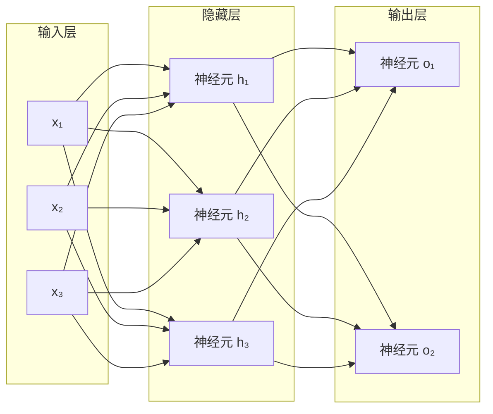
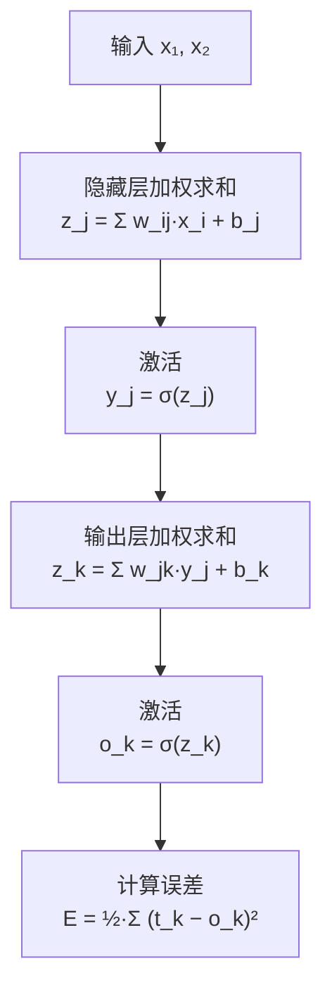
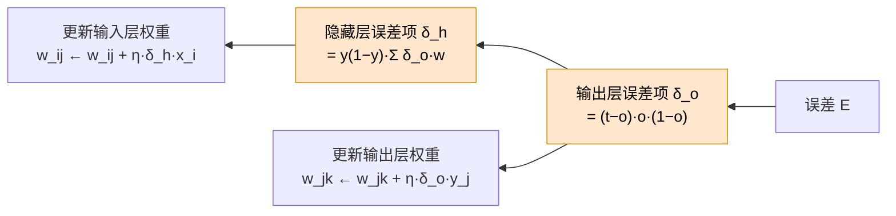

# 03. 神经网络和反向传播算法

> [📖 模块目录](README.md) · ⬅️ [上一篇：02 线性单元和梯度下降](02_线性单元和梯度下降.md) · ➡️ [下一篇：04 卷积神经网络](04_卷积神经网络.md)

**这一篇你将学到**：

- 为什么单层网络连"异或"这种简单问题都解不了
- 多层神经网络长什么样，为什么必须要有非线性激活函数
- **反向传播算法**的完整推导——这是深度学习最核心的算法，也是本篇的重点
- 用纯 NumPy 写出一个能解 XOR 的神经网络

> 📐 本篇会用到**链式法则**、**偏导数**、**矩阵乘法**。如果这些概念你还生疏，先看 [数学预备知识](数学预备知识.md) 的 [§7 链式法则与计算图](数学预备知识.md#7-链式法则与计算图接力传责任) 和 [§6 偏导数与梯度](数学预备知识.md#6-偏导数与梯度参数该往哪边调)。

---

## 1. 这一篇解决什么问题

### 1.1 先说结论：单层网络有个解不了的问题

第 1 篇讲过，感知器就是在平面上画一条直线把两类点分开。第 2 篇的线性单元也是画直线（只是用来做回归）。

现在看一个只有 4 行的"小问题"——**异或（XOR）**：

| 输入 $x_1$ | 输入 $x_2$ | 输出 $t$ |
|---|---|---|
| 0 | 0 | **0** |
| 0 | 1 | **1** |
| 1 | 0 | **1** |
| 1 | 1 | **0** |

**用一句话说**：两个输入"不一样"时输出 1，"一样"时输出 0。

把它画在平面上（横轴 $x_1$、纵轴 $x_2$）：

```text
   x2
    ↑
  1 │  ●(0,1)      ○(1,1)
    │   输出1       输出0
    │
  0 │  ○(0,0)      ●(1,0)
    │   输出0       输出1
    └──────────────────────→ x1
        0            1
```

**● 表示希望输出 1，○ 表示希望输出 0。**

问题来了：**你能画一条直线，把 ● 和 ○ 分开吗？**

试着画：

- 竖线？左边两个是 ○ 和 ●，混在一起 → 不行
- 横线？下面两个是 ○ 和 ●，混在一起 → 不行
- 斜线？无论怎么斜，对角线上总是一对"● 和 ○"捆在一起 → 不行

**答案是不可能。** 因为 ● 位于两个对角，它们构成的图形是"交叉"的，而一条直线最多只能切出一块凸区域。

> 💡 **什么叫"凸"**：如果一块区域里任意两点的连线都还在这块区域内，就叫凸的。一条直线能分出来的一侧，一定是凸的。XOR 的两个 ● 在 (0,1) 和 (1,0)，连线中点 (0.5,0.5) 落在 ○ 的区域里 → **不是凸的** → 一条直线做不到。

### 1.2 那我们用两条直线呢

如果允许用**两条**直线，就简单了：

```text
   x2
    ↑
  1 │  ●(0,1)  ╲    ○(1,1)         直线①：x1 + x2 = 0.5
    │           ╲                  直线②：x1 + x2 = 1.5
    │            ╲
  0 │  ○(0,0)    ╲  ●(1,0)
    └──────────────────────→ x1
```

看出来了吗：**两个 ● 都夹在 $0.5 < x_1+x_2 < 1.5$ 之间**，而两个 ○ 的 $x_1+x_2$ 分别等于 0 和 2，都在这个区间**外面**。

所以判断可以分两步：

1. 先算 $x_1+x_2$（这是"两个输入的加权和"）
2. 再看它是否落在 $(0.5,\ 1.5)$ 之间

**这就是"多层网络"的思想**：单层只能画一条直线，多层可以先用几条直线切分空间，再把结果组合起来。

> 📌 **本篇的三句话预告**：
> ① 单层网络只能做"线性可分"的问题；
> ② 加一层隐藏神经元就能表达更复杂的边界，XOR 迎刃而解；
> ③ 但多层网络怎么训练？答案就是**反向传播算法**。

---

## 2. 神经网络长什么样

### 2.1 结构

把第 1、2 篇的一个"神经元"横向排开、纵向堆叠，就成了神经网络：



**三个层次的职责**：

| 层 | 名称 | 干什么 |
|---|---|---|
| 左边 | **输入层** | 只负责接收数据，不做计算（所以图中画成方块） |
| 中间 | **隐藏层** | 把输入"加工"成中间特征——**这一层就是单层网络做不到的那部分能力** |
| 右边 | **输出层** | 给出最终结果（分类用概率、回归用数值） |

**"全连接"**：图中每个输入都连到每个隐藏神经元，每个隐藏神经元都连到每个输出。所以这一层也叫**全连接层**。

> ⚠️ **注意术语**：不算输入层的话，上图是"两层网络"（1 个隐藏层 + 1 个输出层）。有的教材按"层数=神经元层数"算成三层。**本书统一用前者**：说有 $L$ 个隐藏层时，指的是中间的计算层数。

### 2.2 每个神经元的计算：还是熟悉的配方

每个神经元做的事，和第 2 篇的线性单元**一模一样**：

$$z_j=\sum_i w_{ij}x_i+b_j,\qquad y_j=f(z_j)$$

差别只在**激活函数** $f$ 的选择上：

| | 输出层用什么 | 隐藏层用什么 |
|---|---|---|
| 第 1 篇感知器 | 阶跃函数（0/1） | — |
| 第 2 篇线性单元 | 恒等函数（原样输出） | — |
| **本篇神经网络** | **Sigmoid**（压到 0~1） | **Sigmoid** |

**为什么用 Sigmoid？** 两个理由：

1. **它把任意实数压到 $(0,1)$**，可以解释成概率，而且输出有界、训练稳定；
2. **它的导数好算**：$\sigma'(z)=\sigma(z)\big(1-\sigma(z)\big)$——这个漂亮的性质会让反向传播的公式变得非常简洁（推导见 [数学预备知识 §11.1](数学预备知识.md#111-sigmoid)）。

---

## 3. 为什么必须要有非线性激活函数

这一点初学者常忽略，但它**决定了多层的意义**。

**问题**：如果激活函数都用恒等的（$y=x$，即没有激活函数），多层还有用吗？

**答案：没有。多层的线性函数叠起来还是一个线性函数。**

### 3.1 两层的证明

设第一层是 $\mathbf{y}=\mathbf{W}_1\mathbf{x}+\mathbf{b}_1$，第二层是 $\mathbf{o}=\mathbf{W}_2\mathbf{y}+\mathbf{b}_2$。把第一层代入第二层：

$$\mathbf{o}=\mathbf{W}_2\big(\mathbf{W}_1\mathbf{x}+\mathbf{b}_1\big)+\mathbf{b}_2=\underbrace{\big(\mathbf{W}_2\mathbf{W}_1\big)}_{\text{还是一个矩阵}}\mathbf{x}+\underbrace{\big(\mathbf{W}_2\mathbf{b}_1+\mathbf{b}_2\big)}_{\text{还是一个向量}}$$

结果完全可以写成 $\mathbf{o}=\mathbf{W}'\mathbf{x}+\mathbf{b}'$ 的形式——**和一个单层网络没有任何差别**。

$$\mathbf{W}'=\mathbf{W}_2\mathbf{W}_1,\qquad \mathbf{b}'=\mathbf{W}_2\mathbf{b}_1+\mathbf{b}_2$$

**推广**：无论叠多少层，只要中间没有非线性，最终都等价于一层。

> 🪨 **一句话**：**非线性激活函数是"多层"存在的前提**。没有它，加层纯属浪费计算。

> 📌 这也解释了第 1 篇的局限为什么"加一层就能解决"：关键在于**加层的同时要有非线性**，让网络能表达"先切一刀、再切一刀、再组合"这样的逻辑。

---

## 4. 前向传播：把数据一层层传下去

### 4.1 符号约定（很重要，后面推导全靠它）

我们先统一记号，**本篇全程使用**：

| 符号 | 含义 | 举例（一个 2 输入、2 隐藏、1 输出的网络） |
|---|---|---|
| $x_i$ | 第 $i$ 个**输入** | $x_1,\ x_2$ |
| $w_{ij}$ | 从节点 $i$ 到**隐藏层节点 $j$** 的权重 | $w_{11}$：输入 1 → 隐藏 1 |
| $b_j$ | 隐藏层节点 $j$ 的偏置 | $b_1,\ b_2$ |
| $z_j$ | 隐藏层节点 $j$ 的**加权和**（激活前） | 记作 $z_j=\sum_i w_{ij}x_i+b_j$ |
| $y_j$ | 隐藏层节点 $j$ 的**输出**（激活后） | $y_j=\sigma(z_j)$ |
| $w_{jk}$ | 从隐藏节点 $j$ 到**输出节点 $k$** 的权重 | — |
| $o_k$ | 输出层节点 $k$ 的输出 | $o_k=\sigma(z_k)$ |
| $t_k$ | 输出层节点 $k$ 的**目标值**（真值） | 训练数据给的 |
| $E$ | 误差（损失） | $E=\frac12\sum_k(t_k-o_k)^2$ |

> 💡 **下标的记法**：$w_{ij}$ 表示"从 $i$ 连到 $j$"。这样写的好处是**求导时下标天然对齐**（详见 [§5](#5-反向传播算法本篇核心)）。

### 4.2 前向传播的完整流程



**一句话**：数据从输入层出发，每经过一层就做一次"加权求和 + 激活"，最后和真值比出误差。

**逐层写成公式**：

$$
\begin{aligned}
\text{隐藏层：}\quad & z_j=\sum_{i} w_{ij}\,x_i+b_j, &\quad y_j&=\sigma(z_j)\\[4pt]
\text{输出层：}\quad & z_k=\sum_{j} w_{jk}\,y_j+b_k, &\quad o_k&=\sigma(z_k)\\[4pt]
\text{误差：}\quad & E&=\tfrac12\sum_{k}(t_k-o_k)^2
\end{aligned}
$$

> 💡 **误差里的 $\frac12$ 是干什么的？** 和第 2 篇一样：求导时平方会掉下来一个 2，正好和 $\frac12$ 抵消，公式更干净。它**不改变最优解的位置**，只是让公式好看。

---

## 5. 反向传播算法（本篇核心）

### 5.1 要解决的问题

训练网络就是"调整所有 $w$ 和 $b$，让 $E$ 变小"。按第 2 篇的办法，需要算出**每个参数的偏导数** $\dfrac{\partial E}{\partial w_{ij}}$，然后：

$$w_{ij}\leftarrow w_{ij}-\eta\frac{\partial E}{\partial w_{ij}}$$

**难点**：网络里有几十上百个参数，逐个用数值微分算（第 2 篇的"试一下变多少"）要算上百次前向，**太慢**。

**反向传播（Backpropagation, BP）** 的价值就在于：**一次前向 + 一次反向，就能算出所有参数的梯度**。

### 5.2 核心技巧：定义"误差项" $\delta$

为了少写重复的式子，我们引入一个中间量——**误差项** $\delta$。

**先看输出层**。对输出节点 $k$，用链式法则：

$$\frac{\partial E}{\partial w_{jk}}=\frac{\partial E}{\partial o_k}\cdot\frac{\partial o_k}{\partial z_k}\cdot\frac{\partial z_k}{\partial w_{jk}}$$

逐项算：

| 因子 | 计算 | 结果 |
|---|---|---|
| $\dfrac{\partial E}{\partial o_k}$ | $E=\frac12\sum(t-o)^2$，只有第 $k$ 项含 $o_k$ | $-(t_k-o_k)$ |
| $\dfrac{\partial o_k}{\partial z_k}$ | $o_k=\sigma(z_k)$，用 $\sigma'=\sigma(1-\sigma)$ | $o_k(1-o_k)$ |
| $\dfrac{\partial z_k}{\partial w_{jk}}$ | $z_k=\sum_j w_{jk}y_j+b_k$ | $y_j$ |

三项相乘：

$$\boxed{\;\frac{\partial E}{\partial w_{jk}}=-\underbrace{(t_k-o_k)\,o_k\,(1-o_k)}_{\text{定义为 } \delta_k^o}\;y_j\;}$$

**我们把这坨"与权重无关、只与输出节点有关"的东西定义成 $\delta_k^o$**：

$$\delta_k^o\equiv(t_k-o_k)\,o_k\,(1-o_k)$$

于是输出层权重的梯度变得非常简洁：

$$\frac{\partial E}{\partial w_{jk}}=-\delta_k^o\,y_j,\qquad \frac{\partial E}{\partial b_k}=-\delta_k^o$$

> 💡 **$\delta_k^o$ 在读什么**：$(t_k-o_k)$ 是"预测差了多少"，$o_k(1-o_k)$ 是"sigmoid 在该点的斜率"。**误差大、斜率大 → $\delta$ 大 → 这个输出节点要负的"责任"大**。$\delta$ 就是**责任的大小**。

### 5.3 隐藏层的误差项：误差往回流

隐藏层的权重 $w_{ij}$ 不直接影响输出，它先影响 $y_j$、再影响 $z_k$、最后才影响 $E$。所以要绕一圈：

$$\frac{\partial E}{\partial w_{ij}}=\frac{\partial E}{\partial y_j}\cdot\frac{\partial y_j}{\partial z_j}\cdot\frac{\partial z_j}{\partial w_{ij}}$$

前两个因子好办，难的是 $\dfrac{\partial E}{\partial y_j}$——**隐藏层的输出 $y_j$ 影响的不止一个东西，而是所有的输出节点**（上图中 $h_1$ 同时连到 $o_1$ 和 $o_2$）。所以要把所有路径加起来：

$$\frac{\partial E}{\partial y_j}=\sum_k\frac{\partial E}{\partial z_k}\cdot\frac{\partial z_k}{\partial y_j}$$

其中 $\dfrac{\partial E}{\partial z_k}$ 正是我们刚算过的（注意 $\frac{\partial E}{\partial z_k}=-(t_k-o_k)o_k(1-o_k)=-\delta_k^o$），而 $\dfrac{\partial z_k}{\partial y_j}=w_{jk}$。代入：

$$\frac{\partial E}{\partial y_j}=-\sum_k \delta_k^o\,w_{jk}$$

再乘上 $\dfrac{\partial y_j}{\partial z_j}=y_j(1-y_j)$：

$$\boxed{\;\delta_j^h\equiv y_j(1-y_j)\sum_k \delta_k^o\,w_{jk}\;}$$

**这就是反向传播的精髓**：隐藏层的误差项 $\delta_j^h$ = **把所有下游节点的误差项按连接权重加权求和**，再乘本节点的激活斜率。

$$y_j(1-y_j)\times\underbrace{\sum_k \delta_k^o\,w_{jk}}_{\text{下游责任的加权和}}$$

于是隐藏层权重的梯度：

$$\boxed{\;\frac{\partial E}{\partial w_{ij}}=-\delta_j^h\,x_i,\qquad \frac{\partial E}{\partial b_j}=-\delta_j^h\;}$$

### 5.4 反向传播的直观图



**读图要点**：误差从右往左流。输出层的 $\delta_o$ 一部分用来更新输出层权重，另一部分**继续往左传**，成为隐藏层的 $\delta_h$。如果有更多隐藏层，就一层层这样传下去——**这就是"反向传播"这个名字的由来**。

### 5.5 完整算法

```text
输入：训练样本集 {x, t}、学习率 η、迭代轮数
① 随机初始化所有 w 与 b（小的随机数）
② 重复以下步骤直到收敛：
   对每个样本 (x, t)：
     ── 前向 ──
     算隐藏层：z_j = Σ w_ij·x_i + b_j ;  y_j = σ(z_j)
     算输出层：z_k = Σ w_jk·y_j + b_k ;  o_k = σ(z_k)
     算误差：  E = ½·Σ (t_k − o_k)²
     ── 反向 ──
     算输出层误差项：δ_o_k = (t_k − o_k)·o_k·(1 − o_k)
     算隐藏层误差项：δ_h_j = y_j(1 − y_j)·Σ_k δ_o_k·w_jk   （求和里的 w_jk 用更新前的值）
     更新输出层权重：w_jk ← w_jk + η·δ_o_k·y_j
                      b_k  ← b_k  + η·δ_o_k
     更新隐藏层权重：w_ij ← w_ij + η·δ_h_j·x_i
                      b_j  ← b_j  + η·δ_h_j
```

> ⚠️ **符号方向别搞反**：梯度下降是"往梯度**反**方向走"，所以
> $$w\leftarrow w-\eta\frac{\partial E}{\partial w}=w+\eta\,\delta\,(\text{上游输入})$$
> 因为 $\frac{\partial E}{\partial w}=-\delta\cdot(\text{上游输入})$，负负得正，最终**是加号**。第 2 篇也是这样。

---

## 6. 手算一个完整的例子

用最小的网络（**2 输入、2 隐藏、1 输出**）走一遍前向 + 反向。**下面的每个数字都用 Python 核算过**（中间数取 6 位小数、加粗结果取全精度——用所示中间数复乘，末位可能差 1～2）。

### 6.1 设定

**输入**：$\mathbf{x}=[0,\ 1]$，**目标**：$t=1$

**初始权重与偏置**：

输入层到隐藏层：

$$\mathbf{W}_1=\begin{bmatrix}w_{11}&w_{12}\\w_{21}&w_{22}\end{bmatrix}=\begin{bmatrix}0.15&0.25\\0.20&0.30\end{bmatrix},\qquad \mathbf{b}_1=\begin{bmatrix}b_1\\b_2\end{bmatrix}=\begin{bmatrix}0.35\\0.35\end{bmatrix}$$

（$w_{11}$ 是输入 1 → 隐藏 1，$w_{12}$ 是输入 1 → 隐藏 2，以此类推）

隐藏层到输出层（用 $w_{jk}$ 表示"从隐藏 $j$ 到输出 $k$"）：

$$w_{1k}=0.40,\qquad w_{2k}=0.50,\qquad b_k=0.60$$

> 📌 **记号提醒**：$w_{jk}$ 的 $j$ 是隐藏层编号、$k$ 是输出层编号，与输入层的 $w_{ij}$（$i$ 是输入编号、$j$ 是隐藏编号）**不冲突**——请注意区分两个下标的含义。

### 6.2 前向传播

**隐藏层**（用 $x_1=0,\ x_2=1$）：

$$z_1=w_{11}x_1+w_{21}x_2+b_1=0.15\times0+0.20\times1+0.35=\mathbf{0.55}$$

$$z_2=w_{12}x_1+w_{22}x_2+b_2=0.25\times0+0.30\times1+0.35=\mathbf{0.65}$$

激活（$\sigma(0.55)=\frac{1}{1+e^{-0.55}}$）：

$$y_1=\sigma(0.55)=\mathbf{0.634136},\qquad y_2=\sigma(0.65)=\mathbf{0.657010}$$

**输出层**：

$$z_k=0.40\times0.634136+0.50\times0.657010+0.60=0.253654+0.328505+0.60=\mathbf{1.182159}$$

$$o_k=\sigma(1.182159)=\mathbf{0.765336}$$

**误差**：

$$E=\tfrac12(t-o)^2=\tfrac12(1-0.765336)^2=\mathbf{0.02753363}$$

> 📖 **读结果**：目标要输出 1，实际只输出了 0.765——**预测偏低**，所以接下来要调整参数把它推高。

### 6.3 反向传播

**输出层误差项**：

$$\delta_k^o=(t-o)\,o\,(1-o)=(1-0.765336)\times0.765336\times(1-0.765336)$$

$$=0.234664\times0.765336\times0.234664=\mathbf{0.04214495}$$

**输出层权重梯度**：

$$\frac{\partial E}{\partial w_{1k}}=-\delta_k^o\,y_1=-0.04214495\times0.634136=\mathbf{-0.02672561}$$

$$\frac{\partial E}{\partial w_{2k}}=-\delta_k^o\,y_2=-0.04214495\times0.657010=\mathbf{-0.02768967}$$

$$\frac{\partial E}{\partial b_k}=-\delta_k^o=\mathbf{-0.04214495}$$

**隐藏层误差项**（把下游责任按权重加权求和，再乘激活斜率）：

$$\delta_1^h=y_1(1-y_1)\sum_k\delta_k^o w_{1k}=0.634136\times0.365864\times(0.04214495\times0.40)$$

$$=0.232008\times0.0168580=\mathbf{0.00391118}$$

$$\delta_2^h=y_2(1-y_2)\sum_k\delta_k^o w_{2k}=0.657010\times0.342990\times(0.04214495\times0.50)$$

$$=0.225348\times0.0210725=\mathbf{0.00474863}$$

**隐藏层权重梯度**（输入是 $x_1=0,\ x_2=1$）：

$$\frac{\partial E}{\partial w_{11}}=-\delta_1^h x_1=-0.00391118\times0=\mathbf{0}$$

$$\frac{\partial E}{\partial w_{21}}=-\delta_1^h x_2=-0.00391118\times1=\mathbf{-0.00391118}$$

$$\frac{\partial E}{\partial w_{12}}=-\delta_2^h x_1=\mathbf{0},\qquad
\frac{\partial E}{\partial w_{22}}=-\delta_2^h x_2=\mathbf{-0.00474863}$$

$$\frac{\partial E}{\partial b_1}=-\delta_1^h=\mathbf{-0.00391118},\qquad
\frac{\partial E}{\partial b_2}=-\delta_2^h=\mathbf{-0.00474863}$$

> 💡 **注意 $x_1=0$ 那两行**：梯度是 **0**。物理含义很直观——**输入为 0 时，这个权重乘以 0，改它对输出没有任何影响，所以不该责怪它**。这是反向传播自动算出来的，不需要人为规定。

**摘要表**：

| 输入层 → 隐藏层 | 梯度 | 隐藏层 → 输出层 | 梯度 |
|---|---|---|---|
| $w_{11}$（输入1→隐藏1） | 0 | $w_{1k}$（隐藏1→输出） | $-0.02672561$ |
| $w_{21}$（输入2→隐藏1） | $-0.00391118$ | $w_{2k}$（隐藏2→输出） | $-0.02768967$ |
| $w_{12}$（输入1→隐藏2） | 0 | $b_k$（输出层偏置） | $-0.04214495$ |
| $w_{22}$（输入2→隐藏2） | $-0.00474863$ | | |

### 6.4 更新一步

取学习率 $\eta=0.5$，按 $w\leftarrow w-\eta\frac{\partial E}{\partial w}$ 更新：

$$w_{1k}\leftarrow0.40-0.5\times(-0.02672561)=\mathbf{0.413362805}$$

$$w_{21}\leftarrow0.20-0.5\times(-0.00391118)=\mathbf{0.201955590}$$

**更新全部参数后重算误差**：

$$E:\ \mathbf{0.02753363}\ \longrightarrow\ \mathbf{0.02590834}$$

**误差下降了** ✓。多走几步会更明显：

| 学习率 $\eta$ | 更新一步后的误差 |
|---|---|
| 0.5 | 0.02590834 |
| 2.0 | 0.02150490 |
| 5.0 | 0.01458117 |
| 20.0 | 0.00162857 |

> ⚠️ **别误以为"学习率越大越好"**：上表只是一步的结果。$\eta$ 太大会在后续步骤震荡甚至发散（第 2 篇 §11 有对照实验）。

---

## 7. 用 NumPy 从零实现

### 7.1 完整代码（可直接运行）

下面这段代码**只用 NumPy** 实现了带一个隐藏层的神经网络，训练它解 XOR。

```python
import numpy as np

def sigmoid(z):
    """Sigmoid 激活函数：把任意实数压到 (0,1)。"""
    return 1.0 / (1.0 + np.exp(-z))


class NeuralNetwork:
    """一个隐藏层的神经网络（全连接 + Sigmoid），从零实现反向传播。"""

    def __init__(self, n_input, n_hidden, n_output, seed=1):
        rng = np.random.default_rng(seed)          # 固定随机种子，结果可复现
        # 权重初始化：小的随机数。全初始化为 0 会导致所有神经元学到同样的东西
        self.W1 = rng.normal(0, 1, (n_input, n_hidden))
        self.b1 = np.zeros(n_hidden)
        self.W2 = rng.normal(0, 1, (n_hidden, n_output))
        self.b2 = np.zeros(n_output)

    def forward(self, X):
        """前向传播：一次算完整个 batch。X 形状 (n_samples, n_input)。"""
        self.X = X
        self.z1 = X @ self.W1 + self.b1            # 隐藏层加权和 (n_samples, n_hidden)
        self.y1 = sigmoid(self.z1)                 # 隐藏层激活
        self.z2 = self.y1 @ self.W2 + self.b2      # 输出层加权和
        self.o = sigmoid(self.z2)                  # 输出层激活
        return self.o

    def backward(self, T):
        """反向传播：算各层误差项，返回全部参数的梯度。T 是目标值。"""
        n = len(T)                                 # 样本个数（用于对 batch 求平均）
        # ① 输出层误差项 δ_o = (t − o)·o·(1 − o)
        d_o = (self.o - T) * self.o * (1 - self.o)
        # ② 输出层梯度（注意前面有个负号，但更新时是"减"，两次负号相消）
        gW2 = self.y1.T @ d_o / n
        gb2 = d_o.sum(axis=0) / n
        # ③ 隐藏层误差项 δ_h = y(1 − y)·Σ_k δ_o·w
        d_h = (self.y1 * (1 - self.y1)) * (d_o @ self.W2.T)
        # ④ 隐藏层梯度
        gW1 = self.X.T @ d_h / n
        gb1 = d_h.sum(axis=0) / n
        return gW1, gb1, gW2, gb2

    def step(self, T, lr):
        """一步梯度下降：算梯度 + 更新参数。"""
        gW1, gb1, gW2, gb2 = self.backward(T)
        self.W1 -= lr * gW1
        self.b1 -= lr * gb1
        self.W2 -= lr * gW2
        self.b2 -= lr * gb2

    def loss(self, T):
        """平方误差损失（½·Σ(t−o)² 再除以样本数 n，与 backward 里的 /n 保持一致）。"""
        return 0.5 * ((T - self.o) ** 2).sum() / len(T)


# ============ 训练 XOR ============
# 输入四个组合，目标是"两个输入不同则输出 1"
X = np.array([[0, 0],
              [0, 1],
              [1, 0],
              [1, 1]], dtype=float)
T = np.array([[0.], [1.], [1.], [0.]])

net = NeuralNetwork(n_input=2, n_hidden=2, n_output=1, seed=1)
LR = 0.5

print("训练前：")
net.forward(X)
print(f"  预测 = {np.round(net.o.ravel(), 4)}  损失 = {net.loss(T):.6f}")

for epoch in range(20001):
    net.forward(X)
    if epoch % 5000 == 0:
        print(f"  第 {epoch:>5} 轮：损失 = {net.loss(T):.8f}")
    net.step(T, LR)

net.forward(X)
pred = net.o.ravel()
print("\n训练后：")
print(f"  预测 = {np.round(pred, 4)}")
print(f"  目标 = {T.ravel()}")
print(f"  损失 = {net.loss(T):.3e}")
print(f"  是否正确分类（阈值 0.5）：{list((pred > 0.5).astype(int)) == [0, 1, 1, 0]}")
```

### 7.2 运行结果

```text
训练前：
  预测 = [0.6628 0.6507 0.6985 0.6836]  损失 = 0.139950
  第     0 轮：损失 = 0.13995031
  第  5000 轮：损失 = 0.00362355
  第 10000 轮：损失 = 0.00087663
  第 15000 轮：损失 = 0.00048258
  第 20000 轮：损失 = 0.00032996

训练后：
  预测 = [0.0285 0.9753 0.9759 0.0252]
  目标 = [0. 1. 1. 0.]
  损失 = 3.299e-04
  是否正确分类（阈值 0.5）：True
```

### 7.3 读结果

| 观察 | 含义 |
|---|---|
| 损失从 0.14 降到 $3.3\times10^{-4}$ | 网络**真的学会了** XOR |
| 预测值 0.0285 / 0.9753 / 0.9759 / 0.0252 | 分别对应目标 0 / 1 / 1 / 0，方向完全正确 |
| 预测值不是精确的 0 和 1 | Sigmoid 只能无限逼近 0/1，永远达不到——这是正常的 |

### 7.4 对照实验：不用隐藏层会怎样

把上面代码里的隐藏层去掉（等效于第 2 篇的线性单元 + sigmoid），用同样的数据训练：

```python
# 对照：没有隐藏层（直接输入→输出）
w = np.zeros(2); b = 0.0
for epoch in range(20001):
    o = sigmoid(X @ w + b)
    E = 0.5 * ((T.ravel() - o) ** 2).sum()
    g = (o - T.ravel()) * o * (1 - o)          # δ_o
    w -= 0.5 * (X.T @ g)
    b -= 0.5 * g.sum()
print(f"最终损失 = {E:.6f}")
print(f"预测 = {np.round(o, 4)}")
```

输出：

```text
最终损失 = 0.500000
预测 = [0.5 0.5 0.5 0.5]
```

**四个预测值全是 0.5，损失卡在 0.5 一动不动。**

这说明：**没有隐藏层，网络只能输出同一个值**。因为两个 ○（目标 0）和两个 ●（目标 1）在"一条直线"看来是对称的，最优策略就是"谁都不得罪"——全部输出 0.5。

> 📌 **这就是"线性不可分"的具体表现**，也是本篇存在的原因。

---

## 8. 别忘了梯度检查

第 2 篇强调过：**反向传播的公式很容易写错**，而错了往往只是"训练得慢一点"或"结果差一点"，很难发现。**唯一可靠的办法是数值梯度对照**。

```python
def gradient_check(net, X, T, eps=1e-6):
    """把解析梯度与数值梯度逐参数比对。"""
    net.forward(X)
    gW1, gb1, gW2, gb2 = net.backward(T)
    analytic = {"W1": gW1, "b1": gb1, "W2": gW2, "b2": gb2}

    def loss_of(P):
        net.W1, net.b1, net.W2, net.b2 = P
        net.forward(X)
        return net.loss(T)

    base = [net.W1.copy(), net.b1.copy(), net.W2.copy(), net.b2.copy()]
    print(f"当前损失 = {loss_of(base):.10f}")
    for name, idx in [("W1", 0), ("b1", 1), ("W2", 2), ("b2", 3)]:
        Arr = base[idx].copy()
        g = np.zeros_like(Arr)
        for m in np.ndindex(Arr.shape):
            orig = Arr[m]
            Arr[m] = orig + eps; base[idx] = Arr; lp = loss_of(base)
            Arr[m] = orig - eps; base[idx] = Arr; lm = loss_of(base)
            Arr[m] = orig; base[idx] = Arr
            g[m] = (lp - lm) / (2 * eps)        # 中心差分
        diff = np.max(np.abs(g - analytic[name]))
        print(f"  {name}: 解析 vs 数值 最大偏差 = {diff:.3e}")


net2 = NeuralNetwork(n_input=2, n_hidden=2, n_output=1, seed=1)
gradient_check(net2, X, T)
```

输出：

```text
当前损失 = 0.1399503058
  W1: 解析 vs 数值 最大偏差 = 6.960e-12
  b1: 解析 vs 数值 最大偏差 = 1.810e-11
  W2: 解析 vs 数值 最大偏差 = 7.672e-12
  b2: 解析 vs 数值 最大偏差 = 1.248e-11
```

偏差在 $10^{-12}$ 量级——**说明反向传播的每个公式都推对了**。

> ⚠️ **一个容易踩的坑**：写梯度检查时，扰动必须作用到**模型真正在用的那个数组**上。如果先做了 `Arr = np.array(net.W1)` 这样的拷贝，再扰动 `Arr`，模型读到的还是原来的值，算出来的数值梯度**全是 0**——而你会误以为"解析梯度全错"。

---

## 9. 局限与下一步

反向传播 + 多层网络解决了 XOR，但这套"全连接"结构还有两个大问题：

| 问题 | 什么时候暴露 | 下一篇怎么解决 |
|---|---|---|
| **参数爆炸 + 丢失空间结构** | 数据是图像/网格时（把 $224\times224$ 的图打平接全连接层，参数上亿） | [04 卷积神经网络](04_卷积神经网络.md)：用**局部连接 + 权值共享** |
| **无法处理序列** | 数据有先后顺序时（位移速率序列、降雨过程） | [05 循环神经网络](05_循环神经网络.md)：引入**隐状态**记住前文 |

> 📌 本课程后续四个算法案例里，LSTM、GCN、CNN-Transformer 三个深度模型都建立在**反向传播**这个基础上，都是用 BP 训练的（XGBoost 是树模型，不用 BP）。**理解 BP 是理解它们的前提**。
>
> 如果想看更严格的 BP 推导（含雅可比矩阵、逐层伴随变量），见 [案例1 LSTM 原理详解 §7](../LSTM/LSTM_算法原理.md)——那里把 BP 用在 LSTM 这种更复杂的结构上。

---

## 10. 小结

### 核心公式（务必记住这三条）

**① 输出层误差项**：

$$\delta_k^o=(t_k-o_k)\,o_k\,(1-o_k)$$

**② 隐藏层误差项**（把下游责任按权重传回来）：

$$\delta_j^h=y_j(1-y_j)\sum_k\delta_k^o\,w_{jk}$$

**③ 权重更新**（对任意层都适用）：

$$w\leftarrow w+\eta\,\delta\,(\text{该权重的上游输入})$$

### 六个要点

1. 单层网络只能做**线性可分**问题，XOR 是经典反例；
2. 加隐藏层 + **非线性激活函数**才能表达复杂边界——**没有非线性，多层等价于一层**；
3. Sigmoid 的导数 $\sigma'=\sigma(1-\sigma)$ 让 BP 公式非常简洁；
4. **误差项 $\delta$ 是"责任"**：下游按权重把责任分给上游；
5. BP 只比前向多一遍反向，就能得到**所有**参数的梯度——这是它高效的原因；
6. **梯度检查是必须做的**，因为 BP 写错了往往只表现为"效果差一点"，很难察觉。

---

## 11. 自检问题

**1.** 为什么单层网络解不了 XOR？请从"凸性"角度解释。

**2.** 如果神经网络的激活函数全部用恒等函数 $f(z)=z$，一个 10 层的网络等价于几层？为什么？

**3.** 写出输出层误差项 $\delta_k^o$ 的三种情况：预测偏高（$o>t$）、预测偏低（$o<t$）、预测刚好（$o=t$）时，$\delta$ 分别是正、负还是零？对应的权重该怎么调？

**4.** 为什么隐藏层的误差项要"求和"（$\sum_k \delta_k^o w_{jk}$）？不求和会怎样？

**5.** 在 §6 的手算里，$\partial E/\partial w_{11}=0$。为什么？如果输入改成 $[1,1]$，它还会是 0 吗？

**6.** 损失函数里的 $\frac12$ 有什么用？去掉它，最优解会变吗？

**7.** 梯度检查里，如果数值梯度全是 0，最可能是什么原因？

**8.** 一个网络有 3 个输入、4 个隐藏神经元、2 个输出神经元，共用多少个权重和多少个偏置？

<details>
<summary>点击查看答案</summary>

**1.** 一条直线（超平面）分出的区域是**凸**的。XOR 的两个"输出 1"的点在 $(0,1)$ 与 $(1,0)$，它们连线的中点 $(0.5,0.5)$ 附近是"输出 0"的区域，所以"输出 1"的集合不是凸的 → 任何一条直线都分不开。

**2.** **等价于 1 层**。因为 $\mathbf{W}_2(\mathbf{W}_1\mathbf{x}+\mathbf{b}_1)+\mathbf{b}_2=(\mathbf{W}_2\mathbf{W}_1)\mathbf{x}+(\mathbf{W}_2\mathbf{b}_1+\mathbf{b}_2)$，多个线性映射的复合还是线性映射。无论多少层都一样。

**3.** $\delta_k^o=(t-o)o(1-o)$，其中 $o(1-o)>0$ 恒成立，所以符号完全由 $(t-o)$ 决定：

| 情形 | $t-o$ | $\delta_k^o$ | 权重更新 |
|---|---|---|---|
| 预测偏高（$o>t$） | 负 | **负** | $w\leftarrow w+\eta\delta y$，$\delta<0$ → 权重**减小** → 输出变小 ✓ |
| 预测偏低（$o<t$） | 正 | **正** | 权重**增大** → 输出变大 ✓ |
| 预测刚好（$o=t$） | 0 | **0** | 不更新（已经对了，不用改）✓ |

**4.** 因为隐藏层的输出 $y_j$ **同时影响所有输出节点**（全连接）。$y_j$ 稍微一变，$o_1,o_2,\dots$ 全都跟着变，所以总影响是所有路径影响之和。不求和就会漏掉部分责任，梯度算错、训练变慢甚至不收敛。

**5.** 因为 $x_1=0$，而 $\partial E/\partial w_{11}=-\delta_1^h x_1=0$。**输入为 0 时该权重对输出没有任何影响**，所以梯度为 0（不该责怪它）。
改成 $[1,1]$ 后 $x_1=1$，梯度变为 $-\delta_1^h\approx-0.0035$（$\delta$ 的数值也会变），**不再是 0**。

**6.** $\frac12$ 的作用是**让求导结果更干净**：$\frac{d}{dx}\left[\frac12(t-o)^2\right]=-(t-o)$。去掉它，梯度会多一个因子 2，等价于学习率变成 2 倍。
**最优解不变**——因为 $\frac12$ 只是个正的常数系数，不改变损失函数的最小值位置。

**7.** 最可能是**扰动作用到了拷贝而不是原数组**上。例如

```python
Arr = np.array(net.W1)   # ✗ 拷贝
Arr[i] += eps            # 改的是拷贝，net.W1 没变
```

此时 `loss_of()` 前后算出的值是**同一个**，差分自然为 0。正确做法是让被扰动的数组就是模型实际读取的那个。

**8.** 权重：输入→隐藏 $3\times4=12$ 个，隐藏→输出 $4\times2=8$ 个，共 **20 个**。
偏置：隐藏层 4 个，输出层 2 个，共 **6 个**。
总计 26 个可训练参数。

</details>

---

## 12. 参考

- Rumelhart, D. E., Hinton, G. E., & Williams, R. J. (1986). *Learning representations by back-propagating errors.* Nature, 323, 533–536. ——反向传播的经典论文
- LeCun, Y., Bottou, L., Orr, G. B., & Müller, K.-R. (1998). *Efficient BackProp.* ——实践中的 BP 技巧
- Nielsen, M. (2015). *Neural Networks and Deep Learning.* ——以 XOR 与手算为例的入门教材（第 1、2 章）
- 本课程 [数学预备知识](数学预备知识.md)：[§7 链式法则](数学预备知识.md)、[§10 数值梯度检查](数学预备知识.md)、[§11 激活函数](数学预备知识.md)

---

**下一篇** → [04. 卷积神经网络](04_卷积神经网络.md)

> 那一篇会讲：数据变成图像（网格）后，全连接为什么不可行，以及**卷积**是怎么用极少的参数处理图像的。
