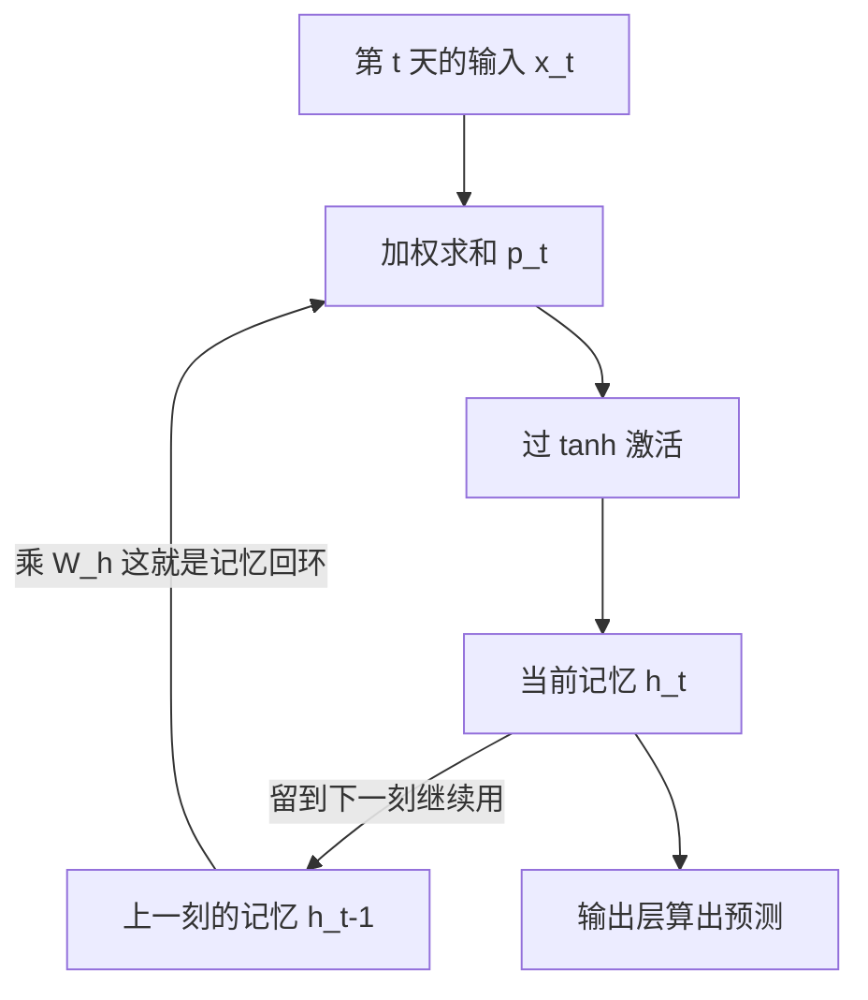
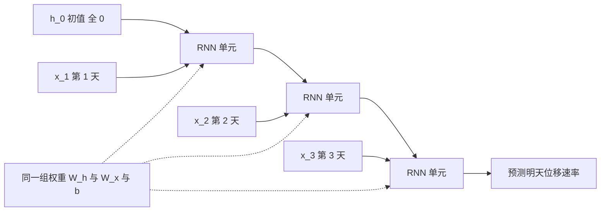

# 05. 循环神经网络：让网络"记住前文"

> [📖 模块目录](README.md) · ⬅️ [上一篇：04 卷积神经网络](04_卷积神经网络.md) · ➡️ [下一篇：06 长短时记忆网络LSTM](06_长短时记忆网络LSTM.md)

**这一篇要干什么**：前四篇的网络都有一个共同前提——**每个样本是独立的**。可边坡位移是**逐日测量**的序列，"今天"和"昨天"强相关。这一篇讲一种能"记住前文"的结构——**循环神经网络**（Recurrent Neural Network，RNN）：手算它的前向、推出它的反向传播（BPTT），再从零写一个能跑通的 RNN，最后用实验亲眼看到它的致命缺陷——**梯度消失**。

**学完你能**：说清隐状态和参数共享各自解决了什么问题；手算一个 2 步 RNN 的前向；手推 BPTT 的递推式；解释为什么"50 天前的降雨影响"RNN 学不到；不借任何框架、只用 NumPy 写出一个带梯度检查的 RNN。

> 📐 **符号看不懂时**：本篇要用矩阵乘法（[§2](数学预备知识.md#2-矩阵乘法-wx-到底在算什么)）、逐元素乘（[§3](数学预备知识.md#3-两种乘法千万别混矩阵乘--逐元素乘)）、连乘符号（[§4.2](数学预备知识.md#42-连乘符号)）、偏导数与梯度（[§6](数学预备知识.md#6-偏导数与梯度参数该往哪边调)）、链式法则（[§7](数学预备知识.md#7-链式法则与计算图接力传责任)）、tanh 及其导数（[§11.2](数学预备知识.md#112-tanh双曲正切)）、数值梯度检查（[§10](数学预备知识.md#10-数值梯度检查为什么必须自己动手做)）。用到哪一节就点哪一节。

**目录**

- [1. 这一篇解决什么问题](#1-这一篇解决什么问题)
- [2. 为什么不能把 30 天直接打平](#2-为什么不能把-30-天直接打平)
- [3. RNN 的核心思想：带记忆的循环](#3-rnn-的核心思想带记忆的循环)
- [4. 前向传播怎么算](#4-前向传播怎么算)
- [5. 手算一个 2 步 RNN 的完整前向](#5-手算一个-2-步-rnn-的完整前向)
- [6. BPTT：把误差沿时间送回去](#6-bptt把误差沿时间送回去)
- [7. 梯度消失与爆炸](#7-梯度消失与爆炸)
- [8. NumPy 从零实现](#8-numpy-从零实现)
- [9. 运行结果与解读](#9-运行结果与解读)
- [10. 局限与下一步](#10-局限与下一步)
- [11. 小结](#11-小结)
- [12. 自检问题](#12-自检问题)
- [13. 下一篇预告](#13-下一篇预告)

---

## 1. 这一篇解决什么问题

到第 4 篇为止，我们见过的模型都有一个共同的隐含前提：**每个样本是独立的，喂进去的顺序随便打乱都不影响结果**。图像就是这样——把训练集洗牌再训练，结果一模一样。

但边坡位移是**逐日测量**的。看某测点连续几天的记录：

| 日期 | 当日降雨 | 位移速率 | 备注 |
|---|---|---|---|
| 第 1 天 | 0.1 | 0.21 | 平稳 |
| 第 2 天 | 3.6 | 0.24 | 一场暴雨 |
| 第 3 天 | 0.2 | 0.68 | 雨停了，**位移却开始加速** |
| 第 4 天 | 0.0 | 0.85 | 还在加速 |
| 第 5 天 | 0.0 | 0.62 | 开始回落 |

这张表里有三件前四篇处理不了的事：**一是"今天"和"昨天"强相关**，第 4 天的速率是第 3 天的延续，把这几天的记录打乱，信息就毁了；**二是降雨和位移之间有滞后**，第 2 天下暴雨而位移第 3 天才加速——当下看不出的因果关系，要看好几天的上下文学得会；**三是序列长度可变**，有的测点有 400 天记录，有的只有 60 天，窗口长度本身要能自由调整。

想要的能力可以概括成一句话：

> **看过去 30 天的位移速率序列，预测明天的位移速率；而这个规律在第 3 天到第 4 天成立，在第 300 天到第 301 天也得同样成立。**

前四篇的模型做不到。原因不是"不够深"，而是它们的**结构里根本没有时间这个概念**。

---

## 2. 为什么不能把 30 天直接打平

最省事的想法：既然全连接层只接受固定长度的向量，那就把 30 天 × 4 个特征**排成一长条**，变成 120 维向量喂进去：

$$\underbrace{\big[\mathbf{x}_{1},\mathbf{x}_{2},\dots,\mathbf{x}_{30}\big]}_{30\ \text{天，每天 4 个数}}\ \xrightarrow{\ \text{打平}\ }\ \underbrace{\mathbf{z}\in\mathbb{R}^{120}}_{\text{一长条}}\ \xrightarrow{\ \text{全连接层}\ }\ \hat{y}$$

符号说明：$\mathbf{x}_t$ 是**第 $t$ 天**的观测向量，含 4 个数（降雨、库水位、温度、位移速率）；$30\times4=120$，打平后是 120 维向量 $\mathbf{z}$；$\hat{y}$ 是预测的明天位移速率。这个方案**能跑**，数据量够大时甚至不算太差，但有三个绕不过去的问题：

| 问题 | 具体表现 | 后果 |
|---|---|---|
| **参数太多** | 输入从 4 维变 120 维，第一层权重就有 $120\times64=7680$ 个 | 参数越多越吃数据，几百条记录根本喂不饱 |
| **规律不共享** | "第 30 天与第 29 天相邻"和"第 3 天与第 2 天相邻"是**两组独立的权重** | "暴雨后两天加速"在第 2 天学过了，到第 200 天还要从头再学 |
| **窗口写死** | 想从 30 天改成 90 天，网络结构就得整个重画 | 换窗口等于重新训练，学到的规律一点带不过去 |

第二条最要命。打个比方：**这就像教学生认字，每个字都换一位新老师**——他永远没法把"A 字学过一次就够了"用起来。第 4 篇里我们见过同一件事的另一面：全连接层处理图像时，因为"每个像素位置各有一套权重"，所以认不出"平移过的同一只猫"，卷积网络用**权值共享**（同一个卷积核在所有位置滑动）解决了它。**序列数据面临的是一模一样的困境，只是"位置"从空间换成了时间。**

用典型配置（每天 4 个特征、隐层 64 个单元、输出 1 个数）算一笔账。RNN 那一格的 4416 怎么来的，[§3.3](#33-参数共享为什么能处理任意长度的序列) 会推，先看结论：

| 窗口长度 | 打平 + 全连接 | 单层 RNN |
|---|---|---|
| 30 天 | 7809 | 4481 |
| 90 天 | 23169 | 4481 |
| 365 天 | 93569 | **4481** |

（其中打平方案是"第一层 $4L\times64$ 加 64 个偏置，再加输出层 $64+1$"；RNN 是"4416 加输出层 65"。**打平方案的参数量随窗口长度线性增长，RNN 一个都不加**——这就是"参数共享"的威力。）

---

## 3. RNN 的核心思想：带记忆的循环

### 3.1 生活类比与隐状态

读这句话："他把钥匙放在桌上，然后**它**不见了。"读到"它"时你知道指的是钥匙而不是桌子——因为你**脑子里还记着前半句**；关键在于**这个"记忆"不是固定长度的东西**，句子可以是 5 个词也可以是 500 个词，你用的还是同一套理解机制，而且记忆是**滚动更新**的（读到新词就更新一下旧记忆，不是把整句话重读一遍）。

RNN 干的就是这件事：**给它一张"便签纸"，每读一天数据就更新一下便签，需要预测时看一眼便签。** 那张便签纸在数学上叫**隐状态**（hidden state），记作 $\mathbf{h}$。为什么"隐"——因为它**没有标准答案**：数据里能看到的只有输入 $\mathbf{x}_t$ 和标签 $y$，没人告诉我们"第 3 天该记住什么"，它是网络**自己学出来的中间量**（和第 3 篇隐藏层是同一个意思）。第一天开始前便签是空的，记作 $\mathbf{h}_0=\mathbf{0}$（全 0 向量）；每天更新一次得到 $\mathbf{h}_t$，它是个 $n$ 维向量（$n$ 自己定，手算例子取 2，程序里取 8），每个分量可理解成一个"记忆槽"。

### 3.2 前向公式与每个符号的含义

这就是 RNN 的全部前向计算，只有一行：

$$\mathbf{h}_t=\tanh\big(\mathbf{W}_h\mathbf{h}_{t-1}+\mathbf{W}_x\mathbf{x}_t+\mathbf{b}\big)$$

读作：**"把上一刻的记忆和今天的输入都做一次加权求和，加起来，再过一次 tanh，就得到今天的记忆。"** 逐项拆开：

| 符号 | 是什么 | 形状 | 在边坡例子里 |
|---|---|---|---|
| $\mathbf{x}_t$ | 第 $t$ 天的输入向量 | $d$ 维 | 当天 4 个观测量 |
| $\mathbf{h}_{t-1}$ | 上一刻的记忆 | $n$ 维 | 前 $t-1$ 天攒下的"印象" |
| $\mathbf{W}_x$ | 输入到记忆的权重 | $n\times d$ | "今天的降雨该往记忆里写多少" |
| $\mathbf{W}_h$ | 记忆到记忆的权重 | $n\times n$ | "昨天的印象今天还剩多少" |
| $\mathbf{b}$ | 偏置 | $n$ 维 | 记忆的默认基准值 |
| $\mathbf{h}_t$ | 更新后的记忆 | $n$ 维 | 读完今天之后的最新印象 |
| $\tanh$ | 激活函数 | 逐元素作用 | 把数值压到 $-1$ 到 $1$ |

三个细节单独说。**第一，$\mathbf{W}_h\mathbf{h}_{t-1}$ 这一项是 RNN 的灵魂**——去掉它，公式就退化成 $\mathbf{h}_t=\tanh(\mathbf{W}_x\mathbf{x}_t+\mathbf{b})$，每天各算各的，**记忆彻底断掉，和全连接层没有区别**。所以这一项也叫**记忆回环**。

**第二，为什么用 $\tanh$ 而不是 sigmoid。** $\tanh$ 输出范围是 $-1$ 到 $1$、**以 0 为中心**，能表示"位移在加速"（正）也能表示"在减速"（负）；sigmoid 输出是 0 到 1，永远表达不了负的记忆。它的导数 $\tanh'(z)=1-\tanh^2(z)$（推导见 [§11.2](数学预备知识.md#112-tanh双曲正切)），[§7](#7-梯度消失与爆炸) 会看到这个导数有多关键。

**第三，矩阵乘法怎么看。** $\mathbf{W}_h\mathbf{h}_{t-1}$ 就是"对上一刻的记忆做一组加权求和"，和 [§2 矩阵乘法](数学预备知识.md#2-矩阵乘法-wx-到底在算什么) 完全一样。检查维度是最快的自检：$(n\times n)\cdot(n\times1)=(n\times1)$ ✓，$(n\times d)\cdot(d\times1)=(n\times1)$ ✓，和偏置相加仍得 $n$ 维 ✓。



那条从 $\mathbf{h}_t$ 绕回 $\mathbf{h}_{t-1}$ 的回环，就是"灵魂那一项"。**注意这不是"循环一次就结束"，而是永远绕下去**——只要还有下一天，记忆就继续往后传。

### 3.3 参数共享：为什么能处理任意长度的序列

看清楚上面那行公式里出现了哪些参数：只有 $\mathbf{W}_h$、$\mathbf{W}_x$、$\mathbf{b}$，**一个下标 $t$ 都没有**。这意味着：**不管现在是第 1 天还是第 300 天，用的都是同一组权重。** 这就是**参数共享**（parameter sharing），参数量因此是固定的：

$$n^2\ (\text{来自}\ \mathbf{W}_h)+nd\ (\text{来自}\ \mathbf{W}_x)+n\ (\text{来自}\ \mathbf{b})$$

代进 [§2](#2-为什么不能把-30-天直接打平) 的数字：$n=64$、$d=4$，得 $64^2+64\times4+64=4096+256+64=\mathbf{4416}$，和表里那一格对上了。参数共享一次性解决那三个问题：**参数量与序列长度无关**（只看 $n$ 和 $d$）、**规律自动共享**（"暴雨后两天加速"在第 2 天学到，第 200 天自动能用，因为共用权重）、**窗口随便换**（换成 90 天、365 天，参数量一个都不变，模型直接能用）。

一句话总结：**RNN 不是"能记住"，而是"用同一套规则反复读"**——读一天数据、更新一次记忆、再读下一天；因为规则是同一套，规律天然地在所有时间位置复用。

### 3.4 时间展开图

公式里 $\mathbf{h}_t$ 用到了 $\mathbf{h}_{t-1}$，看起来是"自己引用自己"，不好画也不好理解。标准做法是**把循环沿时间摊开**，画出 3 天的样子：



这张图叫**时间展开图**（unrolled RNN）。读图两个要点：**一是横向是时间不是层数**，它表示的是**同一个网络的多次调用**，不是三个不同的网络；**二是三个「RNN 单元」是同一个**，虚线那格强调的就是这件事——三组参数在三个位置上**完全是同一份**，算参数量时最容易在这里搞错（会算成 3 倍）。

---

## 4. 前向传播怎么算

把 [§3.2](#32-前向公式与每个符号的含义) 的公式按时间顺序执行一遍就是前向传播：便签清空（$\mathbf{h}_0=\mathbf{0}$）→ 读第 1 天得 $\mathbf{h}_1$ → 读第 2 天得 $\mathbf{h}_2$ → …… → 读到第 $T$ 天得 $\mathbf{h}_T$ → 用 $\mathbf{h}_T$ 做预测。**注意最后一步只用了 $\mathbf{h}_T$，前面的 $\mathbf{h}_1$ 到 $\mathbf{h}_{T-1}$ 都被丢掉了**——这是有意的：$\mathbf{h}_T$ 是在读完整个窗口之后算出来的，理论上已经"读过前面所有信息"了。

不过输出层怎么接，取决于任务要什么：

| 接法 | 怎么算 | 适合什么任务 | 本课程的用法 |
|---|---|---|---|
| **只看最后一步** | $\hat{y}=\mathbf{W}_y\mathbf{h}_T+b_y$ | 用一整段历史预测**一个**未来值 | 案例 1 的位移速率预测正是这种 |
| **每一步都输出** | $\hat{y}_t=\mathbf{W}_y\mathbf{h}_t+b_y$ | 每一步都要答案（逐日预报、逐字翻译） | 想一次预报未来 7 天时会用 |

其中 $\mathbf{W}_y$ 是"记忆到输出"的权重（形状是 输出维度 $\times\ n$），$b_y$ 是输出层偏置（单输出时是一个数）。**本文的程序用第一种**：输出层就是一个"记忆 $\to$ 1 个数"的线性层，和 [第 2 篇](02_线性单元和梯度下降.md) 的线性单元长得一模一样——只是输入从"原始特征"换成了"RNN 的记忆"；损失函数也照搬第 2 篇的平方误差，只是整个窗口共用一个标签：

$$E=\frac{1}{B}\cdot\frac{1}{2}\sum_{b=1}^{B}\big(t_b-\hat{y}_b\big)^2$$

$B$ 是这一批样本的个数，$t_b$ 是第 $b$ 个样本的真实值，$\hat{y}_b$ 是它的预测。

---

## 5. 手算一个 2 步 RNN 的完整前向

把纸笔拿出来。为算得动，取最小规模：输入 2 维、记忆 2 维、序列长度 2 天。下面这些权重真实训练时由梯度下降学出来，这里先人为给一组：

$$\mathbf{W}_x=\begin{bmatrix}0.8&-0.4\\0.5&0.6\end{bmatrix},\qquad
\mathbf{W}_h=\begin{bmatrix}0.5&0.2\\-0.3&0.4\end{bmatrix},\qquad
\mathbf{b}=\begin{bmatrix}0.1\\-0.1\end{bmatrix},\qquad
\mathbf{W}_y=\begin{bmatrix}1.2&-0.8\end{bmatrix},\qquad b_y=0.05$$

两天的输入是 $\mathbf{x}_1=[1.0,\ 0.0]^{\top}$（强降雨）和 $\mathbf{x}_2=[0.0,\ 0.6]^{\top}$（没下雨但位移偏快），起点 $\mathbf{h}_0=[0,\ 0]^{\top}$。

**第 1 天。** 输入那一路 $\mathbf{W}_x\mathbf{x}_1=[0.8,\ 0.5]^{\top}$；记忆那一路因为 $\mathbf{h}_0=\mathbf{0}$ 而全是 0。加上偏置：

$$\mathbf{p}_1=\begin{bmatrix}0.8\\0.5\end{bmatrix}+\begin{bmatrix}0\\0\end{bmatrix}+\begin{bmatrix}0.1\\-0.1\end{bmatrix}=\begin{bmatrix}0.9\\0.4\end{bmatrix},\qquad
\mathbf{h}_1=\tanh(\mathbf{p}_1)=\begin{bmatrix}0.71629787\\0.37994896\end{bmatrix}$$

$\mathbf{p}_1$ 叫**预激活**（还没过激活函数的值）。**第 1 天的便签写好了：第 1 个记忆槽记下 0.7163，第 2 个记下 0.3799。** 第 2 天要分开算两路：

$$\mathbf{W}_x\mathbf{x}_2=\begin{bmatrix}0.8\times0.0+(-0.4)\times0.6\\0.5\times0.0+0.6\times0.6\end{bmatrix}=\begin{bmatrix}-0.24\\0.36\end{bmatrix}$$

$$\mathbf{W}_h\mathbf{h}_1=\begin{bmatrix}0.5\times0.71629787+0.2\times0.37994896\\-0.3\times0.71629787+0.4\times0.37994896\end{bmatrix}
=\begin{bmatrix}0.35814894+0.07598979\\-0.21488936+0.15197958\end{bmatrix}
=\begin{bmatrix}0.43413873\\-0.06290978\end{bmatrix}$$

**这一行就是"记忆"在起作用**：第 2 天自己没下雨（$\mathbf{x}_2$ 第 1 个分量是 0），但 $\mathbf{W}_h\mathbf{h}_1$ 把第 1 天的印象带了过来。三部分相加再过 tanh：

$$\mathbf{p}_2=\begin{bmatrix}-0.24\\0.36\end{bmatrix}+\begin{bmatrix}0.43413873\\-0.06290978\end{bmatrix}+\begin{bmatrix}0.1\\-0.1\end{bmatrix}=\begin{bmatrix}0.29413873\\0.19709022\end{bmatrix},\qquad
\mathbf{h}_2=\tanh(\mathbf{p}_2)=\begin{bmatrix}0.28593963\\0.19457730\end{bmatrix}$$

最后算输出：

$$\hat{y}=\mathbf{W}_y\mathbf{h}_2+b_y=1.2\times0.28593963+(-0.8)\times0.19457730+0.05=0.34312756-0.15566184+0.05=\mathbf{0.23746572}$$

用代码核对全部数字：

```python
import numpy as np

Wx = np.array([[ 0.8, -0.4], [ 0.5,  0.6]])   # 输入 -> 隐状态
Wh = np.array([[ 0.5,  0.2], [-0.3,  0.4]])   # 上一刻隐状态 -> 当前隐状态
b, Wy, by = np.array([0.1, -0.1]), np.array([1.2, -0.8]), 0.05
X = np.array([[1.0, 0.0], [0.0, 0.6]])        # 第 1 天强降雨；第 2 天没雨

h = np.zeros(2)                               # h_0 全 0
for t in range(2):
    p = Wx @ X[t] + Wh @ h + b                # 前向公式里的加权求和
    print(f"第 {t+1} 天：Wx x = {np.round(Wx @ X[t], 8)}   Wh h = {np.round(Wh @ h, 8)}")
    h = np.tanh(p)
    print(f"        p = {np.round(p, 8)}   h = {np.round(h, 8)}")
print(f"\n输出 y = {float(Wy @ h + by):.8f}")

h_n = np.tanh(Wx @ X[1] + b)                  # 对照：假装网络没有记忆
print(f"若没有记忆：y = {float(Wy @ h_n + by):.8f}")
```

真实输出（和上面手算的每一行都对得上）：

```text
第 1 天：Wx x = [0.8 0.5]   Wh h = [0. 0.]
        p = [0.9 0.4]   h = [0.71629787 0.37994896]
第 2 天：Wx x = [-0.24  0.36]   Wh h = [ 0.43413873 -0.06290978]
        p = [0.29413873 0.19709022]   h = [0.28593963 0.1945773 ]

输出 y = 0.23746572
若没有记忆：y = -0.32034736
```

**最后那行对照说明了什么？** 同样的第 2 天输入，有记忆时输出 $+0.2375$，没记忆时输出 $-0.3203$——**符号都反了**：第 2 天自己的数据（没下雨、位移偏快）单独看是"该减速"的，加上第 1 天那场暴雨的印象，结论就翻成了"该加速"。**记忆不是锦上添花，它直接决定了结论的方向。**

---

## 6. BPTT：把误差沿时间送回去

### 6.1 和第 3 篇的 BP 比，多了什么

[第 3 篇](03_神经网络和反向传播算法.md) 的反向传播思路是"**从损失出发，沿计算图倒着走，每个节点把误差按比例分给上游**"。RNN 的反向传播是同一套东西，只是计算图从"一层一层"变成了"**一时刻一时刻**"，于是有了自己的名字：**BPTT**（Backpropagation Through Time，时间反向传播）。

| | 多层网络的 BP | RNN 的 BPTT |
|---|---|---|
| 计算图的方向 | 层深方向（第 3 层 → 第 2 层 → 第 1 层） | 时间方向（第 $T$ 天 → 第 $T-1$ 天 → ... → 第 1 天） |
| 图和参数的关系 | 每层有自己的 $\mathbf{W}$ | **所有时刻共用同一份 $\mathbf{W}$** |
| 参数梯度怎么来 | 各层的局部梯度分别算 | 各时刻的贡献**必须累加起来** |

最后一行是**最容易被漏掉的一点**（下一节专门讲）；链式法则本身和 [§7](数学预备知识.md#7-链式法则与计算图接力传责任) 完全一样，只是链变长了。

### 6.2 隐状态梯度的递推式

先定义反向传播的载体——**损失对每个时刻记忆的偏导数** $\partial E/\partial\mathbf{h}_t\in\mathbb{R}^{n}$。含义是：**"如果第 $t$ 天的记忆稍微变一点点，最终损失会变多少"**。关键是看清 $\mathbf{h}_t$ **影响哪些下游量**。在 [§3.4](#34-时间展开图) 的展开图上，$\mathbf{h}_t$ 出去有两条线：

```text
路径 1：h_t ──→ 输出层 ──→ 损失           （只有 t = T 时才有这条线）
路径 2：h_t ──→ h_{t+1} ──→ ... ──→ 损失   （除了最后一天，都有这条线）
```

两条路径的贡献相加（这就是链式法则，和 [§7](数学预备知识.md#7-链式法则与计算图接力传责任) 里"接力传责任"是同一件事）：

$$\frac{\partial E}{\partial \mathbf{h}_t}=\underbrace{\frac{\partial E_t}{\partial \mathbf{h}_t}}_{\text{路径 1，只有本步输出}}+\underbrace{\frac{\partial E}{\partial \mathbf{h}_{t+1}}\cdot\frac{\partial \mathbf{h}_{t+1}}{\partial \mathbf{h}_t}}_{\text{路径 2，来自下一步的误差}}$$

一句人话版本：**第 $t$ 天的记忆要认两份责任——一是它造成的本步输出误差（如果有输出的话），二是它经由第 $t+1$ 天的记忆间接造成的后续所有误差。** 第二份责任就是"**把误差沿时间往回送**"。算法上从最后一天 $t=T$ 开始（那时只有路径 1，$\partial E/\partial\mathbf{h}_T$ 直接算得出来），一天一天往回推，每步都用上一步的结果——**结构和第 3 篇"从输出层往回传"完全一样，只是"层"换成了"天"。**

### 6.3 参数梯度要沿时间累加

$\mathbf{W}_h$、$\mathbf{W}_x$、$\mathbf{b}$ 在**每一天都被用了一次**，所以"这一天该负多少责任"要**加起来**：

$$\frac{\partial E}{\partial \mathbf{W}_h}=\sum_{t=1}^{T}\boldsymbol{\delta}_t\,\mathbf{h}_{t-1}^{\top},\qquad
\boldsymbol{\delta}_t=\frac{\partial E}{\partial \mathbf{h}_t}\odot\big(\mathbf{1}-\mathbf{h}_t\odot\mathbf{h}_t\big)$$

$\odot$ 是**逐元素乘**（[§3](数学预备知识.md#3-两种乘法千万别混矩阵乘--逐元素乘)），$\mathbf{1}-\mathbf{h}_t\odot\mathbf{h}_t$ 就是 $\tanh'$ 的取值（因为 $\tanh'=1-\tanh^2$）。

**为什么求和号在这里出现？** $\mathbf{W}_h$ 出现在第 1 天的算式里、第 2 天的算式里、……第 $T$ 天的算式里，改动它的任意一个分量，从那天起往后的**所有**输出都会跟着变。所以求偏导是把它在每一天的"账"都翻出来加在一起——这就是参数共享的代价：**省了参数，但每个参数都要为所有时刻负责**；写代码时对应的是 `dWh += ...`，那个 `+=` 就是这个求和号。

### 6.4 跨 k 步的梯度是 k 次连乘

现在看最关键的一步：**误差往回过一天，要乘什么？** 从 $\mathbf{h}_t=\tanh(\mathbf{W}_h\mathbf{h}_{t-1}+\cdots)$ 出发对 $\mathbf{h}_{t-1}$ 求导，先用 $\tanh$ 的导数（得 $1-\mathbf{h}_t\odot\mathbf{h}_t$），再对里面那层线性部分求导（$\mathbf{W}_h\mathbf{h}_{t-1}$ 对 $\mathbf{h}_{t-1}$ 求导就是 $\mathbf{W}_h$），两段乘起来：

$$\frac{\partial \mathbf{h}_t}{\partial \mathbf{h}_{t-1}}=\mathrm{diag}\big(\mathbf{1}-\mathbf{h}_t\odot\mathbf{h}_t\big)\,\mathbf{W}_h$$

> ⚠️ **转置在哪一侧最容易记反**：上面这个是**雅可比**，**不带转置**；真正把误差往回送时要用 $\mathbf{W}_h^{\top}$。记忆法：**前向是 $\mathbf{W}$ 乘上去，反向是 $\mathbf{W}^{\top}$ 乘回来**（[§2.3](数学预备知识.md#23-转置是什么)）。

这个雅可比的意思是：**过一天，误差先被逐元素压一次（$\tanh'$），再被 $\mathbf{W}_h$ 混合一次。** 那么跨 $k$ 天呢？链式法则说要把每一段的倍数乘起来（[§7](数学预备知识.md#7-链式法则与计算图接力传责任)），所以：

$$\frac{\partial \mathbf{h}_{t+k}}{\partial \mathbf{h}_t}
=\prod_{j=1}^{k}\frac{\partial \mathbf{h}_{t+j}}{\partial \mathbf{h}_{t+j-1}}
=\prod_{j=1}^{k}\mathrm{diag}\big(\mathbf{1}-\mathbf{h}_{t+j}\odot\mathbf{h}_{t+j}\big)\,\mathbf{W}_h$$

$\prod_{j=1}^{k}$ 是**连乘符号**（[§4.2](数学预备知识.md#42-连乘符号)），读作"把 $j$ 从 1 连乘到 $k$"。**盯住这个式子看三秒**：它是 $k$ 个矩阵连乘，**每个矩阵里都有一个"小于等于 1 的缩放因子"和一个固定的 $\mathbf{W}_h$**。连乘 $k$ 次后会变成什么样？这就是本篇的重点高潮。

---

## 7. 梯度消失与爆炸

### 7.1 连乘的数学：范数上界

对上面那个雅可比的**范数**（把矩阵理解成一个"放大倍数"）取上界，这是本篇最重要的一行公式：

$$\left\|\frac{\partial \mathbf{h}_{t+k}}{\partial \mathbf{h}_t}\right\|\ \le\ \big(\gamma\,\sigma_{\max}\big)^{k}$$

| 符号 | 是什么 | 取值范围 | 谁决定 |
|---|---|---|---|
| 双竖线记号 | **范数**，这里指矩阵能把向量放大多少倍 | 大于等于 0 | —— |
| $\gamma$ | $\tanh$ 导数的最大值，也就是 $\max\lvert\tanh'\rvert$ | 小于等于 **1** | **激活函数锁死，学不动** |
| $\sigma_{\max}$ | $\mathbf{W}_h$ 的最大奇异值，也叫**谱范数** | 由权重决定 | 训练可以调 |
| $k$ | 往回传了多少步 | 正整数 | 任务决定 |

这个不等式把三种情况分得清清楚楚：$\gamma\sigma_{\max}<1$ 时乘一次缩一点，**连乘 $k$ 次就指数级趋近于 0**，这就是**梯度消失**；$\gamma\sigma_{\max}>1$ 时连乘 $k$ 次指数级放大，这就是**梯度爆炸**；$\gamma\sigma_{\max}=1$ 时既不放大也不缩小，梯度能稳定传下去（理想的临界状态）。

**注意 $\gamma$ 被激活函数锁死了。** 对 $\tanh$ 来说，$z=0$ 处导数才是 1，稍微大一点就掉下来：

| 输入 $z$ | $\tanh(z)$ | $\tanh'(z)=1-\tanh^2(z)$ |
|---|---|---|
| 0.0 | 0.000000 | **1.000000** |
| 1.0 | 0.761594 | 0.419974 |
| 2.0 | 0.964028 | 0.070651 |
| 3.0 | 0.995055 | 0.009866 |

**实战里绝大多数时刻 $\tanh$ 的输入都不接近 0**，所以 $\gamma$ 实际远小于 1——**就算把 $\mathbf{W}_h$ 调得让 $\sigma_{\max}=1$，梯度照样衰减**。这是 RNN 学不到长期依赖的第一层原因。

### 7.2 数值感受表

光看公式没有感觉。把 $(\gamma\sigma_{\max})^k$ 实际算出来：

```python
import numpy as np

print("若 t 时刻的梯度是 1，回传 k 步后还剩多少：")
print(f"{'衰减比例':>10s}{'5 步后':>12s}{'20 步后':>12s}{'50 步后':>14s}")
for r in [0.5, 0.9, 1.0, 1.1]:
    print(f"{r:>10.1f}{r**5:>12.4e}{r**20:>12.4e}{r**50:>14.4e}")
print("\n若把比例调大（这是 RNN 做不到的事）：")
print(f"  0.95 时 50 步后剩 {0.95**50*100:5.2f}%   0.99 时 50 步后剩 {0.99**50*100:5.2f}%")
```

真实输出：

```text
若 t 时刻的梯度是 1，回传 k 步后还剩多少：
      衰减比例        5 步后       20 步后         50 步后
       0.5  3.1250e-02  9.5367e-07    8.8818e-16
       0.9  5.9049e-01  1.2158e-01    5.1538e-03
       1.0  1.0000e+00  1.0000e+00    1.0000e+00
       1.1  1.6105e+00  6.7275e+00    1.1739e+02

若把比例调大（这是 RNN 做不到的事）：
  0.95 时 50 步后剩  7.69%   0.99 时 50 步后剩 60.50%
```

**最值得盯住的是 0.9 那一行。** 0.9 看起来"离 1 很近"，5 步后还有 59%，感觉没问题；但 20 步后只剩 12%，**50 步后只剩 0.5%**（$5.15\times10^{-3}$）——也就是 [§4.2 连乘符号](数学预备知识.md#42-连乘符号) 里那个 $0.9^{50}\approx0.0052$。而 0.99 看起来"几乎就是 1"，50 步后也只剩 60%。**要让 50 步后的梯度还能用，衰减比例得做到 0.99 以上——而 $\gamma$ 被 $\tanh$ 锁在远小于 1 的地方，单靠调 $\mathbf{W}_h$ 根本做不到。** 这就是 RNN 的绝症。（另外，**爆炸那一侧更危险**：$\gamma\sigma_{\max}=1.1$ 时 50 步后是 117 倍。这还只是 50 步，序列长到 200 步就是 $1.1^{200}\approx1.9\times10^{8}$——**一次参数更新就把权重推到极远处，损失直接变成 `nan`**。）

### 7.3 为什么 50 天前的降雨影响学不到

把上面的数学翻译成岩土工程的语言。回到 [§1](#1-这一篇解决什么问题) 那个观察：第 2 天下暴雨，第 3 天位移才开始加速。现在把时间尺度拉长到工程实际——**渗流引起的边坡变形，滞后往往是几十天量级**：雨水入渗、孔隙水压力上升、有效应力下降、变形发展，这条链条本身就要走很久。假设某测点的真实规律是"**第 5 天那场强降雨，是第 50 天位移加速的主因**"，那么训练时模型必须把"第 50 天的预测错了多少"沿时间一路送回第 5 天。按 [§7.2](#72-数值感受表) 的算法，这个信息在回送路上要乘 **45 次** $\gamma\sigma_{\max}$；取一个对 RNN 相当友好的比例 0.9，45 步后只剩 $0.9^{45}=0.00873$——**不到 1%**（实战中的比例通常远小于 0.9）。**结果是：第 5 天那一格输入的参数梯度几乎为 0，梯度下降收不到任何"该调它"的信号，它就一动不动。** 从外部看，现象就是——**模型能学会"今天降雨今天加速"（短滞后，衰减没几步），永远学不会"上个月的降雨这个月加速"（长滞后，梯度走到半路就没了）。**

这不是"训练轮数不够"或"学习率没调好"——**把训练跑到 1 万轮，那个梯度还是 0.9% 上下（0.87%），什么都不会变。** [§9.4](#94-梯度沿时间的实测衰减) 会把这个"传不回去"实测出来，数值比这个估算还夸张得多。

### 7.4 梯度沿时间回传的示意


从右往左每一步都是一次"乘 $\mathbf{W}_h^{\top}$ 再乘 $\tanh'$"。**注意最左边那个 $\delta_5$**：第 5 天正是脉冲出现的位置、真正该被调整的地方，可梯度传到那里已经化为乌有——**它成了整个序列里"最学不动"的一天。**

### 7.5 缓解手段概览

看到病根，就能看清各种"药方"分别治什么：

| 手段 | 治的是 | 原理 | 能不能根治 |
|---|---|---|---|
| **梯度裁剪** | 梯度**爆炸** | 梯度范数超过阈值就整体缩小，方向不变 | 能治爆炸，**治不了消失** |
| **换激活函数**（如 ReLU） | 消失的"激活"那一份 | ReLU 在正区间导数恒为 1，没有 $\tanh'\le1$ 的压制 | 只解决 $\gamma$，$\mathbf{W}_h$ 连乘那份还在 |
| **好的初始化** | 起步就衰减 | 让 $\mathbf{W}_h$ 初始接近正交（奇异值都接近 1） | 延缓，不能保证练到最后还正交 |
| **换结构：LSTM / GRU** | **消失本身** | 状态更新变成"**加法 + 逐元素乘**"，绕开权重矩阵连乘 | **根本解法**（[§10](#10-局限与下一步)） |

**梯度裁剪**的做法是算完梯度后先看它的全局范数 $\lVert\mathbf{g}\rVert$，超过阈值 $\tau$ 就等比例缩回来：

$$\mathbf{g}\leftarrow\mathbf{g}\cdot\min\Big(1,\ \frac{\tau}{\lVert\mathbf{g}\rVert}\Big)$$

**为什么是缩放而不是截断**：缩放后梯度**方向完全不变**，只是步长变小，仍然在往正确方向走；逐分量截断会改变方向，是错的。**为什么换激活函数不够**：$\tanh'\le1$ 只是衰减的两个来源之一，另一个是 $\mathbf{W}_h$ 被连乘 $k$ 次——**把 $\gamma$ 解决掉，$(\sigma_{\max})^k$ 那一项照样指数衰减**。**真正的出路是改结构**：不再让旧记忆"乘一个权重矩阵"，而是让它"**乘以一个 0 到 1 之间的开关、再加上一点新东西**"；改成逐元素缩放后就没有矩阵连乘了，衰减率也就变成了**可以学的**。

---

## 8. NumPy 从零实现

下面这**一整段**是一个完整脚本（只依赖 NumPy 和 Matplotlib），依次做四件事：定义 RNN 类、做梯度检查、在两个序列任务上训练、画出结果。任务设计用岩土工程的场景讲：**某测点发生了一次强降雨事件（一个 $\pm1$ 的脉冲），我们要预测这次事件对随后位移的影响量。** 唯一的自变量是"这次事件发生在多少天以前"，记作 `lag`。序列长度固定 50 天，事件出现在第 $50-\text{lag}$ 天：`lag = 0` 表示事件就在最后一天，**不需要记忆**（短依赖）；`lag = 45` 表示事件在第 5 天，**要记 45 步**（长依赖）。

```python
import numpy as np
import matplotlib.pyplot as plt

# 让图里能显示中文（Windows 上可改成 'Microsoft YaHei' 或 'SimHei'）
plt.rcParams['font.sans-serif'] = ['Heiti TC', 'PingFang SC', 'Arial Unicode MS', 'DejaVu Sans']
plt.rcParams['axes.unicode_minus'] = False


class RNN:
    """最小循环神经网络：一层隐状态 + 线性输出，BPTT + 梯度下降。"""

    def __init__(self, n_in, n_hidden, eta=0.2, seed=0):
        rng = np.random.default_rng(seed)
        self.n_hidden = n_hidden
        self.Wx = rng.normal(0, 1 / np.sqrt(n_in), (n_hidden, n_in))
        self.Wh = rng.normal(0, 1 / np.sqrt(n_hidden), (n_hidden, n_hidden))
        self.b = np.zeros(n_hidden)
        self.Wy = rng.normal(0, 1 / np.sqrt(n_hidden), n_hidden)
        self.by = np.zeros(1)            # 输出偏置，写成 1 元素数组方便梯度检查
        self.eta = eta
        self.loss_history = []           # 每轮损失，用来画曲线

    def forward(self, X):
        """X 形状 B,T,d：B 个样本、每个 T 天、每天 d 个特征"""
        B, T, _ = X.shape
        H = np.zeros((B, T + 1, self.n_hidden))          # H 的第 0 列就是 h_0 = 0
        for t in range(T):                               # 逐时刻滚动更新
            H[:, t + 1] = np.tanh(X[:, t] @ self.Wx.T + H[:, t] @ self.Wh.T + self.b)
        return H[:, T] @ self.Wy + self.by[0], H         # 只取最后时刻的记忆

    def loss(self, X, t):
        return 0.5 * np.mean((self.forward(X)[0] - t) ** 2)

    def loss_and_grads(self, X, t):
        """前向 + BPTT，返回损失和 5 组梯度"""
        B, T, _ = X.shape
        y, H = self.forward(X)
        err = y - t
        loss = 0.5 * np.mean(err ** 2)
        e = err / B                              # dL/dy，除以 B 来自"求平均"
        grads = {'Wy': H[:, T].T @ e, 'by': np.array([e.sum()])}
        dWx, dWh, db = np.zeros_like(self.Wx), np.zeros_like(self.Wh), np.zeros_like(self.b)
        delta = e[:, None] * self.Wy[None, :]      # 反向的起点：dL/dh_T
        for tt in range(T - 1, -1, -1):            # 沿时间倒着走
            dp = delta * (1 - H[:, tt + 1] ** 2)   # 先过 tanh 的导数：1 - h^2
            dWh, dWx, db = dWh + dp.T @ H[:, tt], dWx + dp.T @ X[:, tt], db + dp.sum(axis=0)
            delta = dp @ self.Wh                   # 把误差往 t-1 送
        grads['Wx'], grads['Wh'], grads['b'] = dWx, dWh, db
        return loss, grads

    def fit(self, X, t, epochs=600):
        for _ in range(epochs):
            loss, g = self.loss_and_grads(X, t)
            for name in ['Wx', 'Wh', 'b', 'Wy', 'by']:
                setattr(self, name, getattr(self, name) - self.eta * g[name])
            self.loss_history.append(loss)
        return self

# ===================== 一、梯度检查：解析梯度 vs 数值梯度 =====================
rng = np.random.default_rng(7)
X = rng.normal(0, 1, (4, 5, 2))        # 4 个样本，每个 5 天，每天 2 个特征
t = rng.normal(0, 1, 4)
m = RNN(n_in=2, n_hidden=3, seed=3)
loss0, g = m.loss_and_grads(X, t)
print(f"当前损失 = {loss0:.10f}\n")
print(f"{'参数':>4s}{'形状':>10s}{'元素数':>8s}{'最大绝对偏差':>16s}{'最大相对偏差':>16s}")

eps, worst = 1e-6, 0.0
for name in ['Wx', 'Wh', 'b', 'Wy', 'by']:
    W, gW = getattr(m, name), g[name].ravel()
    flat = W.ravel()                   # ravel 返回的是视图，改它就是改参数本身
    ma = mr = 0.0
    for i in range(flat.size):
        o = flat[i]
        flat[i] = o + eps; lp = m.loss(X, t)     # 参数加大一点点
        flat[i] = o - eps; lm = m.loss(X, t)     # 参数减小一点点
        flat[i] = o                              # 马上改回去
        num, ana = (lp - lm) / (2 * eps), gW[i]  # 数值梯度 vs 解析梯度
        ma = max(ma, abs(num - ana))
        mr = max(mr, abs(num - ana) / max(1e-8, abs(num) + abs(ana)))
    worst = max(worst, ma)
    print(f"{name:>4s}{str(W.shape):>10s}{flat.size:>8d}{ma:>16.3e}{mr:>16.3e}")
print(f"\n全部参数的最大绝对偏差 = {worst:.3e}，属于浮点误差量级 → BPTT 的公式推对了")


# ===================== 二、序列任务：短依赖 vs 长依赖 =====================
def make_task(n_samples, T, lag, seed, noise=0.1):
    """第 t* = T-1-lag 天有一个 ±1 的脉冲，其余天只有噪声；要预测的就是脉冲值"""
    rng = np.random.default_rng(seed)
    X = np.zeros((n_samples, T, 2))                    # 通道 0 放脉冲，通道 1 全是噪声
    X[:, :, 1] = rng.normal(0, noise, (n_samples, T))
    pulse = rng.choice([-1.0, 1.0], size=n_samples)    # 每次事件要么 +1 要么 -1
    X[:, T - 1 - lag, 0] = pulse
    return X, pulse


def r2(pred, true):
    return 1 - np.sum((true - pred) ** 2) / np.sum((true - true.mean()) ** 2)


T, EPOCHS = 50, 600
XA_tr, tA_tr = make_task(256, T, 0, seed=1)      # 任务 A：脉冲就在最后一天
XA_te, tA_te = make_task(128, T, 0, seed=2)
XB_tr, tB_tr = make_task(256, T, 45, seed=1)     # 任务 B：脉冲在第 5 天，要记 45 步
XB_te, tB_te = make_task(128, T, 45, seed=2)
mA = RNN(n_in=2, n_hidden=8, eta=0.2, seed=0).fit(XA_tr, tA_tr, epochs=EPOCHS)
mB = RNN(n_in=2, n_hidden=8, eta=0.2, seed=0).fit(XB_tr, tB_tr, epochs=EPOCHS)

print("\n两个任务的损失（结构、数据量、迭代次数、随机种子完全相同）")
print(f"{'轮数':>6s}{'任务A 短依赖 lag=0':>22s}{'任务B 长依赖 lag=45':>22s}")
for ep in [0, 5, 20, 50, 100, 200, 400, EPOCHS - 1]:
    print(f"{ep:>6d}{mA.loss_history[ep]:>22.6f}{mB.loss_history[ep]:>22.6f}")
for tag, m, tr, te in [('A lag=0 ', mA, (XA_tr, tA_tr), (XA_te, tA_te)),
                       ('B lag=45', mB, (XB_tr, tB_tr), (XB_te, tB_te))]:
    print(f"任务{tag}  训练 R2 = {r2(m.forward(tr[0])[0], tr[1]):.4f}"
          f"   测试 R2 = {r2(m.forward(te[0])[0], te[1]):.4f}")

# ---------- 滞后天数扫描 ----------
print("\n滞后天数 lag 扫描：只有 lag 在变，其余全部相同")
print(f"{'lag':>5s}{'需要记忆的步数':>16s}{'训练损失':>12s}{'训练 R2':>10s}{'测试 R2':>10s}")
lags, r2_test = [0, 5, 10, 20, 45], []
for lag in lags:
    tr, te = make_task(256, T, lag, seed=1), make_task(128, T, lag, seed=2)
    m = RNN(n_in=2, n_hidden=8, eta=0.2, seed=0).fit(tr[0], tr[1], epochs=EPOCHS)
    r2_test.append(r2(m.forward(te[0])[0], te[1]))
    print(f"{lag:>5d}{lag:>16d}{m.loss_history[-1]:>12.6f}"
          f"{r2(m.forward(tr[0])[0], tr[1]):>10.4f}{r2_test[-1]:>10.4f}")

# ---------- 梯度沿时间回传的实测衰减 ----------
X, tt_ = make_task(128, T, 45, seed=2)
y, H = mB.forward(X)
delta = ((y - tt_) / X.shape[0])[:, None] * mB.Wy[None, :]
norms = np.zeros(T + 1)
norms[T] = np.linalg.norm(delta, axis=1).mean()
for s in range(T - 1, -1, -1):                 # 只回传，不更新参数
    delta = (delta * (1 - H[:, s + 1] ** 2)) @ mB.Wh
    norms[s] = np.linalg.norm(delta, axis=1).mean()
print("\n把 dL/dh_t 的范数沿时间打出来")
print(f"{'时刻 t':>8s}{'dL/dh_t 的平均范数':>24s}{'占 t=50 的比例':>18s}")
for s in [50, 45, 40, 30, 20, 10, 5, 1]:
    print(f"{s:>8d}{norms[s]:>24.3e}{norms[s]/norms[50]:>18.3e}")
print(f"第 5 天（脉冲真正出现的位置）的梯度只剩 t=50 处的 {norms[5]/norms[50]:.2e}")

# ---------- 画图 ----------
fig, axes = plt.subplots(1, 2, figsize=(11.5, 4.2))
axes[0].plot(mA.loss_history, label='任务A lag=0 短依赖')
axes[0].plot(mB.loss_history, label='任务B lag=45 长依赖')
axes[0].set_yscale('log'); axes[0].axhline(0.5, ls=':', c='gray', lw=1)
axes[0].set_xlabel('迭代轮数'); axes[0].set_ylabel('损失（对数刻度）'); axes[0].grid(alpha=0.3)
axes[0].set_title('短依赖掉下去，长依赖卡住'); axes[0].legend(fontsize=9)
axes[1].bar([str(l) for l in lags], r2_test, color='tab:blue', alpha=0.8)
axes[1].axhline(0, c='k', lw=0.8); axes[1].set_xlabel('滞后天数 lag')
axes[1].set_ylabel('测试集 R2'); axes[1].set_title('能回忆的步数越多，性能越差')
axes[1].grid(alpha=0.3, axis='y')
plt.tight_layout(); plt.show()
```

**代码和公式的对应关系**：`H[:, t+1] = np.tanh(...)` 就是 [§3.2](#32-前向公式与每个符号的含义) 那一行前向公式；`delta = dp @ self.Wh` 就是 [§6.4](#64-跨-k-步的梯度是-k-次连乘) 的"沿时间回传一步"；`dWh + dp.T @ H[:, tt]` 里的加号就是 [§6.3](#63-参数梯度要沿时间累加) 的求和号。**BPTT 是本文最容易写错的一段代码**——"求和不求和""用不用转置""tanh 导数乘在哪一步"任何一处写错，代码**照样能跑、损失照样在降**，只是降得更慢，光看损失根本发现不了。

---

## 9. 运行结果与解读

### 9.1 梯度检查通过

**示例运行结果**（偏差末位随 NumPy/平台略有出入，量级不变）：

```text
当前损失 = 0.2021578101

  参数        形状     元素数          最大绝对偏差          最大相对偏差
  Wx    (3, 2)       6       2.918e-11       1.504e-09
  Wh    (3, 3)       9       4.748e-11       1.105e-09
   b      (3,)       3       1.458e-11       1.628e-09
  Wy      (3,)       3       2.398e-11       6.962e-11
  by      (1,)       1       9.363e-12       7.397e-11

全部参数的最大绝对偏差 = 4.748e-11，属于浮点误差量级 → BPTT 的公式推对了
```

数值梯度是"把参数扰动一点点、看损失变了多少"试出来的，解析梯度是 BPTT 推出来的（原理见 [§10 数值梯度检查](数学预备知识.md#10-数值梯度检查为什么必须自己动手做)）。偏差 $10^{-11}$ 量级纯粹是浮点误差。**对照一下"写错会怎样"**：把 `Wh` 的解析梯度故意乘 0.5，同一段检查代码给出的最大绝对偏差是 $2.33\times10^{-2}$，大了 **9 个数量级**——一眼就能看出问题，这就是梯度检查的价值。

> ⚠️ 一个容易踩的坑：`flat = W.ravel()` 拿到的是视图，改 `flat` 就是改 `W`；写成 `flat = np.array(W).ravel()` 就是拷贝，改它不影响 `W`，数值梯度会**全是 0**，从而误判成"解析梯度全错"。

### 9.2 损失曲线：短依赖掉下去，长依赖卡住

```text
两个任务的损失（结构、数据量、迭代次数、随机种子完全相同）
    轮数         任务A 短依赖 lag=0        任务B 长依赖 lag=45
     0              1.197181              1.033981
     5              0.030949              0.169712
    20              0.000544              0.500143
    50              0.000490              0.499168
   100              0.000416              0.499157
   200              0.000307              0.499131
   400              0.000180              0.499056
   599              0.000113              0.498912
任务A lag=0   训练 R2 = 0.9998   测试 R2 = 0.9997
任务B lag=45  训练 R2 = 0.0007   测试 R2 = -0.0451
```

**这是本篇最有说服力的一段证据，请逐行读。** 任务 A（短依赖）损失从 1.20 一路掉到 0.000113，训练 R² 0.9998、测试 R² 0.9997——它**真的学会了**：看一眼最后一天的输入，把那个 $\pm1$ 原样报出来。测试集和训练集表现几乎一样，说明学到的是**真规律**，不是死记硬背。

任务 B（长依赖）损失从 1.03 出发，**第 5 轮曾经下探到 0.170**（一度以为要成了），然后掉头往上返，最终停在 **0.498912**。**0.5 这个数字非常有讲究**——它恰好是"**什么都不学、永远输出 0**"的损失：

$$E=\frac{1}{2}\mathbb{E}\big[(0-t)^2\big]=\frac{1}{2}\times1=0.5$$

因为 $t$ 是 $\pm1$，平方的期望是 1（[§13 期望与方差](数学预备知识.md#13-期望与方差直觉版)）。也就是说——**模型最后认定"这个任务无解"，干脆输出一个常数 0，一分力气都不出。** 实测也证实了：这个模型在测试集上的输出标准差只有 0.0037（真实脉冲的标准差是 0.9851），基本就是一个常量。

**那第 5 轮那个 0.170 是怎么回事？** 那是**初期参数还小、碰巧撞上了一个部分拟合的解**，随后的梯度把它推回了 0.5 附近——因为通往"真正解"的那条路上梯度基本上是 0，只有把输出压成常量的方向有梯度可走。**这正是梯度消失的样子：模型不是慢慢学不会，而是被推向一个"放弃"的解，然后卡死在那里。**

### 9.3 短依赖与长依赖的差别

把 `lag` 这个唯一变量扫一遍，结果是一个断崖：

```text
滞后天数 lag 扫描：只有 lag 在变，其余全部相同
  lag         需要记忆的步数        训练损失     训练 R2     测试 R2
    0               0    0.000113    0.9998    0.9997
    5               5    0.000023    1.0000    1.0000
   10              10    0.465236    0.2870    0.1728
   20              20    0.494434    0.0096   -0.0358
   45              45    0.498912    0.0007   -0.0451
```

**要读出三件事**：**一是 lag 从 0 到 5 全部满分**（测试 R² 都接近 1）——记忆 5 步完全没问题，按 [§7.2](#72-数值感受表) 的表，衰减比例 0.9 时 5 步后还剩 59%，梯度够用。**二是 lag 一到 10 就塌了**（测试 R² 从 1.0000 掉到 0.1728）——**注意这个断崖的位置**，只有 10 步，工程上算很短的依赖了。**三是 lag 20 以后 R² 在 0 附近甚至为负**——负 R² 的字面含义是"预测比直接用平均值还差"，但结合 [§9.2](#92-损失曲线短依赖掉下去长依赖卡住) 的分析，其实它输出了一个常数，负值只是测试集上的随机波动。**一条工程提醒**：这里的 5 步、10 步都是**缩微模型**（隐层 8 个单元、序列 50 步）；真实边坡的滞后动不动几十天，**RNN 在真实问题上的表现只会更糟**，所以本项目的案例 1 直接上 LSTM。

### 9.4 梯度沿时间的实测衰减

最后把 [§7.4](#74-梯度沿时间回传的示意) 那张示意图的**真实数字**打出来。做法是拿训练好的 `lag=45` 模型只做一次反向传播、不更新参数，把每个时刻 $\partial E/\partial\mathbf{h}_t$ 的范数记下来：

```text
把 dL/dh_t 的范数沿时间打出来
    时刻 t           dL/dh_t 的平均范数        占 t=50 的比例
      50               5.758e-03         1.000e+00
      45               2.739e-10         4.756e-08
      40               1.145e-17         1.989e-15
      30               8.441e-33         1.466e-30
      20               5.980e-48         1.039e-45
      10               4.132e-63         7.176e-61
       5               2.336e-69         4.056e-67
       1               8.200e-69         1.424e-66
第 5 天（脉冲真正出现的位置）的梯度只剩 t=50 处的 4.06e-67
```

**这是本篇最震撼的一串数字，值得停下来看**：往回走 **5 步**（t 从 50 到 45），梯度就只剩 **$4.8\times10^{-8}$**——一亿分之四；往回走 **10 步**（到 t=40），只剩 $2.0\times10^{-15}$——**已经低于双精度浮点数的分辨极限**；走到脉冲真正出现的 **t=5**，梯度是 $4.06\times10^{-67}$。**做个换算**：氢原子质量与太阳质量之比约 $10^{-57}$，而 $4\times10^{-67}$ 比这个还小 10 个数量级——**这个梯度在数值上就是彻底的 0。**

**这就是 [§7.3](#73-为什么-50-天前的降雨影响学不到) 那个估算的实测版**：那里按 0.9 的比例估出"45 步后只剩 0.9%"，已经够绝望了；实测结果是 $4\times10^{-67}$——**真实衰减比最悲观的估算还猛得多**，因为回传路上每一步的实际衰减比例远小于 0.9（[§7.1](#71-连乘的数学范数上界) 说过，$\gamma$ 通常远小于 1）。**结论**：RNN 不是"不容易学长期依赖"，而是**在数值上根本不可能学**。要解决它，必须改掉"跨时间步连乘权重矩阵"这件事本身。

---

## 10. 局限与下一步

把 [§7.5](#75-缓解手段概览) 收拢一下。RNN 的长期依赖问题，根源在 [§6.4](#64-跨-k-步的梯度是-k-次连乘) 那个 $k$ 次连乘的雅可比

$$\frac{\partial \mathbf{h}_{t+k}}{\partial \mathbf{h}_t}=\prod_{j=1}^{k}\mathrm{diag}\big(\mathbf{1}-\mathbf{h}_{t+j}\odot\mathbf{h}_{t+j}\big)\,\mathbf{W}_h$$

问题出在两处，而且**两处都无法通过调参解决**：$\tanh'$ 那一项（逐元素缩放）的最大值是 1，且**只在输入为 0 时取到**，实战中大部分时刻远小于 1，**由激活函数定死、训练调不动**；$\mathbf{W}_h$ 被连乘 $k$ 次这一项，就算初始化成正交矩阵，训练中也会被梯度推走，**没有机制强迫它保持"不放大不缩小"**。所以梯度裁剪、换激活函数、好的初始化都只能**延缓**，不能根治。

**出路只有一个：让"记忆"的通路不经过权重矩阵连乘。** 具体做法是把状态更新从

$$\mathbf{h}_t=\tanh\big(\mathbf{W}_h\,\mathbf{h}_{t-1}+\cdots\big)\qquad\text{旧记忆先乘一个权重矩阵}$$

改成

$$\mathbf{c}_t=\mathbf{f}_t\odot\mathbf{c}_{t-1}+\mathbf{i}_t\odot\tilde{\mathbf{c}}_t\qquad\text{旧记忆只逐元素乘一个开关，再加一点新内容}$$

其中 $\mathbf{f}_t$ 是一个 0 到 1 之间的**门**，而且**它自己是学出来的**。这样一来，跨时间步的雅可比不再含 $\mathbf{W}_h$，只剩 $\mathrm{diag}(\mathbf{f}_t)$ —— **衰减率从"被激活函数锁死的常数"变成了"可以学习的参数"**。想要长期记忆的维度，网络会把对应的 $f$ 学到接近 1。

这就是 **LSTM**（长短时记忆网络）。下一篇 [06. 长短时记忆网络LSTM](06_长短时记忆网络LSTM.md) 从本篇的 BPTT 出发，把门控的公式、前向与反向完整推一遍，并给出梯度流的数学分析。读懂之后可以直接进入 [案例1 · LSTM 原理详解](../LSTM/LSTM_算法原理.md)——**它的 §2（从 RNN 说起）和 §3（梯度消失与爆炸）就是本篇同一内容的"深入版"**：本篇讲了直觉、手算和实证，那里给出严格的雅可比推导、规范化的范数界 $\lVert\partial\mathbf{h}_{t+k}/\partial\mathbf{h}_t\rVert\le(\gamma\sigma_{\max})^k$、梯度裁剪公式与真实位移数据上的落地方案。

---

## 11. 小结

**前向（只有这一行，但要在所有时刻重复执行）**

$$\mathbf{h}_t=\tanh\big(\mathbf{W}_h\mathbf{h}_{t-1}+\mathbf{W}_x\mathbf{x}_t+\mathbf{b}\big),\qquad \hat{y}=\mathbf{W}_y\mathbf{h}_T+b_y$$

**反向（BPTT）**

$$\frac{\partial E}{\partial \mathbf{h}_t}=\frac{\partial E_t}{\partial \mathbf{h}_t}+\frac{\partial E}{\partial \mathbf{h}_{t+1}}\frac{\partial \mathbf{h}_{t+1}}{\partial \mathbf{h}_t},\qquad
\frac{\partial \mathbf{h}_t}{\partial \mathbf{h}_{t-1}}=\mathrm{diag}\big(\mathbf{1}-\mathbf{h}_t\odot\mathbf{h}_t\big)\mathbf{W}_h$$

**六个要点**

1. **序列数据有三个特殊要求**：样本不独立、长度可变、同一规律在所有时间位置复现。把 30 天打平成 120 维喂给全连接，会付出"参数多、不共享、窗口写死"三重代价。
2. **RNN 的两个核心设计**：**隐状态** $\mathbf{h}_t$（记忆便签，滚动更新）和**参数共享**（同一组 $\mathbf{W}_h,\mathbf{W}_x,\mathbf{b}$ 在所有时刻复用）。后者让参数量与序列长度**无关**——30 天、90 天、365 天都是 4416 个。
3. **前向按时间顺序执行**，把 $\mathbf{h}_0$ 设成全 0，一天一天更新；输出层可以只接最后一步 $\mathbf{h}_T$，也可以每一步都接。
4. **BPTT 就是 BP 加上时间维**：链式法则一模一样，区别只有"每个参数被用了 $T$ 次，所以梯度要沿时间**累加** $T$ 次"。
5. **梯度消失是 RNN 的绝症**：跨 $k$ 步的梯度是 $k$ 个雅可比连乘，范数上界是 $(\gamma\sigma_{\max})^k$。$\gamma$ 被 $\tanh$ 锁在 1 以下，衰减是结构性的，**调参救不回来**。实测：往回 45 步梯度只剩 $4\times10^{-67}$。
6. **出路是换结构**：把记忆更新从"乘权重矩阵"改成"逐元素乘门再加新内容"，衰减率就从"死数"变成"可学的量"。这是下一篇 LSTM 的全部动机。

---

## 12. 自检问题

先自己写答案，再点开看。第 3、5、7 题要动笔算或跑代码。

**1.** RNN 的隐状态 $\mathbf{h}_t$ 是什么？它和普通全连接网络的隐藏层有什么区别？

**2.** 为什么说"参数共享"是 RNN 能用少量参数处理任意长度序列的原因？参数量怎么算？

**3.** 用 [§5](#5-手算一个-2-步-rnn-的完整前向) 的公式和权重，算第 2 天的 $\mathbf{p}_2$。如果把 $\mathbf{W}_h$ 整块改成 0（相当于没有记忆），$\mathbf{h}_2$ 和 $\hat{y}$ 分别变成多少？和原文的 $0.23746572$ 差多远？

**4.** 反向传播要沿时间往回送误差。为什么"每一天的参数梯度要累加"，而不是像多层网络那样一层一份？

**5.** 写出跨 $k$ 步梯度的范数上界公式，逐个符号解释。为什么这个上界意味着"调参救不了 RNN"？

**6.** 损失停在 0.498912 这个数，为什么能断定模型"什么都没学到"？这个 0.5 是怎么来的？

**7.** 把 [§8](#8-numpy-从零实现) 的任务里 `lag=45` 改成 `lag=3`，跑一遍。损失能降下去吗？为什么？

**8.** 缓解梯度问题的几种手段里，为什么只有"换结构"算根治？梯度裁剪具体解决的是哪一侧的问题？

<details>
<summary>点击查看答案</summary>

**第 1 题**：隐状态 $\mathbf{h}_t$ 是 RNN 内部的**记忆便签**，一个 $n$ 维向量，按 $\mathbf{h}_t=\tanh(\mathbf{W}_h\mathbf{h}_{t-1}+\mathbf{W}_x\mathbf{x}_t+\mathbf{b})$ **逐时刻滚动更新**。和普通隐藏层有两个区别：**一是普通的隐藏层没有"上一刻"**，它的输出只依赖当前输入，同样输入永远给同样输出，洗牌训练结果不变；**二是隐藏层的数量决定"深度"，隐状态的更新次数决定"记忆跨度"**——前者由人设计，后者由序列长度决定，同一网络读 30 天和读 365 天用的是同一个 $\mathbf{h}$ 变量、同一套权重。相同之处是：两者都是**没有标准答案的中间量**，都由网络自己学出来。

**第 2 题**：**原因**是前向公式里**一个代表时刻的下标都没有**——$\mathbf{W}_h$、$\mathbf{W}_x$、$\mathbf{b}$ 在第 1 天和第 300 天用的是**同一份数组**。序列变长只意味着循环多跑几轮，**参数表一个格子都不用加**，也不用重新设计结构（"窗口写死"就是这样被解决的）。**参数量** $=n^2+nd+n=64^2+64\times4+64=4416$。对比窗口 30 天的打平方案（第一层 7744）少了 43%；窗口拉到 365 天，打平方案要 93569，RNN 还是 4416。⚠️ 常见算错方式：把展开图上的三个「RNN 单元」当成三个网络、把参数乘 3——它们其实共用同一份参数。

**第 3 题**：第 2 天输入 $\mathbf{x}_2=[0,\ 0.6]^{\top}$，$\mathbf{h}_1=[0.71629787,\ 0.37994896]^{\top}$，于是

$$\mathbf{W}_x\mathbf{x}_2=\begin{bmatrix}-0.24\\0.36\end{bmatrix},\qquad
\mathbf{W}_h\mathbf{h}_1=\begin{bmatrix}0.43413873\\-0.06290978\end{bmatrix},\qquad
\mathbf{p}_2=\begin{bmatrix}0.29413873\\0.19709022\end{bmatrix}$$

**把 $\mathbf{W}_h$ 整块改成 0**，记忆那一路就没了，$\mathbf{p}_2=[-0.14,\ 0.26]^{\top}$，$\mathbf{h}_2=[-0.13909245,\ 0.25429553]^{\top}$，于是

$$\hat{y}=1.2\times(-0.13909245)+(-0.8)\times0.25429553+0.05=-0.16691-0.20344+0.05=\mathbf{-0.32034736}$$

**差了 0.558，而且符号完全相反**（有记忆 $+0.2375$，没记忆 $-0.3203$）。原因：第 2 天自己的数据（没下雨）单独看是"该减速"的，加上第 1 天暴雨的印象后结论翻成"该加速"。**这就是记忆的价值——它不是微调，它可能直接决定结论的方向。**

**第 4 题**：因为**同一组参数被用了 $T$ 次**。多层网络里，第 2 层的权重 $\mathbf{W}_2$ 只在"第 1 层到第 2 层"这一个位置出现一次，对损失的影响只有一条路径，算一次就够；RNN 里 $\mathbf{W}_h$ 出现在第 1 天、第 2 天、……第 $T$ 天的算式里，**改动它任意一个分量，从那天起往后的所有输出都会跟着变**。按链式法则总共要负 $T$ 份责任：

$$\frac{\partial E}{\partial \mathbf{W}_h}=\sum_{t=1}^{T}\boldsymbol{\delta}_t\,\mathbf{h}_{t-1}^{\top}$$

一句话记：**参数共享省了参数，但每个参数必须为所有时刻负责。** 代码里必须写 `dWh += ...`（而不是 `dWh = ...`），那个 `+=` 就是这个求和号。

**第 5 题**：

$$\left\|\frac{\partial \mathbf{h}_{t+k}}{\partial \mathbf{h}_t}\right\|\ \le\ \big(\gamma\,\sigma_{\max}\big)^{k}$$

**双竖线**是范数，理解成"这个矩阵能把向量放大多少倍"；$\gamma$ 是 $\tanh$ 导数的最大值 $\max\lvert\tanh'\rvert$，**小于等于 1，而且只在输入为 0 时取到 1**，由激活函数定死，训练调不动；$\sigma_{\max}$ 是 $\mathbf{W}_h$ 的最大奇异值（谱范数），由权重决定，训练可以调；$k$ 是往回传了多少步，由任务决定，外面那个 $k$ 次方是因为链式法则要求把 $k$ 段的倍数**连乘**起来。**为什么调参救不了**：要梯度不衰减需要 $\gamma\sigma_{\max}\ge1$，但 $\gamma$ 那侧被激活函数锁死（实战中 $\tanh$ 的输入很少接近 0，$\gamma$ 常常只有 0.1 到 0.4），单靠把 $\sigma_{\max}$ 顶上去不够；而 $\sigma_{\max}>1$ 又会走向另一个极端——**梯度爆炸**，训练直接 `nan`。于是形成死结：**两边都不行，中间几乎没有可行空间**，而且 $\gamma\sigma_{\max}=1$ 这个理想点**不是一个稳定的工作点**，训练中随时会滑向任意一侧。实测也印证了：往回 45 步，梯度只剩 $4\times10^{-67}$。

**第 6 题**：因为 $0.5$ 恰好是"**永远输出 0**"这个废方案能达到的损失：

$$E=\frac{1}{2}\mathbb{E}\big[(0-t)^2\big]=\frac{1}{2}\times1=0.5$$

任务里目标 $t$ 是 $\pm1$ 且等概率出现，所以 $\mathbb{E}[t^2]=1$，损失就是 0.5。**模型训到 0.498912，比 0.5 只低了 0.1%，说明它已经退化成"输出一个常数 0"了。** 实测证据两条：一是这个模型在测试集上的输出标准差只有 0.0037（真实脉冲 0.9851），**基本就是常量**；二是训练结束时 $\partial E/\partial\mathbf{h}_5$ 已经小到 $10^{-69}$，第 5 天那块输入对应的参数**根本收不到梯度信号**。所以它不是"学得慢"，而是**这个结构学不到**。


**第 7 题**：**能降下去。** 参考 [§9.3](#93-短依赖与长依赖的差别) 的扫描结果：`lag = 5` 时训练损失 0.000023、测试 R² 1.0000；`lag = 3` 比它更短，所以同样会学得很好（大概率 R² 也接近 1）。**原因**：梯度只需回走 3 步。按 [§7.1](#71-连乘的数学范数上界) 的上界，3 步的衰减是 $(\gamma\sigma_{\max})^3$——**衰减是有的，但还没到没用的地步**，梯度仍然能有效地告诉那 3 天的参数"该往哪调"。**这个对照实验的意义**在于它排除了别的解释：两个任务用**完全相同的网络结构、数据量、迭代次数、随机种子**，唯一不同的是"信息离输出有多远"。既然短的那些能学会，就说明**问题不在模型容量、不在数据、不在优化，只在梯度回传的距离**。

**第 8 题**：**只有换结构算根治，因为它拆掉的是衰减的"骨架"。** RNN 跨时间步的雅可比是 $\mathrm{diag}(\tanh')\,\mathbf{W}_h$——**里面含权重矩阵**，$k$ 步就是 $k$ 个矩阵连乘。LSTM 把状态更新改成 $\mathbf{c}_t=\mathbf{f}_t\odot\mathbf{c}_{t-1}+\mathbf{i}_t\odot\tilde{\mathbf{c}}_t$，旧状态只被 $\mathbf{f}_t$ **逐元素缩放**，没有矩阵乘法，于是跨时间步的雅可比主干变成 $\mathrm{diag}(\mathbf{f}_t)$——**对角矩阵连乘还是对角矩阵，不存在"谱半径被反复相乘"的问题**，而且 $f$ 是**学出来的**：需要长期记忆的维度，网络会把 $f$ 学到接近 1。**衰减率从"死数"变成"可学的量"，这才是质的改变。** **梯度裁剪解决的是"爆炸"那一侧。** 做法是算完梯度后看全局范数，超过阈值就等比例缩小：

$$\mathbf{g}\leftarrow\mathbf{g}\cdot\min\Big(1,\ \frac{\tau}{\lVert\mathbf{g}\rVert}\Big)$$

它只在 $\lVert\mathbf{g}\rVert>\tau$ 时生效，所以**对梯度消失完全无效**——梯度本来就小，裁剪再缩只会更小；它**不改变梯度方向**（整体乘一个正数），所以不会干扰优化方向。这也解释了为什么必须"缩放"而不是"逐分量截断"：截断会改变方向，可能把正确的更新方向掰歪。三者分工因此很清楚：**裁剪治爆炸，换激活函数只解决 $\gamma$ 那一份，初始化只是延缓**。要治消失，只能动结构。

</details>

---

## 13. 下一篇预告

本篇留下的问题非常明确，甚至可以说**已经把答案的形状画出来了**：

> 跨时间步的梯度里有一个 $\mathbf{W}_h$ 连乘，这是祸根。那就**别让它乘矩阵**——改成逐元素乘一个 0 到 1 的开关。

下一篇 [06. 长短时记忆网络LSTM](06_长短时记忆网络LSTM.md) 讲的正是这件事：引入独立的**细胞状态** $\mathbf{c}_t$ 把"长期记忆"和"对外输出"分开；引入三个学出来的**门**（遗忘门、输入门、输出门）；把状态更新改成加法形式，得到那条著名的**常数误差传送带**；再完整推导 LSTM 的前向与 BPTT，并用和本篇一样的梯度检查方法验证。

本篇的几样东西下一节会直接复用：**隐状态与参数共享的思路**、**前向逐时刻展开的写法**、**BPTT 的"从后往前 + 梯度累加"框架**、**梯度检查这套验证手段**；唯一被换掉的，就是那一条从 $\mathbf{h}_{t-1}$ 到 $\mathbf{h}_t$ 的公式。

**下一篇** → [06. 长短时记忆网络(LSTM)](06_长短时记忆网络LSTM.md)

---

## 参考

- Elman, J. L. (1990). *Finding Structure in Time.* Cognitive Science, 14(2), 179–211. —— 最简循环网络（Elman 网络），即本文的模型
- Werbos, P. J. (1990). *Backpropagation Through Time: What It Does and How to Do It.* Proc. IEEE, 78(10), 1550–1560. —— BPTT 的系统表述
- Bengio, Y., Simard, P., & Frasconi, P. (1994). *Learning Long-Term Dependencies with Gradient Descent is Difficult.* IEEE TNN, 5(2), 157–166. —— 梯度消失/爆炸的经典分析，本文 §7 的理论依据
- Pascanu, R., Mikolov, T., & Bengio, Y. (2013). *On the Difficulty of Training Recurrent Neural Networks.* ICML. —— 梯度裁剪，本文 §7.5
- 本课程 [案例1 · LSTM 原理详解 §2–§3](../LSTM/LSTM_算法原理.md) —— 本文的深入版：严格的雅可比推导、范数界、梯度裁剪公式与真实数据上的落地

---

> [📖 模块目录](README.md) · ⬅️ [上一篇：04 卷积神经网络](04_卷积神经网络.md) · ➡️ [下一篇：06 长短时记忆网络LSTM](06_长短时记忆网络LSTM.md)
>
> 📐 数学符号看不懂？查 [数学预备知识.md](数学预备知识.md)（[§4 连乘符号](数学预备知识.md#4-求和符号与连乘符号) ｜ [§6 偏导数与梯度](数学预备知识.md#6-偏导数与梯度参数该往哪边调) ｜ [§7 链式法则](数学预备知识.md#7-链式法则与计算图接力传责任) ｜ [§10 数值梯度检查](数学预备知识.md#10-数值梯度检查为什么必须自己动手做) ｜ [§11.2 tanh](数学预备知识.md#112-tanh双曲正切)）

**下一篇** → [06. 长短时记忆网络(LSTM)](06_长短时记忆网络LSTM.md)
