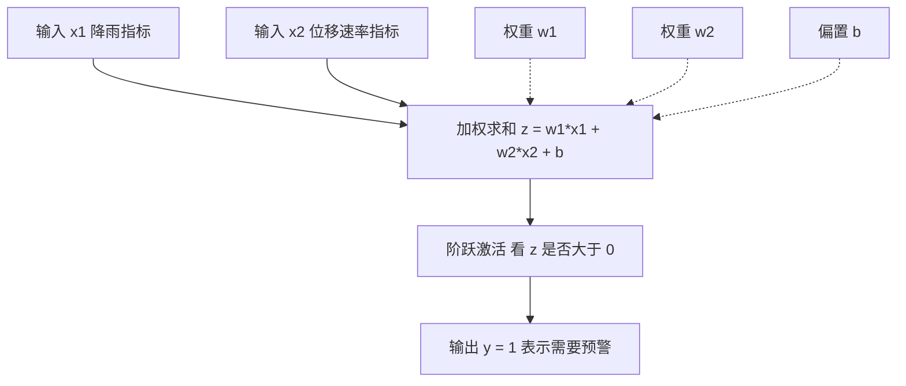
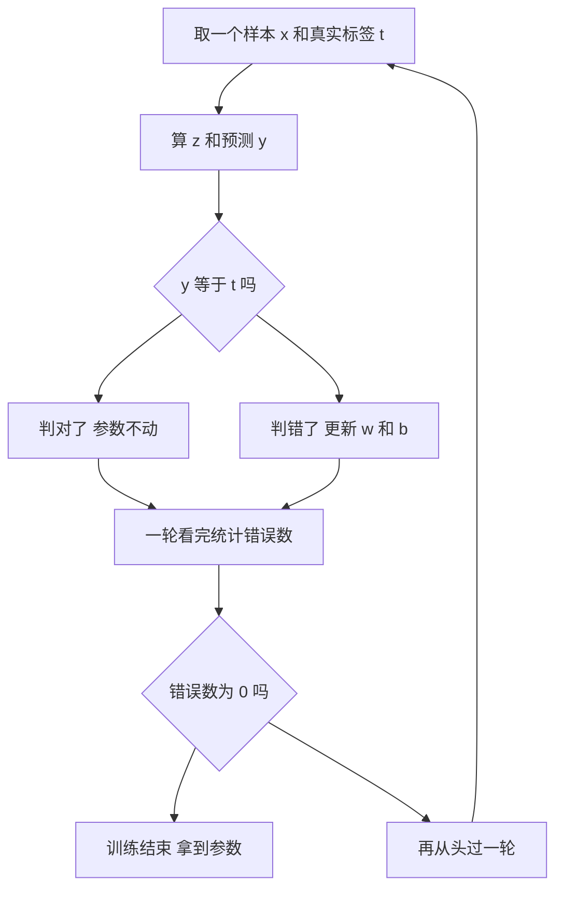
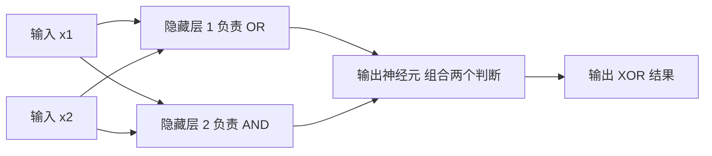

# 01. 感知器：一个"神经元"怎么工作

> [📖 模块目录](README.md) · ➡️ [下一篇：02 线性单元和梯度下降](02_线性单元和梯度下降.md)

**这一篇要干什么**：拿 4 个边坡监测样本当例子，讲清"一个神经元"怎么工作，手推它的学习规则，再用 NumPy 写出判断"某测点要不要发预警"的二分类程序。

**学完你能**：说清权重 $\mathbf{w}$、偏置 $b$、学习率 $\eta$ 各自在干什么；用纸笔跟着算完一轮参数更新；不借任何框架、只用 NumPy 写出一个感知器。

> 📐 **符号看不懂时**：本篇只用到"加权求和"和"正负号"，对应 [数学预备知识 §1 变量与下标](../算法原理_数学预备知识.md#1-变量与下标怎么读懂-x_i) 和 [§2 矩阵乘法](../算法原理_数学预备知识.md#2-矩阵乘法-wx-到底在算什么)。本篇**暂时不需要导数**（[§5](../算法原理_数学预备知识.md#5-导数变化率是什么意思)、[§6](../算法原理_数学预备知识.md#6-偏导数与梯度参数该往哪边调)、[§9 梯度下降](../算法原理_数学预备知识.md#9-梯度下降与学习率) 都是下一篇才用到）。

**目录**

- [1. 这一篇解决什么问题](#1-这一篇解决什么问题)
- [2. 从生物神经元到数学模型](#2-从生物神经元到数学模型)
- [3. 几何直觉：感知器就是在画一条直线](#3-几何直觉感知器就是在画一条直线)
- [4. 感知器学习规则](#4-感知器学习规则)
- [5. 手算一个完整例子](#5-手算一个完整例子)
- [6. 用 NumPy 从零实现](#6-用-numpy-从零实现)
- [7. 运行结果与解读](#7-运行结果与解读)
- [8. 局限与下一步：XOR 为什么解不了](#8-局限与下一步xor-为什么解不了)
- [9. 小结](#9-小结)
- [10. 自检问题](#10-自检问题)

---

## 1. 这一篇解决什么问题

边坡上布了若干 GNSS 监测点，每天都会测到一批数字：降雨量、库水位、位移量、位移速率。我们想做的事是：

> 每天早上看一眼昨天的数据，判断这个测点**今天要不要发预警**。

"要不要"只有两种答案，这类"输入一堆数字、输出是或否"的问题叫**二分类问题**。我们不手写规则，而是希望机器**自己从历史数据里找规律**，这就是机器学习。本篇只用两个特征：

| 符号 | 含义 | 取值 |
|---|---|---|
| $x_1$ | 降雨指标 | 0 表示几乎无雨，1 表示特大暴雨 |
| $x_2$ | 位移速率指标 | 0 表示完全平稳，1 表示变形极快 |

真实数据是"毫米""毫米每天"这种带量纲的数，一般先要**归一化**压到 0 到 1 之间（原因见 [§7.4](#74-一条工程上的提醒)）；为了能用纸笔跟着算，本篇直接用归一化后的数字。输出记作 $y$：$y=1$ 需要预警，$y=0$ 不需要；专家给出的标准答案记作 $t$。**本篇要回答的问题**：机器怎么把 $(x_1,x_2)$ 变成 $y$？答：用最古老的一种"神经元"——**感知器**。

---

## 2. 从生物神经元到数学模型

### 2.1 先打个比方：神经细胞怎么传信号

神经细胞大致这么干活：

1. **树突**从四面八方的邻居那里接信号；
2. 不同邻居的话**分量不一样**：有的信号强（"这事重要"），有的弱；
3. 所有信号在**细胞体**里汇总、加起来；
4. 只有总和**超过某个门槛**，细胞才"放电"把信号传下去；不够门槛就憋着。

**关键在第 3、4 步**：先汇总，再看"过不过门槛"。这就是一个二分类器的全部骨架。

### 2.2 再换个更熟的比方：算总评

老师算一门课的总评：平时作业占 30%，期末考试占 70%，总评 60 分以上算通过。把这句话直接写成上一步的形式：

$$\text{通过}=\begin{cases}1,& 0.3\times\text{作业分}+0.7\times\text{考试分}-60>0\\ 0,& \text{否则}\end{cases}$$

0.3 和 0.7 就是**权重**：这一项有多重要。那个"$-60$"是**偏置**（bias）：它写成加的形式，实际作用是**移动那条及格线**。权重和偏置在神经网络里通称**参数**。

### 2.3 数学定义

输入是 $n$ 个数字组成的向量 $\mathbf{x}$（本篇 $n=2$）。感知器只做两件事：

**第一步，加权求和**：

$$z=w_1x_1+w_2x_2+b=\mathbf{w}^\top\mathbf{x}+b$$

$\mathbf{w}^\top\mathbf{x}$ 就是"逐项相乘再求和"，和 $w_1x_1+w_2x_2$ 完全是一回事，写法看不懂就翻 [§2.3 转置](../算法原理_数学预备知识.md#23-转置是什么)。

**第二步，过一个"阶跃"函数**：

$$y=\begin{cases}1,& z>0\\ 0,& z\le 0\end{cases}$$

这个函数叫**阶跃激活函数**：不管 $z$ 是 0.01 还是 1000，只要是正数就吐一个 1。它的图像是"平—突然跳上去—再平"的一级台阶。

> ⚠️ **约定**：本篇一律"$z>0$ 输出 1，$z\le 0$ 输出 0"。手算时你会碰到 $z$ **正好等于 0** 的情况（第 1 轮的样本 1），那时按约定输出 0。有的书写的是 $z\ge0$ 输出 1，两种都行，但**从头到尾只能用一种**，否则数字对不上。



虚线表示"这些参数参与了计算"，实线表示数据从输入流到输出。这张图的形状，就是以后所有神经网络图的第一个零件。

### 2.4 每个符号的含义

| 符号 | 是什么 | 在边坡例子里 |
|---|---|---|
| $\mathbf{x}$ | 输入特征向量 | 一个测点当天的两个指标 |
| $x_1,\ x_2$ | 第 1、2 个特征 | $x_1$ 降雨，$x_2$ 位移速率 |
| $\mathbf{w}$ | 权重向量 | 哪个指标更值得警惕 |
| $w_1,\ w_2$ | 各特征的权重 | 比如 $w_1=0.9$ |
| $b$ | 偏置 | 预警门槛的高低 |
| $z$ | 加权求和的结果，也叫分数 | 越大越倾向预警 |
| $y$ | 模型的预测 | 0 或 1 |
| $t$ | 真实标签 | 专家标注的答案 |
| $\eta$ | 学习率（读 eta） | 每次调整参数走多大一步 |

**权重和偏置是"学"出来的**，$x$ 和 $t$ 是数据给的，$y$ 和 $z$ 是算出来的。整篇文档说到底只有一件事：**怎么根据 $t$ 和 $y$ 的差别去改 $\mathbf{w}$ 和 $b$**。

> ⚠️ **别把权重过度解读成"重要性"**：这个解读要跟**特征的取值范围**一起看。把降雨的量纲从"归一化值"换成"毫米"，$w_1$ 会缩小同样的倍数，而决策边界一点没变。所以权重只有在各特征取值范围相近时才能直接比大小——这正是要先归一化的原因之一。

---

## 3. 几何直觉：感知器就是在画一条直线

本篇只有两个特征，所以每个样本都能画在平面上：横轴降雨指标，纵轴位移速率指标，一个样本就是一个点。

判定规则是"$z>0$ 就输出 1"，而 $z=0$ 在平面上是一条**直线**：

$$w_1x_1+w_2x_2+b=0$$

这条直线叫**决策边界**：一侧 $z>0$（判为 1），另一侧 $z\le0$（判为 0）。所以"感知器学习"在几何上就是：**不停移动这条直线，直到两类点分别落在直线两侧**。

用后面手算得到的最终参数 $w_1=0.9,\ w_2=1.2,\ b=-1$ 画出来是这样（`o` 不需预警，`X` 需要预警，`#` 是决策边界）：

```text
  x2
 0.9 |                  X
 0.8 |###
 0.7 |   ##
 0.6 |     ###
 0.5 |        ###       X
 0.4 |  o        ##
 0.3 |             ###
 0.2 |                ###
 0.1 |        o          ##
     +---------------------
      0                  1   -> x1
```

四个点全部落对：两个 `o` 在边界下方（$z<0$），两个 `X` 在边界上方（$z>0$）。两个值得记住的细节：**$\mathbf{w}$ 垂直于决策边界，指向"判为 1"的那一侧**（让边界平移或旋转，本质都是在调 $\mathbf{w}$）；**$b$ 决定边界离原点多远**（距离等于 $\lvert b\rvert$ 除以 $\mathbf{w}$ 的长度，本例是 $1\div1.5=0.667$，就是"把及格线上下移动"）。

[§7.3](#73-把决策边界画出来) 有一段代码能画出这张图的彩色版。

---

## 4. 感知器学习规则

### 4.1 规则本身

参数一开始什么都不知道，先随便给个初值（比如全设成 0），然后**拿样本一个一个喂进去，判错了就改参数**：

$$w_i\leftarrow w_i+\eta\,(t-y)\,x_i$$

$$b\leftarrow b+\eta\,(t-y)$$

- $t-y$ 只有三种可能：**0（判对了）、$+1$（该报没报）、$-1$（不该报却报了）**；
- $\eta$ 是学习率，决定每次改多少。

把全部样本看完一遍叫**一轮**（epoch）；一轮不够就再来一轮，直到某一轮一个错误都没有。



### 4.2 为什么这个规则有效：四种情形

只看公式容易迷糊。把 $t$ 和 $y$ 的四种组合全列出来，**重点看 $(t-y)$**，它决定参数往哪边调：

| 情形 | $t$ | $y$ | $t-y$ | 参数怎么变 | 效果 |
|---|---|---|---|---|---|
| 判对且确实要预警 | 1 | 1 | 0 | 不变 | 已经对了，别乱动 |
| **漏报** | 1 | 0 | +1 | $w_i$ 加上 $\eta x_i$，$b$ 加上 $\eta$ | 把 $\mathbf{w}$ 往 $\mathbf{x}$ 方向推，该样本 $z$ 变大 |
| **误报** | 0 | 1 | -1 | $w_i$ 减去 $\eta x_i$，$b$ 减去 $\eta$ | 把 $\mathbf{w}$ 往 $-\mathbf{x}$ 方向推，该样本 $z$ 变小 |
| 判对且确实不用预警 | 0 | 0 | 0 | 不变 | 已经对了，别乱动 |

一句话：**判对了不动，判错了就朝"让这个样本判对"的方向挪一步。** 用后面手算里真实发生的两次更新体会一下（$\eta=1$）：

- **漏报**：样本 $\mathbf{x}=(0.9,0.9)$，$t=1$ 但 $y=0$。$\mathbf{w}$ 从 $(0,0)$ 变成 $(0+1\times0.9,\ 0+1\times0.9)=(0.9,0.9)$，$b$ 从 0 变成 1——$\mathbf{w}$ 转到了跟这个样本同一方向。
- **误报**：样本 $\mathbf{x}=(0.4,0.1)$，$t=0$ 但 $y=1$。$\mathbf{w}$ 从 $(0.9,0.9)$ 变成 $(0.9-0.4,\ 0.9-0.1)=(0.5,0.8)$，$b$ 从 1 变成 0——又往回拉了一点。

**再往深挖一层**：判错的样本经过这次更新，它自己的 $z$ 会变多少？代进更新式算：

$$z_{\text{新}}=\mathbf{w}_{\text{新}}^\top\mathbf{x}+b_{\text{新}}=z+\eta\,(t-y)\,\big(\lVert\mathbf{x}\rVert^2+1\big)$$

其中 $\lVert\mathbf{x}\rVert^2=x_1^2+x_2^2$ 是这个样本两个指标的平方和（[§1.3 粗体与下标](../算法原理_数学预备知识.md#13-粗体与下标为什么有的量带粗体)）。判错时 $t-y$ 必是 $+1$ 或 $-1$，所以**判错的样本，更新后它的 $z$ 一定朝正确方向移动 $\eta(\lVert\mathbf{x}\rVert^2+1)$ 那么多，不多不少**。两条实测数据：

- $(0.9,0.9)$ 漏报时：$z$ 从 $0$ 变成 $0+1\times(0.81+0.81+1)=2.62$ ✓
- $(0.4,0.1)$ 误报时：$z$ 从 $1.45$ 变成 $1.45-1\times(0.16+0.01+1)=0.28$ ✓

### 4.3 学习率有什么用

$\eta$ 决定每步走多大。但感知器这里有个**反直觉的事实**：如果初始权重全是 0，$\eta$ 取多少，**最终决策边界一模一样，连每轮错几个都一样**，区别只是 $\mathbf{w}$ 和 $b$ 被同比例放大缩小。用 [§5](#5-手算一个完整例子) 那份数据实跑：

| 学习率 $\eta$ | 几轮收敛 | 最终 $\mathbf{w}$ | 最终 $b$ | 每轮错误数 |
|---|---|---|---|---|
| 0.1 | 4 | $(0.09,\ 0.12)$ | $-0.1$ | 1 → 3 → 1 → 0 |
| 1.0 | 4 | $(0.9,\ 1.2)$ | $-1.0$ | 1 → 3 → 1 → 0 |
| 100 | 4 | $(90,\ 120)$ | $-100$ | 1 → 3 → 1 → 0 |

原因：阶跃函数**只关心 $z$ 的正负**。$\eta$ 放大 $k$ 倍时 $\mathbf{w}$、$b$ 也放大 $k$ 倍，$z$ 跟着放大 $k$ 倍，**正负号一点没变**，于是每次判对判错完全相同。

> 🤔 所以学习率在感知器里几乎没用（这是"阶跃 + 零初始化"特有的巧合）。但在 [第 2 篇](02_线性单元和梯度下降.md) 的梯度下降里它就成了头等大事：决定每步沿梯度走多远，太大会震荡，太小会爬得极慢（[§9.2](../算法原理_数学预备知识.md#92-学习率太大太小都不行)）。现在记住"$\eta$ 是个步长"就够了。

### 4.4 感知器收敛定理（只讲结论）

这套规则 1958 年由 Rosenblatt 提出，两年后被证明了一个漂亮的性质：

> **如果**存在一条直线能把两类点完全分开（术语叫**线性可分**），**那么**感知器"判错就调"的过程**一定能在有限步内**停下来，得到一组全分对的参数。
>
> **如果**不存在这样的直线，感知器**永远不收敛**，参数一直来回晃。

三点补充，都是你必须知道的边界：

1. **只保证"能分开"，不保证"分得最好"**：找到的解和初始值、样本顺序都有关。同一份数据换个顺序，可能得到 $\mathbf{w}=(0.9,1.2),\ b=-1$，也可能得到 $\mathbf{w}=(1.2,0.1),\ b=-1$——两个都把 4 个样本分对了，但"离边界最近的点有多近"不同（前者最近距离 0.27，后者只有 0.11）。**"训练全对"不等于"找到唯一真理"。**
2. **它不告诉你需要多少步**：可能 3 轮，也可能 3 万轮。
3. **数据不可分时它是真学不会**，[§8](#8-局限与下一步xor-为什么解不了) 用 XOR 演示。

---

## 5. 手算一个完整例子

把纸笔拿出来。这一节的每个数字都能用 [§6](#6-用-numpy-从零实现) 的代码复核。

### 5.1 数据与初始值

4 个测点样本，$t$ 是专家事后标注的"当天是否需要预警"：

| 样本 | $x_1$ | $x_2$ | $t$ | 数据像什么样 |
|---|---|---|---|---|
| 样本 1 | 0.4 | 0.1 | 0 | 雨不算小，但测点几乎没动 |
| 样本 2 | 0.1 | 0.4 | 0 | 几乎没下雨，位移只是正常波动 |
| 样本 3 | 0.9 | 0.9 | 1 | 大暴雨叠加明显加速变形 |
| 样本 4 | 0.9 | 0.5 | 1 | 大暴雨，位移明显偏快 |

初始参数故意设成"一张白纸"，学习率取 1 方便手算：$\mathbf{w}=(0,0)$、$b=0$、$\eta=1$。训练顺序固定为样本 1 → 2 → 3 → 4，每轮都按这个顺序。

### 5.2 第 1 轮：从全 0 开始

开局**任何样本的 $z$ 都是 0**，按约定输出 0，所以两个负样本天然判对。

| 样本 | $z$ | $y$ | $t$ | 判定 | 更新后 $\mathbf{w}$ | 更新后 $b$ |
|---|---|---|---|---|---|---|
| 1 | $0.00$ | 0 | 0 | 对 | $(0.00,\ 0.00)$ | $0.00$ |
| 2 | $0.00$ | 0 | 0 | 对 | $(0.00,\ 0.00)$ | $0.00$ |
| 3 | $0.00$ | 0 | 1 | **错（漏报）** | $(0.90,\ 0.90)$ | $1.00$ |
| 4 | $0.9\times0.9+0.9\times0.5+1=2.26$ | 1 | 1 | 对 | $(0.90,\ 0.90)$ | $1.00$ |

把第 3 个样本（本轮唯一的更新）写细一点：

- 算 $z=0\times0.9+0\times0.9+0=0$，因为 $z$ 不大于 0，所以 $y=0$；
- 但 $t=1$，$t-y=1-0=+1$，**漏报**，要更新；
- 权重：$w_1\leftarrow0+1\times(1-0)\times0.9=0.9$，$w_2$ 同样得 $0.9$；
- 偏置：$b\leftarrow0+1\times(1-0)=1.0$。

**第 1 轮结束：$\mathbf{w}=(0.90,\ 0.90)$，$b=1.00$，错误数 1 个。**

### 5.3 第 2 轮：错得最多的一轮

起点 $\mathbf{w}=(0.90,0.90)$，$b=1.00$。这一轮三个样本都判错，请慢慢看：

| 样本 | $z$ 的计算 | $y$ | $t$ | 判定 | 更新算式 | 更新后 |
|---|---|---|---|---|---|---|
| 1 | $0.9\times0.4+0.9\times0.1+1=1.45$ | 1 | 0 | **错（误报）** | $0.9-0.4,\ 0.9-0.1,\ 1-1$ | $\mathbf{w}=(0.50,0.80)$，$b=0.00$ |
| 2 | $0.5\times0.1+0.8\times0.4+0=0.37$ | 1 | 0 | **错（误报）** | $0.5-0.1,\ 0.8-0.4,\ 0-1$ | $\mathbf{w}=(0.40,0.40)$，$b=-1.00$ |
| 3 | $0.4\times0.9+0.4\times0.9-1=-0.28$ | 0 | 1 | **错（漏报）** | $0.4+0.9,\ 0.4+0.9,\ -1+1$ | $\mathbf{w}=(1.30,1.30)$，$b=0.00$ |
| 4 | $1.3\times0.9+1.3\times0.5+0=1.82$ | 1 | 1 | 对 | 不动 | $\mathbf{w}=(1.30,1.30)$，$b=0.00$ |

**第 2 轮结束：$\mathbf{w}=(1.30,\ 1.30)$，$b=0.00$，错误数 3 个。**

看清楚这一轮的过程：上一轮把 $\mathbf{w}$ 推得太靠"预警"那边，于是两个不需预警的样本被误报，更新把参数拉回来；拉了一半，第 3 个样本又漏报了，再推回去。**这就是"来回摆"**，而摆动的幅度完全由样本自己决定。

### 5.4 第 3、4 轮：停下来

第 3 轮起点 $\mathbf{w}=(1.30,1.30)$，$b=0.00$：

| 样本 | $z$ 的计算 | $y$ | $t$ | 判定 | 更新后 |
|---|---|---|---|---|---|
| 1 | $1.3\times0.4+1.3\times0.1+0=0.65$ | 1 | 0 | **错（误报）** | $\mathbf{w}=(0.90,1.20)$，$b=-1.00$ |
| 2 | $0.9\times0.1+1.2\times0.4-1=-0.43$ | 0 | 0 | 对 | 不动 |
| 3 | $0.9\times0.9+1.2\times0.9-1=0.89$ | 1 | 1 | 对 | 不动 |
| 4 | $0.9\times0.9+1.2\times0.5-1=0.41$ | 1 | 1 | 对 | 不动 |

**第 3 轮结束：$\mathbf{w}=(0.90,\ 1.20)$，$b=-1.00$，错误数 1 个。**

第 4 轮起点 $\mathbf{w}=(0.90,1.20)$，$b=-1.00$：四个样本的 $z$ 依次是 $-0.52$、$-0.43$、$+0.89$、$+0.41$，全部判对，**错误数 0，训练结束**：

$$\mathbf{w}=\begin{bmatrix}0.9\\1.2\end{bmatrix},\qquad b=-1$$

决策边界是 $0.9x_1+1.2x_2=1$，即 $x_2=0.833-0.75x_1$——从左上斜向右下的一条直线，正是 [§3](#3-几何直觉感知器就是在画一条直线) 那张示意图里的 `#`。每轮错误数走势：**1 → 3 → 1 → 0**。

> 💡 跑 [§6](#6-用-numpy-从零实现) 的代码时，把样本顺序改成倒着来（4 → 3 → 2 → 1）再试一次，你会发现收敛轮数和最终参数都变了——这就是 [§4.4](#44-感知器收敛定理只讲结论) 说的"解不唯一"。

---

## 6. 用 NumPy 从零实现

把上面那个循环包成一个类，只有 `fit` 学参数、`predict` 做预测两个方法。整段只依赖 NumPy，可直接复制运行。

```python
import numpy as np

class Perceptron:
    """感知器：最简单的二分类模型（只用 NumPy）"""

    def __init__(self, eta=1.0, n_iter=20):
        self.eta = eta          # 学习率：每次调整的步长
        self.n_iter = n_iter    # 最多把数据整体过几轮

    def fit(self, X, y):
        """训练：一轮一轮看样本，判错就调整 w 和 b"""
        n_samples, n_features = X.shape
        self.w = np.zeros(n_features)   # 权重，初始化为 0
        self.b = 0.0                    # 偏置，初始化为 0
        self.errors_ = []               # 记录每轮错几个，用来观察收敛

        for epoch in range(1, self.n_iter + 1):
            errors = 0
            for xi, ti in zip(X, y):
                y_pred = self._predict_one(xi)
                if y_pred != ti:                        # 只在判错时才动参数
                    errors += 1
                    self.w += self.eta * (ti - y_pred) * xi
                    self.b += self.eta * (ti - y_pred)
            self.errors_.append(errors)
            print(f"第 {epoch:2d} 轮：错误 {errors} 个，"
                  f"w = {np.round(self.w, 2)}，b = {np.round(self.b, 2)}")
            if errors == 0:                             # 一轮下来全对，收工
                print(f"第 {epoch} 轮已全部分对，训练结束")
                break
        return self

    def _predict_one(self, x):
        """单个样本：加权求和 -> 阶跃判断"""
        z = float(np.dot(self.w, x) + self.b)
        return 1 if z > 0 else 0

    def predict(self, X):
        """批量预测"""
        return np.array([self._predict_one(x) for x in X])

# ---------- 用刚才那 4 个监测样本训练 ----------
X = np.array([[0.4, 0.1], [0.1, 0.4], [0.9, 0.9], [0.9, 0.5]])
y = np.array([0, 0, 1, 1])          # 1 = 需要发布预警

clf = Perceptron(eta=1.0, n_iter=20).fit(X, y)

z_all = [float(np.dot(clf.w, xi) + clf.b) for xi in X]      # 每个样本的分数
print("\n每个样本的 z 值：", np.round(z_all, 2))
print("预测结果：", clf.predict(X), " 真实标签：", y)
print("最终参数：w =", np.round(clf.w, 2), " b =", round(clf.b, 2))
print("错误数曲线：", clf.errors_)
```

真实输出（和 §5 的手算表逐行一致，可以拿来核对你纸上的数字）：

```text
第  1 轮：错误 1 个，w = [0.9 0.9]，b = 1.0
第  2 轮：错误 3 个，w = [1.3 1.3]，b = 0.0
第  3 轮：错误 1 个，w = [0.9 1.2]，b = -1.0
第  4 轮：错误 0 个，w = [0.9 1.2]，b = -1.0
第 4 轮已全部分对，训练结束

每个样本的 z 值： [-0.52 -0.43  0.89  0.41]
预测结果： [0 0 1 1]  真实标签： [0 0 1 1]
最终参数：w = [0.9 1.2]  b = -1.0
错误数曲线： [1, 3, 1, 0]
```

**到此为止你已经有了一个能工作的"神经元"**：两个参数、一个减号、一个判断。

---

## 7. 运行结果与解读

### 7.1 "错误数降到 0"意味着什么

错误数曲线 `[1, 3, 1, 0]` 最后停在 0，准确含义是：**用这组参数看训练集里的 4 个样本，全部判对了。** 它**不**意味着：学到了"真实的滑坡规律"（4 个样本太少，它只是找到一条能把这 4 个点分开的直线）；参数唯一（换个顺序会得到 $\mathbf{w}=(1.2,0.1),\ b=-1$，同样全分对）；对**没见过**的样本也判得对——这要靠留出测试集来检查，而 4 个样本根本不够分，真实项目得有几百上千条记录，这个坑在后续案例里会正式处理。

### 7.2 分得开，但分得稳吗

把每个样本的 $z$ 和它到边界的距离算出来（距离等于 $z$ 的绝对值除以 $\mathbf{w}$ 的长度）：

| 样本 | $z$ | 到边界距离 | 判成 | 备注 |
|---|---|---|---|---|
| 1 | $-0.52$ | 0.35 | 0 | 比较稳 |
| 2 | $-0.43$ | 0.29 | 0 | 比较稳 |
| 3 | $+0.89$ | 0.59 | 1 | 最稳 |
| 4 | $+0.41$ | 0.27 | 1 | 擦着线过 |

点到直线 $w_1x_1+w_2x_2+b=0$ 的距离公式是 $\lvert z\rvert$ 除以 $\lVert\mathbf{w}\rVert$，本例 $\lVert\mathbf{w}\rVert=\sqrt{0.9^2+1.2^2}=1.5$。样本 4 离边界只有 0.27，指标稍微变一点判定就会翻过来。

**感知器只保证"分开"，完全不关心"分得多宽松"。** 这在预警系统里很要命（临界样本会来回跳），后面会有专门优化"间隔"的方法，以及能输出概率的模型。

### 7.3 把决策边界画出来

```python
import numpy as np
import matplotlib.pyplot as plt

# 让图里能显示中文（Windows 上可改成 'Microsoft YaHei' 或 'SimHei'）
plt.rcParams['font.sans-serif'] = ['Heiti TC', 'PingFang SC', 'Arial Unicode MS', 'DejaVu Sans']
plt.rcParams['axes.unicode_minus'] = False

X = np.array([[0.4, 0.1], [0.1, 0.4], [0.9, 0.9], [0.9, 0.5]])   # x1 降雨, x2 位移速率
y = np.array([0, 0, 1, 1])          # 1 = 需要发布预警
w, b = np.array([0.9, 1.2]), -1.0   # 训练得到的权重和偏置

fig, ax = plt.subplots(figsize=(5.6, 5.0))
ax.scatter(X[y == 0, 0], X[y == 0, 1], s=120, c='tab:blue', marker='o',
           edgecolor='k', label='无需预警 t=0')
ax.scatter(X[y == 1, 0], X[y == 1, 1], s=120, c='tab:red', marker='^',
           edgecolor='k', label='需要预警 t=1')

# 决策边界：0.9*x1 + 1.2*x2 - 1 = 0
x1_line = np.linspace(0, 1, 50)
x2_line = (1 - w[0] * x1_line) / w[1]
ax.plot(x1_line, x2_line, 'k--', lw=2, label='决策边界 z=0')
ax.fill_between(x1_line, x2_line, 1.0, color='tab:red', alpha=0.08)   # 判为 1 的区域

# 画权重向量的方向：它垂直于决策边界，指向"需要预警"那一侧
tail = np.array([0.55, (1 - w[0] * 0.55) / w[1]])      # 在边界上取一点
head = tail + w / np.linalg.norm(w) * 0.25             # 沿 w 方向画一段
ax.annotate('', xy=head, xytext=tail, arrowprops=dict(arrowstyle='-|>', lw=2))
ax.text(0.30, 0.72, r'$\mathbf{w}=(0.9,\ 1.2)$', fontsize=11)

for i, xi in enumerate(X, start=1):                    # 标注样本编号
    ax.text(xi[0] + 0.03, xi[1] + 0.03, f'样本{i}', fontsize=9)

ax.set(xlim=(-0.05, 1.05), ylim=(-0.05, 1.05), xlabel='降雨指标 $x_1$',
       ylabel='位移速率指标 $x_2$', title='感知器学到的决策边界（浅红区域判为"需要预警"）')
ax.legend(loc='lower left', fontsize=9)
ax.grid(alpha=0.3)
plt.tight_layout()
plt.show()
```

图上你会看到：两个蓝圆点在虚线左下方、两个红三角在右上方；浅红区域（判为"预警"）是边界以上的半张平面；黑色箭头是 $\mathbf{w}=(0.9,1.2)$ 的方向，它正好垂直于虚线。

### 7.4 一条工程上的提醒

真实监测数据**必须先归一化**再喂给感知器。降雨量是几十毫米的量级，位移速率可能是零点几的量级，不做处理的话大数值特征会主导 $z$，权重就失去意义（见 [§2.4 的警告](#24-每个符号的含义)）。本项目所有案例的第一步数据预处理都是标准化/归一化，看案例代码时留意这一行。

---

## 8. 局限与下一步：XOR 为什么解不了

### 8.1 感知器只能画直线

前面几节的样本有个共同点：**两类点能用一条直线分开**（线性可分）。分不开会怎样？

举个监测里很现实的例子。假设我们要做的不是"滑坡预警"，而是判断"自动判定结果**要不要转人工复核**"：两个信号一致时（都正常或都异常）机器自己处理，两个信号**互相矛盾**时才需要人工看一眼。正确规则是：

| $x_1$ 降雨偏高 | $x_2$ 位移偏高 | 要不要人工复核 |
|---|---|---|
| 0 | 0 | 0 |
| 0 | 1 | **1** |
| 1 | 0 | **1** |
| 1 | 1 | 0 |

这个真值表叫 **XOR**（异或）：相同出 0，不同出 1。画到平面上，$(0,0)$ 和 $(1,1)$ 是一类，$(0,1)$ 和 $(1,0)$ 是另一类，**两类点交错排列，像国际象棋棋盘**。

**为什么一条直线一定不行？** 把同一类的两个点连起来：$(0,0)$ 与 $(1,1)$ 的连线、$(0,1)$ 与 $(1,0)$ 的连线，这两条线段在中心 $(0.5,0.5)$ **交叉**。而一条直线把平面切成两个"半平面"，每个半平面都是**凸**的——同一侧的两点连线必须还留在这一侧。两条连线既然必然交叉，就不可能分别待在两侧。所以**无论直线怎么摆，都至少有一个点落错边**。跑一下感知器，看它有多无奈：

```python
import numpy as np
import matplotlib.pyplot as plt

plt.rcParams['font.sans-serif'] = ['Heiti TC', 'PingFang SC', 'Arial Unicode MS', 'DejaVu Sans']
plt.rcParams['axes.unicode_minus'] = False

# XOR 的 4 个样本：两个都超阈值或都不超 -> 0；只有一个超阈值 -> 1
X = np.array([[0., 0.], [0., 1.], [1., 0.], [1., 1.]])
y = np.array([0, 1, 1, 0])

# ---------- 训练 20 轮，看它能不能学会 ----------
w, b, eta = np.zeros(2), 0.0, 1.0
for epoch in range(1, 21):
    errors = 0
    for xi, ti in zip(X, y):
        y_pred = 1 if float(np.dot(w, xi) + b) > 0 else 0
        if y_pred != ti:
            errors += 1
            w = w + eta * (ti - y_pred) * xi
            b = b + eta * (ti - y_pred)
    if epoch <= 5:
        print(f"第 {epoch:2d} 轮：错误 {errors} 个，w = {np.round(w, 2)}，b = {b:.2f}")
print(f"训练 20 轮后：w = {np.round(w, 2)}，b = {b:.2f}，错误数仍然降不到 0")

# ---------- 画图：换几条直线，每条都至少分错一个点 ----------
fig, ax = plt.subplots(figsize=(5.6, 5.0))
ax.scatter(X[y == 0, 0], X[y == 0, 1], s=130, c='tab:blue', marker='o', edgecolor='k')
ax.scatter(X[y == 1, 0], X[y == 1, 1], s=130, c='tab:red', marker='^', edgecolor='k')

x1_line = np.linspace(-0.15, 1.15, 50)
for wc, bc, name in [(np.array([0., 1.]), -0.5, '横线 $x_2=0.5$'),
                     (np.array([1., -1.]), 0.0, '斜线 $x_1=x_2$')]:
    ax.plot(x1_line, -(wc[0] * x1_line + bc) / wc[1], '--', lw=1.8, label=name)
    for xi, ti in zip(X, y):                     # 把这条线分错的点标出来
        if (1 if float(np.dot(wc, xi) + bc) > 0 else 0) != ti:
            ax.plot(xi[0], xi[1], 'kx', ms=16, mew=3)

ax.text(-0.12, 1.06, '黑叉 = 该线分错的点  蓝圆 t=0  红三角 t=1', fontsize=10)
ax.set(xlim=(-0.15, 1.15), ylim=(-0.15, 1.15), xlabel='$x_1$', ylabel='$x_2$',
       title='换哪条直线，都至少差一个点')
ax.legend(loc='lower center', fontsize=9)
ax.grid(alpha=0.3)
plt.tight_layout()
plt.show()
```

真实输出：

```text
第  1 轮：错误 2 个，w = [-1.  0.]，b = 0.00
第  2 轮：错误 3 个，w = [-1.  0.]，b = 1.00
第  3 轮：错误 4 个，w = [-1.  0.]，b = 1.00
第  4 轮：错误 4 个，w = [-1.  0.]，b = 1.00
第  5 轮：错误 4 个，w = [-1.  0.]，b = 1.00
训练 20 轮后：w = [-1.  0.]，b = 1.00，错误数仍然降不到 0
```

两件事值得注意：

1. **错误数不降反升**（2 → 3 → 4 → 4 → 4…），20 轮后参数锁死在一个状态上原地打转。这正是收敛定理的反面：数据不可分，所以永不收敛。
2. **为什么降不下去？** 阶跃函数只回答"过没过线"，不回答"离过线还差多少"。参数更新只能靠 $t-y$ 的正负号（只有 $\pm1$ 两个取值），拿不到"差多远"的信息。

### 8.2 出路：让网络"拐弯"

一条直线不够，那就用**折线**：先让几个神经元各画一条直线、各自回答一个简单问题，再用一个神经元把这些回答**组合**起来。XOR 拆开看就很清楚：

$$\text{XOR}=\text{OR}\ \text{并且}\ \text{不是}\ \text{AND}$$

"至少一个偏高"（OR）和"两个都偏高"（AND）之间的那部分，正是"只有一个偏高"。结构上就是加一层：



多出来的这一层叫**隐藏层**。它的作用可以这样理解：把 4 个点在平面上"重新摆一遍位置"，摆到能用一条直线分开为止，然后输出层再画那条直线。输入层 → 隐藏层 → 输出层，这就是**多层神经网络**的雏形，也是后面所有深度模型的基本形状。

但立刻冒出两个新问题：

1. **参数变多了，还能"判错就往 $\mathbf{x}$ 方向推"吗？** 隐藏层没有标准答案——没人告诉我们隐藏神经元该输出什么，这条规则直接失效。
2. **阶跃函数给不出"该调多少"的信息**（[§8.1](#81-感知器只能画直线) 已看到后果）；解决办法是把它换成光滑的函数，这样才有斜率可算。

这两件事正是后面两篇的主题：

- [02. 线性单元和梯度下降](02_线性单元和梯度下降.md)：先解决"怎么**自动**找到好参数"——把阶跃换成连续函数，用梯度下降一步步往低处走；
- [03. 神经网络和反向传播算法](03_神经网络和反向传播算法.md)：再解决"多层网络怎么训练"——用反向传播把误差一层层分回去，那时你能从零写出一个真正解得出 XOR 的网络。

---

## 9. 小结

**模型（前向计算）**

$$z=\mathbf{w}^\top\mathbf{x}+b,\qquad y=\begin{cases}1,& z>0\\ 0,& z\le 0\end{cases}$$

**学习规则（只需要 $t$ 和 $y$ 的差）**

$$w_i\leftarrow w_i+\eta\,(t-y)\,x_i,\qquad b\leftarrow b+\eta\,(t-y)$$

**四个要点**

1. 感知器 = 加权求和 + 阶跃判断；$\mathbf{w}$ 是权重（各特征的重要性），$b$ 是偏置（挪动门槛）；几何上它就是在平面上画一条直线，$\mathbf{w}$ 垂直于直线、指向判为 1 的那一侧；
2. 学习规则只有一句话：**判对了不动，判错了朝"让这个样本判对"的方向挪一步**，$\eta$ 是步长；
3. 线性可分时它一定收敛（但解不唯一、不保证最好）；线性不可分时（XOR）永远学不会——那需要多层网络，而多层网络需要梯度下降和反向传播，就是后面两篇。

---

## 10. 自检问题

先自己写答案，再点开看。第 2、8 题要动笔算。

**1.** 写出感知器的加权求和公式和输出公式，说明 $x_1$、$w_1$、$b$、$z$、$y$、$t$、$\eta$ 各是什么。

**2.** 某样本 $\mathbf{x}=(0.5,0.5)$，当前 $\mathbf{w}=(1,1)$、$b=-1.2$、$\eta=0.5$，真实标签 $t=1$。参数会怎么变？更新后这个样本的 $z$ 是多少？

**3.** $t=0$ 而 $y=1$ 时，更新公式把 $\mathbf{w}$ 往哪个方向推？为什么这能让该样本的 $z$ 变小？

**4.** 为什么感知器只能画一条直线？数据不可分时会发生什么？

**5.** 用本篇这 4 个样本，把学习率从 1 改成 0.1（初始权重仍全为 0），最终决策边界会变吗？为什么？

**6.** 感知器训练 XOR 时，错误数为什么从 2 涨到 4 再卡住？

**7.** 你能手工设计一个"两层"网络让它正确判断 XOR 吗？（提示：用 OR 和 AND 两个隐藏神经元）

**8.** 用最终参数 $\mathbf{w}=(0.9,1.2)$、$b=-1$，算样本 $(0.9,0.5)$ 的 $z$ 和它到决策边界的距离。

<details>
<summary>点击查看答案</summary>

**第 1 题**

$$z=w_1x_1+w_2x_2+b=\mathbf{w}^\top\mathbf{x}+b,\qquad y=\begin{cases}1,& z>0\\ 0,& z\le 0\end{cases}$$

符号含义：$x_1$ 是第 1 个输入特征（本例的降雨指标），$w_1$ 是它的权重（有多重要），$b$ 是偏置（挪动判定门槛），$z$ 是加权求和的结果（也叫分数），$y$ 是模型预测，$t$ 是真实标签，$\eta$ 是学习率（每次调整参数的步长）。

**第 2 题**：当前分数 $z=1\times0.5+1\times0.5-1.2=-0.2$。因为 $z\le0$，输出 $y=0$，而 $t=1$，**漏报**，$t-y=+1$，需要更新：

$$w_1\leftarrow1+0.5\times1\times0.5=1.25,\qquad w_2\leftarrow1.25,\qquad b\leftarrow-1.2+0.5=-0.7$$

更新后分数 $z=1.25\times0.5+1.25\times0.5-0.7=0.55$，比原来的 $-0.2$ 增加了 $0.75$。对一下 [§4.2](#42-为什么这个规则有效四种情形) 的公式：$\eta(\lVert\mathbf{x}\rVert^2+1)=0.5\times(0.25+0.25+1)=0.75$ ✓ 完全吻合。

**第 3 题**：$t-y=0-1=-1$，所以 $w_i\leftarrow w_i-\eta x_i$、$b\leftarrow b-\eta$，也就是把 $\mathbf{w}$ 减去 $\mathbf{x}$。为什么有效：该样本的 $z$ 会变成

$$z_{\text{新}}=z-\eta\big(\lVert\mathbf{x}\rVert^2+1\big)$$

其中 $\lVert\mathbf{x}\rVert^2+1>0$、$\eta>0$，所以 $z$ 一定变小，下次更倾向输出 0——正是我们想要的。

**第 4 题**：因为判定依据是"$z>0$"，而 $z=0$ 在二维平面上就是一条直线，它两侧分别是 $z>0$ 和 $z\le0$。**模型只有 $\mathbf{w}$、$b$ 这几个旋钮，能表达的全部形状就是一条直线**，没有别的可能。

若数据不可分：感知器**不会收敛**，参数一直来回摆（XOR 例子里错误数从 2 涨到 4 并锁死），训练再多轮也至少有一个样本判错。收敛定理只对线性可分的数据成立。

**第 5 题**：**不会变，连每轮错几个都一样。** 实测：

| $\eta$ | 几轮收敛 | 最终 $\mathbf{w}$ | 最终 $b$ | 每轮错误数 |
|---|---|---|---|---|
| 0.1 | 4 | $(0.09,\ 0.12)$ | $-0.1$ | 1 → 3 → 1 → 0 |
| 1.0 | 4 | $(0.9,\ 1.2)$ | $-1.0$ | 1 → 3 → 1 → 0 |

初始权重全为 0 时，$\eta$ 放大 $k$ 倍会让 $\mathbf{w}$、$b$ 也恰好放大 $k$ 倍，于是 $z$ 放大 $k$ 倍而**正负号不变**，每次判对判错都一样，最终边界 $0.9x_1+1.2x_2=1$ 自然也一样（参数同乘 $k$ 后约掉即可）。换成非全 0 的初始值，或换成下一篇的连续激活函数，$\eta$ 就会真正影响结果。

**第 6 题**：两个原因叠加：

1. **阶跃函数丢掉了"差多少"的信息**。它只输出 0 或 1，判错时 $t-y$ 只有 $+1$、$-1$ 两种取值，模型不知道是"只差一点点"还是"差十万八千里"，只能机械地推同样的步长，没法收敛到折中点。
2. **数据本身就分不开**。XOR 两类点交错排列，本来就找不到那条直线，收敛定理的前提不成立，参数只能在一个循环里打转。

顺带说清一个区别：感知器**不是**在"最小化误差"——它没有损失函数、没有梯度，只是执行"判错就调"这个固定动作。到了 [第 2 篇](02_线性单元和梯度下降.md)，目标改成**最小化一个连续的损失函数**，学不动就能被诊断出来（损失下不去），而不是像这里只能看着错误数来回跳。

**第 7 题**：结构：输入 2 个 → 隐藏层 2 个神经元 → 输出 1 个。全用整数参数，隐藏层分别做 OR 和 AND：

| 层 | 计算 | 参数 |
|---|---|---|
| 隐藏神经元 1 做 OR | $h_1=\text{阶跃}(x_1+x_2-0.5)$ | $w=(1,1)$，$b=-0.5$ |
| 隐藏神经元 2 做 AND | $h_2=\text{阶跃}(x_1+x_2-1.5)$ | $w=(1,1)$，$b=-1.5$ |
| 输出神经元 | $y=\text{阶跃}(h_1-h_2-0.5)$ | $w=(1,-1)$，$b=-0.5$ |

逐个核对：

| $\mathbf{x}$ | $h_1$ 至少一个偏高 | $h_2$ 两个都偏高 | $h_1-h_2-0.5$ | $y$ | 应为 |
|---|---|---|---|---|---|
| $(0,0)$ | 0 | 0 | $-0.5$ | 0 | 0 ✓ |
| $(0,1)$ | 1 | 0 | $0.5$ | 1 | 1 ✓ |
| $(1,0)$ | 1 | 0 | $0.5$ | 1 | 1 ✓ |
| $(1,1)$ | 1 | 1 | $-0.5$ | 0 | 0 ✓ |

全对。注意这些参数是**手工凑**的；[第 3 篇](03_神经网络和反向传播算法.md) 要做的就是让机器**自己**把它们学出来。

**第 8 题**

$$z=0.9\times0.9+1.2\times0.5-1=0.81+0.6-1=0.41$$

权重长度 $\lVert\mathbf{w}\rVert=\sqrt{0.9^2+1.2^2}=\sqrt{0.81+1.44}=\sqrt{2.25}=1.5$，于是到边界的距离是

$$\frac{\lvert z\rvert}{\lVert\mathbf{w}\rVert}=\frac{0.41}{1.5}=0.273$$

含义：这个样本离边界只有 0.27（坐标系是 0 到 1）。它的 $z$ 是正的所以判成 1，但数据稍微一变就会翻到另一边——这就是 [§7.2](#72-分得开但分得稳吗) 说的"分得开，但不一定分得稳"。

</details>

---

## 参考

- Rosenblatt, F. (1958). *The Perceptron: A Probabilistic Model for Information Storage and Organization in the Brain.* Psychological Review, 65(6), 386–408. —— 感知器原始论文
- Novikoff, A. B. J. (1962). *On Convergence Proofs on Perceptrons.* Proceedings of the Symposium on the Mathematical Theory of Automata. —— 收敛定理
- Minsky, M., & Papert, S. (1969). *Perceptrons: An Introduction to Computational Geometry.* MIT Press. —— XOR 不可分的经典分析
- 李航. 《统计学习方法》第 2 章 感知机 · 周志华. 《机器学习》第 5 章 神经网络. —— 中文教材里的严格推导与扩展

---

**下一篇** → [02. 线性单元和梯度下降](02_线性单元和梯度下降.md)
