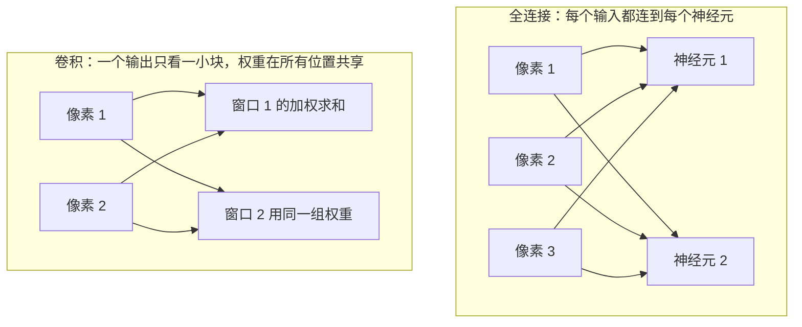
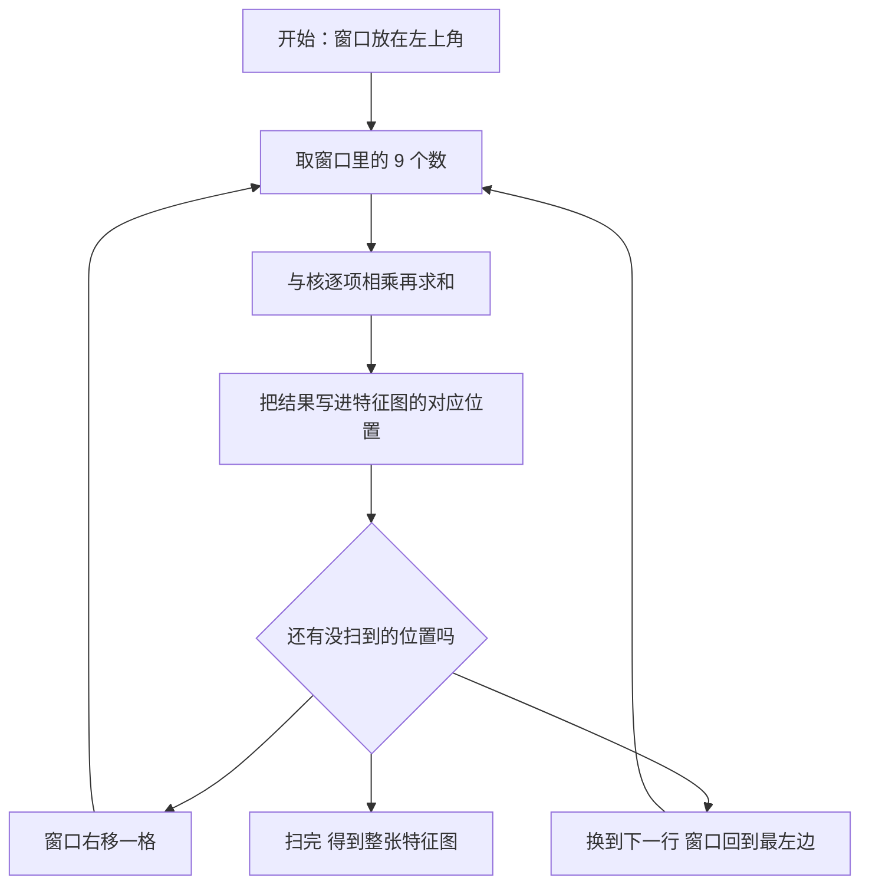

# 04. 卷积神经网络：怎么处理网格数据
> [📖 模块目录](README.md) · ⬅️ [上一篇：03 神经网络和反向传播算法](03_神经网络和反向传播算法.md) · ➡️ [下一篇：05 循环神经网络](05_循环神经网络.md)

**这一篇要干什么**：把边坡孔压场、位移场这类"铺在二维网格上的数据"栅格化成小图，讲清卷积和池化这两个新零件，手算一个二维卷积，再用 NumPy 从零写一个几秒就能训完的迷你 CNN，把学到的卷积核打印出来看。

**学完你能**：说清"局部连接"和"权值共享"省了多少参数；拿纸笔算完一个 5×5 输入、3×3 核的卷积；用 NumPy 写出卷积层、池化层及其反向传播，并用数值梯度验证；明白为什么普通卷积不能直接用来预测未来。

**要用的数学**：滑动窗口加权求和（[§16 一维卷积](../算法原理_数学预备知识.md#16-一维卷积滑动窗口加权求和)）、链式法则（[§7](../算法原理_数学预备知识.md#7-链式法则与计算图接力传责任)）、矩阵乘法（[§2](../算法原理_数学预备知识.md#2-矩阵乘法-wx-到底在算什么)）、数值梯度检查（[§10](../算法原理_数学预备知识.md#10-数值梯度检查为什么必须自己动手做)）。

---
## 1. 这一篇解决什么问题
前 3 篇的数据都是"一行数字"：一个测点当天的降雨、水位、位移。但边坡监测里还有一类数据天生是**铺在二维网格上的**。本课程 [work001](../work001/README.md) 复现那篇论文时就是这么做的：把边坡剖面切成 120×120 的格子，每格放 4 个数——重度、黏聚力、内摩擦角、孔隙率，于是整个边坡变成一张 **120×120×4 的"四通道图像"**，再让 CNN 看图回答"这个时刻的安全系数是多少"。孔压场、位移场、降雨分布图，凡是"每个位置都有值"的数据都能这么排。
问题是：能不能还像前 3 篇那样把每格摊平成一长串，直接接全连接层？能写出来，但有两个要命的毛病。

### 1.1 毛病一：参数爆炸
拿一张 224×224 的彩色图算（3 个颜色通道），摊平后是 $224\times224\times3=150{,}528$ 个数。只接**一层** 1000 个神经元的全连接层（[§2.2](../算法原理_数学预备知识.md#22-它为什么在神经网络里无处不在)），参数是 $150{,}528\times1000+1000=\mathbf{150{,}529{,}000}$——**一亿五千万个参数，只为一层**。而 [01 篇](01_感知器.md) 的感知器一共只有 3 个参数。
```python
n_in = 224 * 224 * 3                      # 彩色图的像素个数
n_out = 1000                              # 全连接层的神经元个数
print("展平后的输入个数 =", n_in)
print("全连接层参数 =", n_in * n_out + n_out, " 约", round(n_in * n_out / 1e8, 2), "亿")
print("卷积核参数 3x3 64 通道 =", 3 * 64 * 3 * 3 + 64)
print("卷积核参数 3x3 1000 通道 =", 3 * 1000 * 3 * 3 + 1000)
print("倍数 =", round((n_in * n_out + n_out) / (3 * 1000 * 3 * 3 + 1000), 1))
```

```text
展平后的输入个数 = 150528
全连接层参数 = 150529000  约 1.51 亿
卷积核参数 3x3 64 通道 = 1792
卷积核参数 3x3 1000 通道 = 28000
倍数 = 5376.0
```

**最后两行就是本篇的主菜**：同样看这张图、同样输出 1000 个通道，卷积层只要 **28,000** 个参数，是全连接层的 **1/5376**。这不是把网络改小换来的，而是靠改变"连接方式"。参数多还有第二个后果：按 [03 篇](03_神经网络和反向传播算法.md) 的写法每个参数都要存梯度、被更新，显存撑不住；而**参数这么多、数据只有几千条**，网络会把训练集背下来（过拟合）。

### 1.2 毛病二：打平就把空间结构丢了
把网格摊平成一列之后，**"谁挨着谁"这个信息没了**。举例：3×3 的小网格 $\begin{bmatrix}1&2&3\\4&5&6\\7&8&9\end{bmatrix}$ 整体向右平移一格（边缘补 0）后变成 $\begin{bmatrix}0&1&2\\0&4&5\\0&7&8\end{bmatrix}$，摊平后原本是 `1 2 3 4 5 6 7 8 9`，平移后是 `0 1 2 0 4 5 0 7 8`——**几乎每个数都换了位置**。在网格上看只是"整体挪了一下"，在摊平后的向量里却几乎是两条毫不相干的样本。全连接层只能对"第 37 号输入""第 38 号输入"分别学权重，**它必须为每个位置单独学一遍**，学到的规律换个位置就不认了。而相邻格子的关系恰恰是物理上最要紧的：孔压的梯度、渗流的方向、滑动面的走向，全藏在"邻居之间差多少"里。

### 1.3 出路：只看局部，并且到处复用
1. **局部连接**：一个输出值不去看全部 150,528 个输入，只看自己附近一小块（比如 3×3 的 9 个数）——参数立刻降到 9 个。
2. **权值共享**：这一小块的权重，在整张图上**每一处都用同一套**——于是不管图多大，参数个数固定不变。



左边每个神经元伸出一大把手抓全部输入；右边每个输出只抓自己那几只"手"，而且**这组手的力度在整张图上通用**。这就是本篇的全部思想。它顺手还带来一个好处：图整体平移一点，输出只是跟着平移，而不是完全变样。

---
## 2. 卷积：局部连接加权值共享
### 2.1 生活类比：拿一个小放大镜看图纸
手里拿一个 3×3 的**小方框**（放大镜），贴在图上左上角，框住 9 个数，按各自的"重要程度"（9 个权重）加权求和，得到 1 个数，写在旁边那张新纸的对应位置上。然后把放大镜往右挪一格再算一次，挪到头就换到下一行最左边，直到扫完整张图。
三个关键词：新纸叫**特征图**（feature map），那 9 个权重叫**卷积核**（kernel，也叫滤波器），"挪几格"叫**步长**（stride）。

**为什么这样看数据有道理**：边坡剖面上"某处的孔压高不高"和它邻居的孔压高度直接相关，和 50 米外的地方关系不大。局部连接正好把"只看近邻"写进结构里，而不是让网络从数据里去猜。

### 2.2 从一维开始：一根线上的滑动窗口
一维的情形 [§16](../算法原理_数学预备知识.md#16-一维卷积滑动窗口加权求和) 讲过：$y_t=\sum_{k=0}^{K-1}w_k\,x_{t-k}$。符号解释：$x$ 是输入序列、$x_t$ 是第 $t$ 个数；$w_0,\dots,w_{K-1}$ 是窗口里的 $K$ 个权重（$K$ 叫**核宽**）；$y_t$ 是输出序列第 $t$ 个位置的值。例：$x=[1,2,3,4,5]$、$w=[0.5,1,0.5]$，则 $y_2=0.5\times3+1\times2+0.5\times1=3.5$。

### 2.3 二维卷积：窗口从一个方框里取数
把窗口从一维的 $K$ 个数推广成二维的 $k\times k$ 个格子（通常取 3、5、7 这类奇数，因为要有个正中心）。设输入网格是 $X$，格子 $(i,j)$ 里的数是 $X_{i,j}$（$i$ 是行号、$j$ 是列号，都从 0 开始数，见 [§1.2 下标](../算法原理_数学预备知识.md#12-下标-x_i-与-w_ij)）；卷积核是 $\mathbf{K}$，第 $u$ 行第 $v$ 列是 $K_{u,v}$，$u,v$ 从 0 数到 $k-1$。输出 $O$ 在位置 $(i,j)$ 的值是
$$O_{i,j}=\sum_{u=0}^{k-1}\sum_{v=0}^{k-1}X_{i+u,\ j+v}\,K_{u,v}+b$$
逐层读：两个求和号意味着"把窗口里 $k\times k$ 个数逐个拿出来"（[§4.1 求和符号](../算法原理_数学预备知识.md#41-求和符号)）；$X_{i+u,\ j+v}$ 是窗口里第 $(u,v)$ 个数（行往下数 $u$ 格、列往右数 $v$ 格）；乘上对着的权重 $K_{u,v}$ 再全部加起来；$b$ 是这一层的**偏置**，和 [01 篇](01_感知器.md) 的 $b$ 一样可正可负，整张特征图共用同一个 $b$，作用是把门槛挪一挪。

**输出尺寸**由输入边长 $H$、核边长 $k$、步长 $s$ 和**填充** $p$（padding，在输入四周补几圈 0）决定：
$$H_{\text{out}}=\left\lfloor\frac{H+2p-k}{s}\right\rfloor+1$$
$\lfloor\cdot\rfloor$ 是向下取整，即"不能整除时舍掉小数"。几个例子（已用代码核过）：

| 输入边长 | 核 $k$ | 填充 $p$ | 步长 $s$ | 输出边长 | 说明 |
|---|---|---|---|---|---|
| 5 | 3 | 0 | 1 | 3 | 本篇手算的例子 |
| 5 | 3 | 1 | 1 | 5 | 四周补一圈，输出和输入一样大 |
| 8 | 3 | 0 | 2 | 3 | 步长 2 等于每隔一格算一次 |
| 224 | 3 | 1 | 1 | 224 | 常用配置，尺寸不变，方便层层堆叠 |

**为什么要填充**：不补 0，每次卷积输出都小一圈（5 变 3），堆几层就没图可算；而且边缘像素被窗口扫到的次数远少于中间（角落 1 次、中心 9 次），补 0 能让每个位置被公平地看同样的次数。

> ⚠️ **容易绕晕的地方**：严格数学定义的卷积要把核**翻转**再滑动（[§16.1](../算法原理_数学预备知识.md#161-定义) 的 $y_t=\sum_k w_k x_{t-k}$，下标相减）；深度学习框架实现的是**不翻转**的版本（上面那条式子，下标相加），严谨的名字叫"相关运算"。两者只差一次翻转，而**核本来就是网络自己学出来的**——需要翻转的场合它会自己把权重反过来学。所以框架里统一叫"卷积"，本篇也这么叫，但手算时务必按上面那条式子算。

### 2.4 权值共享到底省了多少
一张 224×224×3 的图，用 3×3 的核提取 1000 个通道：$3\times1000\times3\times3+1000=28{,}000$ 个参数，对比全连接层的 150,529,000 就是 1/5376。省在三处：一个输出只看 $k\times k$ 个输入（不是全部 150,528 个）；所有位置共用一套权重；偏置每个输出通道一个（不是每个神经元一个）。

**最值得记住的一条**：卷积层参数量**与输入图大小无关**。输入从 224×224 换成 448×448，卷积层还是 28,000 个参数，一个不多；全连接层会变成 4 倍。这正是 [work001](../work001/README.md) 把全网边坡栅格化成同一尺寸图像的用意之一。

**那它凭什么认得出东西**：因为"局部模式在图上哪儿都长一个样"。一条水平渗流通道出现在第 3 行还是第 8 行，物理意义相同；用同一套权重去扫，"横边"在哪儿都会被同一个核抓出来。这叫**平移等变性**——输入平移一格，特征图上的响应也跟着平移一格。

### 2.5 窗口是怎么滑的


每行扫 3 个位置、共扫 3 行，得到 9 个输出位置，正好是 3×3，与尺寸公式 $\lfloor(5+0-3)/1\rfloor+1=3$ 对得上。

---
## 3. 手算一个二维卷积
拿纸笔跟着算。输入是 5×5 网格（当成归一化后的孔压增量），核是 3×3 矩阵，$b=0$：
```
输入 X               核 K
 1  2  3  0  1        1   0  -1
 4  5  6  1  0        2   0  -2
 7  8  9  2  1        1   0  -1
 1  0  2  3  4
 2  1  0  1  2
```

**先看这个核在找什么**：中间一列全是 0，左边一列全正、右边一列全负。只有当"左边亮、右边暗"时正乘亮、负乘暗，结果才大——所以它是**竖直边缘检测器**。这类数字不是人编的，是机器学出来的；这里先借它当例子。
输出是 3×3（$5+0-3+1=3$）。窗口每向右挪一格就整体右移一列，9 个位置逐个算，**按行分组**（核有三行，一行一行地乘）：

| 输出位置 | 窗口（三行） | 第 1 行小计 | 第 2 行小计 | 第 3 行小计 | 合计 |
|---|---|---|---|---|---|
| (0,0) | $\begin{bmatrix}1&2&3\\4&5&6\\7&8&9\end{bmatrix}$ | $1\times1+3\times(-1)=-2$ | $4\times2+6\times(-2)=-4$ | $7\times1+9\times(-1)=-2$ | $-8$ |
| (0,1) | $\begin{bmatrix}2&3&0\\5&6&1\\8&9&2\end{bmatrix}$ | $2\times1=2$ | $5\times2+1\times(-2)=8$ | $8\times1+2\times(-1)=6$ | $16$ |
| (0,2) | $\begin{bmatrix}3&0&1\\6&1&0\\9&2&1\end{bmatrix}$ | $3\times1+1\times(-1)=2$ | $6\times2=12$ | $9\times1+1\times(-1)=8$ | $22$ |
| (1,0) | $\begin{bmatrix}4&5&6\\7&8&9\\1&0&2\end{bmatrix}$ | $4\times1+6\times(-1)=-2$ | $7\times2+9\times(-2)=-4$ | $1\times1+2\times(-1)=-1$ | $-7$ |
| (1,1) | $\begin{bmatrix}5&6&1\\8&9&2\\0&2&3\end{bmatrix}$ | $5\times1+1\times(-1)=4$ | $8\times2+2\times(-2)=12$ | $3\times(-1)=-3$ | $13$ |
| (1,2) | $\begin{bmatrix}6&1&0\\9&2&1\\2&3&4\end{bmatrix}$ | $6\times1=6$ | $9\times2+1\times(-2)=16$ | $2\times1+4\times(-1)=-2$ | $20$ |
| (2,0) | $\begin{bmatrix}7&8&9\\1&0&2\\2&1&0\end{bmatrix}$ | $7\times1+9\times(-1)=-2$ | $1\times2+2\times(-2)=-2$ | $2\times1=2$ | $-2$ |
| (2,1) | $\begin{bmatrix}8&9&2\\0&2&3\\1&0&1\end{bmatrix}$ | $8\times1+2\times(-1)=6$ | $3\times(-2)=-6$ | $1\times1+1\times(-1)=0$ | $0$ |
| (2,2) | $\begin{bmatrix}9&2&1\\2&3&4\\0&1&2\end{bmatrix}$ | $9\times1+1\times(-1)=8$ | $2\times2+4\times(-2)=-4$ | $2\times(-1)=-2$ | $2$ |

输出是 $\mathbf{O}=\begin{bmatrix}-8&16&22\\-7&13&20\\-2&0&2\end{bmatrix}$。

**读懂它**：这个核左边权重正、右边权重负，所以输出**为正**说明"窗口里左边的数比右边大"，输出**为负**说明"左边比右边小"。$O_{0,2}=22$ 最大，对应窗口 $\begin{bmatrix}3&0&1\\6&1&0\\9&2&1\end{bmatrix}$——左边一列是 $3,6,9$，明显比右边一列 $1,0,1$ 大，于是拿到很大的正数，**这正是"左亮右暗"的竖直边缘**。一句话：**一个核就是一个"小模板"，它在图上到处找和自己长得像的地方，哪里像输出就大。**
用代码核对（**手算最容易错的就是下标，能跑一遍就别猜**）：
```python
import numpy as np
X = np.array([[1, 2, 3, 0, 1],
              [4, 5, 6, 1, 0],
              [7, 8, 9, 2, 1],
              [1, 0, 2, 3, 4],
              [2, 1, 0, 1, 2]], dtype=float)
K = np.array([[1, 0, -1],
              [2, 0, -2],
              [1, 0, -1]], dtype=float)
def conv2d(X, K, stride=1, pad=0):
    """二维卷积：输出尺寸 = (H + 2p - k) / s + 1"""
    Xp = np.pad(X, ((pad, pad), (pad, pad)))
    H, W = Xp.shape
    kh, kw = K.shape
    oh = (H - kh) // stride + 1
    ow = (W - kw) // stride + 1
    out = np.zeros((oh, ow))
    for i in range(oh):
        for j in range(ow):
            out[i, j] = np.sum(Xp[i*stride:i*stride+kh, j*stride:j*stride+kw] * K)
    return out
print("无填充、步长 1：输出尺寸", conv2d(X, K).shape)
print("输出 =\n", conv2d(X, K).astype(int))
print("加一圈填充、步长 1：输出尺寸", conv2d(X, K, 1, 1).shape)
print("无填充、步长 2：输出尺寸", conv2d(X, K, 2, 0).shape)
```

```text
无填充、步长 1：输出尺寸 (3, 3)
输出 =
 [[-8 16 22]
 [-7 13 20]
 [-2  0  2]]
加一圈填充、步长 1：输出尺寸 (5, 5)
无填充、步长 2：输出尺寸 (2, 2)
```

和纸上算的 9 个数字**一个不差**。

---
## 4. 多通道卷积
### 4.1 为什么会有"通道"
一张真实的边坡图不止一个数值场。120×120 的网格上，重度场、黏聚力场、内摩擦角场、孔隙率场是**四张叠在一起的图**，每张叫一个**通道**（channel）。所以输入不是二维网格，而是 $C$ 张网格叠成的"三明治"，形状记作 $C\times H\times W$。

### 4.2 一个核扫过所有通道，加起来只出一张图
**窗口在每个通道上都取一次数，各自乘上该通道的权重，最后把 $C$ 个通道的结果全部加起来**，只得到 1 个数：
$$O_{i,j}=\sum_{c=0}^{C-1}\sum_{u=0}^{k-1}\sum_{v=0}^{k-1}X_{c,\ i+u,\ j+v}\,K_{c,u,v}+b$$
对照单通道的式子只多了一个对 $c$ 的求和，$X_{c,i+u,j+v}$ 是"第 $c$ 个通道、第 $i+u$ 行第 $j+v$ 列"的数。**要让输出有多张特征图，就用多个核**，每个核自己扫一遍、各出一张。于是有两条最好记的对应关系：
$$\text{输出通道数}=\text{核的个数},\qquad \text{每个核的深度}=\text{输入通道数}$$

### 4.3 手算一个 3 通道的例子
输入是 3 个通道的 3×3 网格，用 2 个 2×2 的核，无填充、步长 1，输出边长 $(3-2)+1=2$，所以是 **2 张 2×2 的特征图**。核 0 在通道 0 上的模板是 $\begin{bmatrix}1&0\\0&-1\end{bmatrix}$（左上减右下），在通道 1 上是 $\begin{bmatrix}0&1\\1&0\end{bmatrix}$（看副对角线），在通道 2 上是全 0（不看这个通道）；核 1 在通道 0 上是全 1（求邻域和）。算输出第 1 张特征图的左上角：
```text
通道 0 窗口 [[1,2],[4,5]] 与 [[1,0],[0,-1]]：  1x1 + 2x0 + 4x0 + 5x(-1) = -4
通道 1 窗口 [[9,8],[6,5]] 与 [[0,1],[1,0]]：  9x0 + 8x1 + 6x1 + 5x0  = 14
通道 2 窗口 [[1,1],[1,1]] 与全 0            ：  0
三个通道相加：-4 + 14 + 0 = 10
```

其余 3 个位置同理（**每格都要把 3 个通道加起来，这是多通道与单通道唯一的区别**）。第 1 张特征图是 $\begin{bmatrix}10&8\\4&2\end{bmatrix}$，第 2 张是 $\begin{bmatrix}14&18\\26&30\end{bmatrix}$（核 1 在通道 0 上是全 1，相当于求邻域 4 个数之和，所以数值大的区域响应也大）。**参数量公式**：$N_{\text{conv}}=F\times C\times k^2+F$，$F$ 是核的个数（也就是输出通道数），$C$ 是输入通道数，$k$ 是核边长，最后的 $+F$ 是每个输出通道的偏置。本例 $2\times3\times4+2=26$。

---
## 5. 池化层
### 5.1 池化在干什么
卷积后特征图往往还是很大（224×224 卷完还是 224×224）。**池化**（pooling）的作用是"把图缩小"：切成一个个不重叠的小块，每块只留一个数代表它。**生活类比**：把大照片压成缩略图，缩略图一个格子对应原图一小块，格子里填那一块**最亮的那个值**（最大池化）或**平均值**（平均池化）。数学定义（窗口 $k\times k$、步长等于 $k$）：
$$\text{MaxPool}:\ O_{i,j}=\max_{0\le u,v<k}X_{i\cdot k+u,\ j\cdot k+v},\qquad\text{AvgPool}:\ O_{i,j}=\frac{1}{k^2}\sum_{u=0}^{k-1}\sum_{v=0}^{k-1}X_{i\cdot k+u,\ j\cdot k+v}$$
第一行读作"输出第 $(i,j)$ 个数就是第 $(i,j)$ 块窗口里最大的那个数"，第二行是同一个小块里所有数的平均。

### 5.2 手算一个 2×2 池化
输入是 4×4 网格（当成某个卷积层的输出），窗口 2×2、步长 2，所以分成 4 块：

| 块 | 块里的 4 个数 | 最大池化 | 平均池化 |
|---|---|---|---|
| 左上 | 1, 3, 5, 6 | $\max=6$ | $(1+3+5+6)/4=3.75$ |
| 右上 | 2, 4, 1, 2 | $\max=4$ | $(2+4+1+2)/4=2.25$ |
| 左下 | 7, 2, 0, 1 | $\max=7$ | $(7+2+0+1)/4=2.5$ |
| 右下 | 8, 3, 4, 9 | $\max=9$ | $(8+3+4+9)/4=6.0$ |
```python
import numpy as np
X = np.array([[1, 3, 2, 4],
              [5, 6, 1, 2],
              [7, 2, 8, 3],
              [0, 1, 4, 9]], dtype=float)
def pool(X, k=2, stride=2, mode="max"):
    H, W = X.shape
    oh, ow = (H - k)//stride + 1, (W - k)//stride + 1
    out = np.zeros((oh, ow))
    for i in range(oh):
        for j in range(ow):
            win = X[i*stride:i*stride+k, j*stride:j*stride+k]
            out[i, j] = win.max() if mode == "max" else win.mean()
    return out
print("最大池化 =\n", pool(X, mode="max"))
print("平均池化 =\n", pool(X, mode="mean"))
```

```text
最大池化 =
 [[6. 4.]
 [7. 9.]]
平均池化 =
 [[3.75 2.25]
 [2.5  6.  ]]
```

最大池化输出 $\begin{bmatrix}6&4\\7&9\end{bmatrix}$，平均池化输出 $\begin{bmatrix}3.75&2.25\\2.5&6.0\end{bmatrix}$，与手算一致。

### 5.3 池化的三个作用和两条代价
**降维**：4×4 变 2×2，数据量少 3/4，后面的全连接层参数量跟着少（下面那个迷你网络里，两次池化把 12×12 压成 3×3）。**一定的平移不变性**：窗口里 4 个数只要有 1 个是大的，最大池化后这块就都是大的，所以特征在窗口内小范围挪动时结果不变；但挪动超过一个窗口还是会变，所以只能说"一定的"。**扩大感受野**：图缩小后，同样 3×3 的核在**原图**上覆盖的范围变大了，这是让网络"越深看得越全"的主要手段。

**代价**：一是丢信息（压缩必然丢细节），二是反向时要记住"谁是最大值"（7.3 节讲）。另外记住：**池化层没有参数**，它不学任何东西，只是固定的压缩规则。
> 💡 现在也有不少网络不用池化，而用"步长 2 的卷积"降采样（降维的同时还能学参数）。池化更省更稳，步长卷积更灵活，两种都在用。

---
## 6. CNN 的整体结构


逐层的**形状变化**与**参数量**（这张表建议背下来，凡读 CNN 代码都对得上）：

| 层 | 操作 | 输出形状 | 形状怎么来的 | 参数量 |
|---|---|---|---|---|
| 输入 | — | 1×12×12 | 单通道栅格图 | 0 |
| 卷积 1 | 4 个 3×3 核，填充 1 | 4×12×12 | 输出通道 = 核个数；填充使边长不变 | $4\times(1\times9)+4=40$ |
| 激活 + 池化 1 | ReLU 后接 2×2 最大池化 | 4×6×6 | ReLU 形状不变，池化边长减半 | 0 |
| 卷积 2 | 8 个 3×3 核，填充 1 | 8×6×6 | 输出通道 = 核个数 | $8\times(4\times9)+8=296$ |
| 激活 + 池化 2 | ReLU 后接 2×2 最大池化 | 8×3×3 | 同上 | 0 |
| 展平 | 拉成一维 | 72 | $8\times3\times3=72$ | 0 |
| 全连接 | 72 到 2 | 2 | 2 个类别 | $72\times2+2=146$ |
| 输出 | softmax | 2 | 两个概率，和为 1 | 0 |

**合计 482 个参数**（对比：同一张图 144 个输入接 32 个隐单元再接 2 类输出是 4,706 个，见 9.3 节实测）。形状规律只有一句话：**卷积层管"通道变多、边长不变"，池化层管"通道不变、边长减半"**，来回几轮把图压小、把通道变多，最后展平交给全连接层做分类。

**它和第 3 篇的全连接网络是什么关系**：还是那三样东西——加权求和、激活函数、反向传播，一点没变。变的只是"谁连谁"：全连接的每个输入都连到每个输出，卷积的每个输出只连一小块输入且所有位置共用权重。所以梯度下降和链式法则**全部照旧**，只是要重新算两个新零件的梯度。

---
## 7. 反向传播要点
[03 篇](03_神经网络和反向传播算法.md) 已讲清骨架：**沿计算图从后往前，每一步把"上游传来的梯度"乘上"本地的导数"，一层层传回去**（计算图见 [§7.2](../算法原理_数学预备知识.md#72-计算图把复合函数画成流程图)）。这里不讲基础，只讲**卷积和池化**的本地导数：输入拿什么梯度、核拿什么梯度、池化怎么传梯度。

### 7.1 一维先看清楚：前向加权求和，反向按权重散回
设输入 $x=[1,2,3]$、核 $w=[2,1]$、无填充、步长 1，输出长度 $3-2+1=2$：$y_0=1\times2+2\times1=4$，$y_1=2\times2+3\times1=7$。损失取 $E=\frac12\sum_t y_t^2$（[02 篇](02_线性单元和梯度下降.md) 用过的平方误差），于是 $\partial E/\partial y_t=y_t$，即 $[4,7]$。

**核的梯度**：$w_0$ 在 $y_0$ 里乘 $x_0$、在 $y_1$ 里乘 $x_1$，所以 $\partial E/\partial w_0=4\times1+7\times2=18$。**输入的梯度**：$x_1$ 被用过两次（$y_0$ 里乘 $w_1$、$y_1$ 里乘 $w_0$），所以 $\partial E/\partial x_1=4\times1+7\times2=18$。规律写成一维通式（$K$ 是核宽）：
$$\frac{\partial E}{\partial w_k}=\sum_{t}\frac{\partial E}{\partial y_t}\,x_{t+k},\qquad \frac{\partial E}{\partial x_j}=\sum_{t}\frac{\partial E}{\partial y_t}\,w_{j-t}$$
前一条下标**相加**，后一条下标**相减**——这就是一正一反的区别。后一条还有更好记的说法：**把每个输出位置的梯度按核的权重"散回"它前向用过的输入位置，重叠处加起来**。前向是"输入扩散到输出"，反向就是"梯度散回输入"，所以卷积的反向本质上是一次**转置卷积**（名字的来历见本节末）。代码验证：
```python
import numpy as np
x = np.array([1., 2., 3.]); w = np.array([2., 1.])     # 输入序列与卷积核，核宽 K=2
conv1d = lambda x, w: np.array([np.sum(x[t:t+2]*w) for t in range(len(x)-1)])
y = conv1d(x, w); E = lambda yy: 0.5*np.sum(yy**2); dy = y.copy()
print("正向输出 y =", y, "  损失 E =", E(y))
dw = np.array([np.sum(dy * x[k:k+len(y)]) for k in range(2)])   # 核的梯度：下标相加
dx = np.zeros_like(x)                                          # 输入的梯度：散回去
for t, dt in enumerate(dy):
    for k in range(2): dx[t+k] += dt*w[k]
eps = 1e-6                                                     # 数值梯度，用来对照
dw_num = np.array([(E(conv1d(x, w+eps*np.eye(2)[k])) - E(conv1d(x, w-eps*np.eye(2)[k])))
                   / (2*eps) for k in range(2)])
dx_num = np.array([(E(conv1d(x+eps*np.eye(3)[j], w)) - E(conv1d(x-eps*np.eye(3)[j], w)))
                   / (2*eps) for j in range(3)])
print("核梯度  解析 =", dw, " 数值 =", dw_num)
print("输入梯度 解析 =", dx, " 数值 =", dx_num)
```

```text
正向输出 y = [4. 7.]   损失 E = 32.5
核梯度  解析 = [18. 29.]  数值 = [18. 29.]
输入梯度 解析 = [ 8. 18.  7.]  数值 = [ 8. 18.  7.]
```

与手算的两个数**完全对上**：$\partial E/\partial w_0=18$、$\partial E/\partial x_1=18$（另外 $\partial E/\partial x_0=8$、$\partial E/\partial x_2=7$、$\partial E/\partial w_1=29$）。数值梯度是拿 $\varepsilon=10^{-6}$ 扰动参数、看损失变化算出来的，与解析公式一模一样——**公式推对了**。

**"转置卷积"这个名字的来历**：把卷积写成矩阵乘法 $\mathbf{y}=\mathbf{A}\mathbf{x}$（$\mathbf{A}$ 的每一行是核在某个位置的摆放），按链式法则，$\mathbf{x}$ 的梯度就是 $\mathbf{A}^\top$ 乘上游梯度（[§2.3 转置](../算法原理_数学预备知识.md#23-转置是什么)）。矩阵转置就是行列互换，所以这叫**转置卷积**。

### 7.2 二维卷积层的梯度：三条公式
设上游梯度 $G_{i,j}=\partial E/\partial O_{i,j}$（形状与输出 $O$ 一样）。

**第一条，对偏置**：每个输出位置都贡献过一次 $b$，所以全部加起来：$\partial E/\partial b=\sum_{i,j}G_{i,j}$。

**第二条，对卷积核**：核里第 $(u,v)$ 个权重 $K_{u,v}$，在输出位置 $(i,j)$ 上乘的是输入位置 $(i+u,j+v)$ 的数，所以
$$\frac{\partial E}{\partial K_{u,v}}=\sum_{i}\sum_{j}G_{i,j}\cdot X_{i+u,\ j+v}$$
**形状怎么对上**：$K$ 是 $k\times k$，$u,v$ 各从 0 到 $k-1$；固定 $(u,v)$ 时右边是"把输入图 $X$ 向右下平移 $(u,v)$ 格、再与梯度图 $G$ 逐项相乘求和"。**遍历全部 $(u,v)$ 就得到与 $K$ 形状相同的梯度矩阵**，可以直接 $K\leftarrow K-\eta\,\partial E/\partial K$。这个动作和卷积长得一样，只是把核换成了梯度图，所以公式里叫它**输入与输出梯度的相关运算**。代码里这一行是 `self.dK = np.einsum('nfp,ncp->fc', dflat, self.cols).reshape(self.K.shape)`，`nfp` 的 $p$ 是"输出图上的位置"（把 $i,j$ 拉平成一个下标），`ncp` 的 $c$ 是"某个核位置 $(c,u,v)$ 对应的那串输入数"，`->fc` 表示把 $n$ 和 $p$ 加掉，只剩"(核编号, 核内位置)"，形状正好与 $\mathbf{K}$ 一致。

**第三条，对输入**：这是 7.1 节"散回"的二维版，
$$\frac{\partial E}{\partial X_{a,b}}=\sum_{c}\sum_{u,v}G_{a-u,\ b-v}\cdot K_{c,u,v}$$
（$c$ 是输出通道；下标越界的位置取 0。）**读法**：输入位置 $(a,b)$ 被哪些输出位置用过？答案是所有把它当作窗口里第 $(u,v)$ 个数的位置，也就是 $(a-u,b-v)$；把这些位置的梯度乘上对应核权重再全部加起来。代码里的 `col2im` 做的正是这件事——把每个窗口的梯度**累加**回它覆盖的输入位置（所以写的是 `+=`）。**前向是"输入的一块扩散成一个输出"，反向是"输出的梯度散回输入的一块"**，记住这一句就不会记反。

### 7.3 池化层的梯度：只给最大值那一个位置
池化没有参数，只有"输入的梯度"要算。**最大池化**前向只把窗口里最大的数传下去，其余 3 个**根本没参与输出**——既然没参与，它们对损失的责任就是 0，所以反向时**上游梯度只送给前向取到最大值的那一个位置，其余位置得 0**。这要求前向时记住最大值的位置（下面代码里的 `self.arg`）。**平均池化**前向 4 个数都参与了且权重都是 $1/4$，所以梯度**平均分给 4 个位置**，每个拿到 $G_{i,j}/4$。

> ⚠️ **一个真实的坑**：最大池化前向时若窗口里有**两个一样大的数**（比如补 0 之后两个 0），梯度给谁？不同框架约定不同（给第一个，或平均分）。浮点数据几乎不会并列，但你做梯度检查时若刚好碰上，就会看到"解析和数值对不上"——那不是你推错了。

### 7.4 实现技巧：im2col 把卷积变成矩阵乘法
Python 里四层循环（核编号、输出行、输出列、核内位置）慢得离谱。常规做法叫 **im2col**（image to column）：把输入图上每个窗口的 $C\times k\times k$ 个数**拉平成一列**，所有位置排成形状 $Ck^2\times(\text{位置个数})$ 的矩阵；把所有核也拉平成 $F\times Ck^2$；**一次矩阵乘法**（[§2](../算法原理_数学预备知识.md#2-矩阵乘法-wx-到底在算什么)）就算出所有位置、所有核的输出，核心一行是 `out = self.K.reshape(F, -1) @ self.cols + self.b[None, :, None]`。好处是矩阵乘法被数值库优化到了极致，而且天然适合 GPU 并行；代价是"列矩阵"里有很多重复数字（相邻窗口重叠的部分被复制多份），用内存换速度，很划算。反向也对应两件事：**核的梯度**用 $G$ 乘列矩阵（上面那条 einsum），**输入的梯度**用 `col2im` 把列矩阵上的梯度累加回原图。
**写完之后一定要做数值梯度检查**（[§10](../算法原理_数学预备知识.md#10-数值梯度检查为什么必须自己动手做)）。这一步不能省，卷积的下标是最容易写错的地方。

---
## 8. NumPy 从零实现
任务：把孔压增量场栅格化成 **12×12 的单通道小图**，让网络判断渗流通道是**水平**（类别 0）还是**竖直**（类别 1）。数据人工造，规则很干净——亮带要么横着铺满一行、要么竖着铺满一列，位置随机、背景带噪声，但**我们知道标准答案**，这样才能验证网络到底学到了什么。规模刻意选得小，几秒就能训完。整段只依赖 NumPy 和 Matplotlib，可直接复制运行：
```python
"""迷你 CNN：从零实现（只用 NumPy + Matplotlib）
把边坡孔压增量场栅格化成 12x12 单通道小图，判断渗流通道是水平还是竖直。"""
import numpy as np
import matplotlib.pyplot as plt
def make_data(n_per_class, size=12, seed=0, pos=(1, 9)):
    """造数据：pos 控制条带位置范围，训练集与测试集可以故意错开"""
    rng = np.random.default_rng(seed)
    X = np.zeros((2*n_per_class, 1, size, size)); y = np.zeros(2*n_per_class, dtype=int)
    for k in range(2*n_per_class):
        img = rng.normal(0, 0.3, size=(size, size))        # 背景噪声
        p = rng.integers(pos[0], pos[1])                   # 条带位置随机
        if k < n_per_class: img[p:p+2, :] += 1.0           # 类别 0：水平渗流通道
        else:               img[:, p:p+2] += 1.0           # 类别 1：竖直入渗通道
        X[k, 0] = img; y[k] = 0 if k < n_per_class else 1
    return X, y
def im2col(X, k, stride, pad):
    """(N,C,H,W) -> (N, C*k*k, oh*ow)：每一列是一个待卷积的小块"""
    N, C, H, W = X.shape
    Xp = np.pad(X, ((0,0),(0,0),(pad,pad),(pad,pad)))
    oh = (H + 2*pad - k)//stride + 1; ow = (W + 2*pad - k)//stride + 1
    cols = np.empty((N, C, k, k, oh, ow))
    for i in range(k):
        for j in range(k):
            cols[:, :, i, j] = Xp[:, :, i:i+oh*stride:stride, j:j+ow*stride:stride]
    return cols.reshape(N, C*k*k, oh*ow), oh, ow
def col2im(dcols, shape, k, stride, pad):
    """im2col 的逆运算：把小块上的梯度累加回原图坐标（重叠处相加）"""
    N, C, H, W = shape
    dXp = np.zeros((N, C, H + 2*pad, W + 2*pad))
    oh = (H + 2*pad - k)//stride + 1; ow = (W + 2*pad - k)//stride + 1
    d4 = dcols.reshape(N, C, k, k, oh, ow)
    for i in range(k):
        for j in range(k):
            dXp[:, :, i:i+oh*stride:stride, j:j+ow*stride:stride] += d4[:, :, i, j]
    return dXp if pad == 0 else dXp[:, :, pad:-pad, pad:-pad]
class Conv2D:
    def __init__(self, c_in, c_out, k, pad=0, stride=1, rng=None):
        rng = rng or np.random.default_rng(0)
        self.K = rng.normal(0, np.sqrt(2.0/(c_in*k*k)), size=(c_out, c_in, k, k))
        self.b = np.zeros(c_out)                     # 每个输出通道一个偏置
        self.k, self.pad, self.stride = k, pad, stride
    def forward(self, X):
        self.Xshape = X.shape
        self.cols, self.oh, self.ow = im2col(X, self.k, self.stride, self.pad)
        out = self.K.reshape(self.K.shape[0], -1) @ self.cols + self.b[None, :, None]
        return out.reshape(X.shape[0], self.K.shape[0], self.oh, self.ow)
    def backward(self, dout):
        N, F, oh, ow = dout.shape
        dflat = dout.reshape(N, F, oh*ow)
        # 核的梯度 = 输入小块与输出梯度的相关运算
        self.dK = np.einsum('nfp,ncp->fc', dflat, self.cols).reshape(self.K.shape)
        self.db = dflat.sum(axis=(0, 2))
        # 输入的梯度 = 把输出梯度按核散回输入坐标（转置卷积）
        dcols = np.einsum('fc,nfp->ncp', self.K.reshape(F, -1), dflat)
        return col2im(dcols, self.Xshape, self.k, self.stride, self.pad)
class Relu:
    def forward(self, X): self.mask = X > 0; return X * self.mask
    def backward(self, d): return d * self.mask
class MaxPool2D:
    """最大池化：前向记下窗口内最大值的位置，反向只把梯度给它"""
    def __init__(self, k=2, stride=2): self.k, self.stride = k, stride
    def forward(self, X):
        N, C, H, W = X.shape; k, s = self.k, self.stride
        oh, ow = (H-k)//s + 1, (W-k)//s + 1
        out = np.zeros((N, C, oh, ow)); self.arg = np.zeros((N, C, oh, ow), dtype=int)
        self.shape = X.shape; n = np.arange(N)
        for c in range(C):
            for i in range(oh):
                for j in range(ow):
                    win = X[:, c, i*s:i*s+k, j*s:j*s+k].reshape(N, -1)
                    a = win.argmax(axis=1)
                    out[:, c, i, j] = win[n, a]; self.arg[:, c, i, j] = a
        return out
    def backward(self, dout):
        N, C, oh, ow = dout.shape; k, s = self.k, self.stride
        dX = np.zeros(self.shape); n = np.arange(N)
        for c in range(C):
            for i in range(oh):
                for j in range(ow):
                    a = self.arg[:, c, i, j]
                    dX[n, c, i*s + a//k, j*s + a % k] = dout[:, c, i, j]
        return dX
class Flatten:
    def forward(self, X): self.shape = X.shape; return X.reshape(X.shape[0], -1)
    def backward(self, d): return d.reshape(self.shape)
class Linear:
    def __init__(self, n_in, n_out, rng=None):
        rng = rng or np.random.default_rng(0)
        self.W = rng.normal(0, np.sqrt(2.0/n_in), size=(n_in, n_out)); self.b = np.zeros(n_out)
    def forward(self, X): self.X = X; return X @ self.W + self.b
    def backward(self, d):
        self.dW = self.X.T @ d; self.db = d.sum(axis=0)
        return d @ self.W.T
class MiniCNN:
    """卷积 1->4 -> ReLU -> 池化 -> 卷积 4->8 -> ReLU -> 池化 -> 展平 -> 全连接"""
    def __init__(self, seed=1):
        rng = np.random.default_rng(seed)
        self.layers = [Conv2D(1, 4, 3, pad=1, rng=rng), Relu(), MaxPool2D(2, 2),
                       Conv2D(4, 8, 3, pad=1, rng=rng), Relu(), MaxPool2D(2, 2),
                       Flatten(), Linear(8*3*3, 2, rng=rng)]
    def forward(self, X):
        for L in self.layers: X = L.forward(X)
        return X
    def backward(self, d):
        for L in reversed(self.layers): d = L.backward(d)
        return d
    def params(self): return [L for L in self.layers if hasattr(L, 'K') or hasattr(L, 'W')]
    def n_params(self):
        return sum(L.K.size + L.b.size if hasattr(L, 'K') else L.W.size + L.b.size
                   for L in self.params())
def softmax_ce(logits, y):
    """softmax + 交叉熵：返回 损失 / 对 logits 的梯度 / 概率"""
    z = logits - logits.max(axis=1, keepdims=True)
    p = np.exp(z)/np.exp(z).sum(axis=1, keepdims=True)
    loss = -np.log(p[np.arange(len(y)), y] + 1e-12).mean()
    d = p.copy(); d[np.arange(len(y)), y] -= 1; d /= len(y)
    return loss, d, p
def accuracy(model, X, y): return (model.forward(X).argmax(axis=1) == y).mean()
def train(Xtr, ytr, eta=0.2, epochs=60, seed=1):
    model, hist = MiniCNN(seed=seed), []
    for _ in range(epochs):
        loss, dlogits, prob = softmax_ce(model.forward(Xtr), ytr)
        model.backward(dlogits)                      # 反向传播：算出所有梯度
        for L in model.params():                     # 梯度下降：全部参数走一步
            if hasattr(L, 'K'): L.K -= eta*L.dK; L.b -= eta*L.db
            else:               L.W -= eta*L.dW; L.b -= eta*L.db
        hist.append((loss, (prob.argmax(1) == ytr).mean()))
    return model, hist

# ============ 1. 训练：条带位置覆盖全图 ============
Xtr, ytr = make_data(150, seed=0, pos=(1, 9))        # 300 张训练图
Xte, yte = make_data(50, seed=123, pos=(1, 9))       # 100 张同分布测试图
model = MiniCNN(seed=1)
print("模型参数量 =", model.n_params())
model, hist = train(Xtr, ytr)
print("训练集", Xtr.shape, " 测试集", Xte.shape)
for ep in [1, 5, 10, 20, 30, 60]:
    print(f"epoch {ep:3d}  loss={hist[ep-1][0]:.4f}  train_acc={hist[ep-1][1]:.3f}"
          f"  test_acc={accuracy(model, Xte, yte):.3f}")
print("同分布测试准确率 =", accuracy(model, Xte, yte))

# ============ 2. 移位实验：条带换个位置还认不认 ============
model2, _ = train(*make_data(150, seed=0, pos=(1, 6)))   # 训练时条带只在第 1~5 行/列
Xsh, ysh = make_data(50, seed=123, pos=(6, 9))           # 测试时在第 6~8 行/列
print("移位实验  CNN: 训练位置 1~5 测试位置 6~8 准确率 =", accuracy(model2, Xsh, ysh))

# ============ 3. 梯度检查：解析梯度 vs 数值梯度 ============
Xg, yg = make_data(15, seed=5)
logits = model.forward(Xg); loss, d, _ = softmax_ce(logits, yg); model.backward(d)
print("梯度检查（解析 vs 数值）：")
for name, arr, g, idx in [("conv1.K", model.layers[0].K, model.layers[0].dK, 3),
                          ("conv1.b", model.layers[0].b, model.layers[0].db, 2),
                          ("conv2.K", model.layers[3].K, model.layers[3].dK, 30),
                          ("fc.W", model.layers[7].W, model.layers[7].dW, 55)]:
    eps, f, orig = 1e-5, arr.ravel(), arr.ravel()[idx]
    f[idx] = orig + eps; L1 = softmax_ce(model.forward(Xg), yg)[0]
    f[idx] = orig - eps; L2 = softmax_ce(model.forward(Xg), yg)[0]
    f[idx] = orig; gnum = (L1 - L2)/(2*eps)
    print(f"  {name}[{idx}]: 解析={g.ravel()[idx]:+.6f} 数值={gnum:+.6f}"
          f" 偏差={abs(g.ravel()[idx]-gnum):.2e}")

# ============ 4. 感受野：只改一个像素，看谁受影响 ============
c1 = model.layers[0]                                 # 第 1 层卷积的输出是 4x12x12
xp = Xte[0:1].copy(); xp[0, 0, 5, 5] += 5.0          # 只改输入第 5 行第 5 列
diff = np.abs(c1.forward(xp)[0] - c1.forward(Xte[0:1])[0]).sum(axis=0)
print("改动输入像素(5,5) 后，第 1 层特征图受影响的行 =",
      np.where(diff.sum(axis=1) > 1e-9)[0].tolist(),
      " 列 =", np.where(diff.sum(axis=0) > 1e-9)[0].tolist())

# ============ 5. 学到的卷积核，以及它对两类图的响应 ============
K1 = model.layers[0].K[:, 0]                         # 第 1 层的 4 个 3x3 核
print("第 1 层学到的 4 个 3x3 卷积核：")
for f in range(4):
    print(f"  核{f}: " + str(np.round(K1[f], 2).tolist()))
c_vis = Conv2D(1, 4, 3, pad=1)                       # 借第 1 层的核，看它对某张图的响应
c_vis.K = model.layers[0].K.copy(); c_vis.b = model.layers[0].b.copy()
pp = lambda M: M.reshape(M.shape[0]//2, 2, M.shape[1]//2, 2).max(axis=(1, 3))
iH = int(np.where(ytr == 0)[0][0]); iV = int(np.where(ytr == 1)[0][0])
pH = pp(c_vis.forward(Xtr[iH:iH+1])[0, 2])           # 核 2 在水平通道图上的响应
pV = pp(c_vis.forward(Xtr[iV:iV+1])[0, 2])           # 核 2 在竖直通道图上的响应
print("水平图 亮带在第", np.where(Xtr[iH, 0].mean(1) > 0.8)[0].tolist(),
      "行  核2 响应行均值剖面 =", np.round(pH.mean(1), 2))
print("竖直图 亮带在第", np.where(Xtr[iV, 0].mean(0) > 0.8)[0].tolist(),
      "列  核2 响应列均值剖面 =", np.round(pV.mean(0), 2))
print("水平图响应：行均值波动 =", round(pH.mean(1).std(), 3),
      " 列均值波动 =", round(pH.mean(0).std(), 3))
print("竖直图响应：行均值波动 =", round(pV.mean(1).std(), 3),
      " 列均值波动 =", round(pV.mean(0).std(), 3))

# ============ 6. 只靠第 1 层的 4 个核，够不够分类 ============
def feats(X):
    return model.layers[2].forward(model.layers[1].forward(model.layers[0].forward(X))
                                   ).max(axis=(2, 3))    # 每个通道取全局最大值
Ftr, Fte = feats(Xtr), feats(Xte)
mu, sd = Ftr.mean(0), Ftr.std(0) + 1e-9
Ftr, Fte = (Ftr - mu)/sd, (Fte - mu)/sd              # 标准化后接一个线性分类器
one = lambda F: np.hstack([F, np.ones((len(F), 1))]) # 末列放全 1，充当偏置
Wls, *_ = np.linalg.lstsq(one(Ftr), np.eye(2)[ytr], rcond=None)
print("只用第 1 层 4 个通道的全局最大值 + 线性分类器：训练准确率 =",
      round(((one(Ftr) @ Wls).argmax(1) == ytr).mean(), 3),
      " 测试准确率 =", round(((one(Fte) @ Wls).argmax(1) == yte).mean(), 3))
fig, axes = plt.subplots(1, 2, figsize=(11, 4))
axes[0].plot([h[0] for h in hist]); axes[0].set_yscale("log")   # 左：损失曲线
im = axes[1].imshow(np.concatenate([K1[i] for i in range(4)], axis=1), cmap="RdBu_r")
plt.tight_layout(); plt.show()                                  # 右：4 个卷积核
```

整段跑完约 2 秒（MacBook 上实测 1.9 秒）。**真实输出**（一个字符都没改）：
```text
模型参数量 = 482
训练集 (300, 1, 12, 12)  测试集 (100, 1, 12, 12)
epoch   1  loss=0.7655  train_acc=0.500  test_acc=1.000
epoch   5  loss=0.4906  train_acc=0.763  test_acc=1.000
epoch  10  loss=0.2819  train_acc=0.877  test_acc=1.000
epoch  20  loss=0.0894  train_acc=1.000  test_acc=1.000
epoch  30  loss=0.0271  train_acc=1.000  test_acc=1.000
epoch  60  loss=0.0061  train_acc=1.000  test_acc=1.000
同分布测试准确率 = 1.0
移位实验  CNN: 训练位置 1~5 测试位置 6~8 准确率 = 0.5
梯度检查（解析 vs 数值）：
  conv1.K[3]: 解析=-0.003139 数值=-0.003139 偏差=1.14e-12
  conv1.b[2]: 解析=+0.000814 数值=+0.000814 偏差=5.83e-13
  conv2.K[30]: 解析=-0.003639 数值=-0.003639 偏差=1.93e-13
  fc.W[55]: 解析=-0.002557 数值=-0.002557 偏差=1.82e-13
改动输入像素(5,5) 后，第 1 层特征图受影响的行 = [4, 5, 6]  列 = [4, 5, 6]
第 1 层学到的 4 个 3x3 卷积核：
  核0: [[0.28, 0.62, 0.35], [-0.37, 0.65, 0.38], [-0.12, 0.54, 0.36]]
  核1: [[0.15, 0.04, 0.3], [-0.45, -0.12, -0.27], [0.17, 0.01, -0.18]]
  核2: [[-0.38, -0.08, -0.02], [-0.16, 0.6, 0.45], [-1.17, -0.81, -0.09]]
  核3: [[-0.1, 0.11, 0.02], [1.12, -0.2, -0.05], [1.19, 0.56, 0.39]]
水平图 亮带在第 [5, 6] 行  核2 响应行均值剖面 = [ 0.26  0.24 -1.08  0.4   0.45  0.15]
竖直图 亮带在第 [3, 4] 列  核2 响应列均值剖面 = [ 0.28  0.65 -1.12  0.33  0.41  0.24]
水平图响应：行均值波动 = 0.521  列均值波动 = 0.172
竖直图响应：行均值波动 = 0.146  列均值波动 = 0.573
只用第 1 层 4 个通道的全局最大值 + 线性分类器：训练准确率 = 0.993  测试准确率 = 1.0
```

**代码与前面公式的对应**，三处最要紧：`im2col` 加那一行矩阵乘法就是 2.3 节的二维卷积公式（只是把逐格滑动换成矩阵乘法，见 7.4）；`np.einsum('nfp,ncp->fc', ...)` 就是 7.2 节第二条公式（核的梯度）；`MaxPool2D.backward` 里 `dX[n, c, i*s + a//k, j*s + a % k] = dout[:, c, i, j]` 就是 7.3 节那句"梯度只给最大值的位置"，`a//k`、`a % k` 是把拉平后的编号还原成行、列。

---
## 9. 运行结果与解读
### 9.1 损失和准确率

| epoch | 1 | 5 | 10 | 20 | 30 | 60 |
|---|---|---|---|---|---|---|
| 训练损失 | 0.7655 | 0.4906 | 0.2819 | 0.0894 | 0.0271 | 0.0061 |
| 训练准确率 | 0.500 | 0.763 | 0.877 | 1.000 | 1.000 | 1.000 |
| 测试准确率 | 1.000 | 1.000 | 1.000 | 1.000 | 1.000 | 1.000 |

**起点 0.7655 是合理的**：两类问题、模型还没学时，最笨的策略是各给 0.5 的概率，交叉熵是 $-\ln 0.5=0.693$；实测 0.7655 比它略大，说明初始随机权重稍微偏向了某一类——**没离谱也没占便宜**（若起点就是 0.001 才要怀疑数据造错）。**训练准确率从 0.500 涨到 1.000**：0.500 正好是"两类乱猜"（数据两类各 150 张），说明初始确实什么都没学到；60 轮后损失是起点的 1/125，且**前 10 轮陡降、后面变平**，与第 2 篇讲的梯度下降形状一致（[§11.1](02_线性单元和梯度下降.md#111-损失曲线该长什么样)）。
**但测试准确率 100% 要冷静看待**：任务是人工造的、两类差异明显、样本也少，**它只说明"这个玩具任务学会了"，不代表"CNN 在边坡监测里都能 100%"**。真实的位移预测要让模型在没见过的时间段上仍然准——第 10 节会说这有多难。

### 9.2 梯度检查：反向传播写对了吗
四个参数的解析梯度与数值梯度在 **6 位有效数字**上一致，偏差 $10^{-12}\sim10^{-13}$，纯粹是浮点误差（输出见上节末尾）。**结论：卷积层、池化层、全连接层的反向传播都写对了。**
这一步为什么不能省：卷积的输入梯度涉及下标相减和越界取 0，池化涉及 argmax 位置的还原，这两处最容易写错，而且**写错了照样能训练**（网络会用错误的梯度勉强学一点），不看梯度检查根本发现不了。开发这段代码时我确实踩了坑：第一版池化反向写成了 `dX[:, c, a, b] = ...` 这种"半边冒号、半边花式下标"的形式，NumPy 会按广播把值写到一片错误的位置，梯度凭空小了 5 个数量级，而**损失曲线看起来完全正常**，全靠梯度检查才揪出来（[§10.2](../算法原理_数学预备知识.md#102-为什么值得做)）。

### 9.3 参数量对比：卷积 vs 全连接
同一份数据、同一个任务，换成"摊平后接全连接层"的写法（12×12 摊平成 144 个数，接 32 个隐单元，再输出 2 类）：
```python
"""全连接基线：12x12 摊平成 144 个数，接 32 个隐单元"""
import numpy as np
def make_data(n, size=12, seed=0, pos=(1, 9)):
    rng = np.random.default_rng(seed)
    X = np.zeros((2*n, size*size)); y = np.zeros(2*n, dtype=int)
    for k in range(2*n):
        img = rng.normal(0, 0.3, (size, size)); p = rng.integers(pos[0], pos[1])
        if k < n: img[p:p+2, :] += 1.0            # 类别 0：水平通道
        else:     img[:, p:p+2] += 1.0            # 类别 1：竖直通道
        X[k] = img.ravel(); y[k] = 0 if k < n else 1
    return X, y
def train_mlp(Xtr, ytr, eta=0.2, epochs=60, seed=1, n_hid=32):
    rng = np.random.default_rng(seed)
    W1 = rng.normal(0, np.sqrt(2/144), (144, n_hid)); b1 = np.zeros(n_hid)
    W2 = rng.normal(0, np.sqrt(2/n_hid), (n_hid, 2)); b2 = np.zeros(2)
    for _ in range(epochs):
        pre = Xtr @ W1 + b1; h = np.maximum(0, pre)          # 隐层
        z = h @ W2 + b2; p = np.exp(z - z.max(1, keepdims=True)); p /= p.sum(1, keepdims=True)
        dl = p.copy(); dl[np.arange(len(ytr)), ytr] -= 1; dl /= len(ytr)
        dh = (dl @ W2.T) * (pre > 0)                        # ReLU 的反向
        W1 -= eta*(Xtr.T @ dh); b1 -= eta*dh.sum(0); W2 -= eta*(h.T @ dl); b2 -= eta*dl.sum(0)
    return lambda X: (np.maximum(0, X @ W1 + b1) @ W2 + b2).argmax(1)
Xtr, ytr = make_data(150, seed=0, pos=(1, 9))        # 与 CNN 同一份训练集
Xte, yte = make_data(50, seed=123, pos=(1, 9))       # 与 CNN 同一份测试集
pred = train_mlp(Xtr, ytr)
print("全连接基线 参数量 =", 144*32 + 32 + 32*2 + 2, " 同分布测试准确率 =", (pred(Xte) == yte).mean())
Xtr2, ytr2 = make_data(150, seed=0, pos=(1, 6))      # 移位实验：训练位置 1~5
Xsh, ysh = make_data(50, seed=123, pos=(6, 9))       # 测试位置 6~8
pred2 = train_mlp(Xtr2, ytr2)
print("移位实验  全连接基线: 训练集准确率 =", (pred2(Xtr2) == ytr2).mean(),
      " 测试位置 6~8 准确率 =", (pred2(Xsh) == ysh).mean())
```

```text
全连接基线 参数量 = 4706  同分布测试准确率 = 1.0
移位实验  全连接基线: 训练集准确率 = 1.0  测试位置 6~8 准确率 = 0.06
```


| 模型 | 参数量 | 同分布测试准确率 | 换到没见过的位置 |
|---|---|---|---|
| 全连接 144 → 32 → 2 | 4,706 | 1.000 | **0.060** |
| 迷你 CNN，两层卷积 | **482** | 1.000 | **0.500** |

1. **同样的准确率，CNN 参数只有全连接的 1/9.8**（482 对 4706），**更不容易过拟合、更省显存**——数据规模一上去，这个差距就是"能训"和"训不动"的区别。
2. **位置一换，全连接立刻垮掉**。训练时亮带只在第 1~5 行/列，测试时在第 6~8 行/列：全连接从 100% 掉到 **6%**（比乱猜还差——它把"第 3 行亮"这种位置绑定当成了规律），而 CNN 还有 **50%**，因为同一个核在哪儿都认"横边"。

**但也要诚实**：CNN 的 50% 也只是"乱猜"水平（两类、0.5 就是瞎猜）。为什么没保住？因为卷积之后还接了**池化 + 展平 + 全连接**——池化只提供"窗口内一小步"的平移不变性，最后那 3×3 特征图上**位置信息还在**，全连接照样会把"第 1 行是热的"记住。要做到真正的位置无关，还需要**全局池化**（把整张特征图压成 1 个数）之类的设计。**结构上的"应该"和实测是两回事，任何结论都要用实验去验。**

### 9.4 学到的卷积核长什么样
```text
  核0: [[0.28, 0.62, 0.35], [-0.37, 0.65, 0.38], [-0.12, 0.54, 0.36]]
  核1: [[0.15, 0.04, 0.3], [-0.45, -0.12, -0.27], [0.17, 0.01, -0.18]]
  核2: [[-0.38, -0.08, -0.02], [-0.16, 0.6, 0.45], [-1.17, -0.81, -0.09]]
  核3: [[-0.1, 0.11, 0.02], [1.12, -0.2, -0.05], [1.19, 0.56, 0.39]]
```

肉眼能看出一点门道：**核 2 最后一行全是负数（$-1.17,\ -0.81,\ -0.09$）、中间一行是正的（$0.60,\ 0.45$）**，是典型的"**上亮下暗**"水平边缘模板；**核 3 第一列全是强正数（$1.12,\ 1.19$）**、后两列偏负，是"**左亮右暗**"的竖直边缘模板；核 0 中间一列为正（$0.62,\ 0.65,\ 0.54$），偏"亮块检测"。但**别以为它就该长成教科书里的 Sobel 算子那样干净**——这些数是数据"推"出来的，不是人设计的，核 1 就长得比较随意。
拿核 2 对一张水平通道图和一张竖直通道图分别算一遍（响应图先 2×2 池化再打印）：
```text
水平图 亮带在第 [5, 6] 行  核2 响应行均值剖面 = [ 0.26  0.24 -1.08  0.4   0.45  0.15]
竖直图 亮带在第 [3, 4] 列  核2 响应列均值剖面 = [ 0.28  0.65 -1.12  0.33  0.41  0.24]
水平图响应：行均值波动 = 0.521  列均值波动 = 0.172
竖直图响应：行均值波动 = 0.146  列均值波动 = 0.573
```

**这两行是这一节最硬的证据**：一是核 2 的响应在"通道所在的位置"出现明显的负极小值（水平图上是第 2 行的行均值 $-1.08$，六行里最低；竖直图上是第 2 列的列均值 $-1.12$，六列里最低）——同一个核，通道一横一竖，它的"最小值"就跟着一横一竖地跑。二是同一个核 2 在水平图上的响应**沿着行**大幅变化（行均值波动 0.521，列均值只有 0.172），在竖直图上则**沿着列**变化（列均值波动 0.573，行均值只有 0.146）。**它是靠"响应出现在哪一行、哪一列"来回答方向问题的**，而不是靠某个单一数值的大小。
**最后用探针实验把话钉死**：既然第 1 层的 4 个核就该把方向信息提出来，那么"每个通道取全局最大值"得到的 **4 个数**应该就够分类了。实测（上面代码第 6 节）：
```text
只用第 1 层 4 个通道的全局最大值 + 线性分类器：训练准确率 = 0.993  测试准确率 = 1.0
```

**光靠第 1 层的 4 个核、再接一个线性分类器（4 个输入、2 个输出，一共 10 个参数），测试准确率就是 100%**（训练集 300 张里错了 2 张）。说明这 4 个核确实已经把"带子是横的还是竖的"提出来了，后面的第 2 个卷积层和全连接层是在这个基础上做更细的加工。

> 💡 **可解释性的一条经验**：单个核的数字不好读，但"**核 → 响应剖面 → 下游能不能用这几个响应分类**"这条链路是可以验证的。案例 3 讲注意力可视化（[§9.2](../CNN-Transformer/CNN-Transformer_算法原理.md)）、案例 4 讲 SHAP 归因，用的是同一个思路：**别只看权重，要看它对输出的实际影响**。

### 9.5 感受野：一个输出位置能看到多大范围
"感受野"（receptive field）就是**一个输出位置在原始输入上能看到的范围大小**。第 1 层用的是 3×3 的核，那么**每个输出位置应该正好看到输入的 3×3 一块**。验证办法：只改输入的一个像素，看哪些输出位置变了——变了的那些就是"看到过"这个像素的位置。
```text
改动输入像素(5,5) 后，第 1 层特征图受影响的行 = [4, 5, 6]  列 = [4, 5, 6]
```

行是 4、5、6，列也是 4、5、6——正好 3×3，**与"每个位置看 3×3"完全一致**（按 0 开始计数，输出 (4,4) 的窗口覆盖输入第 4、5、6 行）。再叠一层 3×3 卷积，感受野就往外扩一圈：**两层 3×3 叠起来，一个位置最多能看到输入的 5×5**。这就是"越深的层看得越全、越浅的层看得越细"的来源，也是 [案例 3](../CNN-Transformer/CNN-Transformer_算法原理.md) 用膨胀卷积拼命扩大感受野的原因——**要预测几十天后的位移，就必须让模型"看得到"几十天前的水位**。

---
## 10. 局限与下一步：卷积会看到未来
### 10.1 普通卷积用在预测任务上会"看到未来"
前面做的都是**分类**：给一张图判断它属于哪一类，看完整张图没有任何问题。但只要把卷积用到**时间序列预测**上，问题立刻来了：**时间只朝一个方向流，预测明天时，今天以后的数还不存在。**
看 7.1 节那个一维例子：$x=[1,2,3,4,5]$，核宽 2 时 $y_0=x_0\times w_0+x_1\times w_1$。把 $x$ 当时间序列（$x_0$ 是第 1 天），$y_0$ 算的是"第 1 天"的输出，可它**用到了 $x_1$，也就是第 2 天的数据**——第 1 天的时候第 2 天还没发生。用第 2 节的说法：核在时刻 $t$ 的**右边**也取了数，而右边就是未来。分类任务里这叫"信息充足"，预测任务里这叫**数据泄漏**：训练时模型能看到未来，测试时看不到，于是训练指标漂亮、上线就崩。

### 10.2 怎么办：因果卷积，只往左边补零
改法只有一句话：**不让核看到右边**——**只在序列左边补零、右边不补**，这样时刻 $t$ 的输出只用到 $t$ 及之前的输入，这种卷积叫**因果卷积**（causal convolution）。在 [§16.1](../算法原理_数学预备知识.md#161-定义) 的求和式里，因为 $k\ge0$，$t-k$ 永远不超过 $t$，**所以左边补零的卷积天然是因果的**；右边一补零就泄漏未来（[§16.4](../算法原理_数学预备知识.md#164-因果卷积为什么补-0-的位置很关键)）。
**顺带解决"看得不够远"**：因果卷积只能靠堆层数扩大感受野，太费参数。**膨胀卷积**（dilated convolution）让窗口里的取数位置隔开 $d$ 个：$d=1$ 挨着取，$d=2$ 隔一格取，$d=4$ 隔三格取。核还是 $K$ 个权重，覆盖的范围却成倍扩大。层数 $L$、核宽 $K$、膨胀率取 $1,2,4,\dots$ 时，感受野是
$$\text{RF}=1+\sum_{i=0}^{L-1}(K-1)\cdot 2^{\,i}$$
**[案例 3](../CNN-Transformer/CNN-Transformer_算法原理.md) 用的就是这个组合**：因果卷积塔 $K=5$、$L=2$、膨胀率 1 和 2，感受野 $1+4+8=\mathbf{13}$ 天，而输入窗口是 60 天。它还有一个非常值得学的**验证习惯**（[案例 3 §8.1](../CNN-Transformer/CNN-Transformer_算法原理.md)）：改掉 $t\ge7$ 的输入，检查 $t\le6$ 的输出有没有变化——**因果卷积的结果变化量严格等于 0**，而同样配置的普通卷积变化了 **3.688**，一眼就能看出泄漏了未来。这和 9.5 节"改一个像素看谁受影响"是同一个手法：**结构上的承诺，必须用实验去验。**

### 10.3 本篇还没讲的三件事
1. **序列怎么办**：位移、降雨、库水位都是随时间变化的序列，除了"局部模式"还有"长期记忆"（三个月前的水位可能还在影响今天的变形）。这是 [第 5 篇](05_循环神经网络.md) 和 [第 6 篇](06_长短时记忆网络LSTM.md) 的主题。
2. **全局信息怎么办**：卷积核再大也只看局部，而"整个 60 天窗口里哪个时刻最要紧"是全局判断，需要自注意力（[案例 3](../CNN-Transformer/CNN-Transformer_算法原理.md) 的后半段）。
3. **位置无关怎么做彻底**：9.3 节已经看到，池化加全连接仍然会记住位置，全局池化、全卷积网络等都是在这个问题上做文章。

---
## 11. 小结
| 零件 | 干什么 | 参数量 | 反向传播要点 |
|---|---|---|---|
| 二维卷积 | 用滑动窗口提取局部模式 | 核个数 × 输入通道 × 核面积 + 核个数 | 核的梯度 = 输入与输出梯度的相关；输入的梯度 = 转置卷积 |
| 填充 | 保住输出尺寸、公平对待边缘 | 0 | — |
| ReLU | 加非线性，形状不变 | 0 | 正数原样通过，负数梯度为 0 |
| 池化 | 降维、一定的平移不变性、扩大感受野 | 0 | 最大池化只给最大值位置 |

**四个要点**
1. **卷积 = 局部连接 + 权值共享**。局部连接治"参数爆炸"（224×224×3 的图，全连接一层要 1.51 亿参数，卷积只要 28,000），权值共享治"换个位置就不认"（同样精度下参数只有全连接的 1/9.8）。
2. **卷积层参数量与输入图大小无关**，这是它能在不同尺寸、不同测区之间迁移的根本原因。
3. **池化和卷积没有本质区别**：都是在特征图上做局部操作，都靠链式法则回传梯度，区别只是权重是学的还是固定的。
4. **写完之后必须做梯度检查**。本篇的池化反向就踩过坑，靠数值梯度才揪出来。

---
## 12. 自检问题
先自己写答案，再点开看。第 1、2、3、6 题要动笔算。
**1.** 输入是 32×32×3 的图，接一个"16 个 5×5 核、步长 1、无填充"的卷积层。输出形状是什么？这一层多少参数？如果改成"展平后接 1000 个神经元的全连接层"，参数又是多少？
**2.** 输入边长 $H=28$、核 $k=5$、填充 $p=2$、步长 $s=2$，输出边长是多少？另一组 $H=12$、$k=3$、$p=0$、$s=3$ 呢？
**3.** 输入 $\begin{bmatrix}2&0&1\\1&3&0\\0&1&2\end{bmatrix}$，核 $\begin{bmatrix}1&0\\-1&1\end{bmatrix}$，无填充、步长 1。手算输出的 4 个数。
**4.** 为什么"权值共享"能大幅减少参数？如果图从 224×224 变成 448×448，卷积层和全连接层的参数量各有什么变化？
**5.** 最大池化和平均池化的反向传播有什么不同？为什么最大池化需要在**前向时**记住位置？

**6.** 一维卷积：$x=[1,2,3]$、核 $w=[2,1]$，损失 $E=\frac12\sum_t y_t^2$。手算 $\partial E/\partial x_1$ 和 $\partial E/\partial w_0$，并说明"转置卷积"体现在哪一步。

**7.** 为什么把普通卷积直接用在位移序列预测上会"看到未来"？应该怎么改？怎么用实验验证改对了？

<details>
<summary>点击查看答案</summary>

**第 1 题**：输出边长 $\lfloor(32+0-5)/1\rfloor+1=28$，输出通道数 = 核个数 = 16，所以输出是 **28×28×16**。参数按"核个数 × 输入通道 × 核面积 + 核个数"：

$$16\times3\times(5\times5)+16=1200+16=\mathbf{1216}$$

改成全连接：摊平后是 $32\times32\times3=3072$ 个数，接 1000 个神经元需要 $3072\times1000+1000=\mathbf{3{,}073{,}000}$，两者相差约 **2527 倍**。这个对比还不是最狠的——卷积层只输出 16 个通道而全连接输出 1000 个；即便把卷积的输出通道也提到 1000 个，参数也只有 76,000，仍是全连接的约 1/40。

**第 2 题**：第一组 $\lfloor(28+2\times2-5)/2\rfloor+1=\lfloor27/2\rfloor+1=13+1=\mathbf{14}$；第二组 $\lfloor(12+0-3)/3\rfloor+1=3+1=\mathbf{4}$。注意取整发生在除以步长**之后**、加 1 **之前**。

**第 3 题**：四个窗口依次是 $\begin{bmatrix}2&0\\1&3\end{bmatrix}$、$\begin{bmatrix}0&1\\3&0\end{bmatrix}$、$\begin{bmatrix}1&3\\0&1\end{bmatrix}$、$\begin{bmatrix}3&0\\1&2\end{bmatrix}$，逐项相乘得 $2\times1+0\times0+1\times(-1)+3\times1=\mathbf{4}$、$0\times1+1\times0+3\times(-1)+0\times1=\mathbf{-3}$、$1\times1+3\times0+0\times(-1)+1\times1=\mathbf{2}$、$3\times1+0\times0+1\times(-1)+2\times1=\mathbf{4}$。

输出是 $\begin{bmatrix}4&-3\\2&4\end{bmatrix}$。**注意核里的 $-1$ 对应窗口的"左下角"**（$u=1,v=0$），这是最容易错的一格。

**第 4 题**：卷积同时改小了两件事：一是**一个输出只看 $k\times k$ 个输入**（不是全部像素），二是**所有位置共用同一套权重**，位置再多也不加参数。所以参数量只跟"输入通道、输出通道、核大小"有关，与图像尺寸无关。图从 224×224 变成 448×448：**卷积层参数量一个都不变**（还是那些核），**全连接层变成 4 倍**（输入个数翻 4 倍，每个输出神经元的权重跟着翻 4 倍）。这正是 CNN 能跨尺寸、跨数据集的原因。

**第 5 题**：**最大池化**前向只把窗口里最大的数传下去，其余 3 个对输出**没有贡献**，所以反向只把梯度送给最大值那一个位置，其余为 0。**平均池化**前向 4 个数都贡献了、权重都是 $1/4$，所以反向把梯度平均分给 4 个位置。最大池化必须在**前向**记住位置，因为位置信息在池化输出里已经丢了（输出只有那个最大值，看不出它在窗口的哪个角），反向时需要知道"当时是谁拿了这笔钱"，所以实现上要额外存一个 argmax 数组（本篇代码里的 `self.arg`）。

**第 6 题**：正向 $y_0=1\times2+2\times1=4$、$y_1=2\times2+3\times1=7$，损失 $E=\frac12(16+49)=32.5$，且 $\partial E/\partial y_t=y_t$。

**对输入的梯度**：$x_1$ 前向参与了两次（在 $y_0$ 里乘 $w_1=1$、在 $y_1$ 里乘 $w_0=2$），两条路都要算：

$$\frac{\partial E}{\partial x_1}=\frac{\partial E}{\partial y_0}w_1+\frac{\partial E}{\partial y_1}w_0=4\times1+7\times2=\mathbf{18}$$

**对核的梯度**：$w_0$ 参与了 $y_0=x_0w_0+\cdots$ 和 $y_1=x_1w_0+\cdots$，所以

$$\frac{\partial E}{\partial w_0}=4x_0+7x_1=4\times1+7\times2=\mathbf{18}$$

**"转置卷积"体现在**：算输入梯度时，是把每个输出位置的梯度**按核的权重散回它前向用过的输入位置**（$y_0$ 的梯度 4 分送 $4\times2$ 给 $x_0$、$4\times1$ 给 $x_1$；$y_1$ 的梯度 7 分送 $7\times2$ 给 $x_1$、$7\times1$ 给 $x_2$，重叠的 $x_1$ 相加得 18）。下标在反向时是**相减**的（前向是相加），这正是矩阵转置在做的事。

**第 7 题**：时间序列上普通卷积在时刻 $t$ 的输出会用到 $t$ 右侧（未来）的输入——$y_0$ 用到了 $x_1$，算第 1 天时用上了第 2 天的数据。训练时未来已知，模型"偷看"到了答案，指标虚高；上线后未来根本不存在，立刻失效，这叫**数据泄漏**。

**改法**：换成**因果卷积**，只在序列**左侧**补零、右侧不补，保证 $t$ 时刻的输出只依赖 $t$ 及之前的输入（[§16.4](../算法原理_数学预备知识.md#164-因果卷积为什么补-0-的位置很关键)）。感受野不够大时配合**膨胀卷积**（层数 $L$、核宽 $K$、膨胀率 $1,2,4,\dots$ 时感受野为 $1+\sum(K-1)2^i$）。

**验证方法**：改动 $t\ge T$ 的输入，检查 $t<T$ 的输出有没有变化——**因果卷积的变化量必须严格等于 0**。案例 3 就是这么验的：因果卷积变化 0，普通卷积变化 3.688（[案例 3 §8.1](../CNN-Transformer/CNN-Transformer_算法原理.md)）。这类"承诺必须被实验验证"的习惯，比记住公式重要得多。

</details>

---
## 13. 下一篇预告
本篇把"网格数据"处理好了：卷积提取局部模式、权值共享减少参数、池化降维。但边坡监测里最要紧的其实是**时间**——降雨连着下几天，库水位慢慢涨落，位移逐渐累积，**第 100 天的变形和第 3 天那次降雨之间可能隔着三个月**。

本篇的两个手段都够不到这么远：卷积只擅长"邻居之间的关系"，池化只能把图缩小。第 10 节虽然用因果卷积和膨胀卷积把感受野撑到 13 天，但那是靠堆结构硬撑的，而且每层的权重**不随时间变化**（今天学到的权重和第 30 天用的是同一个）。

**下一篇** → [05. 循环神经网络](05_循环神经网络.md)：我们把"循环"这个思想引入网络——让网络在处理序列时**带着一个状态往下走**，第 $t$ 步的状态既包含当前输入、也包含前面所有步骤的记忆。你会手推 BPTT（沿时间反向传播），从零实现一个 RNN，并亲眼看到它为什么记不住太久以前的事（梯度消失）——那正是 LSTM（[第 6 篇](06_长短时记忆网络LSTM.md)）要解决的问题。

## 参考
- LeCun, Y., Bottou, L., Bengio, Y., & Haffner, P. (1998). *Gradient-Based Learning Applied to Document Recognition.* Proceedings of the IEEE, 86(11), 2278–2324. —— 卷积网络的开山之作，含权值共享与池化的经典设计
- Fukushima, K. (1980). *Neocognitron: A Self-organizing Neural Network Model for a Mechanism of Pattern Recognition Unaffected by Shift in Position.* Biological Cybernetics, 36(4), 193–202. —— "局部连接 + 平移不变"思想的源头
- Oord, A. v. d., et al. (2016). *WaveNet: A Generative Model for Raw Audio.* arXiv:1609.03499. —— 因果卷积与膨胀卷积的经典应用
- 本项目 [work001 论文复现](../work001/README.md) —— 边坡栅格化成 120×120×4 的四通道图，用 CNN 回归安全系数 FS
- 本项目 [案例 3 · CNN-Transformer 原理详解](../CNN-Transformer/CNN-Transformer_算法原理.md) —— 因果卷积、膨胀卷积（RF = 13 天）与因果性验证

---
> [📖 模块目录](README.md) · ⬅️ [上一篇：03 神经网络和反向传播算法](03_神经网络和反向传播算法.md) · ➡️ [下一篇：05 循环神经网络](05_循环神经网络.md)
>
> 📐 数学符号看不懂？查 [算法原理_数学预备知识.md](../算法原理_数学预备知识.md)（[§16 一维卷积](../算法原理_数学预备知识.md#16-一维卷积滑动窗口加权求和) ｜ [§7 链式法则](../算法原理_数学预备知识.md#7-链式法则与计算图接力传责任) ｜ [§10 数值梯度检查](../算法原理_数学预备知识.md#10-数值梯度检查为什么必须自己动手做) ｜ [§2 矩阵乘法](../算法原理_数学预备知识.md#2-矩阵乘法-wx-到底在算什么)）

**下一篇** → [05. 循环神经网络](05_循环神经网络.md)
