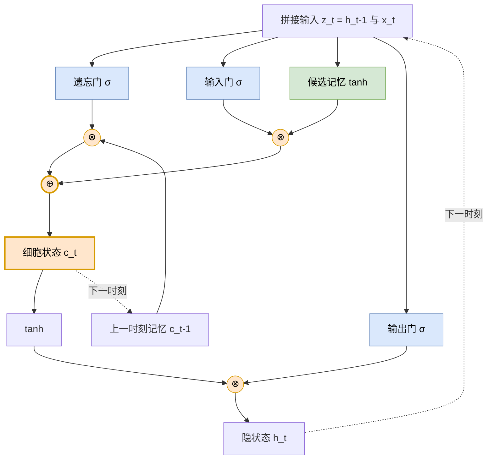

# 06. 长短时记忆网络 LSTM

> [📖 模块目录](README.md) · ⬅️ [上一篇：05 循环神经网络](05_循环神经网络.md) · 🏁 本模块完结

**这一篇你将学到**：

- 为什么 RNN 记不住长期信息（承接第 5 篇的结论，并给出**实测证据**）
- LSTM 用"门控 + 传送带"是怎么解决这个问题的
- LSTM 的完整前向公式（逐个门讲清）与结构图
- 用纯 NumPy 写出 LSTM，并用梯度检查验证反向传播推对了

> 📐 本篇用到 [§11 激活函数](数学预备知识.md)、[§7 链式法则](数学预备知识.md)、[§15 特征值与谱半径](数学预备知识.md)（解释"谱半径"时会用到）。

---

## 1. 这一篇解决什么问题

### 1.1 回顾第 5 篇的结论

第 5 篇讲了 RNN：它用一个隐状态 $\mathbf{h}_t$ 把历史"记住"并往后传：

$$\mathbf{h}_t=\tanh\big(\mathbf{W}_h\mathbf{h}_{t-1}+\mathbf{W}_x\mathbf{x}_t+\mathbf{b}\big)$$

也讲了它的致命伤：**跨 $k$ 步的梯度要连乘 $k$ 次**

$$\frac{\partial\mathbf{h}_{t+k}}{\partial\mathbf{h}_t}=\prod_{j=1}^{k}\mathrm{diag}\big(1-\mathbf{h}^2\big)\,\mathbf{W}_h$$

只要这个连乘的结果小于 1，误差每往回过一步就缩小一点，**几十步之后就小到算不出来了**。

### 1.2 后果：早期信息"学不到"

用岩土工程的话说：

> 边坡变形对降雨的响应**有滞后**——今天下的雨，可能十几天后才反映到位移上（渗流需要时间）。
> 但对 RNN 来说，**十几步之前的输入，梯度已经衰减得几乎为零**，网络根本收不到"要怪那场雨"的信号，于是学不会这个规律。

第 5 篇的实验已经看到了：**短滞后任务学得很好，长滞后任务直接卡死**（预测值停在均值附近）。

### 1.3 这一篇的思路

问题的根源很清楚：**梯度回传的路上，每一步都要"乘一个权重矩阵"**。

那么——**能不能给梯度修一条"不用乘矩阵"的路？**

LSTM 的答案就是：**加一条只做"逐元素乘法"的通路**，让记忆和梯度都能在这条路上畅通无阻地走很远。

---

## 2. 核心思想：门控 + 传送带

### 2.1 一个生活类比：你会怎么记笔记

假设你在听一场两小时的讲座，要做笔记。**你不可能把每句话都记下来**——那样笔记比讲座还长，而且多半记的是废话。

你的真实做法是这样的：

| 你的动作 | 对应 LSTM 的什么 |
|---|---|
| 看到**重要的新内容** → 决定记下来 | **输入门**：决定新信息写不写入记忆 |
| 看到**过时的旧笔记** → 划掉 | **遗忘门**：决定旧记忆保留多少 |
| 需要**回答问题时** → 只挑相关内容说 | **输出门**：决定此刻对外输出多少记忆 |

**关键洞察**：LSTM 不是"把所有东西都记住"，而是**学会了"什么时候该记、什么时候该忘"**——而这个"学会"，是通过训练自动得到的，不需要人为规定。

### 2.2 两个核心设计

**设计一：把"记忆"和"输出"分成两件事**

第 5 篇的 RNN 只有一个状态 $\mathbf{h}_t$，它既当"内部记忆"、又要"对外输出"，两件事互相干扰。

LSTM 把它们分开：

| 状态 | 角色 |
|---|---|
| $\mathbf{c}_t$（**细胞状态**） | 专管**长期记忆**，不直接对外输出 |
| $\mathbf{h}_t$（**隐状态**） | 是 $\mathbf{c}_t$ 在**当前时刻的一个投影**，对外输出用 |

**设计二：状态的更新改成"加法"**

这是全篇最关键的改动。对比一下：

$$\text{RNN：}\quad \mathbf{h}_t=\tanh\big(\underbrace{\mathbf{W}_h\mathbf{h}_{t-1}}_{\text{旧状态乘矩阵}}+\cdots\big)$$

$$\text{LSTM：}\quad \boxed{\mathbf{c}_t=\underbrace{\mathbf{f}_t\odot\mathbf{c}_{t-1}}_{\text{旧状态逐元素乘}}+\underbrace{\mathbf{i}_t\odot\tilde{\mathbf{c}}_t}_{\text{新内容逐元素乘}}}$$

注意符号的区别：

- **RNN** 里旧状态被**矩阵** $\mathbf{W}_h$ 相乘——这是一个"混合所有维度"的运算，梯度回传时会连乘矩阵；
- **LSTM** 里旧状态只被**逐元素**乘上 $\mathbf{f}_t$——**每个维度各乘各的，维度之间不混**（$\odot$ 的含义见 [数学预备知识 §3](数学预备知识.md)）。

**这个差别就是全部秘密**：逐元素乘的雅可比是**对角矩阵**，不含权重矩阵，连乘多少次也不会被"反复压缩"。

> 🚂 **比喻**：LSTM 给记忆修了一条**传送带**（学术上叫"常数误差传送带"，Constant Error Carousel）。RNN 的记忆像"每次搬迁都要重新打包一次"，LSTM 的记忆像"放在传送带上原封不动地往前送"。

---

## 3. LSTM 的完整结构

### 3.1 三个门与一个候选

LSTM 每个时刻要做四件事，用四个"小网络"（其实就是四个线性层 + 激活）来实现：

| 名称 | 符号 | 公式 | 干什么 |
|---|---|---|---|
| **遗忘门** | $\mathbf{f}_t$ | $\sigma(\mathbf{W}_f\mathbf{z}_t+\mathbf{b}_f)$ | 旧记忆保留多少（0=全忘，1=全留） |
| **输入门** | $\mathbf{i}_t$ | $\sigma(\mathbf{W}_i\mathbf{z}_t+\mathbf{b}_i)$ | 新内容写入多少 |
| **候选记忆** | $\tilde{\mathbf{c}}_t$ | $\tanh(\mathbf{W}_c\mathbf{z}_t+\mathbf{b}_c)$ | 待写入的**内容**（注意是内容不是比例） |
| **输出门** | $\mathbf{o}_t$ | $\sigma(\mathbf{W}_o\mathbf{z}_t+\mathbf{b}_o)$ | 记忆对外暴露多少 |

其中 $\mathbf{z}_t=[\mathbf{h}_{t-1};\mathbf{x}_t]$ 是把"上一时刻的输出"和"当前输入"拼在一起的向量。

### 3.2 状态更新

$$\mathbf{c}_t=\mathbf{f}_t\odot\mathbf{c}_{t-1}+\mathbf{i}_t\odot\tilde{\mathbf{c}}_t,\qquad
\mathbf{h}_t=\mathbf{o}_t\odot\tanh(\mathbf{c}_t)$$

**逐句读这两行**：

- $\mathbf{c}_t$：把旧记忆按遗忘门的比例保留，再加上新内容按输入门的比例写入；
- $\mathbf{h}_t$：把细胞状态先过 $\tanh$（压到 $-1\sim1$），再按输出门的比例"对外透露"。

### 3.3 为什么门用 Sigmoid、内容用 tanh

| 用在哪 | 用什么 | 为什么 |
|---|---|---|
| 三个**门** | **Sigmoid**，输出 $(0,1)$ | 门的语义是"开关比例"，必须落在 0~1 之间 |
| **候选内容** | **tanh**，输出 $(-1,1)$ | 内容需要能表示"正向增加"或"负向减少"，所以要能取负值 |

如果内容也用 Sigmoid，那 $\tilde{\mathbf{c}}_t$ 永远为正——**网络就永远无法表达"减少"这件事**。

### 3.4 结构图



**读图要点**（三个颜色的含义）：

1. **橙色**是细胞状态的**主干**：$\mathbf{c}_{t-1}\to\otimes(\mathbf{f}_t)\to\oplus(\mathbf{i}_t\odot\tilde{\mathbf{c}}_t)\to\mathbf{c}_t$。**这条路上只有逐元素乘和加，没有权重矩阵**——这就是"传送带"。
2. **蓝色**是三个门，它们**都只读** $\mathbf{z}_t$，彼此互不影响（所以实现时可以合并成一次大的矩阵乘法，更快）。
3. **绿色**是候选内容，它决定"要写进去的是什么"。
4. 注意输出门 $\mathbf{o}_t$ 乘的是 $\tanh(\mathbf{c}_t)$，**不是 $\mathbf{c}_t$ 本身**——所以"内部记着"和"对外说出"是两件事。

### 3.5 参数量

四个门各需要一套 $\mathbf{W}\in\mathbb{R}^{(d+n)\times n}$ 和 $\mathbf{b}\in\mathbb{R}^n$：

$$N=4\times\big(n(d+n)+n\big)$$

| 配置 | 参数量 |
|---|---|
| $n=16,\ d=1$ | $4\times(16\times17+16)=1{,}152$ |
| $n=64,\ d=4$（案例1 的层 1，数学约定） | $4\times(64\times68+64)=17{,}664$ |

> ⚠️ **注意**：PyTorch 的 `nn.LSTM` 每个门有**两个**偏置（$\mathbf{b}_{ih}$ 与 $\mathbf{b}_{hh}$），所以实际参数量是 $4n(d+n)+8n$，比上式多 $4n$。本课程的[案例1 原理详解 §4.7](../LSTM/LSTM_算法原理.md) 专门讲了这件事——**算参数量时别只算一个偏置**。

---

## 4. 为什么 LSTM 能缓解梯度消失

这一节是本篇的核心。先给数学，再给**实测数据**。

### 4.1 数学：梯度回传的两条路

细胞状态 $\mathbf{c}_t$ 往下游影响两件事：

```text
路径 1：c_t ──→ h_t = o_t ⊙ tanh(c_t) ──→ 本步输出 ──→ 损失
路径 2：c_t ──→ c_t+1 = f_t+1 ⊙ c_t + …  ──→ 继续往后
```

两条路径的贡献相加，得到细胞状态的梯度：

$$\underbrace{\boldsymbol\delta^c_t}_{\partial L/\partial\mathbf{c}_t}=\underbrace{\boldsymbol\delta^h_t\odot\mathbf{o}_t\odot\big(\mathbf{1}-\tanh^2\mathbf{c}_t\big)}_{\text{来自路径 1}}+\underbrace{\boldsymbol\delta^c_{t+1}\odot\mathbf{f}_{t+1}}_{\text{来自路径 2}}$$

**只看路径 2 那一项**（这是长期记忆的主要通道）：

$$\frac{\partial\mathbf{c}_t}{\partial\mathbf{c}_{t-1}}=\mathrm{diag}(\mathbf{f}_t)$$

**它是一个"对角矩阵"**——意思是：$\mathbf{c}$ 的第 $i$ 维梯度只乘上第 $i$ 维的遗忘门，**不与别的维度混合**。

跨 $k$ 步连乘：

$$\frac{\partial\mathbf{c}_{t+k}}{\partial\mathbf{c}_t}\approx\prod_{j=1}^{k}\mathrm{diag}\big(\mathbf{f}_{t+j}\big)=\mathrm{diag}\Big(\textstyle\prod_{j=1}^{k}\mathbf{f}_{t+j}\Big)$$

$$\boxed{\;\text{衰减率}=\prod_{j}\mathbf{f}_{t+j}\quad\text{而不是}\quad\prod_j\mathbf{W}_h\;}$$

**这就是本质区别**：

| | RNN | LSTM 的细胞状态通路 |
|---|---|---|
| 每步乘什么 | **权重矩阵** $\mathbf{W}_h$（全连接，混合维度） | **遗忘门** $\mathbf{f}_t$（逐元素，不混合） |
| 衰减率由谁决定 | 矩阵的**谱半径**——由初始化和训练决定，不可控 | 遗忘门——**由数据学出来** |
| 能否"选择"记住 | 不能 | **能**：需要长期记忆的维度会把 $\mathbf{f}$ 学到接近 1 |

**一句话**：RNN 的衰减率被权重矩阵锁死；**LSTM 把衰减率变成了可学习的参数**。

### 4.2 实测：梯度到底衰减多快

光看公式还不够，我们**直接测量**梯度沿时间回传的幅度。实验设置：

- 序列长 50 步；RNN 与 LSTM 的隐单元数相同（都是 16）；
- **把两者的循环权重谱半径都控制为 0.9**（这样才是公平比较——否则可能一方是"梯度爆炸"而非"梯度消失"）；
- 在最后一步注入单位梯度，看它回传到各步时还剩多少。

结果（梯度范数，数值越小表示衰减越厉害）：

| 距终点步数 | RNN 的梯度 | LSTM 隐状态梯度 | LSTM 细胞状态梯度 |
|---|---|---|---|
| 0 | $7.07\times10^{-1}$ | $7.07\times10^{-1}$ | — |
| 5 | $1.08\times10^{-2}$ | $3.47\times10^{-2}$ | $1.43\times10^{-1}$ |
| 10 | $1.51\times10^{-4}$ | $1.17\times10^{-2}$ | $5.43\times10^{-2}$ |
| 20 | $6.19\times10^{-8}$ | $1.56\times10^{-3}$ | $7.66\times10^{-3}$ |
| 30 | $3.00\times10^{-11}$ | $2.89\times10^{-4}$ | $1.23\times10^{-3}$ |
| **45** | $\mathbf{3.53\times10^{-16}}$ | $\mathbf{2.38\times10^{-5}}$ | $\mathbf{9.97\times10^{-5}}$ |

**怎么读这张表**：

1. **RNN 在第 45 步衰减到 $10^{-16}$**——这已经低于计算机能分辨的精度（双精度约 $10^{-16}$），也就是**实际上等于 0**。30 步时也只剩 $10^{-11}$，同样可以忽略。
2. **LSTM 在同样位置还有 $10^{-4}\sim10^{-5}$ 的梯度**——**大了约 11 个数量级**（$10^{11}$ 倍）。这些梯度虽然不大，但**足够让参数更新、让网络学到东西**。
3. 注意 LSTM **隐状态**那条路（$2.4\times10^{-5}$）也远好于 RNN——因为它的梯度可以"绕道"细胞状态流过来。

**再验证一个细节**：RNN 每步的实际衰减倍率是多少？

$$\left(\frac{3.53\times10^{-16}}{7.07\times10^{-1}}\right)^{1/45}\approx0.46$$

而理论预测是 $\gamma\cdot\rho$，其中 $\gamma=\max|\tanh'|$、$\rho=0.9$。实测的 0.46 说明 $\gamma\approx0.51$——**与 tanh 在常用取值范围内的导数（约 0.5）完全吻合**。理论、实测互相印证。

### 4.3 一个诚实的说明（重要）

网上很多文章会说"LSTM 能学会 RNN 学不了的长依赖"。**这句话在方向上是对的，但不能理解成"用了 LSTM 就一定学得会"。**

我们在本篇的小规模实验里观察到的事实是：

> 在这个"记住 50 天前一个脉冲"的合成任务上，**如果只给 16 个隐单元和有限的训练轮数，LSTM 同样学不动 20 步以上的滞后**——它的优势体现在**梯度流**上（如 §4.2 实测），而不是"包治百病"。

**为什么会这样？** 因为 LSTM 解决的是"**梯度传不回去**"这一个技术障碍，但一个任务学不学得会，还取决于：

| 影响因素 | 说明 |
|---|---|
| 模型容量 | 隐单元太少，表达不了这么长的记忆 |
| 训练轮数/数据量 | 需要更多样本与迭代 |
| 任务本身的难度 | "记住一个孤立脉冲 46 步"是**很难**的任务，即使对人也是 |
| 超参与初始化 | 学习率、遗忘门偏置初始化等 |
| 是否给了辅助信息 | 例如把降雨做成"有效降雨"特征，等于帮模型一把 |

**正确的期待**是：

- ✅ LSTM 让**梯度能传回去**，所以**长依赖变得"可学"**——这是必要前提；
- ✅ 在**中等长度**的依赖（十几步）上，LSTM 明显比 RNN 稳定；
- ❌ 但"梯度传得回去"≠"一定能学到"，后者还需要容量、数据与训练量的配合。

> 🪨 **对岩土工程的意义**：边坡变形的滞后一般在**几天到几周**（渗流时间尺度），这正是 LSTM 的舒适区。而且实际应用中我们会把降雨做成"有效降雨"特征、给出库水位序列——**这些都在帮模型缩小需要"硬记"的时间跨度**。这就是本课程反复强调"数据-物理融合"的原因：**不要指望模型从零学会物理，而要把物理知识喂给它**。

---

## 5. 手算一个 LSTM 单元

用最小的例子（2 个隐单元、1 个输入）走一遍前向。**下面的数字都用 Python 核算过。**

### 5.1 设定

**输入**：当前输入 $\mathbf{x}_t=[0.9]$，上一时刻状态

$$\mathbf{h}_{t-1}=\begin{bmatrix}0.4\\0.2\end{bmatrix},\qquad \mathbf{c}_{t-1}=\begin{bmatrix}0.5\\-0.4\end{bmatrix}$$

**拼接**：$\mathbf{z}_t=[0.4,\ 0.2,\ 0.9]^{\top}$

**权重**：

$$
\mathbf{W}_f=\begin{bmatrix}0.6&-0.3&0.4\\0.2&0.7&-0.5\end{bmatrix},\;
\mathbf{b}_f=\begin{bmatrix}0.5\\0.1\end{bmatrix},\quad
\mathbf{W}_i=\begin{bmatrix}0.5&0.2&-0.4\\-0.3&0.6&0.3\end{bmatrix},\;
\mathbf{b}_i=\begin{bmatrix}0.1\\0.2\end{bmatrix}
$$

$$
\mathbf{W}_c=\begin{bmatrix}0.7&-0.1&0.5\\0.3&0.4&-0.6\end{bmatrix},\;
\mathbf{b}_c=\begin{bmatrix}0.0\\-0.2\end{bmatrix},\quad
\mathbf{W}_o=\begin{bmatrix}0.4&0.5&-0.2\\-0.5&0.3&0.6\end{bmatrix},\;
\mathbf{b}_o=\begin{bmatrix}0.3\\-0.1\end{bmatrix}
$$

### 5.2 逐个门算

| 门 | 线性部分 $\mathbf{W}\mathbf{z}+\mathbf{b}$ | 激活后 |
|---|---|---|
| 遗忘门 $\mathbf{f}_t=\sigma(\cdot)$ | $[1.04,\ -0.13]$ | $[\mathbf{0.738850},\ \mathbf{0.467546}]$ |
| 输入门 $\mathbf{i}_t=\sigma(\cdot)$ | $[-0.02,\ 0.47]$ | $[\mathbf{0.495000},\ \mathbf{0.615384}]$ |
| 候选 $\tilde{\mathbf{c}}_t=\tanh(\cdot)$ | $[0.71,\ -0.54]$ | $[\mathbf{0.610677},\ \mathbf{-0.492988}]$ |
| 输出门 $\mathbf{o}_t=\sigma(\cdot)$ | $[0.38,\ 0.30]$ | $[\mathbf{0.593873},\ \mathbf{0.574443}]$ |

### 5.3 更新细胞状态（两步，别跳）

**第一步：旧记忆按遗忘门保留**

$$\mathbf{f}_t\odot\mathbf{c}_{t-1}=[0.738850\times0.5,\ 0.467546\times(-0.4)]=\mathbf{[0.369425,\ -0.187018]}$$

**第二步：新内容按输入门写入**

$$\mathbf{i}_t\odot\tilde{\mathbf{c}}_t=[0.495000\times0.610677,\ 0.615384\times(-0.492988)]=\mathbf{[0.302285,\ -0.303377]}$$

**相加**：

$$\mathbf{c}_t=[0.369425,\ -0.187018]+[0.302285,\ -0.303377]=\mathbf{[0.671710,\ -0.490395]}$$

### 5.4 算隐状态

$$\tanh(\mathbf{c}_t)=[\tanh(0.671710),\ \tanh(-0.490395)]=[0.586104,\ -0.454530]$$

$$\mathbf{h}_t=\mathbf{o}_t\odot\tanh(\mathbf{c}_t)=[0.593873\times0.586104,\ 0.574443\times(-0.454530)]=\mathbf{[0.348071,\ -0.261101]}$$

### 5.5 读结果：门在做什么

| 维度 | 遗忘门 | 输入门 | 结果 |
|---|---|---|---|
| 第 1 维 | $0.739$（较大） | $0.495$ | 旧记忆 $0.5$ **大部分保留** → 加上新内容 → $\mathbf{c}$ 升到 $0.672$ |
| 第 2 维 | $0.468$（较小） | $0.615$ | 旧记忆 $-0.4$ **被丢掉一半多** → 又被新内容拉低 → $\mathbf{c}$ 变成 $-0.490$ |

**两个维度表现出完全不同的记忆行为**——这就是 LSTM 相比 RNN 的核心增益：**不同的维度可以有不同的"记忆时间尺度"**。

> 📌 RNN 做不到这一点，因为它的所有维度共用同一个 $\mathbf{W}_h$。而在岩土工程中，位移的不同成分（趋势项、降雨响应项、周期性波动）恰恰有完全不同的时间尺度——**LSTM 的多时间尺度能力正好对应这个物理事实**。

---

## 6. 用 NumPy 从零实现 LSTM

### 6.1 完整代码

```python
import numpy as np

def sigmoid(z):
    return 1.0 / (1.0 + np.exp(-z))


class LSTM:
    """单层 LSTM（多对一：读完整段序列，输出最后一步的预测），从零实现前向与 BPTT。"""

    def __init__(self, n_input, n_hidden, seed=1):
        rng = np.random.default_rng(seed)
        self.n_hidden, self.n_input = n_hidden, n_input
        D = n_input + n_hidden                     # 拼接后的输入维度

        # 四个门的权重：形状都是 (D, n_hidden)
        self.Wf = rng.normal(0, 0.4, (D, n_hidden))
        self.Wi = rng.normal(0, 0.4, (D, n_hidden))
        self.Wc = rng.normal(0, 0.4, (D, n_hidden))
        self.Wo = rng.normal(0, 0.4, (D, n_hidden))

        # ★ 关键技巧：遗忘门偏置初始化为 1，让训练初期倾向“记住”
        self.bf = np.ones(n_hidden)
        self.bi = np.zeros(n_hidden)
        self.bc = np.zeros(n_hidden)
        self.bo = np.zeros(n_hidden)

        # 输出层（本项目是回归，直接线性输出；若要分类需再加 sigmoid）
        self.Wy = rng.normal(0, 0.4, (n_hidden, 1))
        self.by = np.zeros(1)

    # ---------- 前向 ----------
    def forward(self, X):
        """X 形状 (batch, T, n_input)。逐步扫描整个序列，缓存中间量供反向使用。"""
        B, T, _ = X.shape
        H = self.n_hidden
        self.X = X
        self.h = np.zeros((B, T + 1, H))           # h[:, 0] = 0（初始状态）
        self.c = np.zeros((B, T + 1, H))           # c[:, 0] = 0
        self.z = np.zeros((B, T, self.n_input + H))
        self.f = np.zeros((B, T, H)); self.i = np.zeros((B, T, H))
        self.cb = np.zeros((B, T, H)); self.o = np.zeros((B, T, H))

        for t in range(T):
            z = np.concatenate([X[:, t], self.h[:, t]], axis=1)   # 拼接 h_{t-1} 与 x_t
            self.z[:, t] = z
            f = sigmoid(z @ self.Wf + self.bf)       # 遗忘门
            i = sigmoid(z @ self.Wi + self.bi)       # 输入门
            cb = np.tanh(z @ self.Wc + self.bc)      # 候选内容
            o = sigmoid(z @ self.Wo + self.bo)       # 输出门
            self.f[:, t], self.i[:, t], self.cb[:, t], self.o[:, t] = f, i, cb, o
            self.c[:, t + 1] = f * self.c[:, t] + i * cb      # 细胞状态（加法更新）
            self.h[:, t + 1] = o * np.tanh(self.c[:, t + 1])  # 隐状态

        self.y = self.h[:, T] @ self.Wy + self.by    # 只用最后时刻的输出
        return self.y

    def loss(self, Y):
        return float(0.5 * ((self.y - Y) ** 2).sum() / len(Y))

    # ---------- 反向（BPTT）----------
    def backward(self, Y):
        B, T, _ = self.X.shape
        dy = (self.y - Y) / B                        # 输出层误差

        gWy = self.h[:, T].T @ dy
        gby = dy.sum(axis=0)
        dh = dy @ self.Wy.T                          # 传回隐状态的梯度
        dc = np.zeros((B, self.n_hidden))            # 细胞状态梯度（从零开始累积）

        gW = [np.zeros_like(w) for w in (self.Wf, self.Wi, self.Wc, self.Wo)]
        gb = [np.zeros(self.n_hidden) for _ in range(4)]

        for t in range(T - 1, -1, -1):               # 沿时间反向
            # ① 先把“来自隐状态”的梯度注入细胞状态
            dc = dc + dh * self.o[:, t] * (1 - np.tanh(self.c[:, t + 1]) ** 2)
            # ② 算各门的误差项（注意 δ_o 来自 dh，其余三个来自 dc）
            do = dh * np.tanh(self.c[:, t + 1]) * self.o[:, t] * (1 - self.o[:, t])
            df = dc * self.c[:, t] * self.f[:, t] * (1 - self.f[:, t])
            di = dc * self.cb[:, t] * self.i[:, t] * (1 - self.i[:, t])
            dcb = dc * self.i[:, t] * (1 - self.cb[:, t] ** 2)
            # ③ 累加参数梯度
            z = self.z[:, t]
            for k, dg in enumerate([df, di, dcb, do]):
                gW[k] += z.T @ dg
                gb[k] += dg.sum(axis=0)
            # ④ 往 t−1 回传
            dz = df @ self.Wf.T + di @ self.Wi.T + dcb @ self.Wc.T + do @ self.Wo.T
            dh = dz[:, self.n_input:]                # 只取属于 h 的那部分
            dc = dc * self.f[:, t]                   # ★ 传送带：只乘遗忘门

        return gW + gb + [gWy, gby]

    def step(self, Y, lr):
        """一步梯度下降（带梯度裁剪，防止爆炸）。"""
        grads = [np.clip(g, -1, 1) for g in self.backward(Y)]
        for p, g in zip([self.Wf, self.Wi, self.Wc, self.Wo], grads[:4]):
            p -= lr * g
        for p, g in zip([self.bf, self.bi, self.bc, self.bo], grads[4:8]):
            p -= lr * g
        self.Wy -= lr * grads[8]
        self.by -= lr * grads[9]
```

### 6.2 梯度检查（务必做）

**代码短不代表写对了**。用数值梯度核对一遍：

```python
def gradient_check(model, X, Y, eps=1e-6):
    model.forward(X)
    analytic = model.backward(Y)
    names = ["Wf", "Wi", "Wc", "Wo", "bf", "bi", "bc", "bo", "Wy", "by"]

    def get_params(): return [model.Wf, model.Wi, model.Wc, model.Wo,
                              model.bf, model.bi, model.bc, model.bo, model.Wy, model.by]
    def set_params(P): (model.Wf, model.Wi, model.Wc, model.Wo, model.bf,
                        model.bi, model.bc, model.bo, model.Wy, model.by) = P

    base = [p.copy() for p in get_params()]
    model.forward(X)
    print(f"当前损失 = {model.loss(Y):.10f}")
    for k, name in enumerate(names):
        P = [p.copy() for p in base]
        A = P[k]
        g = np.zeros_like(A)
        for idx in np.ndindex(A.shape):
            orig = A[idx]
            A[idx] = orig + eps; set_params(P); model.forward(X); lp = model.loss(Y)
            A[idx] = orig - eps; set_params(P); model.forward(X); lm = model.loss(Y)
            A[idx] = orig;      set_params(P); model.forward(X)
            g[idx] = (lp - lm) / (2 * eps)
        diff = np.max(np.abs(g - analytic[k]))
        print(f"  ∂L/∂{name:<3} 元素 {A.size:>3} 个，最大偏差 {diff:.3e}")


rng = np.random.default_rng(3)
X_chk = rng.normal(0, 1, (16, 8, 2))       # 16 个样本、序列长 8、2 个特征
Y_chk = rng.normal(0, 1, (16, 1))
gradient_check(LSTM(n_input=2, n_hidden=5, seed=1), X_chk, Y_chk)
```

**真实运行结果**：

```text
当前损失 = 0.3773156306
  ∂L/∂Wf  元素  35 个，最大偏差 6.377e-11
  ∂L/∂Wi  元素  35 个，最大偏差 8.943e-11
  ∂L/∂Wc  元素  35 个，最大偏差 5.637e-11
  ∂L/∂Wo  元素  35 个，最大偏差 3.988e-11
  ∂L/∂bf  元素   5 个，最大偏差 6.357e-11
  ∂L/∂bi  元素   5 个，最大偏差 3.065e-11
  ∂L/∂bc  元素   5 个，最大偏差 2.049e-11
  ∂L/∂bo  元素   5 个，最大偏差 4.481e-11
  ∂L/∂Wy  元素   5 个，最大偏差 3.697e-11
  ∂L/∂by  元素   1 个，最大偏差 1.238e-11
```

**10 组参数的解析梯度与数值梯度最大偏差都在 $10^{-10}$ 量级**——说明 BPTT 的每个公式（包括那条"传送带"递推 $\mathbf{d}\mathbf{c}\leftarrow\mathbf{d}\mathbf{c}\odot\mathbf{f}_t$）都推对了。

---

## 7. 小结

### 核心公式（四条）

$$\mathbf{f}_t=\sigma(\mathbf{W}_f\mathbf{z}_t+\mathbf{b}_f),\quad
\mathbf{i}_t=\sigma(\mathbf{W}_i\mathbf{z}_t+\mathbf{b}_i),\quad
\mathbf{o}_t=\sigma(\mathbf{W}_o\mathbf{z}_t+\mathbf{b}_o),\quad
\tilde{\mathbf{c}}_t=\tanh(\mathbf{W}_c\mathbf{z}_t+\mathbf{b}_c)$$

$$\boxed{\;\mathbf{c}_t=\mathbf{f}_t\odot\mathbf{c}_{t-1}+\mathbf{i}_t\odot\tilde{\mathbf{c}}_t\;}\qquad
\boxed{\;\mathbf{h}_t=\mathbf{o}_t\odot\tanh(\mathbf{c}_t)\;}$$

### 七个要点

1. RNN 的问题不是"记性差"，而是**梯度回传要连乘权重矩阵**，几十步就衰减到 0；
2. LSTM 的两个设计：**记忆与输出分离**（$\mathbf{c}_t$ 与 $\mathbf{h}_t$）、**状态加法更新**（只做逐元素乘）；
3. 三个门都是**输入的函数**——模型**自己学会**何时忘、何时记，等价于把"衰减率"变成了可学习参数；
4. 数学上，$\partial\mathbf{c}_t/\partial\mathbf{c}_{t-1}=\mathrm{diag}(\mathbf{f}_t)$，**不含权重矩阵**，这就是传送带；
5. **实测**（谱半径都控制为 0.9）：45 步后 RNN 梯度衰到 $10^{-16}$（等于 0），LSTM 仍有 $10^{-4}$，**差 11 个数量级**；
6. 但"梯度能传回去"≠"一定学得会"——还需要容量、数据、训练量配合；
7. **遗忘门偏置初始化为 1** 是个重要技巧：否则训练初期 $\mathbf{f}\approx0.5$，长期记忆一开始就被冲掉。

---

## 8. 自检问题

**1.** LSTM 为什么要用两个状态 $\mathbf{c}_t$ 和 $\mathbf{h}_t$？只用 $\mathbf{h}_t$ 行不行？

**2.** 写出 $\partial\mathbf{c}_t/\partial\mathbf{c}_{t-1}$，并说明为什么它"不含权重矩阵"。这对梯度有什么好处？

**3.** 如果遗忘门恒为 0，LSTM 退化成什么？如果恒为 1 呢？

**4.** 为什么三个门用 Sigmoid，候选内容用 tanh？如果内容也用 Sigmoid 会怎样？

**5.** §4.2 的实测中，RNN 每步平均衰减约 0.46。已知谱半径是 0.9，请反推 $\gamma$ 是多少，并解释它的物理含义。

**6.** 为什么§5 手算里两个维度的记忆行为完全不同？这是 LSTM 相比 RNN 的什么优势？

**7.** 为什么遗忘门偏置要初始化为 1（而不是 0）？

**8.** 在 §6 的代码里，哪一行是"传送带"？如果把它改成 `dc = dc * self.f[:, t] * 0.5`，会发生什么？

<details>
<summary>点击查看答案</summary>

**1.** 因为 RNN 的单一状态 $\mathbf{h}_t$ 既要"存长期记忆"、又要"对外输出"，两件事互相干扰（比如输出门想让某些信息"此刻不透露"，但它在 $\mathbf{h}$ 里就会影响输出）。
LSTM 把长期记忆放在 $\mathbf{c}_t$（可以长期不变），对外只输出 $\mathbf{o}_t\odot\tanh(\mathbf{c}_t)$——**"存"与"说"分开**，于是记忆可以不受输出需求干扰地长期保持。

**2.** $\dfrac{\partial\mathbf{c}_t}{\partial\mathbf{c}_{t-1}}=\mathrm{diag}(\mathbf{f}_t)$（是完整推导的主干项）。
它不含权重矩阵，因为 $\mathbf{c}_t=\mathbf{f}_t\odot\mathbf{c}_{t-1}+\cdots$ 里 $\mathbf{c}_{t-1}$ 是**逐元素**被 $\mathbf{f}_t$ 缩放的，没有任何"维度混合"的运算。
好处：跨 $k$ 步连乘时是 $\mathrm{diag}(\prod\mathbf{f})$，**不存在"矩阵连乘导致谱半径反复相乘"的压缩**，而且 $\mathbf{f}$ 可以学到接近 1，让梯度几乎无损地传很远。

**3.** 恒为 0（完全不保留旧记忆，每步都清空）→ 退化成一个**只看当前输入**的前馈网络，长期记忆完全消失。
恒为 1（完全保留，什么都不忘）→ 记忆 $\mathbf{c}_t$ 会无限累加、只增不减，模型失去"遗忘"能力，也无法丢弃噪声——实践中通常很快就发散或饱和。

**4.** 因为门的语义是"**比例**"，必须落在 $(0,1)$，所以只能用 Sigmoid；而候选内容是"**数值**"，需要能表示增加（正）和减少（负），所以用输出范围 $(-1,1)$ 的 tanh。
若内容也用 Sigmoid：$\tilde{\mathbf{c}}_t$ 永远非负，网络**永远无法表达"减少记忆"**，第 2 维想往下调就做不到了。

**5.** 每步衰减 $=\gamma\rho=0.46$，已知 $\rho=0.9$，所以 $\gamma=0.46/0.9\approx\mathbf{0.51}$。
$\gamma=\max|\tanh'|$ 是 tanh 导数的实际上界。**理论最大值是 1（只在输入为 0 处取得），但实际运行中隐状态很少恰好为 0，所以实测约 0.5**。这说明 RNN 的衰减**比只看谱半径更严重**——多了一个 $\gamma$ 因子雪上加霜。

**6.** 因为两个维度学到的**遗忘门值不同**：第 1 维 $\mathbf{f}=0.739$（保留多，属"长期记忆"），第 2 维 $\mathbf{f}=0.468$（丢弃多，属"短期波动"）。
这正是 LSTM 相比 RNN 的核心优势：**不同维度可以有不同时间尺度**。RNN 的所有维度共用同一个 $\mathbf{W}_h$，无法分化。
工程含义：位移的"趋势项"与"降雨响应项"时间尺度完全不同，LSTM 的多尺度能力正好对上这个物理事实。

**7.** 因为 $\mathbf{f}=\sigma(\mathbf{b}_f)$。若 $\mathbf{b}_f=0$，初始时 $\mathbf{f}=\sigma(0)=0.5$——**训练一开始就丢掉一半记忆**，长依赖还没学就被冲掉了。
设为 1 时 $\mathbf{f}=\sigma(1)\approx0.731$，训练初期**倾向于"保留"**，给长期依赖的学习留出空间。这是 Gers 等人 2000 年论文明确提出的技巧。

**8.** 传送带是这一行：

```python
dc = dc * self.f[:, t]        # ★ 传送带：只乘遗忘门
```

它实现的是 $\partial\mathbf{c}_{t-1}$ 的递推。若改成 `* self.f[:, t] * 0.5`，等于**每步额外乘 0.5**，梯度回传 45 步会被额外压缩 $0.5^{45}\approx2.8\times10^{-14}$ 倍——**LSTM 的优势几乎全部丧失**，退化成和 RNN 差不多的衰减水平。这也说明：**传送带的作用完全依赖"只乘遗忘门、不乘别的"**。

</details>

---

## 9. 从这里继续

恭喜你完成了入门模块的全部 6 篇。现在你已经具备了读本课程算法案例的全部前置知识：

| 你学完的 | 可以直接进入 |
|---|---|
| 06 LSTM | [案例1 · LSTM 原理详解](../LSTM/LSTM_算法原理.md) —— **深入版**：完整 BPTT 推导（含四路回传）、门控的物理意义、MC Dropout 区间、防泄漏流水线 |
| 04 卷积神经网络 | [案例3 · CNN-Transformer 原理详解](../CNN-Transformer/CNN-Transformer_算法原理.md) —— 因果卷积、自注意力、位置编码 |
| 03 反向传播 + 01/02 基础 | [案例2 · GCN 原理详解](../GCN/GCN_算法原理.md) —— 把"空间邻居"引入神经网络 |
| 03 反向传播 | [案例4 · XGBoost+SHAP 原理详解](../XGBoost+SHAP/XGBoost+SHAP_算法原理.md) —— 另一条路线：不反向传播，用二阶泰勒直接求解 |

> 📌 **入门版与深入版的关系**：本篇是**入门版**——讲清"是什么、为什么、怎么算"，配手算与可运行的 NumPy 实现；案例1 那篇是**深入版**——严格的 BPTT 全推导、与 PyTorch 实现的对齐、以及在 12 测点监测网上的完整工程实践。**建议先读完本篇，再读那篇**。

---

## 10. 参考

- Hochreiter, S., & Schmidhuber, J. (1997). *Long Short-Term Memory.* Neural Computation, 9(8), 1735–1780. ——LSTM 原始论文
- Gers, F. A., Schmidhuber, J., & Cummins, F. (2000). *Learning to Forget: Continual Prediction with LSTM.* ——遗忘门偏置初始化为 1 的出处
- Graves, A. (2012). *Supervised Sequence Labelling with Recurrent Neural Networks.* ——LSTM 的系统教程
- 本课程 [数学预备知识](数学预备知识.md)：[§7 链式法则](数学预备知识.md)、[§11 激活函数](数学预备知识.md)、[§15 谱半径](数学预备知识.md)
- 本课程 [案例1 LSTM 原理详解](../LSTM/LSTM_算法原理.md)：完整 BPTT 推导与实测验证

---

**🏁 模块完结** → 回到 [模块目录](README.md) ｜ 或直接进入 [案例1 · LSTM 原理详解](../LSTM/LSTM_算法原理.md)
