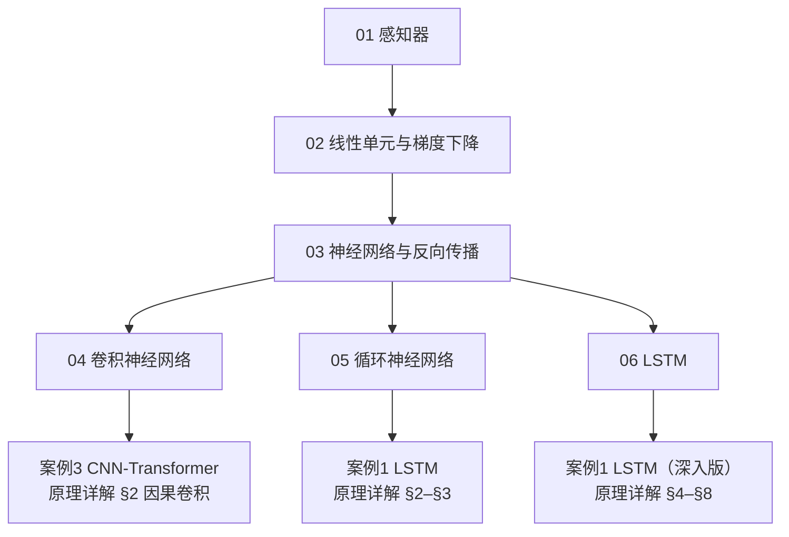

# 零基础入门深度学习

> **这是本课程的最底层入口**。如果你从没学过神经网络，不知道"神经元""梯度下降""反向传播"是什么，请从这里开始——不要直接跳到算法案例的原理详解，那些文档假设你已经会这些了。

## 学习顺序（请勿跳步）

| 顺序 | 文档 | 核心问题 | 学完你能 |
|---|---|---|---|
| 1 | [01_感知器.md](01_感知器.md) | 一个"神经元"怎么工作？ | 手推感知器学习规则，写出二分类程序 |
| 2 | [02_线性单元和梯度下降.md](02_线性单元和梯度下降.md) | 怎么让模型**自己**找到好参数？ | 手推平方误差的梯度，实现梯度下降做回归 |
| 3 | [03_神经网络和反向传播算法.md](03_神经网络和反向传播算法.md) | 多层网络怎么训练？ | 手推 BP 算法，从零实现一个能解 XOR 的网络 |
| 4 | [04_卷积神经网络.md](04_卷积神经网络.md) | 怎么处理图像/网格数据？ | 手算二维卷积，从零实现一个迷你 CNN |
| 5 | [05_循环神经网络.md](05_循环神经网络.md) | 怎么处理序列数据？ | 手推 BPTT，从零实现 RNN 并理解梯度消失 |
| 6 | [06_长短时记忆网络LSTM.md](06_长短时记忆网络LSTM.md) | 怎么让网络记住长期信息？ | 手推 LSTM 前向与反向，从零实现 LSTM |

**预计用时**：每篇 2~3 小时（含动手敲代码），全部约 15 小时。

## 这个模块和算法案例的关系

学完这 6 篇，你就具备了读算法案例原理详解的全部前置知识：



| 学完本模块的 | 可直接进入 | 那里会讲 |
|---|---|---|
| 04 卷积神经网络 | [案例3 · CNN-Transformer 原理详解](../CNN-Transformer/CNN-Transformer_算法原理.md) | 因果卷积、自注意力、位置编码 |
| 05 循环神经网络 | [案例1 · LSTM 原理详解 §2–§3](../LSTM/LSTM_算法原理.md) | RNN 的时间展开与梯度消失的严格分析 |
| 06 LSTM | [案例1 · LSTM 原理详解 §4–§8](../LSTM/LSTM_算法原理.md) | 门控的完整数学、BPTT 全推导、物理融合 |

> 📐 **数学符号看不懂**？本模块每篇都假定你只学过高中数学。遇到矩阵、偏导数、链式法则等符号，随时查阅 [数学预备知识.md](数学预备知识.md)——那份文档用大白话 + 手算例子讲清了全部所需工具。

## 每篇文档的结构（统一格式）

每篇都按同一套路写，便于循序渐进：

1. **这一篇解决什么问题** —— 先讲清"为什么需要它"
2. **从直观到数学** —— 先用生活类比，再给公式（每个符号都有解释）
3. **手算一个例子** —— 拿纸笔能跟着算完的小例子，数字都验证过
4. **从零实现（NumPy）** —— 不用任何深度学习框架，只用 NumPy 写出可运行代码
5. **运行结果与解读** —— 代码输出意味着什么
6. **局限与下一步** —— 这个方法的边界在哪，为什么需要下一篇
7. **自检问题** —— 含折叠答案
8. **下一篇预告**

## 环境准备

本模块的代码**只需要 NumPy 和 Matplotlib**：

```bash
pip install numpy matplotlib
```

> 完整的项目环境（PyTorch 等）见 [项目根目录 README](../README.md) 的「快速开始」。本模块刻意不用 PyTorch——**从零手写才能真懂**。

## 约定

- 所有代码都是 **NumPy 从零实现**，可直接复制运行（每段都可独立跑通）
- 公式中的符号在全模块统一：$\mathbf{x}$ 输入、$\mathbf{w}$ 权重、$b$ 偏置、$\eta$ 学习率、$\sigma$ 激活函数
- 运行环境：Python 3.12 + NumPy 2.x（见 [requirements.txt](../requirements.txt)）
- **建议**：每段代码都亲手敲一遍，跑一遍，改一改看结果怎么变——**敲一遍胜过读十遍**

---

**开始学习** → [01. 感知器](01_感知器.md)
